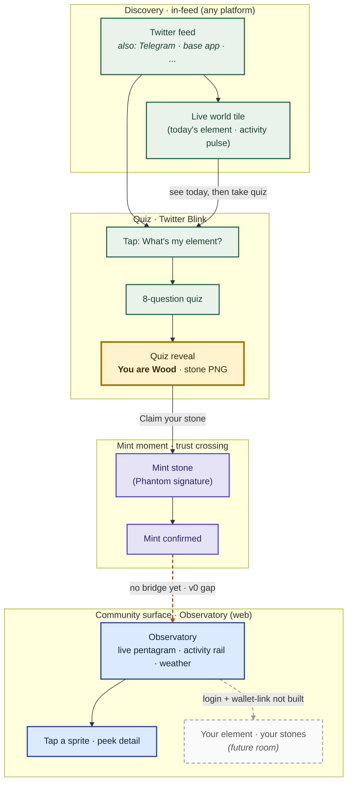

# Purupuru · Awareness Layer

> **Solana Frontier hackathon submission · ship 2026-05-11**

**Strava for on-chain communities.** Your community's on-chain activity, surfaced where your community already hangs out — Twitter, Telegram, group chats — without anyone leaving to see it. The quiz + stone + observatory you'll see in this hackathon submission is **one component of that vision**: a starter loop that demonstrates the architecture. The infrastructure is modular by design — the Blink renders anywhere the Solana Actions spec is honored; the substrate is chain-agnostic at the schema layer (Solana for now); the presentation layer is built to wrap any underlying community-activity feed.

What you'll experience in v0: a Twitter-native personality quiz that sorts you into one of five elements, mints you a Genesis Stone on Solana, and surfaces what your community is doing through a live observatory dashboard. The quiz is the lure · the observatory is the destination · the stone is the receipt of having entered.

> **Live**: [purupuru-quiz.vercel.app](https://purupuru-quiz.vercel.app) (Twitter Blink) · [purupuru-blink.vercel.app](https://purupuru-blink.vercel.app) (Observatory dashboard)
> **Program**: `7u27WmTz2hZHvvhL89XcSCY3eFhxEfHjUN5MjzMY6v38` on Solana devnet

---

## What is this? (the four cold-reader questions)

### 1. What is purupuru?

A Twitter Blink that meets people where they already are. They take a 90-second personality quiz; an element (Wood / Fire / Earth / Metal / Water) is reflected back to them; they mint a stone that records the moment on-chain. The on-chain activity flows back into a public observatory dashboard so a community can see itself in real-time — without leaving Twitter to do it.

### 2. What's a stone, and why would I want one?

A **Genesis Stone** is your on-chain badge of having taken the quiz — a proper Metaplex NFT that lives in your Phantom wallet's collectibles tab. It's the artifact of your element. Five stones exist (one per element); yours is the one your answers earned. The stone is a starter — post-hackathon it evolves into a richer character (`puruhani`) as the awareness layer grows.

### 3. What's the Observatory?

A live dashboard ([purupuru-blink.vercel.app](https://purupuru-blink.vercel.app)) that visualizes what's happening across the awareness layer in real time:

- **Pentagram canvas** with sprites moving through the five elemental zones
- **Activity rail** showing recent events (claimed a stone · archetype emerged · weather shift)
- **KPI strip**: live presence · dominant element · cycle balance · cosmic intensity
- **Weather tile** with real-world weather mapped onto the elemental cycle
- **Day/night theme** that flips with local sunrise · ambient music underscores

The observatory is what you graduate INTO after the quiz. It's the room that makes the quiz feel like more than just a quiz.

### 4. How do the quiz, the wallet, and the dashboard connect?

```
TWITTER ──► Blink unfurl ──► take quiz (no wallet) ──► reveal element
                                                         │
                                                         ▼
PHANTOM ◄── sponsored-payer pays gas ◄── click "Claim Your Stone"
                                                         │
                                                         ▼
                                          on-chain · Anchor program
                                          mints Metaplex NFT to your wallet
                                          emits StoneClaimed event
                                                         │
                                                         ▼
DASHBOARD ◄── indexer subscribes to events ◄── activity rail updates
                                          (indexer in `project-purupuru/radar`
                                           · zerker's lane · post-anchor-deploy)
```

The wallet bridges the two surfaces. Twitter takes you in; the wallet records you; the dashboard surfaces you back. **No login required to take the quiz** — the wallet only enters at the mint moment, gasless via sponsored-payer.

---

## The whole user journey · what to emphasize

> **Reading guide**: four narrative beats from top to bottom — *discover · take the quiz · cross trust · land in the world*. Yellow = the emotional payoff. Purple = the moment commitment changes (wallet signature). Blue = the destination. Dashed lines = where the loop doesn't close yet (amber = v0 gap we'd ship if we had another sprint · grey = future room).



> **Twitter is the v0 instance.** Same Action endpoints unfurl in Telegram and base app — one journey, many doorways. The chain layer (Solana for v0) and substrate (HMAC-sealed quiz state · Anchor program · Metaplex mint) stay constant; the presentation layer adapts per distribution.

**Demo emphasis** (3-min recording target):
- **Linger 45s · Z3 Reveal** — the emotional payoff. The room where recognition + reflection land · *"this is me · this gives me a way to navigate."*
- **Linger 30s · Z6 Observatory** — pan the pentagram canvas · activity rail ticking · click a sprite. Sells "Strava for on-chain."
- **Linger 20s · Z1a Ambient** — the moat made visible. The shot that distinguishes us from "just another quiz app."
- **Montage 30s · Z2 Quiz** — accelerate Q1 → Q3 → Q6 → Q8 · texture without latency.
- **Quick 15s · Z4 Treasury** — Phantom popup · sign · confirm. Don't dwell.

Full journey detail at [`grimoires/loa/context/06-user-journey-map.md`](grimoires/loa/context/06-user-journey-map.md) (rosenzu spatial map).

---

## Architecture · separation-as-moat

The deck punchline is also the architecture: **substrate truth ≠ presentation**. The system is split into two layers that never mutate each other:

```
                     ┌─────────────────────────────────────────────┐
                     │  PRESENTATION LAYER · the surfaces           │
                     │  ┌────────────┐ ┌────────────┐ ┌──────────┐ │
                     │  │  Twitter   │ │  Telegram  │ │   Web    │ │
                     │  │   Blink    │ │   Blink    │ │Observatory│ │
                     │  │ (us)       │ │  (planned) │ │  (zerker)│ │
                     │  └─────┬──────┘ └─────┬──────┘ └────┬─────┘ │
                     │        │              │             │        │
                     │   READ-ONLY · agents present, never mutate   │
                     └────────┼──────────────┼─────────────┼────────┘
                              │              │             │
                              ▼              ▼             ▼
                     ┌─────────────────────────────────────────────┐
                     │  SUBSTRATE TRUTH · single source              │
                     │  ┌──────────────────────────────────────┐   │
                     │  │  Solana devnet                        │   │
                     │  │  · Anchor program (claim_genesis_stone)│  │
                     │  │  · Metaplex Token Metadata             │  │
                     │  │  · StoneClaimed events                 │  │
                     │  └──────────────────────────────────────┘   │
                     │  ┌──────────────────────────────────────┐   │
                     │  │  Off-chain primitives                 │   │
                     │  │  · HMAC-sealed quiz state             │   │
                     │  │  · Vercel KV nonce store              │   │
                     │  │  · Sponsored-payer keypair            │   │
                     │  └──────────────────────────────────────┘   │
                     └─────────────────────────────────────────────┘
```

**Why it's a moat**: agents present substrate · they never write it. Hallucinations become cosmetic, not financial. New presentations (Telegram · Discord · CLI · whatever comes next) can be added without changing on-chain logic. The on-chain truth sits underneath multiple surfaces · the surfaces compete on UX, not on whose ledger is authoritative.

### Substrate components

| Component | Path | What it does |
|---|---|---|
| **Anchor program** | `programs/purupuru-anchor/` | `claim_genesis_stone` instruction · ed25519-via-instructions-sysvar verification · Metaplex CPI mint |
| **Substrate package** | `packages/peripheral-events/` | Effect Schema discriminated unions · HMAC quiz state · ClaimMessage canonical encoding · `StoneClaimedSchema` for indexer consumption |
| **Mint flow** | `app/api/actions/mint/genesis-stone/` · `lib/blink/anchor/` | Server-side tx assembly · sponsored-payer partial-sign · KV nonce replay protection |
| **Sponsored-payer** | `lib/blink/sponsored-payer.ts` | Gasless UX · backend keypair pays fees · user wallet signs as authority |
| **Anchor program walkthrough** | [`grimoires/loa/learning/anchor-program-walkthrough.md`](grimoires/loa/learning/anchor-program-walkthrough.md) | Pedagogical tour · PDAs · CPI · sysvars · the ed25519-via-sysvar pattern |

### Presentation surfaces

| Surface | Path | Status |
|---|---|---|
| **Twitter Blink · ambient** | `app/api/actions/today/` | LIVE |
| **Twitter Blink · quiz chain** | `app/api/actions/quiz/{start,step,result}/` | LIVE · 8-question HMAC-validated chain |
| **Quiz renderer** | `packages/medium-blink/src/quiz-renderer.ts` | LIVE · pure functions producing `ActionGetResponse` per Solana Actions spec |
| **Voice corpus** | `packages/medium-blink/src/voice-corpus.ts` | LIVE · 8 questions × 3 answers · 5 archetype reveals |
| **Local preview** | `app/preview/` | LIVE · `/preview` renders Blink locally with full Phantom interaction |
| **Web observatory** | `app/page.tsx` + `components/observatory/*` | LIVE on `main` branch · zerker's lane |
| **Telegram Blink** | reuses existing `/api/actions/*` endpoints | UNTESTED · structurally compatible |

### Data flow per user action

| User action | Substrate write | Presentation read |
|---|---|---|
| Take the quiz (Q1-Q8) | none — HMAC-sealed URL state only | none |
| Reach the reveal | none — server recomputes archetype from validated answers | reveal card · stone PNG · aggregate ("23 others share today") |
| Click "Claim Your Stone" | Anchor `claim_genesis_stone` ix → Metaplex CPI → SPL mint + metadata PDA · `StoneClaimed` event emitted | Phantom collectibles tab shows the new NFT |
| Indexer consumes event (post-hackathon) | none | observatory rail row appears · KPI count increments |

---

## What's mocked vs real · honest table

> Hackathon-honest: this section is promoted to top-level so judges see the v0/v1 boundary clearly.

| Layer | Real | Mocked | Notes |
|---|---|---|---|
| Anchor program on devnet | ✅ | — | Deployed at `7u27WmTz...` · 6/6 invariant tests · upgrade-authority freeze pending operator-run before demo |
| Mint flow end-to-end | ✅ | — | Real `claim_genesis_stone` ix · real Metaplex NFT · real Phantom collectibles |
| HMAC quiz state | ✅ | — | HMAC-SHA256 over canonical encoding · constant-time verify · timing-safe |
| Sponsored-payer (gasless) | ✅ | — | Backend keypair · 0.05 SOL minimum balance gate |
| KV nonce replay protection | ✅ | — | Vercel KV · NX EX 300 atomic claim |
| Stone art (5 PNGs) | ✅ | — | Gumi-delivered · 1350×1350 · referenced from Metaplex metadata |
| Quiz step illustrations | ✅ | — | 7 atmospheric scenes · 1 reused (q8 = q1 · return-to-source bookend) |
| Score adapter | 🟡 | mock | Interface in place · backed by deterministic stub · stretch goal: real Score API |
| Observatory KPI feeds | 🟡 | mock | Activity rail = synthetic feed · indexer not yet connected |
| `StoneClaimed` indexer | 🔴 | — | Schema exported · indexer build is in [`project-purupuru/radar`](https://github.com/project-purupuru/radar) (zerker's lane · post-anchor-deploy) |
| Web auth · profile claim | 🔴 | — | Z8 in user journey map · NOT BUILT · v1 work · deck-honest |
| Cross-platform Telegram unfurl | 🟡 | — | Same Action endpoints work everywhere the spec is honored · untested in Telegram client |
| BLINK_DESCRIPTOR upstream PR | 🔴 | — | Local descriptor · upstream contribution to `freeside-mediums` deferred post-hackathon |

---

## Lanes · who owns what

| Handle | Lane | Repository |
|---|---|---|
| **zksoju** (us) | Substrate (`@purupuru/peripheral-events`) · Anchor program · Twitter Blink quiz + mint flow · Vercel deploy | this repo · `feat/awareness-layer-spine` |
| **zerker** | Web observatory dashboard · Solana indexer · Score API integration | this repo `main` (observatory) + [`project-purupuru/radar`](https://github.com/project-purupuru/radar) (indexer) |
| **gumi** | Quiz design · 8 questions × 3 answers · 5 archetype reveals · stone art (5 PNGs) · per-step illustrations · voice register · gating taste | parallel · ratified into `voice-corpus.ts` + `public/art/` |
| **eileen** | Architecture ratification · separation-as-moat doctrine authority · keypair posture · review gate | external · async |

---

## Stack

- **Next.js 16.2.6** (App Router · Turbopack)
- **React 19.2.4** · **TypeScript 5** · **Tailwind 4** (via `@tailwindcss/postcss`)
- **Pixi.js v8** (vanilla · no `@pixi/react`) — observatory canvas
- **Anchor 0.31.1** + Rust + **Metaplex Token Metadata 5.1.x**
- **`@coral-xyz/anchor`** TS client (vendored IDL at `lib/blink/anchor/`)
- **Effect Schema** (`^3.10.0`) — substrate validation
- **`tweetnacl`** + Solana's `Ed25519Program` for the verify-via-sysvar pattern
- **`@vercel/kv`** — nonce store
- **`@dialectlabs/blinks`** — Blink renderer (preview page)
- **pnpm 10.x** · monorepo workspace

---

## Local development

### Prerequisites

- Node 20+ · pnpm 10+
- Rust + Anchor CLI 0.31.1 (only if you want to build/test the program)
- Solana CLI (only if you want to deploy the program)

### Setup

```bash
pnpm install
cp .env.example .env.local  # if .env.example exists; otherwise see below
pnpm dev                    # starts Next.js on localhost:3000
```

### Required env vars

See `lib/blink/env-check.ts` for the preflight contract. Quick reference:

| Var | Purpose | Source |
|---|---|---|
| `QUIZ_HMAC_KEY` | 32-byte hex (64 chars) HMAC key | `openssl rand -hex 32` |
| `CLAIM_SIGNER_SECRET_BS58` | ed25519 keypair · base58 64-byte secret | `solana-keygen` then bs58-encode |
| `SPONSORED_PAYER_SECRET_BS58` | Solana keypair · pays tx fees | dedicated devnet keypair · ≥0.05 SOL |
| `KV_REST_API_URL` + `KV_REST_API_TOKEN` | Vercel KV · nonce store | auto-set by `@vercel/kv` provisioning |
| `SOLANA_RPC_URL` | optional · defaults to devnet | Helius/Triton for production-grade |
| `NEXT_PUBLIC_APP_URL` | canonical app URL · embedded in Action responses | `https://purupuru-quiz.vercel.app` |

### Verify the live mint route

```bash
# Local
pnpm tsx scripts/sp3-mint-route-smoke.ts

# Against live Vercel
BASE_URL=https://purupuru-quiz.vercel.app pnpm tsx scripts/sp3-mint-route-smoke.ts
```

### Testing

```bash
pnpm vitest run                              # all unit tests (127 tests)
pnpm --filter @purupuru/peripheral-events test
pnpm --filter @purupuru/medium-blink test
cd programs/purupuru-anchor && anchor test  # 6 invariant tests on the program
```

---

## Repository tour

```
purupuru-ttrpg/
├── app/                                 # Next.js App Router
│   ├── api/actions/                     # Solana Actions endpoints (Blinks)
│   │   ├── today/                       # ambient card
│   │   ├── quiz/{start,step,result}/    # 8-step quiz chain
│   │   └── mint/genesis-stone/          # mint POST · sponsored-payer · KV nonce
│   ├── preview/                         # local Blink preview at /preview
│   └── page.tsx                         # observatory landing (zerker on main)
├── packages/
│   ├── peripheral-events/               # substrate · HMAC · ClaimMessage · schemas
│   ├── medium-blink/                    # Blink renderer · voice corpus · descriptor
│   └── world-sources/                   # Score adapter (mock + interface)
├── lib/
│   ├── blink/
│   │   ├── anchor/                      # vendored IDL + typed Program client
│   │   ├── env-check.ts                 # preflight for mint-route env vars
│   │   ├── nonce-store.ts               # Vercel KV NX EX 300
│   │   └── sponsored-payer.ts           # backend keypair · partial-sign helper
│   └── score/                           # Score read-adapter contract + mock
├── programs/
│   └── purupuru-anchor/                 # Rust + Anchor 0.31.1 · the on-chain program
│       ├── programs/.../src/lib.rs      # claim_genesis_stone instruction
│       └── tests/sp2-claim.ts           # 6 invariant tests
├── public/
│   ├── art/quiz/q1..q8.png              # per-step atmospheric illustrations
│   └── art/stones/{element}.png         # 5 stone NFTs (Gumi-delivered)
├── grimoires/                           # planning + audit + memory
│   ├── loa/{prd,sdd}.md                 # PRD r6 + SDD r2 (3 flatline rounds)
│   ├── loa/learning/                    # Rust walkthrough · pedagogical artifacts
│   ├── loa/context/                     # session kickoffs · gap maps · pre-demo checklist · USER JOURNEY MAP
│   └── vocabulary/lexicon.yaml          # canonical product terms · cold-audience registers
└── scripts/                             # bootstrap collection NFT · spike scripts · smoke tests
```

---

## Pre-demo checklist

The single doc the operator runs through before recording at [`grimoires/loa/context/05-pre-demo-checklist.md`](grimoires/loa/context/05-pre-demo-checklist.md). Covers:

1. New `QUIZ_HMAC_KEY` env var setup (gen + Vercel paste)
2. Smoke-test command + expected output
3. Live e2e test sequence on `/preview`
4. **Upgrade-authority freeze** (`solana program set-upgrade-authority --final` · IRREVERSIBLE · post-validation only)
5. Demo recording capture list
6. Known-good vs known-broken state
7. Break-glass top-up commands

---

## Design references

- [`grimoires/loa/prd.md`](grimoires/loa/prd.md) — PRD r6 · 941 lines · target audience · positioning · cut-tree · 12 functional requirements
- [`grimoires/loa/sdd.md`](grimoires/loa/sdd.md) — SDD r2 · architecture · API contracts · security
- [`grimoires/loa/context/06-user-journey-map.md`](grimoires/loa/context/06-user-journey-map.md) — full spatial map · 9 zones · trust crossings · what to emphasize
- [`grimoires/loa/learning/anchor-program-walkthrough.md`](grimoires/loa/learning/anchor-program-walkthrough.md) — pedagogical tour of `lib.rs` + Solana/Anchor primer
- [`grimoires/loa/context/prd-gap-map.md`](grimoires/loa/context/prd-gap-map.md) — what's done vs what's deferred · honest punch list
- [`grimoires/vocabulary/lexicon.yaml`](grimoires/vocabulary/lexicon.yaml) — canonical product terms · forbidden synonyms · cold-audience registers · register guardrails

---

## Post-hackathon · v1 work

Tracked at [#6 · v1 hardening backlog](https://github.com/project-purupuru/purupuru-ttrpg/issues/6) (bridgebuilder findings).

Beyond that, the user journey map calls out three rooms that need to land:

1. **Z5 confirmation surface** · post-mint atmospheric thread · "your stone is in the world now" · skybridge to observatory
2. **Z8 profile claim** · the missing room · auth · element recognition · "this is yours"
3. **Indexer wiring** · close seam between mint events and observatory rail (`project-purupuru/radar`)

**Pitch framing decisions** (operator-confirmed 2026-05-10):

- **"Strava for on-chain communities" is the vision** — affirmed. The hackathon submission is one demonstrable component. The infrastructure is modular: chain layer (Solana for v0 · agnostic at schema layer) → service layer (substrate primitives · platform-portable) → presentation layer (Twitter Blink today · Telegram + base app + others to come). The service layer should NOT be overdone — it should serve to enrich how people connect with their communities, not replace the platforms they're on.
- **Recognition + reflection · not fortune-telling** — the quiz reflects something true about the user · helps them navigate the world · resonance via specifics from MBTI-style archetypes. "Fortune-telling" was a reference frame from the Chinese-base-app distribution conversation; the underlying mechanic is the same across distributions.
- **Quiz length** — currently 8 questions per Gumi feedback. Open question post-hackathon: research suggests 3-5 for Twitter attention budget · operator may push for 5 (richer signal · fewer drop-off doors). Pending Gumi conversation.

---

## Acknowledgments

Built for Solana Frontier hackathon. Doctrine debts: Eileen (separation-as-moat), Gumi (quiz design + voice + stones), zerker (observatory + indexer).
