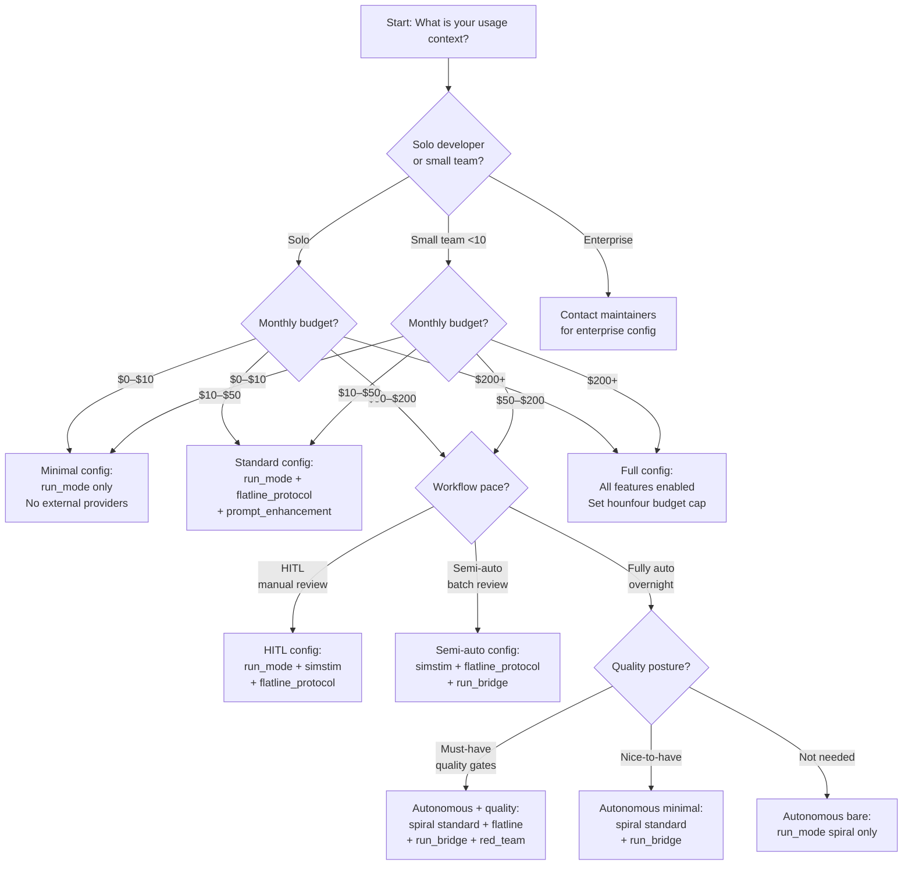

# Loa Configuration Reference

_Pricing verified: 2026-04-15. Prices change — recheck before large commitments._

This document covers every configurable key in `.loa.config.yaml`. Run `/loa setup` for an interactive wizard that guides you to a budget-appropriate configuration.

---

## Overview

`.loa.config.yaml` lives at your repository root and is never modified by framework updates. Copy sections from `.loa.config.yaml.example` into your own file to activate features. Every key has a safe default — you can run Loa with an empty config and enable features incrementally as you need them.

This document is organised in three parts:

1. **Cost Matrix** and **Decision Guide** — read these first before enabling expensive features.
2. **Primary Sections** — high-impact features that invoke external AI APIs and have meaningful cost implications.
3. **Secondary Sections** — lower-cost or cost-free configuration knobs.

All price estimates assume the models and token volumes documented in the **Pricing Footnotes** at the end of this file. Use the `/loa setup` wizard to build a configuration matched to your budget.

---

## Cost Matrix

> [!NOTE]
> All costs are approximate and based on Anthropic, OpenAI, and Google published pricing as of 2026-04-15. Actual costs depend on your specific usage patterns, context sizes, and model API pricing which changes over time. Recheck before large commitments — see [Pricing Footnotes](#pricing-footnotes).
>
> Model names in this document (Opus 4.6, Sonnet 4.6, GPT-5.3-codex, Gemini 2.5 Pro) reflect the models configured in Hounfour at the time of writing. Your actual models depend on your `.loa.config.yaml` settings and `model-adapter.sh` registry. If model names or pricing have changed, update the Hounfour config and refer to your provider's current pricing page.

| Feature | Per-Invocation Low | Per-Invocation High | Models Used | Monthly at Moderate Workflow[^1] |
|---------|-------------------|---------------------|-------------|----------------------------------|
| Flatline Protocol | $15 | $25 | Opus 4.6 + GPT-5.3-codex | ~$120–200 |
| Simstim | $25 | $65 | Opus 4.6 + GPT-5.3-codex + Gemini 2.5 Pro | ~$200–520 |
| Spiral (standard profile) | $10 | $15 | Sonnet 4.6 (exec) + Opus 4.6 (judge) | ~$40–60 |
| Spiral (full profile) | $20 | $35 | Sonnet 4.6 + Opus 4.6 + GPT-5.3-codex + Gemini | ~$80–140 |
| Run Bridge | $10 | $20 | Opus 4.6 + GPT-5.3-codex | ~$40–80 |
| Post-PR Validation | $5 | $15 | Opus 4.6 | ~$80–240 |
| Red Team (standard) | $5 | $15 | Opus 4.6 + GPT-5.3-codex | ~$20–60 |
| Red Team (deep) | $15 | $30 | Opus 4.6 + GPT-5.3-codex | ~$30–60 |
| Continuous Learning (Flatline integration) | $2 | $8 | Opus 4.6 | ~$32–128 |
| Prompt Enhancement | <$0.05 | $0.10 | Sonnet 4.6 | ~$1–5 |

[^1]: Moderate workflow assumption: 2 planning cycles/week (≈8/month), 4 PRs/week (≈16/month). Your actual costs will vary based on PR volume, planning frequency, and context size.

---

## Decision Guide

Use this flowchart to route yourself to a recommended feature set before touching the config.

**Fallback decision table** (if the Mermaid diagram does not render):

| Usage Tier | Budget | Workflow Pace | Recommended Feature Set |
|-----------|--------|---------------|------------------------|
| Solo | $0–$10/mo | Any | `run_mode` only |
| Solo | $10–$50/mo | Any | `run_mode` + `flatline_protocol` + `prompt_enhancement` |
| Solo/Team | $50–$200/mo | HITL | `run_mode` + `simstim` + `flatline_protocol` |
| Solo/Team | $50–$200/mo | Semi-auto | `simstim` + `flatline_protocol` + `run_bridge` |
| Solo/Team | $50–$200/mo | Fully auto | `spiral` (standard) + `run_bridge` |
| Any | $200+/mo | Fully auto | All features + `hounfour` metering with daily cap |

> **Always set a budget cap appropriate for your usage tier.** Enable `hounfour.metering.enabled: true` and set `hounfour.metering.budget.daily_micro_usd` before running autonomous modes overnight. Recommended values: `1000000` ($1/day) for solo $0–10/mo tier, `10000000` ($10/day, the default) for moderate use, `50000000` ($50/day) for active autonomous workflows. See [`### hounfour`](#hounfour) for setup.

Run `/loa setup` to have the wizard walk you through this decision interactively.

---

## Primary Sections

These sections configure features that invoke external AI APIs. Each section documents costs, risks, and setup requirements before sub-keys so you can make an informed decision.

---

### simstim

> **ELI5**: Simstim is an AI co-pilot for your entire development cycle. It runs you through planning, building, reviewing, and auditing — with multiple AI models reviewing each stage. You stay in the driver's seat at every decision point, but AI handles the heavy lifting. Like having a senior engineer sitting next to you who has read every RFC you've ever written.

**Version introduced**: v1.0.0  
**Recommendation**: Enable when you want AI-accelerated HITL development with multi-model quality gates at each phase.  
**Default**: `enabled: true`

> **Cost Warning**: Simstim invokes Opus 4.6, GPT-5.3-codex, and Gemini 2.5 Pro at each phase gate. A full cycle (PRD → SDD → Sprint → Implementation) costs **$25–$65**. Set `hounfour.metering.budget.daily_micro_usd` before running unattended sessions.

#### Sub-keys

| Key | Type | Default | Description |
|-----|------|---------|-------------|
| `enabled` | bool | `true` | Master toggle |
| `flatline.auto_accept_high_consensus` | bool | `true` | Auto-integrate HIGH_CONSENSUS Flatline findings without prompting |
| `flatline.show_disputed` | bool | `true` | Present DISPUTED findings for human decision |
| `flatline.show_blockers` | bool | `true` | Present BLOCKER findings (not auto-halt in HITL mode) |
| `flatline.phases` | list | `[prd, sdd, sprint]` | Which phases get Flatline review |
| `defaults.timeout_hours` | int | `24` | Maximum workflow duration |
| `skip_phases.prd_if_exists` | bool | `false` | Skip PRD phase if file already exists |
| `skip_phases.sdd_if_exists` | bool | `false` | Skip SDD phase if file already exists |
| `skip_phases.sprint_if_exists` | bool | `false` | Skip Sprint phase if file already exists |

#### Cost

Per invocation: $25–$65 (full PRD→Implementation cycle). Monthly at moderate workflow: ~$200–520.  
Models: Opus 4.6 (primary review), GPT-5.3-codex (cross-review), Gemini 2.5 Pro (tertiary).  
Requires: `ANTHROPIC_API_KEY` + `OPENAI_API_KEY` + optionally `GOOGLE_API_KEY`.

#### Risks if enabled

- Cost can spike on large codebases with many Flatline finding iterations.
- DISPUTED findings require human time to resolve at each phase gate.
- Timeout of 24h may be exceeded on very large projects.

#### Risks if disabled

- No multi-model adversarial review of planning documents.
- Single-model planning lacks cross-model dissent to catch blind spots.

#### Setup requirements

- `ANTHROPIC_API_KEY` (required)
- `OPENAI_API_KEY` (required for cross-review)
- `hounfour.flatline_routing: true` (recommended)
- `hounfour.metering.enabled: true` (recommended for cost safety)

#### See also

- `.claude/skills/simstim-workflow/SKILL.md`
- `.claude/loa/reference/flatline-reference.md`

---

### run_mode

> **ELI5**: Run Mode lets Claude run autonomously overnight. You kick off a sprint in the evening, go to sleep, and wake up to reviewed and audited code waiting for your approval. It's like delegating to a junior engineer who is very fast but needs you to check their work before merging.

**Version introduced**: v1.27.0  
**Recommendation**: Enable for semi-autonomous and fully-autonomous workflows. Configure `git.auto_push` to control whether PRs are created automatically.  
**Default**: `enabled: true`

#### Sub-keys

| Key | Type | Default | Description |
|-----|------|---------|-------------|
| `enabled` | bool | `true` | Master toggle |
| `defaults.max_cycles` | int | `20` | Maximum sprint cycles before stopping |
| `defaults.timeout_hours` | int | `8` | Maximum total run duration |
| `sprint_plan.branch_prefix` | string | `"feature/"` | Git branch name prefix |
| `sprint_plan.default_branch_name` | string | `"release"` | Default branch name |
| `sprint_plan.consolidate_pr` | bool | `true` | Merge all sprint branches into one PR |
| `sprint_plan.commit_prefix` | string | `"feat"` | Conventional commit prefix |
| `sprint_plan.include_commits_by_sprint` | bool | `true` | Group commits by sprint in PR body |
| `git.auto_push` | bool/string | `true` | Push commits: `true`, `false`, or `"prompt"` |
| `git.create_draft_pr` | bool | `true` | Always create PRs as drafts (hardcoded) |
| `git.base_branch` | string | `"main"` | Branch to diff against for sprint completion |
| `git.sprint_commit_pattern` | string | `'^feat\(sprint-'` | Regex for sprint commit detection |

#### Cost

Run Mode itself is low-cost (no external API calls for orchestration). Cost comes from the sub-skills it invokes: `/implement`, `/review-sprint`, `/audit-sprint`, and optionally Flatline.  
See individual skill costs: Flatline ($15–25/planning cycle), Bridgebuilder ($10–20/run).

#### Risks if enabled

- `git.auto_push: true` will push commits and create draft PRs without confirmation.
- `max_cycles: 20` may run long overnight sessions — set `hounfour.metering.budget.daily_micro_usd` as a safety net.

#### Risks if disabled

- Autonomous `/run` commands will not execute.
- HITL workflow still works via individual skill invocations.

#### Setup requirements

- Git configured with remote push access
- Optional: `hounfour.metering.enabled: true` for cost safety

#### See also

- `.claude/skills/run-mode/SKILL.md`
- `.claude/loa/reference/hooks-reference.md`

---

### hounfour

> **ELI5**: Hounfour is the model router and cost tracker for all external API calls. Think of it as the switchboard and accountant rolled into one: it decides which AI provider handles each request, and it tracks every dollar spent. Set a daily budget here so you never wake up to a surprise bill.

**Version introduced**: v1.36.0  
**Recommendation**: Enable metering before using any expensive features. Set `daily_micro_usd` to a value you're comfortable spending per day.  
**Default**: `flatline_routing: false`, `metering.enabled: true`

#### Sub-keys

| Key | Type | Default | Description |
|-----|------|---------|-------------|
| `flatline_routing` | bool | `false` | Route Flatline through Hounfour provider selection (canonical key) |
| `feature_flags.metering` | bool | `true` | Enable BudgetEnforcer cost tracking |
| `feature_flags.google_adapter` | bool | `true` | Enable Google provider |
| `feature_flags.flatline_routing` | bool | `false` | Alias for top-level `flatline_routing` — top-level key takes precedence if both are set |
| `metering.enabled` | bool | `true` | Enable cost tracking |
| `metering.ledger_path` | string | `.run/cost-ledger.jsonl` | JSONL append-only cost ledger |
| `metering.budget.daily_micro_usd` | int | `10000000` | Daily budget cap in micro-USD ($10/day) |
| `metering.budget.warn_at_percent` | int | `80` | Warn when spend exceeds this % of daily budget |
| `metering.budget.on_exceeded` | string | `"downgrade"` | Action when budget exceeded: `block` (hard-stop all API calls), `downgrade` (switch expensive models to cheaper alternatives, e.g., Opus→Sonnet), `warn` (log warning but continue spending) |

#### Cost

No direct API cost. Hounfour is a routing and metering layer. Cost comes from the providers it routes to.

#### Risks if enabled

- Misconfigured `daily_micro_usd: 0` will block all API calls immediately. Use a nonzero value.
- `on_exceeded: block` will hard-stop autonomous workflows mid-cycle if budget is hit.
- The default daily cap of $10/day is conservative. Solo developers running occasional Flatline reviews will stay well within this. If you run autonomous overnight workflows (Spiral, Run Bridge), you may need to raise it — `50000000` ($50/day) is reasonable for active autonomous use, `500000000` ($500/day) for enterprise with heavy multi-cycle Spiral runs.

#### Risks if disabled

- No budget enforcement — uncapped spending in autonomous modes.
- No cost ledger for spend analysis.

#### Setup requirements

- At least one provider API key: `ANTHROPIC_API_KEY`, `OPENAI_API_KEY`, or `GOOGLE_API_KEY`
- Writable `.run/` directory for cost ledger

#### See also

- `.claude/loa/reference/hooks-reference.md`

---

### vision_registry

> **ELI5**: The Vision Registry is a long-term memory for architectural ideas that aren't ready to implement yet. Whenever an AI reviewer or bridge loop spots an interesting pattern — "we could make auth pluggable," "this could become a registry" — it gets captured here so it's not lost between sessions. When a future planning cycle touches the same area, the relevant vision surfaces automatically.

**Version introduced**: v1.39.0  
**Recommendation**: Start with `shadow_mode: true` (default). After two cycles the wizard will ask you to activate. Full activation is safe for any budget tier.  
**Default**: `enabled: false`, `shadow_mode: true`

#### Sub-keys

| Key | Type | Default | Description |
|-----|------|---------|-------------|
| `enabled` | bool | `false` | Master toggle |
| `shadow_mode` | bool | `true` | Log matches silently; activate after threshold cycles |
| `shadow_cycles_before_prompt` | int | `2` | Cycles before activation prompt is shown |
| `status_filter` | list | `[Captured, Exploring]` | Vision statuses to consider for matching |
| `min_tag_overlap` | int | `2` | Minimum tag overlap to surface a vision |
| `max_visions_per_session` | int | `3` | Max visions shown per planning session |
| `ref_elevation_threshold` | int | `3` | Reference count before suggesting lore elevation |
| `propose_requirements` | bool | `false` | Propose vision-inspired requirements in PRD |
| `bridge_auto_capture` | bool | `false` | Auto-capture VISION findings from bridge reviews |

#### Cost

No external API calls. Vision matching is local tag overlap. Only `propose_requirements: true` triggers an LLM call to generate PRD proposals.

#### Risks if enabled

- With `propose_requirements: true`, vision-inspired requirements may add scope to cycles.
- `max_visions_per_session: 3` keeps output focused; increase cautiously.

#### Risks if disabled

- Architectural insights from bridge and Flatline reviews are not preserved across sessions.
- Patterns spotted in cycle N are invisible to cycle N+10 planning.

#### Setup requirements

- None for shadow mode
- Vision index at `grimoires/loa/visions/index.md` (auto-created on first activation)

#### See also

- `.claude/skills/spiraling/SKILL.md`

---

### spiral

> **ELI5**: Spiral is a self-improving development loop. It runs your full Loa workflow (plan → build → review → audit) repeatedly, with each cycle feeding lessons into the next. Set a cycle budget and walk away. Good for "I want the codebase significantly improved by morning" workflows.

**Version introduced**: v0.1.0 (MVP, cycle-066)  
**Recommendation**: Start with `harness.pipeline_profile: standard` and `budget_cents: 2000` ($20). Increase budget only after validating quality gates work in your repo.  
**Default**: `enabled: false`

> **Cost Warning**: Spiral's `standard` profile costs **$10–15/cycle**, `full` profile **$20–35/cycle**. A 3-cycle run at standard = **~$30–45**. A 5-cycle full run would cost ~$100–175 but **the hard ceiling of $100 (`budget_cents: 10000`) will terminate the spiral mid-run when the budget is exhausted**. The ceiling is a hard maximum — you cannot configure higher. Plan your cycle count to fit within it. Hard ceilings: max 50 cycles, $100 budget cap, 24h wall clock.

#### Sub-keys

| Key | Type | Default | Description |
|-----|------|---------|-------------|
| `enabled` | bool | `false` | Master toggle |
| `default_max_cycles` | int | `3` | Cycle budget per spiral run |
| `flatline.min_new_findings_per_cycle` | int | `3` | Minimum new findings before kaironic termination |
| `flatline.consecutive_low_cycles` | int | `2` | Consecutive low-finding cycles before stopping |
| `budget_cents` | int | `2000` | Cost budget in cents ($20). Hard ceiling: 10000 ($100) — values above are clamped |
| `wall_clock_seconds` | int | `28800` | Max wall-clock time (8h). Hard ceiling: 86400 (24h) — values above are clamped |
| `seed.enabled` | bool | `false` | Pull prior cycle outputs into discovery context |
| `halt_sentinel` | string | `.run/spiral-halt` | Create this file to halt gracefully mid-spiral |
| `harness.enabled` | bool | `true` | Use evidence-gated harness (required for quality gates) |
| `harness.pipeline_profile` | string | `"standard"` | `light`, `standard`, or `full` (see below) |
| `harness.executor_model` | string | `"sonnet"` | Model for planning/implementation phases |
| `harness.advisor_model` | string | `"opus"` | Model for review/audit phases |
| `scheduling.enabled` | bool | `false` | Off-hours scheduling |
| `scheduling.windows` | list | — | UTC time windows for scheduled runs |

**Pipeline profiles**:

| Profile | Flatline Gates | Advisor | Budget/Cycle | Use When |
|---------|---------------|---------|-------------|----------|
| `light` | None | Sonnet | ~$8 | Low-cost iterations, documentation work |
| `standard` | Sprint Flatline only | Opus | ~$12 | Default — balanced quality and cost |
| `full` | All 3 Flatline gates | Opus | ~$20–35 | Maximum quality, large refactors |

#### Cost

Per cycle: $10–15 (standard), $20–35 (full). Monthly at moderate workflow (4 cycles): ~$40–60 (standard), ~$80–140 (full).  
Models: Sonnet 4.6 (executor), Opus 4.6 (advisor). Full profile adds GPT-5.3-codex + Gemini.

#### Risks if enabled

- Autonomous cycles run without HITL confirmation unless `halt_sentinel` is created.
- Flat/divergent codebases may hit budget before producing useful improvements.
- Without harness, LLM can skip quality gates — keep `harness.enabled: true`.

#### Risks if disabled

- No multi-cycle autonomous development.
- Each cycle must be started manually via `/run sprint-N`.

#### Setup requirements

- `ANTHROPIC_API_KEY` (required)
- `OPENAI_API_KEY` (required for `standard`/`full` profiles)
- `hounfour.metering.enabled: true` (strongly recommended)
- `harness.enabled: true` (required for quality gate enforcement)

#### See also

- `.claude/skills/spiraling/SKILL.md`
- `.claude/scripts/spiral-orchestrator.sh`
- `.claude/scripts/spiral-harness.sh` (evidence-gated harness)

---

### run_bridge

> **ELI5**: Run Bridge is an iterative improvement loop. It takes your code, runs a multi-model code review, fixes issues, and repeats until quality converges. Think of it as "keep polishing until reviewers run out of complaints." Great for PRs that need to meet a high quality bar.

**Version introduced**: v1.35.0  
**Recommendation**: Enable for production codebases where PR quality matters. Start with `defaults.depth: 3` (3 iterations) and tune based on convergence speed.  
**Default**: `enabled: false`

> **Cost Warning**: Each bridge iteration invokes Opus 4.6 and GPT-5.3-codex for review. A depth-5 run costs **$10–20 total**. Long iterations on large codebases cost more.

#### Sub-keys

| Key | Type | Default | Description |
|-----|------|---------|-------------|
| `enabled` | bool | `false` | Master toggle |
| `defaults.depth` | int | `3` | Maximum bridge iterations |
| `defaults.per_sprint` | bool | `false` | Review after each sprint vs after full plan |
| `defaults.flatline_threshold` | float | `0.05` | Score ratio below which iteration is "flat" |
| `defaults.consecutive_flatline` | int | `2` | Consecutive flat iterations before stopping |
| `timeouts.per_iteration_hours` | int | `4` | Max hours per iteration |
| `timeouts.total_hours` | int | `24` | Max total bridge hours |
| `github_trail.post_comments` | bool | `true` | Post Bridgebuilder review as PR comment |
| `github_trail.update_pr_body` | bool | `true` | Update PR body with iteration summary |
| `ground_truth.enabled` | bool | `true` | Generate Ground Truth files after convergence |
| `bridgebuilder.persona_enabled` | bool | `true` | Use persona-driven enriched reviews |
| `bridgebuilder.enriched_findings` | bool | `true` | Include educational context in findings |

#### Cost

Per depth-5 run: $10–20. Monthly at moderate workflow (1 bridge/week): ~$40–80.  
Models: Opus 4.6 (Bridgebuilder review), GPT-5.3-codex (cross-review dissent).

#### Risks if enabled

- `github_trail.post_comments: true` posts findings to GitHub PRs — ensure PR is private if needed.
- Iterations may not converge on fundamentally flawed architecture.

#### Risks if disabled

- No iterative improvement loop for code quality.
- Bridgebuilder review available only as one-shot via `/flatline-review`.

#### Setup requirements

- `ANTHROPIC_API_KEY` (required)
- `OPENAI_API_KEY` (required for cross-review)
- GitHub token with PR write access (for `github_trail.post_comments`)

#### See also

- `.claude/skills/run-bridge/SKILL.md`
- `.claude/loa/reference/run-bridge-reference.md`

---

### post_pr_validation

> **ELI5**: Post-PR Validation runs a checklist after you push a PR: security audit, E2E tests, Flatline review, Bridgebuilder review. Think of it as the quality gate that fires after the code is committed but before anyone reviews it — catches things that unit tests miss.

**Version introduced**: v1.36.0  
**Recommendation**: Enable for production repos. Leave `phases.flatline.enabled: false` and `phases.bridgebuilder_review.enabled: false` until you're comfortable with the baseline costs.  
**Default**: `enabled: true`, most expensive phases disabled

> **Cost Warning**: With `phases.flatline.enabled: true`, adds ~$5–15 per PR. With `phases.bridgebuilder_review.enabled: true`, adds ~$10–20 per PR (Opus + GPT-5.3-codex).

#### Sub-keys

| Key | Type | Default | Description |
|-----|------|---------|-------------|
| `enabled` | bool | `true` | Master toggle |
| `phases.audit.enabled` | bool | `true` | Run consolidated PR audit after PR creation |
| `phases.audit.max_iterations` | int | `5` | Max fix iterations |
| `phases.audit.min_severity` | string | `"medium"` | Skip findings below this severity |
| `phases.context_clear.enabled` | bool | `true` | Clear context for fresh-eyes review |
| `phases.e2e.enabled` | bool | `true` | E2E testing with fresh context |
| `phases.flatline.enabled` | bool | `false` | Optional Flatline PR review (~$5–15 depending on diff size) |
| `phases.flatline.mode` | string | `"hitl"` | `hitl` or `autonomous` |
| `phases.bridgebuilder_review.enabled` | bool | `false` | Post-PR Bridgebuilder loop (opt-in) |
| `phases.bridgebuilder_review.auto_triage_blockers` | bool | `true` | Auto-dispatch `/bug` for BLOCKER findings |
| `phases.bridgebuilder_review.depth` | int | `5` | Bridge iterations for post-PR review |

#### Cost

Without optional phases: minimal (local checks + Sonnet for audit). With `flatline.enabled: true`: +$5–15/PR. With `bridgebuilder_review.enabled: true`: +$10–20/PR. Monthly at 16 PRs: ~$80–240 (all enabled).

#### Risks if enabled

- `auto_triage_blockers: true` will autonomously create bug fix PRs for BLOCKER findings. Findings are queued to `.run/bridge-pending-bugs.jsonl` and dispatched one at a time through `/bug` — not batch-created. The circuit breaker in `/bug` (same finding 3x = escalate to HITL) limits runaway triage. If Bridgebuilder produces many BLOCKERs in a single review, they queue but only the next `/bug` invocation consumes one.
- `phases.flatline.mode: autonomous` runs without human confirmation.

#### Risks if disabled

- No automated post-PR quality gate.
- Security findings may slip through without post-PR audit.

#### Setup requirements

- `ANTHROPIC_API_KEY` (for Flatline and Bridgebuilder phases)
- `OPENAI_API_KEY` (for Bridgebuilder cross-review)

#### See also

- `.claude/loa/reference/flatline-reference.md`
- `.claude/loa/reference/run-bridge-reference.md`

---

### prompt_enhancement

> **ELI5**: Prompt Enhancement automatically improves your prompts before they reach skill execution. When you invoke a skill, your input is silently refined for clarity, specificity, and completeness — like having an editor polish your instructions before handing them to a contractor. You never see the enhancement unless you enable `show_analysis`.

**Version introduced**: v1.14.0 (explicit), v1.17.0 (invisible mode)  
**Recommendation**: Leave enabled (default). The cost is negligible and the quality improvement is meaningful. Disable only if you need exact prompt passthrough for debugging.  
**Default**: `enabled: true`

#### Sub-keys

| Key | Type | Default | Description |
|-----|------|---------|-------------|
| `enabled` | bool | `true` | Master toggle |
| `auto_enhance_threshold` | int | `4` | Minimum prompt token count before enhancement kicks in (very short prompts pass through) |
| `show_analysis` | bool | `true` | Show the enhancement analysis in trajectory logs |
| `max_refinement_iterations` | int | `3` | Maximum refinement passes before accepting the enhanced prompt |

#### Cost

Per invocation: <$0.05–$0.10 (Sonnet 4.6, small context). Monthly at moderate workflow: ~$1–5.  
Enhancement runs once per skill invocation with a small prompt — token usage is minimal.

#### Risks if enabled

- None significant. Enhancement is invisible and non-blocking.
- `show_analysis: true` adds verbose output to trajectory logs.

#### Risks if disabled

- Skill prompts are not refined — ambiguous or incomplete prompts produce lower-quality outputs.
- Particularly noticeable in `/plan-and-analyze` and `/architect` where prompt quality directly affects artifact quality.

#### Setup requirements

- `ANTHROPIC_API_KEY` (uses Sonnet for enhancement — included in base Claude Code usage)

#### See also

- `.claude/skills/enhancing-prompts/SKILL.md`

---

### prompt_isolation

> **ELI5**: Prompt Isolation wraps external content (PR diffs, review documents, user input) in a protective envelope so that content cannot override Claude's instructions. Like putting suspicious email in a sandbox before opening it — the content can be read but cannot execute commands.

**Version introduced**: v1.42.0  
**Recommendation**: Leave enabled (default). Only disable if you are debugging a prompt injection issue and need to see raw content.  
**Default**: `enabled: true`

#### Sub-keys

| Key | Type | Default | Description |
|-----|------|---------|-------------|
| `enabled` | bool | `true` | Master toggle. When false, `isolate_content()` passes through unchanged |

#### Cost

None. Local text wrapping, no API calls.

#### Risks if enabled

- None known. Transparent to normal workflows.

#### Risks if disabled

- Prompt injection attacks from reviewed documents, PR diffs, or learning content become possible.
- CRITICAL: Never disable in production autonomous workflows.

#### Setup requirements

- None

#### See also

- `.claude/loa/reference/guardrails-reference.md`

---

### continuous_learning

> **ELI5**: Continuous Learning watches your development sessions and extracts reusable patterns — "every time you did X, Y was the fix." These patterns accumulate into a learning library that gets injected into future sessions. Like a second brain that remembers every lesson from every debugging session and surfaces it when relevant.

**Version introduced**: v1.17.0 (invisible_retrospective), v1.23.0 (Flatline integration)  
**Recommendation**: Enable both `invisible_retrospective` and `compound_learning`. Enable `flatline_integration` only if you're already running Flatline Protocol.  
**Default**: `invisible_retrospective.enabled: true`, `compound_learning.enabled: true`, `flatline_integration.enabled: true`

> **Cost Warning**: `flatline_integration.enabled: true` with `fallback_to_llm: true` adds Opus API calls to transform Flatline findings into learnings. Estimated $2–8 per session with active Flatline.

#### Sub-keys

**`invisible_retrospective`** (session learning):

| Key | Type | Default | Description |
|-----|------|---------|-------------|
| `enabled` | bool | `true` | Enable automatic learning detection |
| `surface_threshold` | int | `3` | Gates passed (0–4) before surfacing finding |
| `max_candidates` | int | `5` | Max candidates evaluated per invocation |
| `max_extractions_per_session` | int | `3` | Max learnings extracted per session |
| `sanitize_descriptions` | bool | `true` | Redact API keys/paths before logging |

**`compound_learning`** (cross-session pattern mining):

| Key | Type | Default | Description |
|-----|------|---------|-------------|
| `enabled` | bool | `true` | Enable compound learning |
| `pattern_detection.min_occurrences` | int | `2` | Minimum occurrences before pattern recognition |
| `pattern_detection.similarity_threshold` | float | `0.6` | Similarity threshold for pattern clustering |
| `flatline_integration.enabled` | bool | `true` | Connect Flatline outputs to learning pipeline |
| `flatline_integration.capture_from_flatline.min_consensus_score` | int | `750` | Minimum Flatline consensus to capture |
| `flatline_integration.transformation.fallback_to_llm` | bool | `true` | Use LLM to transform findings to learnings |
| `flatline_integration.transformation.max_transformations_per_cycle` | int | `50` | Cap per cycle to prevent runaway costs |

#### Cost

`invisible_retrospective` alone: no external API cost (local pattern detection). `compound_learning.flatline_integration` with `fallback_to_llm: true`: $2–8 per session. Monthly at moderate workflow: ~$32–128.

#### Risks if enabled

- `fallback_to_llm: true` can make unexpected API calls during non-planning sessions.
- Extracted learnings may occasionally be context-specific and noisy.

#### Risks if disabled

- No automated pattern accumulation from debugging or review sessions.
- Institutional knowledge from AI sessions is lost between sessions.

#### Setup requirements

- No external APIs required for `invisible_retrospective`
- `ANTHROPIC_API_KEY` (required for `flatline_integration.fallback_to_llm: true`)

#### See also

- `.claude/skills/continuous-learning/SKILL.md`
- `.claude/loa/reference/memory-reference.md`

---

### red_team

> **ELI5**: Red Team is an adversarial AI that tries to break your design before you build it. Give it your PRD and SDD, and two AI models independently attack it: "what if an attacker does X?" "what if the API is called in the wrong order?" The output is a ranked list of attack scenarios and proposed counter-designs.

**Version introduced**: v1.0.0 (cycle-012)  
**Recommendation**: Run in `standard` mode after each SDD. Reserve `deep` mode for security-critical components.  
**Default**: `enabled: false`

> **Cost Warning**: Standard mode invokes Opus 4.6 + GPT-5.3-codex at **$5–15 per invocation**. Deep mode at **$15–30**. Enable only when you have API keys configured.

#### Sub-keys

| Key | Type | Default | Description |
|-----|------|---------|-------------|
| `enabled` | bool | `false` | Master toggle |
| `mode` | string | `"standard"` | `quick`, `standard`, or `deep` |
| `thresholds.confirmed_attack` | int | `700` | Both models > this → CONFIRMED_ATTACK |
| `thresholds.theoretical` | int | `400` | Theoretical concern threshold |
| `thresholds.human_review_gate` | int | `800` | Severity requiring human acknowledgment |
| `budgets.quick_max_tokens` | int | `50000` | Token cap for quick mode |
| `budgets.standard_max_tokens` | int | `200000` | Token cap for standard mode |
| `budgets.deep_max_tokens` | int | `500000` | Token cap for deep mode |
| `simstim.auto_trigger` | bool | `false` | Run as Phase 4.5 of `/simstim` |

#### Cost

Standard: $5–15 per invocation. Deep: $15–30 per invocation. Monthly at moderate workflow (4 invocations): ~$20–60 (standard), ~$30–60 (deep).  
Models: Opus 4.6 + GPT-5.3-codex.

#### Risks if enabled

- `simstim.auto_trigger: true` adds ~$5–15 to every Simstim cycle automatically.
- CONFIRMED_ATTACK findings require human acknowledgment before proceeding.

#### Risks if disabled

- No adversarial pre-build threat modeling.
- Security vulnerabilities may be discovered post-build rather than at design time.

#### Setup requirements

- `ANTHROPIC_API_KEY` (required)
- `OPENAI_API_KEY` (required for cross-review dissent)
- `hounfour.flatline_routing: true` (for live model invocation)

#### See also

- `.claude/skills/red-teaming/SKILL.md`

---

### flatline_protocol

> **ELI5**: Flatline Protocol is a multi-model adversarial review for planning documents. When you finish writing a PRD or SDD, Flatline sends it to Claude Opus and GPT simultaneously, compares their reviews, and surfaces findings where both models agree (high confidence) or disagree (needs human judgment). It's like hiring two senior engineers to review your design independently, then comparing their notes.

**Version introduced**: v1.17.0  
**Recommendation**: Enable for any team running planning-heavy workflows. HIGH_CONSENSUS findings auto-integrate so it doesn't slow you down — only DISPUTED findings require your attention.  
**Default**: `enabled: true`

> **Cost Warning**: Flatline invokes Opus 4.6 + GPT-5.3-codex per review phase. A full planning cycle (PRD + SDD + Sprint) costs **$15–25**. With `code_review.enabled: true` and `security_audit.enabled: true`, add ~$3 per PR.

#### Sub-keys

| Key | Type | Default | Description |
|-----|------|---------|-------------|
| `enabled` | bool | `true` | Master toggle |
| `auto_trigger` | bool | `true` | Auto-run after each planning phase |
| `phases.prd` | bool | `true` | Review after `/plan-and-analyze` |
| `phases.sdd` | bool | `true` | Review after `/architect` |
| `phases.sprint` | bool | `true` | Review after `/sprint-plan` |
| `models.primary` | string | `"opus"` | Primary review model |
| `models.secondary` | string | `"gpt-5.3-codex"` | Cross-review model |
| `thresholds.high_consensus` | int | `700` | Auto-integrate above this score |
| `thresholds.disputed_delta` | int | `300` | Score delta above which finding is DISPUTED |
| `thresholds.blocker_skeptic` | int | `700` | Skeptic concern above this = BLOCKER |
| `max_iterations` | int | `5` | Maximum Flatline loops per document |
| `code_review.enabled` | bool | `false` | Opt-in dissent for `/review-sprint` |
| `security_audit.enabled` | bool | `false` | Opt-in dissent for `/audit-sprint` |
| `inquiry.budget_cents` | int | `500` | Cost cap per inquiry invocation |
| `secret_scanning.enabled` | bool | `true` | Redact secrets before sending to external models. **Security invariant** — setting to `false` is overridden to `true` at runtime with a CRITICAL log |

#### Cost

Per planning cycle: $15–25. With `code_review` + `security_audit` enabled: +$3 per PR. Monthly at moderate workflow (8 planning cycles): ~$120–200.  
Models: Opus 4.6 (primary), GPT-5.3-codex (secondary/cross-review).

#### Risks if enabled

- `secret_scanning.enabled` is a **security invariant** — the runtime overrides `false` to `true` and logs a CRITICAL warning. This config key exists for forward compatibility but cannot be disabled. Raw code must never be sent to external providers without redaction.
- BLOCKER findings halt autonomous workflows until resolved.
- `max_iterations: 5` creates a loop that may be long for complex documents.

#### Risks if disabled

- No multi-model adversarial review for planning documents.
- Single-model planning has no external dissent signal.
- `/simstim` and `/spiral` operate without Flatline quality gates.

#### Setup requirements

- `ANTHROPIC_API_KEY` (required — Opus)
- `OPENAI_API_KEY` (required — GPT-5.3-codex)
- `hounfour.flatline_routing: true` (recommended)
- `secret_scanning.enabled: true` (leave enabled — default is safe)

#### See also

- `.claude/loa/reference/flatline-reference.md`
- `.claude/skills/flatline-knowledge/SKILL.md`

---

### Safety Hooks (reference — not a YAML key)

Safety hooks are active in **all modes** (interactive, autonomous, simstim). They are not configurable via `.loa.config.yaml` — they are framework-managed and enforced at the platform level. This table is included for reference so you understand what protections are active.

> **ELI5**: These hooks are the guardrails that prevent the AI from accidentally deleting files, pushing to wrong branches, or writing to protected directories. They run before or after every tool call — you can't turn them off, and that's by design.

| Hook File | Event | Purpose |
|-----------|-------|---------|
| `block-destructive-bash.sh` | PreToolUse:Bash | Blocks `rm -rf`, `git push --force`, `git reset --hard`, `git clean -f` |
| `team-role-guard.sh` | PreToolUse:Bash | Enforces lead-only bash ops in Agent Teams mode (no-op in single-agent) |
| `team-role-guard-write.sh` | PreToolUse:Write/Edit | Blocks teammate writes to System Zone (`.claude/`), state files, and append-only files |
| `team-skill-guard.sh` | PreToolUse:Skill | Blocks lead-only skill invocations for teammates |
| `run-mode-stop-guard.sh` | Stop | Guards against premature exit during autonomous runs |
| `mutation-logger.sh` | PostToolUse:Bash | Logs mutating bash commands to `.run/audit.jsonl` |
| `write-mutation-logger.sh` | PostToolUse:Write/Edit | Logs Write/Edit file modifications to `.run/audit.jsonl` |

**Deny rules** (`.claude/hooks/settings.deny.json`): blocks agent access to `~/.ssh/`, `~/.aws/`, `~/.kube/`, `~/.gnupg/`, and credential stores.

#### See also

- `.claude/loa/reference/hooks-reference.md`

---

## Secondary Sections

These sections configure lower-cost or cost-free features. They use a lighter documentation format: ELI5, defaults, sub-keys, and see-also.

---

### paths

> **ELI5**: Paths lets you relocate Loa's state files out of the default locations. Useful if you're integrating Loa into a monorepo or using OpenClaw.

**Version introduced**: v1.27.0  
**Recommendation**: Leave at defaults unless you have a specific directory structure requirement.  
**Default**: `grimoire: grimoires/loa`, `beads: .beads`, `state_dir: .loa-state`

#### Sub-keys

| Key | Type | Default | Description |
|-----|------|---------|-------------|
| `grimoire` | string | `grimoires/loa` | Grimoire directory (relative to repo root) |
| `beads` | string | `.beads` | Beads task tracking directory |
| `soul.source` | string | `grimoires/loa/BEAUVOIR.md` | Soul template input |
| `soul.output` | string | `grimoires/loa/SOUL.md` | Soul generated output |
| `state_dir` | string | `.loa-state` | Consolidated state zone directory |

#### See also

- `.claude/loa/reference/beads-reference.md`

---

### ride

> **ELI5**: Ride analyzes your codebase and generates Loa-compatible Ground Truth artifacts. The `staleness_days` setting controls how often Ride re-analyzes before showing a warning.

**Version introduced**: v1.31.0  
**Recommendation**: Default staleness of 7 days is suitable for most projects.  
**Default**: `staleness_days: 7`

#### Sub-keys

| Key | Type | Default | Description |
|-----|------|---------|-------------|
| `staleness_days` | int | `7` | Days before ride artifacts are considered stale |
| `enrichment.gaps.max_open` | int | `200` | Maximum open gaps before error |
| `enrichment.gaps.warn_at` | int | `150` | Warning threshold for gap count |
| `enrichment.decisions.stale_months` | int | `12` | Months before ADR flagged stale |
| `enrichment.terminology.max_terms` | int | `50` | Maximum terms to extract from source |

#### See also

- `.claude/skills/riding-codebase/SKILL.md`

---

### plan_and_analyze

> **ELI5**: Controls discovery behavior for the PRD planning phase — how many questions are asked, whether to use structured interviewing, and how the PRD is generated.

**Version introduced**: v1.0.0  
**Recommendation**: Defaults are suitable. Adjust `max_interview_turns` if you find the discovery phase too long or too short.  
**Default**: See `.loa.config.yaml.example`

#### Sub-keys

| Key | Type | Default | Description |
|-----|------|---------|-------------|
| `enabled` | bool | `true` | Enable `/plan-and-analyze` |
| `interview.enabled` | bool | `true` | Use structured interview mode |
| `interview.max_turns` | int | — | Maximum interview turns before PRD generation |

#### See also

- `.claude/skills/discovering-requirements/SKILL.md`

---

### interview

> **ELI5**: Fine-grained control over the structured interview questions asked during PRD discovery. Customize which question sets are asked and in what order.

**Version introduced**: v1.0.0  
**Recommendation**: Leave at defaults unless you have domain-specific question templates.  
**Default**: All standard question sets enabled

#### Sub-keys

| Key | Type | Default | Description |
|-----|------|---------|-------------|
| `enabled` | bool | `true` | Enable structured interview mode |
| `sections` | list | — | Ordered list of question sections to include |

---

### autonomous_agent

> **ELI5**: Controls the danger level and permission tier for the `/autonomous` command — the fully-unattended workflow. CRITICAL danger level means it requires explicit human confirmation before starting.

**Version introduced**: v1.22.0  
**Recommendation**: Leave danger level at `critical`. Lowering it bypasses the confirmation gate in autonomous mode.  
**Default**: `danger_level: critical`

#### Sub-keys

| Key | Type | Default | Description |
|-----|------|---------|-------------|
| `danger_level` | string | `"critical"` | Permission tier: `critical`, `high`, `moderate`, `low` |
| `enabled` | bool | `true` | Enable autonomous agent mode |

#### See also

- `.claude/skills/autonomous-agent/SKILL.md`

---

### workspace_cleanup

> **ELI5**: After a sprint, workspace cleanup removes stale lock files, temporary artifacts, and other detritus. This setting controls how aggressive cleanup is and what is considered stale.

**Version introduced**: v1.0.0  
**Recommendation**: Enable for long-running projects. Adjust `staleness_days` if cleanup is too aggressive.  
**Default**: See `.loa.config.yaml.example`

#### Sub-keys

| Key | Type | Default | Description |
|-----|------|---------|-------------|
| `enabled` | bool | `true` | Enable post-sprint cleanup |
| `staleness_days` | int | `7` | Files older than this are candidates for cleanup |

---

### goal_traceability

> **ELI5**: Goal Traceability connects every sprint task back to a PRD requirement. Enables automatic validation that implementation covers all stated goals.

**Version introduced**: v1.0.0  
**Recommendation**: Enable for traceability in regulated or audited environments.  
**Default**: `enabled: true`

#### Sub-keys

| Key | Type | Default | Description |
|-----|------|---------|-------------|
| `enabled` | bool | `true` | Enable goal-to-implementation traceability |

---

### effort

> **ELI5**: Effort estimation injects story-point or time estimates into sprint plans, helping teams scope work before committing to a cycle.

**Version introduced**: v1.0.0  
**Recommendation**: Enable for teams that need sprint scoping. Disable for solo rapid iteration where estimation overhead is not worthwhile.  
**Default**: See `.loa.config.yaml.example`

#### Sub-keys

| Key | Type | Default | Description |
|-----|------|---------|-------------|
| `enabled` | bool | `true` | Include effort estimates in sprint plans |
| `unit` | string | `"story_points"` | Estimation unit: `story_points`, `hours`, `days` |

---

### context_editing

> **ELI5**: Context Editing controls how Claude manages its own context window during long sessions — what gets summarised, what gets preserved verbatim.

**Version introduced**: v1.0.0  
**Recommendation**: Leave at defaults. Override `preserve_sections` if specific document sections should never be summarised.  
**Default**: See `.loa.config.yaml.example`

#### Sub-keys

| Key | Type | Default | Description |
|-----|------|---------|-------------|
| `enabled` | bool | `true` | Enable context management |
| `preserve_sections` | list | — | Section headings to preserve verbatim |

---

### memory_schema

> **ELI5**: Memory Schema configures how observations from development sessions are stored and retrieved. Affects the persistent memory system used for cross-session recall.

**Version introduced**: v1.28.0  
**Recommendation**: Leave at defaults unless you need custom memory categories.  
**Default**: Standard categories enabled

#### Sub-keys

| Key | Type | Default | Description |
|-----|------|---------|-------------|
| `enabled` | bool | `true` | Enable memory schema |
| `categories` | list | — | Memory categories to track |

#### See also

- `.claude/loa/reference/memory-reference.md`

---

### skills

> **ELI5**: The skills section lets you configure per-skill behaviour — which skills are enabled, what their danger levels are, and any overrides to their default parameters.

**Version introduced**: v1.0.0  
**Recommendation**: Leave at defaults. Use this only if you need to disable a specific skill or override its parameters.  
**Default**: All skills enabled at their default danger levels

#### Sub-keys

| Key | Type | Default | Description |
|-----|------|---------|-------------|
| `<skill-name>.enabled` | bool | `true` | Enable/disable a specific skill |
| `<skill-name>.danger_level` | string | — | Override skill danger level |

---

### oracle

> **ELI5**: Oracle is a code-pattern analysis tool that queries your codebase for architectural patterns, anti-patterns, and structural insights. When `live_model` is enabled, it invokes Opus for deeper analysis.

**Version introduced**: v1.0.0  
**Recommendation**: Use `live_model: false` (default) for cost-free analysis. Enable `live_model: true` only for deep architectural analysis on complex codebases.  
**Default**: `live_model: false`

> **Cost Warning**: With `live_model: true`, Oracle invokes Opus 4.6 for analysis. Cost depends on codebase size — estimate $2–10 per invocation.

#### Sub-keys

| Key | Type | Default | Description |
|-----|------|---------|-------------|
| `enabled` | bool | `true` | Enable oracle analysis |
| `live_model` | bool | `false` | Use live Opus model for analysis (costs apply) |
| `model` | string | `"opus"` | Model for live analysis |

#### See also

- `.claude/skills/riding-codebase/SKILL.md`

---

### visual_communication

> **ELI5**: Controls how Loa generates diagrams and visual output — Mermaid charts, ASCII art, tables. Adjust rendering preferences here.

**Version introduced**: v1.0.0  
**Recommendation**: Leave at defaults.  
**Default**: `mermaid.enabled: true`

#### Sub-keys

| Key | Type | Default | Description |
|-----|------|---------|-------------|
| `mermaid.enabled` | bool | `true` | Enable Mermaid diagram generation |
| `ascii.enabled` | bool | `true` | Enable ASCII art output |

---

### butterfreezone

> **ELI5**: BUTTERFREEZONE generates a token-efficient, provenance-tagged project summary for AI agent consumption. Like a README, but designed for machines instead of humans.

**Version introduced**: v1.35.0  
**Recommendation**: Enable. Low overhead and improves agent context quality significantly.  
**Default**: `enabled: true`

#### Sub-keys

| Key | Type | Default | Description |
|-----|------|---------|-------------|
| `enabled` | bool | `true` | Enable BUTTERFREEZONE generation |
| `output_path` | string | `BUTTERFREEZONE.md` | Output file path |
| `word_budget.total` | int | `3200` | Total word budget (~8000 tokens) |
| `staleness_days` | int | `7` | Advisory freshness window |
| `hooks.run_bridge` | bool | `true` | Regenerate during bridge FINALIZING phase |
| `rtfm.check_enabled` | bool | `true` | Include in RTFM validation |

#### See also

- `.claude/skills/butterfreezone-gen/SKILL.md`

---

### bridgebuilder_design_review

> **ELI5**: Controls the Bridgebuilder persona for design-phase reviews. The Bridgebuilder is an enriched AI reviewer that generates educational context alongside findings — not just "this is wrong" but "here's the engineering principle this violates."

**Version introduced**: v1.35.0  
**Recommendation**: Enable `persona_enabled: true` for maximum review depth. Educational fields add value without additional cost.  
**Default**: See `run_bridge.bridgebuilder.*` keys

#### Sub-keys

| Key | Type | Default | Description |
|-----|------|---------|-------------|
| `persona_enabled` | bool | `true` | Use persona-driven enriched reviews |
| `enriched_findings` | bool | `true` | Include educational context (faang_parallel, metaphor, teachable_moment) |
| `insights_stream` | bool | `true` | Generate narrative insights stream |
| `praise_findings` | bool | `true` | Include PRAISE severity for good engineering |
| `persona_path` | string | `.claude/data/bridgebuilder-persona.md` | Persona definition file |

#### See also

- `.claude/skills/bridgebuilder-review/SKILL.md`
- `.claude/loa/reference/run-bridge-reference.md`

---

## Pricing Footnotes

All prices are approximate as of 2026-04-15. **Always recheck before committing to large autonomous runs.** Prices change frequently.

| Provider | Model | Input (per MTok) | Output (per MTok) | Notes |
|----------|-------|-----------------|-------------------|----|
| Anthropic | Claude Opus 4.6 | $15 | $75 | Primary model for review/audit |
| Anthropic | Claude Sonnet 4.6 | $3 | $15 | Default executor for spiral/run |
| OpenAI | GPT-5.3-codex | ~$1.75 | ~$14 | Cross-review dissent model |
| Google | Gemini 2.5 Pro | ~$1.25 | ~$10 | Tertiary model (simstim/full spiral) |

_Pricing verified: 2026-04-15. Prices change — recheck before large commitments. Sources: [Anthropic pricing](https://www.anthropic.com/pricing), [OpenAI pricing](https://openai.com/pricing), [Google AI pricing](https://ai.google.dev/pricing)._
