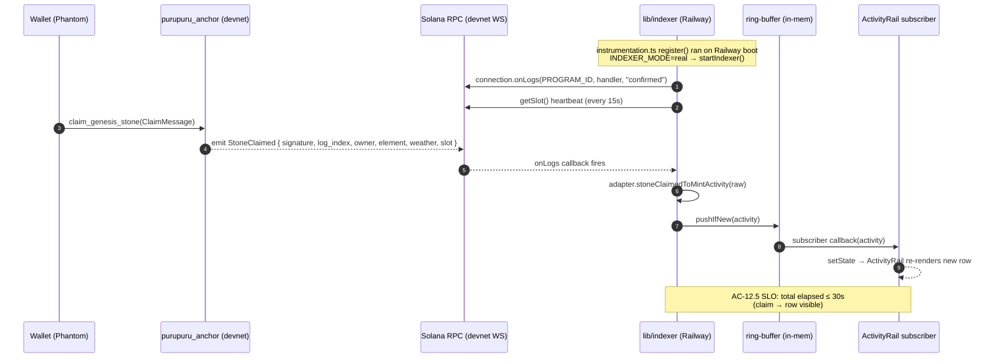

# Software Design Document · purupuru awareness layer · r2

> **r2 = Codex's awareness operating model translated into the day-1 vertical slice.**
> Smaller than the final architecture per §12 of the awareness model. Module boundaries claim only what's load-bearing for the slice. Brownfield: zerker's existing scaffold (Next.js 16 + Pixi + `lib/score` + brand assets) is wrapped, not rewritten.

---

## 0 · architectural punchline

```
🪨 the punchline (separation-as-moat · eileen's design)
   substrate (truth) ≠ presentation (voice)
   agents present · they never mutate state
   hallucinations cosmetic, not financial

🌬 the slice (codex's "build one vertical first")
   bazi quiz → archetype → mint genesis stone (devnet)
   GET-chain quiz · 1 signing prompt at mint
   Metaplex Token Metadata for visible NFT
   weather bot ambient continuity (already live)

🌊 the modules (codex's awareness model · slice-shaped)
   apps/web (zerker's Next.js 16 · brownfield-wrapped)
     api/actions/quiz/* + api/actions/mint/*  (NEW v0)
     existing kit landing + brand assets       (zerker)
   packages/peripheral-events (NEW v0 · L2 sealed)
   packages/world-sources (NEW v0 · adapters)
   packages/medium-blink (NEW v0 · BLINK renderer)
   programs/purupuru-anchor (NEW v0 · devnet · 2 instructions)
   fixtures/ (NEW v0 · stable JSON for tests + lab)
```

---

## 1 · module map (per Codex's awareness model §4 · slice-tight)

```
apps/
  web/                                    [BROWNFIELD · zerker's Next.js 16 · wrapped]
    src/app/api/actions/quiz/             [NEW · GET chain endpoints · interactive entry]
      start/route.ts                       Q1 · ActionGetResponse
      step/route.ts                        Q2-Q5 chain via links.next
      result/route.ts                      archetype reveal + mint button
    src/app/api/actions/today/route.ts    [NEW · AMBIENT awareness Blink · post-bridgebuilder REFRAME-1]
                                           aggregate world activity (mint count · weather ·
                                           element distribution) · NO interaction · this IS
                                           the awareness-layer thesis demonstration
    src/app/api/actions/mint/              [NEW · POST signs + returns Anchor tx]
      genesis-stone/route.ts                ed25519-signed claim · sponsored-payer
    src/app/page.tsx                       [BROWNFIELD · zerker's kit landing · UNTOUCHED]
    src/app/world-lab/page.tsx             [NEW v0+ · §9 awareness model · gate-on-time]

packages/
  peripheral-events/                      [NEW v0 · L2 sealed Effect Schema]
    src/world-event.ts                     WorldEvent discriminated union (4 variants)
    src/bazi-quiz-state.ts                 HMAC-validated quiz state (per blocker fix)
    src/claim-message.ts                   structured ed25519-signed payload
    src/event-id.ts                        canonical hash derivation
    src/ports.ts                           interface-only ports
    src/index.ts                           public API

  world-sources/                          [NEW v0 · adapters per Codex's §4]
    src/score-adapter.ts                   reads existing score-puru API
    src/sonar-adapter.ts                   Hasura GraphQL subscription
    src/weather-fixture.ts                 fixture-backed for hackathon (real later)
    src/index.ts

  medium-blink/                           [NEW v0 · per Codex's §4]
    src/descriptor.ts                      BLINK_DESCRIPTOR (upstream PR target)
    src/quiz-renderer.ts                   GET-chain Action responses (interactive)
    src/result-renderer.ts                 archetype card + mint button
    src/mint-renderer.ts                   POST mint Action response
    src/ambient-renderer.ts                [NEW · post-bridgebuilder] aggregate today's
                                           world activity for /api/actions/today
                                           NO interaction · this is the awareness moat
    src/index.ts

programs/
  purupuru-anchor/                        [NEW v0 · devnet ONLY · Rust]
    programs/purupuru-anchor/src/lib.rs    2 instructions
                                           upgrade authority frozen post-deploy
    tests/                                  invariant tests (no lamport · no token mut · etc.)
    Anchor.toml

fixtures/                                 [NEW v0 · per Codex's §4]
  quiz/quiz-fire.json                      example quiz state (Fire archetype)
  quiz/quiz-water.json                     (Water · etc.)
  events/mint-event.json                   reference WorldEvent
  events/weather-event.json
```

**Deferred per Codex's §12 "What Not To Build Yet"**:
- `packages/game-domain/` (only if peripheral-events grows broad)
- `packages/visual-registry/` (named tokens · post-hackathon)
- `tools/puru/` (CLI · post-hackathon)

**Brownfield bridges** (Codex's §8 wrap-first-move-later):
- `lib/score/` — zerker's existing read-adapter contract + deterministic mock · WRAPPED by `packages/world-sources/score-adapter.ts` (the wrap calls into zerker's `lib/score` for v0 mocked path · later switches to live API)
- `app/globals.css` — zerker's OKLCH wuxing palette + motion vocabulary · CONSUMED via Tailwind utilities by Blink result-renderer (no rewrite)
- `public/art/{puruhani,jani}/` — zerker's brand assets · referenced by Metaplex metadata URI + result-card OG images
- `public/data/materials/` — zerker's 18 Threlte material configs · DEFERRED (post-hackathon · 3D path)
- `app/page.tsx` kit landing — zerker's home · UNTOUCHED

---

## 2 · import rules + composition flow (per Codex's §5 + §6)

```
allowed:
  apps/* → packages/*

  packages/medium-blink → packages/peripheral-events
  packages/world-sources → packages/peripheral-events
  packages/world-sources → external clients (score-puru API · Sonar · Solana RPC)

  apps/web → all packages (it's the wiring layer)

forbidden:
  packages/peripheral-events → Next.js · React · Solana Action route code · concrete adapters · rendering libs
  programs/* → TypeScript runtime packages

composition flow (Codex's §5):
  source adapter → domain schema/event → pure system → medium renderer → app route

concrete:
  ScoreAdapter / WeatherFixture
    → BaziQuizState + WeatherReading + WorldEvent
    → BaziResolverSystem (pure · in peripheral-events)
    → MediumBlinkRenderer (in medium-blink)
    → POST /api/actions/quiz/result (in apps/web)
```

---

## 3 · data models (Effect Schema · per Codex's §3)

### 3.1 · `WorldEvent` (sealed discriminated union)

```typescript
import { Schema as S } from "effect"

const Element = S.Literal("WOOD", "FIRE", "EARTH", "METAL", "WATER")
const TokenAddr = S.String.pipe(S.brand("SolanaPubkey"))

const MintEvent = S.Struct({
  _tag: S.Literal("MintEvent"),
  eventId: S.String, // canonical hash
  emittedAt: S.Date,
  ownerWallet: TokenAddr,
  element: Element,
  weather: Element,  // cosmic weather imprint at mint
  stonePda: S.String, // GenesisStone PDA
})

const WeatherEvent = S.Struct({
  _tag: S.Literal("WeatherEvent"),
  eventId: S.String,
  emittedAt: S.Date,
  day: S.String, // ISO date
  dominantElement: Element,
  generativeNext: Element,
  oracleSources: S.Array(S.Literal("TREMOR", "CORONA", "BREATH")),
})

const ElementShiftEvent = S.Struct({
  _tag: S.Literal("ElementShiftEvent"),
  eventId: S.String,
  emittedAt: S.Date,
  wallet: TokenAddr,
  fromAffinity: S.Record(Element, S.Number),
  toAffinity: S.Record(Element, S.Number),
  deltaElement: Element,
})

const QuizCompletedEvent = S.Struct({
  _tag: S.Literal("QuizCompletedEvent"),
  eventId: S.String,
  emittedAt: S.Date,
  archetype: Element,
  // NO wallet · GET-chain is anonymous (per blocker fix · walletAwareGet:false)
})

export const WorldEvent = S.Union(MintEvent, WeatherEvent, ElementShiftEvent, QuizCompletedEvent)
```

### 3.2 · `BaziQuizState` (HMAC-validated · NO account in GET state)

> **Blocker fix · flatline r4 SKP-001 (CRITICAL 900)**: walletAwareGet:false means GET requests don't have wallet · removed `account` from quiz state · HMAC over `(step, answers)` only · wallet binds at mint POST.

```typescript
const Answer = S.Literal(0, 1, 2, 3) // 4 button-multichoice per question

export const BaziQuizState = S.Struct({
  step: S.Number.pipe(S.between(1, 5)),
  answers: S.Array(Answer), // length = step - 1
  mac: S.String, // HMAC-SHA256(secret, canonicalEncode({step, answers}))
})

// Server reads HMAC at every transition · constant-time compare via crypto.timingSafeEqual
// canonicalEncode: length-prefixed CBOR · forbids ambiguous concatenation
```

### 3.3 · `ClaimMessage` (server-signed · ed25519 via Solana sysvar)

> **Blocker fix · flatline r4 SKP-002 (CRITICAL 860)**: nonce stored server-side with TTL · prevents replay across cluster/program/version · structured payload prevents domain confusion.
>
> **Bridgebuilder HIGH-2 fix**: nonce store is **Vercel KV** (durable Redis-compatible · survives cold starts across function instances). NOT in-memory Set. 5min TTL via Vercel KV's `EX` parameter.
>
> **Flatline SDD r2 HIGH-780 fix**: KV configuration MUST be:
> - **strongly-consistent reads** (NOT read-replica · would allow nonce_seen=false past actual write)
> - **single-region** (iad1) for v0 · multi-region adds complexity
> - **atomic check-and-set**: `SET nonce ... NX EX 300` (one operation · NOT GET-then-SET race)
> - **fail-closed when unreachable**: KV down → 503 mint endpoint · NOT fail-open
> - **alert on KV latency p99 > 100ms** during demo window (anomaly signal)
>
> This is the only nonce-store that satisfies the cross-instance durability requirement on Vercel's stateless function model.

```rust
// Anchor program-side type · matches TS-side via IDL
pub struct ClaimMessage {
    pub domain: [u8; 32],         // "purupuru.awareness.genesis-stone"
    pub version: u8,
    pub cluster: u8,              // 0=devnet, 1=mainnet (rejects cross-cluster)
    pub program_id: Pubkey,       // domain separation
    pub wallet: Pubkey,
    pub element: u8,              // 1=Wood, 2=Fire, 3=Earth, 4=Metal, 5=Water
    pub weather: u8,
    pub quiz_state_hash: [u8; 32], // sha256(canonical quiz state · server-recomputed)
    pub issued_at: i64,
    pub expires_at: i64,           // 5min after issued
    pub nonce: [u8; 16],          // server-tracked · UUID v4 · 5min server-side TTL
}
```

### 3.4 · `WitnessRecord` and `GenesisStone` PDAs

```rust
#[account]
pub struct WitnessRecord {
    pub witness: Pubkey,
    pub event_id: [u8; 32],
    pub event_kind: u8,
    pub timestamp: i64,
    pub slot: u64,
}
// PDA seeds: [b"witness", event_id, witness_wallet]

#[account]
pub struct GenesisStone {
    pub owner: Pubkey,
    pub element: u8,
    pub weather: u8,
    pub claimed_at: i64,
    pub slot: u64,
    // metaplex_metadata stored at separate Metaplex PDA · linked
}
// PDA seeds: [b"stone", wallet] · idempotent · one per wallet
```

---

## 4 · API contracts (Solana Actions spec)

### 4.1 · GET chain (anonymous · no signing)

```
GET /api/actions/quiz/start
  → ActionGetResponse {
      icon, title, description, label,
      links.actions: [
        { label: "Wood path",  href: "/api/actions/quiz/step?step=2&a1=0&mac=..." },
        { label: "Fire path",  href: "/api/actions/quiz/step?step=2&a1=1&mac=..." },
        { label: "Earth path", href: "/api/actions/quiz/step?step=2&a1=2&mac=..." },
        { label: "Water path", href: "/api/actions/quiz/step?step=2&a1=3&mac=..." }
      ]
    }

GET /api/actions/quiz/step?step=N&a1=...&aN-1=...&mac=...
  → server validates HMAC · returns next step's ActionGetResponse with 4 buttons
  → step 5 → links.actions points to /result endpoint

GET /api/actions/quiz/result?step=5&a1=...&a5=...&mac=...
  → server recomputes element from validated answers
  → returns archetype card icon + ActionGetResponse with 1 button:
      { label: "Claim your stone", href: "/api/actions/mint/genesis-stone" }
  → answers + element passed to next step via URL state (still HMAC-protected)
```

### 4.1.5 · Ambient Blink (NEW · post-bridgebuilder REFRAME-1 · awareness-layer thesis demo)

```
GET /api/actions/today
  → ActionGetResponse {
      icon: today's element + aggregate stats render,
      title: "today in the world · {N} stones claimed · fire surges +{X}%",
      description: ambient narrative · weather voice · who's been here today,
      label: "the world",
      links.actions: [
        { label: "what's my element?", href: "/api/actions/quiz/start" },     // CTA: cross-link to interactive quiz
        { label: "see today's tide",    href: "/api/actions/today/detail" }    // optional follow-up · stretch
      ]
    }

  reads from peripheral-events aggregate (v0 default · simulated via fixtures)
  OR reads from real Score API via score-puru-production (stretch · if SCORE_API_URL set)
  
  cache: Cache-Control: public, max-age=60, stale-while-revalidate=300
  no signing · stateless · this IS the awareness moat in action
```

**Why this matters (REFRAME-1 resolution)**: the awareness-layer thesis was previously implicit in PRD r6 but the SDD's center of gravity drifted toward the quiz-mint demo. This ambient endpoint gives judges a SECOND entry point that demonstrates substrate-vs-presentation directly: *here is the world's activity · no interaction required · the moat is visible.*

The two surfaces compose: quiz Blink = interactive entry (what's MY archetype?) · ambient Blink = aliveness signal (what's THE WORLD doing?). Both share the same `peripheral-events` substrate. Same data · two presentations. The deck story holds.

### 4.2 · POST mint (signing prompt · wallet binds here per walletAwareGet fix)

```
POST /api/actions/mint/genesis-stone
  body: { account, answers, mac } // wallet provides account · server validates mac
  →
  1. validate account is well-formed pubkey
  2. validate HMAC over answers (NO account in HMAC · added at signing time)
  3. recompute element from answers (server-side · ignore client-supplied)
  4. fetch today's cosmic weather from oracle
  5. generate nonce (UUID v4) · store server-side with 5min TTL
  6. construct ClaimMessage payload
  7. sign with ed25519 keypair (separate from sponsored-payer)
  8. fetch recent_blockhash (commitment: confirmed)
  9. construct legacy Solana transaction:
     - fee_payer = sponsored-payer pubkey
     - instructions: [Ed25519Program(claim_msg, sig, signer), purupuru_anchor::claim_genesis_stone]
  10. sponsored-payer partial-signs FIRST (server-side)
  11. return ActionPostResponse with base64 transaction (waiting for wallet signature)
  → wallet signs as authority · submits
  → indexer confirms StoneClaimed event
```

---

## 5 · Solana Anchor program (devnet ONLY v0)

### 5.1 · Two instructions

**A · `attest_witness(event_id, event_kind)`** — ambient presence trail · sponsored-payer · idempotent PDA.

**B · `claim_genesis_stone(message: ClaimMessage)`** — server-signed mint:

```rust
// In purupuru_anchor::claim_genesis_stone:
//   1. Read instructions sysvar at index = current_instruction_index - 1
//   2. Verify prior instruction is Ed25519Program program ID
//      (Ed25519SigVerify111111111111111111111111111)
//   3. Parse Ed25519 instruction data layout (offsets per Solana docs)
//      - signer pubkey == HARDCODED claim-signer pubkey (anchor program-authority)
//      - message bytes == canonical serialize(ClaimMessage args)
//   4. Validate ClaimMessage:
//      - cluster matches (devnet)
//      - program_id matches (this program's id)
//      - expires_at > current slot timestamp
//      - nonce not in seen_nonces (program state)
//   5. CPI to Metaplex mpl-token-metadata to mint NFT
//   6. Create GenesisStone PDA · idempotent
//   7. Emit StoneClaimed event
```

### 5.2 · Upgrade authority · FROZEN post-deploy

```bash
# After devnet deploy (sprint-3) · lock the program:
solana program set-upgrade-authority --new-upgrade-authority None <PROGRAM_ID>
```

This prevents redeploy mid-evaluation · honors flatline r4 SKP-005 · documented tradeoff.

### 5.3 · Day-1 smoke test (Codex's §10 brownfield rule applied)

> **Blocker fix · flatline r4 SKP-004 (HIGH 740)**: Metaplex Phantom devnet visibility unverified · day-1 SPIKE BEFORE building full flow.

```
Spike 1 · Metaplex Phantom devnet visibility
  - mint a minimal Metaplex token on devnet via mpl-token-metadata SDK
  - verify Phantom collectibles tab renders the NFT
  - if FAIL: revert mint flow to PDA-only · rename "mint" → "claim record"

Spike 2 · ed25519-via-instructions-sysvar pattern
  - minimal Anchor program reads instructions sysvar after Ed25519Program
  - validate signer pubkey + message bytes match
  - reference: `solana-program` docs + Anchor sysvar examples

Spike 3 · partial-sign tx assembly
  - backend partial-signs minimal tx · returned via Action POST
  - Phantom signs as authority and submits
  - validates: tx version (legacy) · blockhash · fee_payer · serialization
```

ALL THREE SPIKES MUST PASS BY EOD 2026-05-08 · OR fall back per §7.5 of PRD r6.

---

## 6 · security architecture

### 6.1 · Three-keypair model (per blocker fixes)

```
sponsored-payer    funds tx fees · refilled per FR-9 alerts (5/2/1 SOL tiered)
                   stored in vercel env: SPONSORED_PAYER_SECRET
                   day-of-demo halt-disable env flag: DISABLE_PAYER_HALT=true

claim-signer       ed25519 keypair · signs ClaimMessage payloads
                   stored in vercel env: CLAIM_SIGNER_SECRET
                   rotation procedure documented in deploy runbook

upgrade-authority  set to None post-deploy (one-shot)
                   no rotation · one-way operation
```

### 6.2 · Sponsored-payer tiered alerts

> **Blocker fix · flatline r4 SKP-005 (HIGH 750)**: single threshold gave 0-warning outage · tiered now.

```
< 5 SOL    warn (vercel log + slack)
< 2 SOL    page operator (urgent · alert webhook)
< 1 SOL    halt mint endpoint (returns 503)

day-of-demo: top up to >10 SOL morning of recording · DISABLE_PAYER_HALT=true · re-enable post
pre-staged refill script · backup keypair
```

> **Bridgebuilder HIGH-4 fix**: Even with `DISABLE_PAYER_HALT=true` during the demo recording window, sponsored-payer balance MUST be logged every 30s to vercel logs · alert if drop-rate exceeds expected (>0.05 SOL per minute = anomalous). Pre-staged refill keypair stored in vercel env `BACKUP_PAYER_SECRET` · refill script `scripts/refill-sponsored-payer.sh` · documented in deploy runbook. Conservation invariant: `committed_mints + reserved_mints ≤ payer_balance / per_mint_cost` · monitored via balance-snapshot logging during disabled-halt window.

### 6.3 · Sybil protection

```
IP rate limit (vercel)    50 quiz-starts/IP/hour · 5 mint-POSTs/IP/hour
balance check ONLY        ≥0.01 SOL (single getBalance call)
                         (NO wallet-age check · getSignaturesForAddress too slow per flatline r3)
sponsored-payer halt      < 1 SOL → 503 (FR-4 + FR-9)
```

### 6.4 · cmp-boundary lint (FR-10 · golden tests)

CI gate · static analysis blocks raw substrate-canonical tokens (event_id · puruhani_id · raw element codes) from interpolating into Action response render output.

### 6.5 · Architectural separation enforcement (HIGH-1 fix)

> **Bridgebuilder HIGH-1 fix**: separation-as-moat (the deck punchline) was enforced by convention only. Now mechanized via **dependency-cruiser config** at `packages/peripheral-events/.dependency-cruiser.cjs`:

```
forbidden:
  - name: 'no-framework-imports-in-substrate'
    severity: error
    from: { path: '^packages/peripheral-events' }
    to:
      pathNot:
        - '^packages/peripheral-events'
        - '^node_modules/effect'
        - '^node_modules/@effect'
      path:
        - '^node_modules/(next|react|@solana|@metaplex)'
        - '^packages/world-sources'
        - '^packages/medium-blink'
        - '^apps/web'
```

CI runs `npx depcruise packages/peripheral-events` · fails build if substrate imports framework/adapter/medium code. **This is what makes the moat real**, not just claimed.

Same guard applied to `packages/medium-blink` (cannot import `world-sources` directly · must go through `peripheral-events` ports).

---

## 7 · brownfield bridges (per Codex's §8)

### 7.1 · Score adapter wraps zerker's `lib/score/` · HYBRID per HIGH-3 fix

```
zerker's lib/score/{types,mock,index}.ts
  exports: ScoreReadAdapter contract + deterministic mock

packages/world-sources/score-adapter.ts (NEW · hybrid)
  imports lib/score/index.ts (adapter contract)

  resolution at runtime:
    if process.env.SCORE_API_URL is set:
      use real score-puru API (with mock fallback on error)
    else:
      use lib/score deterministic mock

  v0 default: mock (operator-confirmed · matches zerker's hackathon brief)
  v0 stretch: env-flag flips to real Score API mid-recording for "aliveness from prior collection"
              (the existing PurupuruGenesis Base mints become historical activity feed)

The hybrid resolves the PRD-r6-vs-zerker-brief tension surfaced by bridgebuilder HIGH-3:
- mock satisfies "no real backend wiring" (zerker's brief)
- env-flag satisfies "consume score's existing surfaces" (PRD r6 FR-5)
- demo can SHOW BOTH paths: pure-sim Day 4 morning · then flip env at recording for
  "things were happening before judges arrived" aliveness · operator's stretch goal
```

**stretch wiring (if time permits)**: Wire to existing PurupuruGenesis Base Sepolia mints via Sonar/Hasura GraphQL · seeds the ambient Blink (`/api/actions/today`) with real prior activity so when judges arrive the world feels lived-in. Per operator: *"add to the aliveness feeling of things already having happened before a users/judges arrival."* Sprint-3 stretch goal · gates on demo simulator complexity.

### 7.2 · Brand assets via Metaplex metadata URI + OG images

```
Metaplex metadata uri:
  vercel-hosted JSON pointing at puruhani sprite (zerker's public/art/puruhani/{element}.png)
  + element glow (public/art/element-effects/{element}_glow.svg)

OG image render:
  Next.js next/og uses zerker's brand assets directly via static URL · no copy
```

### 7.3 · World Lab (post-spine · operator-paced)

> Codex's §9 World Lab. NOT v0 spine · stretch goal IF time permits.

```
apps/web/src/app/world-lab/page.tsx
  Pixi sim integration point (zerker's lane · operator dashboard view per PRD r6 §3.1)
  consumes packages/peripheral-events fixtures
  visual learning + debugging surface · NOT product surface
```

---

## 8 · observability + test strategy

### 8.1 · Test pyramid

```
unit
  - peripheral-events: 100% Effect Schema decode/encode roundtrip · canonical hash stable
  - bazi-quiz-state: HMAC validation · length-extension forgery FAILS golden test
  - world-sources adapters: mocked external clients · contract tests
  - medium-blink renderers: cmp-boundary golden tests (no raw IDs in output)
  - purupuru-anchor: 7 invariant tests (no lamport · no token mut · double-claim reject ·
    unsigned reject · expired sig reject · cross-cluster reject · replay nonce reject)

integration
  - Action endpoint roundtrip in dialect inspector (sprint-2)
  - end-to-end quiz → result → mint on devnet (sprint-3)
  - Phantom collectibles tab visibility (Metaplex spike sprint-1)

e2e
  - 3-min demo recording happy path (sprint-4)
  - multi-wallet recording (operator + zerker tap visibly)
```

### 8.2 · Observability (FR-9 · structured logs + alerts)

```
structured JSON logs    every event-emission · GET · POST · mint submission
metrics                 quiz funnel (Q1→Q5 dropoff) · mint success rate · sponsored-payer balance ·
                        PDA creation rate · HMAC validation failure rate (tampering signal) ·
                        StoneClaimed event indexer lag

vercel dashboards       dropoff trend · success rate · funnel viz
alert webhooks          tiered sponsored-payer (5/2/1 SOL) · quiz error rate >5% · mint failure >10%
                        HMAC failure rate anomaly · indexer lag
```

---

## 9 · day-1 spine (concrete · runnable end-to-end by EOD 2026-05-08)

```
spine MUST work end-to-end by EOD day 1:

✅ packages/peripheral-events scaffolded with WorldEvent + BaziQuizState · placeholder canonical hash
✅ packages/world-sources/score-adapter.ts wrapping zerker's lib/score (mock path)
✅ packages/medium-blink with placeholder voice (zksoju 25 placeholder strings · gumi swaps in)
✅ apps/web/src/app/api/actions/quiz/start/route.ts returns ActionGetResponse with 4 buttons
✅ apps/web/src/app/api/actions/quiz/step/route.ts chains through Q1-Q5 via links.next · HMAC validation
✅ apps/web/src/app/api/actions/quiz/result/route.ts returns archetype + mint button
✅ apps/web/src/app/api/actions/today/route.ts returns ambient awareness Blink (v0+ · post-bridgebuilder)
✅ apps/web/src/app/api/actions/mint/genesis-stone/route.ts:
   - day-1 minimum: returns mock witness-only transaction (not yet claim_genesis_stone) OR
   - day-1 stretch: returns real claim_genesis_stone tx (gates on Spike 1+2+3 passing)
✅ vercel preview deploys and serves blink in dialect inspector
✅ deck draft: separation-as-moat slide + product demo description + monetization line + UA line

3 spikes (BEFORE stretch starts):
  Spike 1 · Metaplex Phantom devnet visibility (FAIL → PDA-only fallback)
  Spike 2 · ed25519-via-instructions-sysvar pattern
  Spike 3 · partial-sign tx assembly

If spine fails by EOD day 1: HALT · operator pair · ALL stretch deferred
```

---

## 10 · stretch goals (sprint-2 onward · ranked priority)

| order | stretch | gate |
|---|---|---|
| 1 | proper HMAC-validated quiz state + length-extension test | sprint-2 morning |
| 2 | claim_genesis_stone Anchor instruction (gates on Spike 2 passing) | sprint-2 EOD |
| 3 | Metaplex Token Metadata mint (gates on Spike 1 passing) | sprint-3 EOD |
| 4 | gumi voice corpus integration | sprint-3 morning |
| 5 | sybil protection (IP rate limit + balance check) | sprint-3 EOD |
| 6 | upstream BLINK_DESCRIPTOR PR | sprint-3 EOD |
| 7 | observability + tiered alerts + golden tests + cmp-boundary lint | sprint-3 EOD |
| 8 | Score dashboard integration (zerker parallel · post-anchor-deploy) | sprint-4 |
| 9 | demo simulator (per D-14) | sprint-4 |
| 10 | dialect blink registry submission | sprint-4 morning |
| 11 | World Lab (Codex's §9) · IF time permits | sprint-4 stretch |
| 12 | NEW · wire ambient Blink to real Score API for "aliveness from prior collection" | sprint-3 stretch · operator's stretch goal · gates on SCORE_API_URL env wired + Sonar GraphQL access |
| 13 | NEW · pre-stage 2 deck templates (mint-language vs claim-record-language) for Spike-1 fail | sprint-4 morning · 30min vs half-day rebuild |
| 14 | NEW · dependency-cruiser CI guard for substrate purity (HIGH-1) | sprint-2 morning · part of cmp-boundary lint package |

---

## 11 · deferred decisions (operator-paced · NOT v0)

| # | decision | gate |
|---|---|---|
| D-1 | repo rename (still `purupuru-ttrpg`) | low blast · pre-mount preferred |
| D-4 | event-witness PDA cleanup posture | post-hackathon |
| D-5 | score's API/CLI/MCP endpoint formalization | zerker · post-hackathon |
| D-6 | 2 unnamed of 5 cosmic weather oracles | gumi · sprint-2 |
| D-10 | sponsored-payer keypair management | post-hackathon |
| D-11 | cross-chain identity unification (Base ↔ Solana) | post-hackathon |
| D-13 | claim-signer keypair rotation procedure | post-hackathon |
| D-14 | demo simulator design | operator-cooking · sprint-4 |
| D-16 | gumi handoff timing | parallel · sprint-2 close target |
| D-17 | zerker indexer ready-by-date | post-anchor-deploy · sprint-3 close |
| D-18 NEW | World Lab v0 scope (Codex §9) | sprint-4 stretch · operator decides |

---

## 12 · sources

- **PRD r6** (`grimoires/loa/prd.md`) — 6-revision functional requirements
- **Codex's awareness operating model** (`grimoires/loa/context/02-awareness-operating-model.md`) — module map · 5 questions framework · import rules · brownfield rule (load-bearing for r2 structure)
- **Flatline r1+r2+r3+r4 reviews** (`grimoires/loa/a2a/flatline/`) — 10 deferred blockers integrated as concrete design decisions in §3-§6
- **zerker's hackathon brief** (`grimoires/loa/context/00-hackathon-brief.md`) — mocked-everything-FE-side · 8 open questions (mostly resolved)
- **PRD r6 → SDD r2 integration** (`grimoires/loa/context/01-prd-r6-integration.md`) — flagged tensions · resolved here
- **/ride reality reports** (`grimoires/loa/reality/*`) — actual codebase state · zerker's scaffold inventory
- **vault doctrines** (`~/vault/wiki/concepts/`) — chathead-in-cache · cmp-boundary · puruhani-as-spine · environment-surfaces · etc.
- **gumi's pitch** — 18 cards · burn loop · soul-stage agents · cosmic weather oracles · daily friend duels (gates on game ship)
- **eileen's framing document** (`/Users/zksoju/Downloads/message (4).txt`) — Frontier-aligned judging rubric · separation-as-moat punchline
- **upstream operator brief** (2026-05-07 PM · post-eileen) — separation-as-moat doctrine · zerker dashboard parallel · gumi quiz design

---

## 13 · Indexer Architecture (FR-12 Amendment · 2026-05-09)

> **⚠️ HISTORICAL — SUPERSEDED 2026-05-09 evening.** This addendum specified an in-process Next.js indexer via `instrumentation.ts`. Subsequent analysis (Vercel can't host long-lived WebSocket subscriptions; sonar's Envio framework is EVM-only) led to spinning up [project-purupuru/radar](https://github.com/project-purupuru/radar) as a sister service. Radar's own SDD at `radar/grimoires/loa/sdd.md` is the canonical architecture spec for the indexer. This §13 is preserved as historical context for the negotiation.
>
> **Amendment authority**: zerker (lane owner per `prd.md:574`) · authored in response to issue #5 (zksoju · 2026-05-09).
> **Supersedes**: §FR-12 carve-out at `prd.md:510` ("out of scope for this repo: the Solana indexer code") — flipped in-repo per `prd.md:945-1064`.
> **Scope**: ADDITIVE to existing SDD §0-§12. Does not rewrite any prior architectural choice; specifies the indexer surface that was previously out-of-repo.
> **Authority chain**: PRD amendment §A "scope boundary flip" (`prd.md:951-964`) → AC-12.5–AC-12.12 (`prd.md:966-977`) → locked tech decisions (`prd.md:982-989`) → this addendum.
> **Hackathon clock**: demo-ready 2026-05-11 morning. Scope limited to that horizon — no over-engineering for post-hackathon concerns.

### 13.0 · why this exists in this SDD now

The SDD r2 mentions the indexer as a downstream consumer at three points:

- §4.2 step 9: *"indexer confirms StoneClaimed event"* (`sdd.md:349`)
- §5.1 step 7: *"Emit StoneClaimed event"* (`sdd.md:377`)
- §11 D-17: *"zerker indexer ready-by-date · post-anchor-deploy · sprint-3 close"* (`sdd.md:640`)

Zero indexer architecture lives anywhere in §0-§12. That gap is what AC-12.5–AC-12.12 fills. The drift report's deferred decision §7.2 (element-casing boundary · `04-observatory-awareness-drift.md:148`) also resolves here: convert at indexer boundary, not in observatory consumers.

### 13.1 · module layout

New tree under `lib/indexer/` (greenfield · no brownfield wrap):

```
lib/indexer/
  idl/
    purupuru_anchor.json        [VENDORED · IDL copy from soju's anchor branch]
                                 source-of-truth: zksoju/<branch>/target/idl/purupuru_anchor.json
                                 re-vendor cadence: post-D-12 upgrade-authority freeze (prd.md:622)
  client.ts                     [Solana Connection + EventParser wired to PROGRAM_ID]
                                 PROGRAM_ID = 7u27WmTz2hZHvvhL89XcSCY3eFhxEfHjUN5MjzMY6v38
                                 deps: @solana/web3.js + @coral-xyz/anchor (NOT YET INSTALLED)
  ring-buffer.ts                [module-singleton · last ~200 MintActivity events]
                                 dedup key: (signature, log_index) per AC-12.7 + issue #5 §DoD
                                 contract: subscribe(cb), recent(n), push(activity)
                                 implements ActivityStream (lib/activity/types.ts:79-82) shape
                                 with the same start/stop discipline as mock.ts:165-187
  adapter.ts                    [StoneClaimed → MintActivity transform]
                                 element byte (1-5) → lowercase Element string
                                 boundary owns the casing flip · observatory unchanged
  reconnect.ts                  [WebSocket liveness + bounded backoff loop]
                                 dead-man timer drives tear-down + reconnect
                                 backoff: 1s → 2s → 4s → 8s → 16s → max 30s
  health.ts                     [{ lastEventAt, count, connected } state surface]
                                 read by app/api/indexer/status/route.ts (§13.4)
                                 writable only from within lib/indexer/* (encapsulated)
  index.ts                      [public surface · `realActivityStream: ActivityStream`]
                                 conforms to lib/activity/types.ts ActivityStream interface
                                 the contract for the env-flag flip at lib/activity/index.ts (§13.3)

instrumentation.ts              [NEW FILE at repo root · Next.js 16 register() hook]
                                 conditional indexer boot — see §13.2

app/api/indexer/status/route.ts [NEW · App Router route handler — see §13.4]
```

**Module boundary discipline**: `lib/indexer/` exports ONLY `realActivityStream` (the `ActivityStream` adapter) and a small health-read accessor. The internal client/ring-buffer/reconnect/health modules are not part of the public surface — consumers import from `lib/indexer` (barrel) or `lib/activity` (env-resolved seam).

**No new packages directory**: This is `lib/`, not `packages/peripheral-events/` or `packages/world-sources/`. Per the amendment scope-flip rationale (`prd.md:957-960`) the observatory branch is monolithic Next.js, not the awareness-branch monorepo. The indexer code lives where the observatory's other adapters live (`lib/score`, `lib/weather`, `lib/activity`).

### 13.2 · server boot via `instrumentation.ts`

Currently absent in the repo. Spec: a single new file at repo root.

```ts
// instrumentation.ts (NEW · Next.js 16 register() canonical hook)
export async function register() {
  // Run-once-per-process — Next.js 16 invokes register() on server boot only.
  // HMR safety: in dev, register() runs on each server reload, not each HMR
  // cycle — but we still gate by INDEXER_MODE so dev defaults to mock and
  // never spins a real WS subscription unless explicitly opted in.
  if (process.env.NEXT_RUNTIME !== "nodejs") return; // edge runtime: never
  if (process.env.INDEXER_MODE !== "real") return;   // dev/preview default: mock

  const { startIndexer } = await import("./lib/indexer");
  await startIndexer();
}
```

**Single-subscription invariant**: the `startIndexer()` function holds a module-level `started: boolean` flag (mirrors `mockActivityStream` start guard at `lib/activity/mock.ts:166`) so a second `register()` call (cold-start retry on Railway) is idempotent.

**Why not a separate worker process**: Railway's free tier serves one Node process per service. Co-locating the indexer with the Next.js handler is cheaper, simpler, and the WS subscription cost is negligible (~10 events / demo, periodic `getSlot` heartbeat). When the demo concludes the workload disappears with the process.

**Why `instrumentation.ts` over `middleware.ts` or a custom server**: per Next.js 16's documented run-once-on-boot hook (`prd.md:989` "canonical Next 16 pattern for run-once-on-boot side effects"). `middleware.ts` runs per-request on the edge runtime — wrong scope. A custom server would force us off Vercel's static-output bias and complicate Railway deploy.

### 13.3 · mock/real switch at `lib/activity/index.ts`

Today (`lib/activity/index.ts:1-5`):

```ts
export type { ActionKind, ActivityEvent, ActivityStream } from "./types";
import { mockActivityStream } from "./mock";
import type { ActivityStream } from "./types";

export const activityStream: ActivityStream = mockActivityStream;
```

Becomes (per AC-12.9):

```ts
export type { ActionKind, ActivityEvent, ActivityStream } from "./types";
import type { ActivityStream } from "./types";
import { mockActivityStream } from "./mock";

// Resolve the seam at module load. INDEXER_MODE defaults to "mock" for dev/preview;
// production / Railway sets INDEXER_MODE=real (see §13.7 deploy contract).
// The contract that makes this safe: realActivityStream and mockActivityStream
// both implement the same ActivityStream interface (lib/activity/types.ts:79-82).
function resolveStream(): ActivityStream {
  if (process.env.INDEXER_MODE === "real") {
    // Lazy require so dev bundles never pull in @solana/web3.js when running mock.
    // ESM dynamic import preserves tree-shaking on the client edge.
    const { realActivityStream } = require("@/lib/indexer");
    return realActivityStream as ActivityStream;
  }
  return mockActivityStream;
}

export const activityStream: ActivityStream = resolveStream();
```

**Critical contract preserved**: every consumer of `activityStream` (e.g., `components/observatory/ActivityRail.tsx`) sees the same `subscribe(cb) → unsubscribe` and `recent(n)` shape from `lib/activity/types.ts:79-82`. No consumer changes. The seam is invisible above the boundary.

**Default = mock**: dev and preview deploys (Vercel) keep mocked behavior. This protects against:
- HMR spawning multiple WS subscriptions in dev (gated by env-flag)
- Vercel preview deploys accidentally hitting devnet rate limits
- Local dev runs without Solana RPC connectivity

Only Railway production sets `INDEXER_MODE=real`.

### 13.4 · health endpoint at `app/api/indexer/status/route.ts`

```ts
// app/api/indexer/status/route.ts (NEW · Next.js 16 App Router route handler)
import { NextResponse } from "next/server";
import { getIndexerHealth } from "@/lib/indexer/health";

export const runtime = "nodejs";       // must NOT be edge — needs lib/indexer state
export const dynamic = "force-dynamic"; // never statically cache

export async function GET() {
  const health = getIndexerHealth();
  return NextResponse.json({
    mode: process.env.INDEXER_MODE === "real" ? "real" : "mock",
    lastEventAt: health.lastEventAt,   // ISO string | null
    count: health.count,                // events seen since process boot
    connected: health.connected,        // WS state · false during reconnect backoff
  });
}
```

Response shape matches AC-12.10 verbatim (`prd.md:975`) plus the `mode` field for operator clarity at-a-glance.

**Visible health pip in observatory chrome (AC-12.8 + AC-12.10)**: a small dot rendered in the Observatory header/rail chrome, polling `/api/indexer/status` every 10s. Pip color states:

| `connected` | last event age | pip |
|---|---|---|
| `true` | ≤ 60s | green (live) |
| `true` | > 60s | amber (connected · feed quiet — ambiguous on devnet but visible) |
| `false` | n/a | red (reconnecting · users see degraded state honestly) |

The pip is **demo-day insurance**: a stalled feed degrades visibly per AC-12.8, not silently. Implementation lives in observatory chrome (e.g., `components/observatory/HealthPip.tsx`); that's an observatory-surface task in the sprint plan, not an indexer task.

### 13.5 · reconnect strategy (resolves PRD open discovery item D · `prd.md:993-997`)

The architectural problem: Solana's `connection.onLogs(...)` does NOT surface explicit disconnect events. A WebSocket can silently die — the callback simply stops firing, with no error to catch. We need an external liveness signal.

**Liveness pattern (locked here)**: dead-man timer driven by lightweight `getSlot` polling.

```
on indexer boot:
  subscribe via connection.onLogs(PROGRAM_ID, handler, "confirmed")
  start heartbeat loop:
    every 15s:
      currentSlot ← await connection.getSlot("confirmed")
      if currentSlot > lastObservedSlot:
        lastObservedSlot ← currentSlot
        lastSlotAdvanceAt ← now()
      else if (now() - lastSlotAdvanceAt) > 60s:
        // dead-man triggered: chain still advances but we're not seeing it
        teardown_subscription()
        reconnect_with_backoff()
        return

on event received:
  push to ring-buffer
  update health.{lastEventAt, count}
  // event reception is its own liveness signal — slot polling is fallback
```

**Backoff schedule (AC-12.8)**: `1s, 2s, 4s, 8s, 16s, 30s, 30s, 30s, ...` — capped at 30s per try, infinite retries (devnet rate-limits don't punish us this politely; if we hit a wall the env-flag escape hatch to Helius is the operator's 2-min recovery move).

**Why `getSlot` over a heartbeat WS subscription**: getSlot is one HTTP call. A second WS subscription doubles the failure surface. The amendment notes devnet is rate-limited; we burn fewer requests with periodic polling than with parallel WS streams.

**Demo-day risk (R-13)**: silent disconnect during recording is the headline risk. Mitigations stack:
1. Reconnect loop catches it within 60s + backoff.
2. Visible health pip flips to red so a stalled feed is honest about itself.
3. `INDEXER_MODE=real` env-flag is per-deploy, so swapping `SOLANA_RPC_URL` to a Helius endpoint is a 2-minute Railway env-update + redeploy.

### 13.6 · element byte conversion (AC-12.11 · resolves drift §7.2)

The IDL's `StoneClaimed.element` field is `u8` 1-5 per the locked decision (`prd.md:976`). The mapping (canonical wuxing order, matches both `sdd.md:240` ClaimMessage and the awareness-branch `04-observatory-awareness-drift.md:50`):

| byte | Element (lowercase) |
|---|---|
| 1 | `wood` |
| 2 | `fire` |
| 3 | `earth` |
| 4 | `metal` |
| 5 | `water` |

```ts
// lib/indexer/adapter.ts (NEW)
import type { Element } from "@/lib/score";
import type { MintActivity } from "@/lib/activity/types";

const ELEMENT_BY_BYTE: Record<number, Element> = {
  1: "wood",
  2: "fire",
  3: "earth",
  4: "metal",
  5: "water",
};

interface RawStoneClaimed {
  signature: string;
  log_index: number;
  owner: string;          // Pubkey base58
  element: number;        // u8 · 1-5
  weather: number;        // u8 · 1-5
  slot: number;
  blockTime: number | null; // unix seconds (null if unconfirmed at parse time)
}

export function stoneClaimedToMintActivity(raw: RawStoneClaimed): MintActivity {
  const element = ELEMENT_BY_BYTE[raw.element];
  const weather = ELEMENT_BY_BYTE[raw.weather];
  if (!element || !weather) {
    throw new Error(
      `[indexer/adapter] invalid element byte: element=${raw.element} weather=${raw.weather} sig=${raw.signature}`,
    );
  }
  return {
    id: `${raw.signature}:${raw.log_index}`, // stable, dedup-safe per AC-12.7
    kind: "mint",
    origin: "on-chain",
    actor: raw.owner,
    element,
    weather,
    at: raw.blockTime
      ? new Date(raw.blockTime * 1000).toISOString()
      : new Date().toISOString(), // fallback if blockTime not yet available
  };
}
```

**Boundary discipline**: this conversion happens HERE, in `lib/indexer/adapter.ts`. Observatory consumers (`ActivityRail`, `PentagramCanvas`, `lib/score`) never see uppercase or byte values — they see the lowercase `Element` they already use. This resolves the deferred decision at `04-observatory-awareness-drift.md:148` in favor of "boundary-conversion" (lower-risk for the observatory branch in isolation).

**Validation note (AC-12.11 spike)**: the open-discovery item at `prd.md:997` requires reading the vendored IDL once it lands to confirm the byte encoding (Anchor IDLs can encode enums as struct-tagged unions instead of plain integers). If the IDL surface differs from the `u8 1-5` assumption, this adapter is the only file that needs adjustment.

### 13.7 · idempotency (AC-12.7 · issue #5 §DoD §1)

Compound key: `(signature, log_index)`. Both are stable on Solana — a transaction signature is unique per cluster, and log_index is the position within the transaction's emit sequence.

The ring buffer dedupes on this key. Implementation contract:

```ts
// lib/indexer/ring-buffer.ts (NEW)
const BUFFER_SIZE = 200;          // AC-12.7: "last ~200 events"
const buffer: MintActivity[] = [];
const seen = new Set<string>();   // signature:log_index keys
const subscribers = new Set<(e: MintActivity) => void>();

export function pushIfNew(activity: MintActivity): boolean {
  if (seen.has(activity.id)) return false; // already seen — dedup
  buffer.push(activity);
  seen.add(activity.id);
  if (buffer.length > BUFFER_SIZE) {
    const evicted = buffer.shift()!;
    seen.delete(evicted.id);       // keep `seen` bounded with the buffer
  }
  for (const cb of subscribers) {
    try { cb(activity); } catch { /* isolate subscriber errors · same as mock */ }
  }
  return true;
}
```

**Restart-resilience scope**: dedup survives within the buffer window of any single process. Cross-restart dedup is explicitly out of scope per AC-12.7 + non-goal `prd.md:1005` — soju re-triggers fresh devnet events morning of demo, and the demo recording window is shorter than any plausible restart cadence.

**`seen.delete(evicted.id)` matters**: without this line the `seen` Set grows unbounded and would, given enough events, recreate the duplicate-from-history bug we're nominally preventing. Bounded together with the buffer.

### 13.8 · Railway deploy contract (AC-12.6)

Process model: single Next.js production server (`pnpm start`). The `instrumentation.ts` register hook (§13.2) boots the indexer in-process alongside the Next handler. No separate worker container, no external scheduler.

Required env vars on Railway service:

| Var | Required | Default if unset | Purpose |
|---|---|---|---|
| `INDEXER_MODE` | yes (=`real`) | `mock` (no boot) | Master gate — anything other than `real` keeps mock path |
| `SOLANA_RPC_URL` | yes | `https://api.devnet.solana.com` | HTTP RPC endpoint for `getSlot` heartbeat + IDL fetch fallback |
| `SOLANA_WS_URL` | yes | `wss://api.devnet.solana.com` | WebSocket endpoint for `onLogs` subscription |
| `INDEXER_PROGRAM_ID` | no | `7u27WmTz2hZHvvhL89XcSCY3eFhxEfHjUN5MjzMY6v38` | Program ID (defaulted from `prd.md:970`) |

**Vercel ruled out**: per amendment Decision C (`prd.md:988`), Vercel serverless functions cannot hold WebSocket subscriptions across invocations. Railway's long-lived Node process is the requirement.

**Health probe**: Railway healthcheck path = `/api/indexer/status` (200 = process alive). This is the same endpoint operators read for human-eye health (§13.4) — single source of truth.

**Cold-start mitigation (R-15)**: Railway free-tier services sleep on idle. Operator action: warm the service ≥30 minutes before demo recording on 2026-05-11 by hitting `/api/indexer/status` from a curl loop. This is a runbook step, not architectural — captured in the sprint plan as a demo-day task.

### 13.9 · failure modes & defenses (extends §13's risks into existing register at `sdd.md:572`)

Mirrors PRD amendment §F risk-register additions (`prd.md:1008-1016`).

| ID | Risk | Likelihood | Impact | Mitigation | Trigger |
|---|---|---|---|---|---|
| **R-13** | Devnet RPC silent WS disconnect during demo | medium | high | reconnect loop §13.5 + visible health pip §13.4 + Helius env-flag escape hatch (2-min Railway redeploy) | `onLogs` callback silent for >60s while `getSlot` advances |
| **R-14** | IDL drift if zksoju upgrades program before D-12 freeze (`prd.md:622`) | low | high | re-vendor IDL post-freeze · zksoju notifies zerker before any pre-freeze redeploy · adapter §13.6 throws on invalid byte (visible failure rather than silent corruption) | Borsh decode fails or `ELEMENT_BY_BYTE` lookup returns undefined |
| **R-15** | Railway cold-start eats demo window | low | medium | warm service ≥30 min before recording via `/api/indexer/status` curl loop · health pip serves dual purpose as warmup probe | First post-deploy ping >5s |
| **R-16** | HMR double-subscription in dev (would burn devnet rate limit fast) | low | low | `INDEXER_MODE=mock` default in dev · `started: boolean` module-level guard in `startIndexer()` · `register()` early-returns when `NEXT_RUNTIME !== "nodejs"` | Dev console shows multiple "[indexer] subscribed" logs per HMR cycle |

R-16 is new to this addendum; R-13/R-14/R-15 mirror the PRD amendment register verbatim for SDD-side traceability.

### 13.10 · test strategy

Aligned with the existing test pyramid at `sdd.md:542-561`. New surfaces:

```
unit
  - lib/indexer/adapter.ts
      · stoneClaimedToMintActivity: byte-1..5 maps to wood/fire/earth/metal/water
      · invalid byte (0, 6, 255) throws with diagnostic context (signature included)
      · id format = `{signature}:{log_index}` (stable + dedup-safe)
      · null blockTime falls back to current time (no crash)
  - lib/indexer/ring-buffer.ts
      · push of (sig, idx) once → recent() returns it
      · push of same (sig, idx) twice → returns false on second, no duplicate emit
      · push past BUFFER_SIZE (200) → oldest evicted, seen-set shrinks accordingly
      · subscriber receives each unique event exactly once
      · subscriber throwing does not poison other subscribers (matches mock.ts:147-152)

integration
  - lib/indexer/reconnect.ts
      · liveness loop: getSlot advance resets dead-man timer
      · liveness loop: 60s without slot advance triggers tear-down + reconnect
      · backoff sequence walks 1→2→4→8→16→30→30 seconds and is interruptible
      · reconnect succeeds after simulated WS-kill (manual matches "WS-kill test" in DoD `prd.md:1042`)

manual e2e (gates demo readiness · 2026-05-10 T-1 dry-run + 2026-05-11 demo morning)
  - INDEXER_MODE=real on Railway preview · trigger devnet claim via
    purupuru-blink.vercel.app/preview · ActivityRail row appears within 30s (AC-12.5, AC-12.12)
  - Health endpoint `/api/indexer/status` returns mode=real, connected=true, count>0
  - Visible health pip in observatory chrome reflects connection state during a kill test
```

**No mainnet tests**: amendment §E non-goal `prd.md:1003`. Devnet-only · the demo target.

**No persistence tests**: amendment §E non-goal `prd.md:1005`. Process restart loses recent feed · acceptable for demo window.

### 13.11 · sequence diagram · happy-path StoneClaimed → ActivityRail row



### 13.12 · what's deferred (post-hackathon · NOT v0)

Explicitly out of scope for this addendum (mirrors amendment §E + general prudence):

| # | item | gate |
|---|---|---|
| D-19 | Persistence layer (Postgres / Hasura / SQLite) | post-hackathon · only if mainnet path materializes |
| D-20 | Multi-program indexing | post-hackathon · single program for demo |
| D-21 | Backfill from program genesis | post-hackathon · soju re-triggers for demo |
| D-22 | Mainnet endpoint switch | separate cycle · gates on full audit |
| D-23 | Aggregations / analytics endpoint | post-hackathon · live feed only for v0 |
| D-24 | Multi-region Railway deploy | post-hackathon · single region (iad1-equivalent) sufficient |

### 13.13 · forward dispatch

This addendum closes the SDD-side gate of the amendment chain at `prd.md:1059-1064`:

1. ✅ **/architect** → SDD addendum (this section §13) · LANDED
2. ⏭ **/sprint-plan** → indexer sprint with concrete tasks: install deps (`@solana/web3.js`, `@coral-xyz/anchor`), vendor IDL, scaffold `lib/indexer/*`, scaffold `instrumentation.ts`, wire `lib/activity/index.ts` env-flag, scaffold `app/api/indexer/status/route.ts`, observatory health pip, demo-dry-run runbook
3. ⏭ **/simstim** → execution dispatch (HITL-accelerated)
4. ⏭ **/run-bridge** → autonomous excellence loop · kaironic termination at AC-12.12 e2e pass

Per zerker (`feedback_iteration_pace.md`), observatory branch uses ad-hoc commits rather than formal `/implement` cycles for hackathon-clock FE-polish work — but the indexer touches the mock/real seam and the deploy contract, both of which warrant the formal cycle. /sprint-plan determines which tasks ride the formal track vs ad-hoc.

---

## supersedes

- **r1** (`grimoires/loa/sdd.md` · companion-from-/ride · 2026-05-07) — placeholder · superseded by r2 (this document)
- **§FR-12 in-repo carve-out** at original `prd.md:510` — superseded by amendment `prd.md:945-1064` and §13 of this SDD (2026-05-09)
