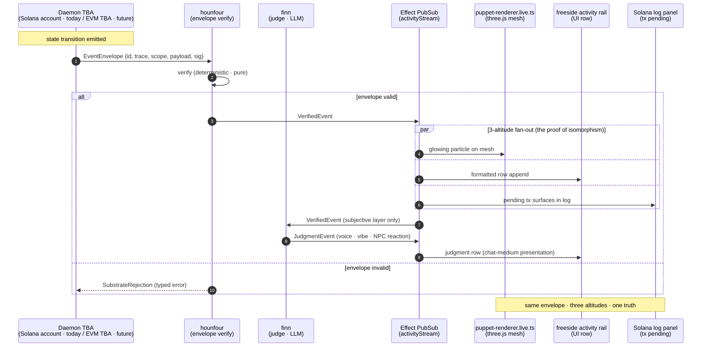

# Puppet Theater and ECS Visualizer (Proposed Thesis)

a thesis · not a shipped artifact. the operator's vision: a **puppet theater** for daemon NFTs · a three.js scene where each daemon is a puppet (mesh + animator) and the strings are events emitted through the §08 envelope. **today this file ships NO three.js code · the MVP file list below is cycle N+2 (or later)** · the thesis stays here so the doctrine can be tested before any rendering work begins.

## why this composes

the §07 isomorphism guarantees this fits cleanly. ECS provides the system/component/entity grammar that game engines need natively · the daemon NFT is already modeled as an entity. each axis of the multi-axis-daemon-architecture (`vault/wiki/concepts/multi-axis-daemon-architecture.md`) maps to a three.js subsystem:

| axis | three.js subsystem |
|---|---|
| 🦴 stack | mesh hierarchy + scene-graph parenting |
| ⚖️ civic | camera focus + audience layout (per-daemon governor lens) |
| 🎴 exodia | material slots + shader composition (construct-as-capability) |
| ⏰ time | animation timeline · state-receipts as keyframes |
| 🏛️ community | spatial partitioning of the shared scene |

**note**: axis-1 and axis-2 are load-bearing per current canon; axis-3/4/5 are candidate (per the multi-axis doctrine v0.75). the theater MVP should treat axis-3/4/5 mappings as provisional and prepared to consolidate.

three.js earns the work for four specific capabilities: **instanced meshes** (render thousands of daemons with one shader call), **declarative scene graph** (matches React tree + metadata structure), **GPU-driven particle systems** (visualize event emissions natively), and **post-processing** (the ambient sky aesthetic — the operator's hades-pattern ceremony from compass commit `41a4aaa style(ceremony): Hades pattern · element-color headlines · indie-grade legibility` extends here).

## the three-altitude event flow

when a daemon emits an event, the operator sees **the same envelope** at three altitudes simultaneously · as a mesh particle in the theater, as a row in the freeside activity stream UI, and as a pending tx in the solana log panel. this is the proof of isomorphism the entire 5-doc set rests on.

the diagram is the proof of isomorphism is testable · same envelope projected onto three surfaces.

## MVP file list (PROPOSED · cycle N+2)

| file | role | folder |
|---|---|---|
| `lib/domain/event-envelope.schema.ts` | the envelope shape (shared with §08) | domain/ |
| `lib/ports/event-stream.port.ts` | service interface for incoming envelopes | ports/ |
| `lib/live/puppet-renderer.live.ts` | three.js instanced-mesh implementation | live/ |
| `lib/live/event-stream.live.ts` | bridges Effect PubSub to three.js render-loop | live/ |
| `lib/mock/event-stream.mock.ts` | replays canned envelopes for offline puppet dev | mock/ |
| `lib/system/world.system.ts` | the central ECS loop · coordinates all axes | system/ |
| `lib/system/axis-time.system.ts` | timeline interpolator · keyframes from receipts | system/ |
| `lib/domain/puppet.entity.ts` | per-puppet visual state (renamed from puppet.component.ts · suffix-discipline alignment OR extend pack to include component) | domain/ |
| `lib/test/puppet-renderer.test.ts` | visual snapshot harness | test/ |

the MVP must demonstrate **all four folders** (domain/ports/live/mock) plus a system + a test or it doesn't validate the doctrine. three.js library selection is open · candidates are `three`, `@react-three/fiber + drei`, or raw three with custom ECS bindings. recommend deferring the choice until cycle N+2 kickoff has render-physics requirements from the operator.

## experimentation thesis (proposed)

the puppet theater is positioned as a **substrate for play**, not a demo. operators try compositions in the theater before shipping them to mainnet · constructs validate behavior in the theater before claiming a daemon stage. the theater mirrors the production substrate exactly · same envelopes · same ports · same boundary types.

this framing is candidate. the verification will be when the MVP ships and the operator can drag-drop a new construct into a running theater and watch its emissions render across the 3 altitudes without a redeploy. **today** that statement is a thesis · not a measurement.

## Sources

* [https://github.com/0xHoneyJar/construct-effect-substrate](https://github.com/0xHoneyJar/construct-effect-substrate) (four-folder discipline)
* [https://github.com/0xHoneyJar/loa/blob/main/docs/ecosystem-architecture.md](https://github.com/0xHoneyJar/loa/blob/main/docs/ecosystem-architecture.md)
* `compass` commit `41a4aaa style(ceremony): Hades pattern · element-color headlines · indie-grade legibility` (the ambient sky aesthetic precedent)
* `vault/wiki/concepts/multi-axis-daemon-architecture.md` (5 axes · axis-3/4/5 candidate)
* `vault/wiki/concepts/chat-medium-presentation-boundary.md` (the substrate→presentation lens)
