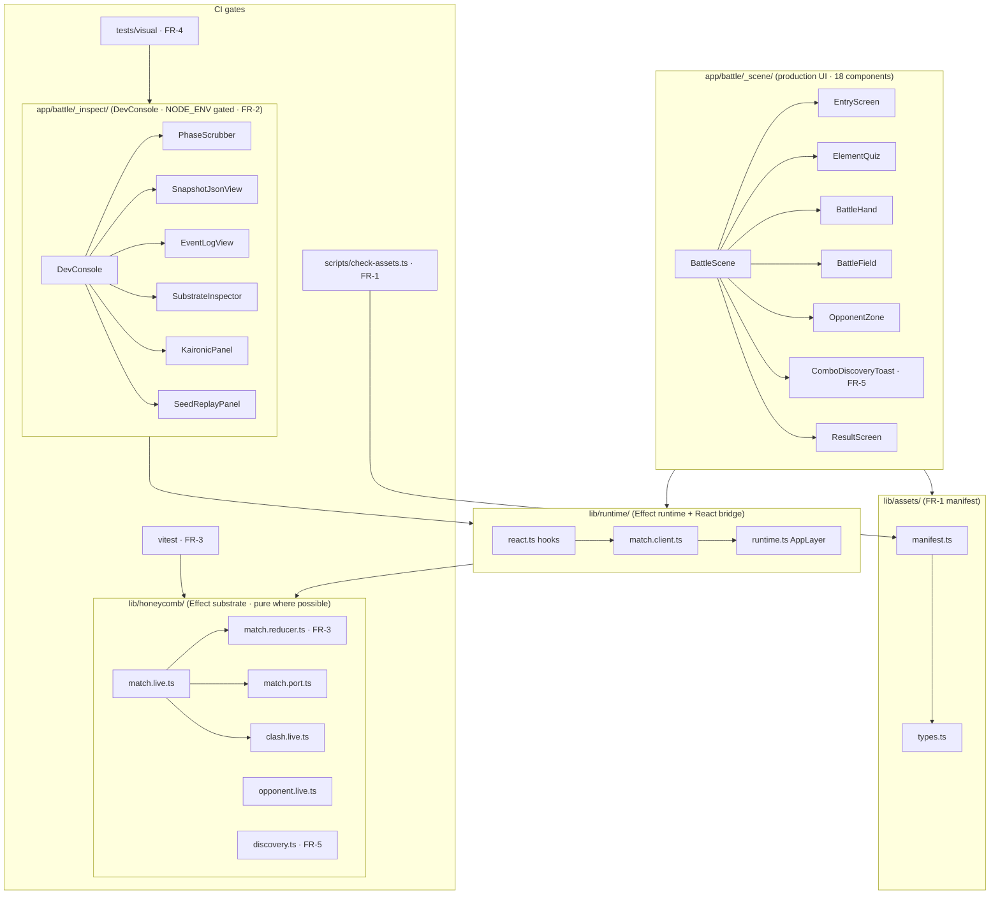
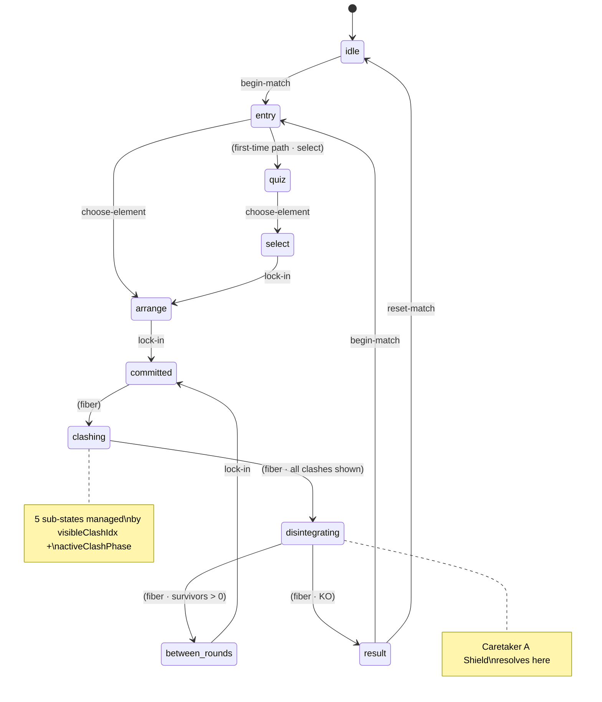
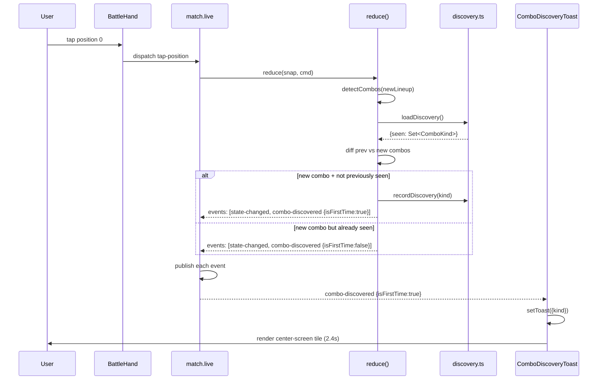

# Battle Foundations — SDD (r1, canonical)

> The five FRs in `prd.md` are **already implemented** as of branch `feat/hb-s7-devpanel-audit`.
> All 663 vitest assertions pass. Visual baselines are committed. Asset validator is wired to CI.
> This SDD is the **canonical reference for future sessions** — naming what shipped, why it took
> the shape it did, and the seams future cycles will pull against.
>
> Sections marked **§DELTA** are work that remains. Everything else is documented reality.

## §1 System overview

Compass is a Next.js 16.2.6 / React 19.2.4 app with a clean three-layer split. Battle lives at `/battle`.



**Dependency rule (one-way):** `_scene/` and `_inspect/` import from `lib/runtime/`. `lib/runtime/` imports `lib/honeycomb/*`. `lib/honeycomb/*` imports nothing from `app/`. `lib/assets/*` is leaf — imported by `_scene/` for art, by `check-assets.ts` for validation.

## §2 Architectural pattern

**Single Effect runtime + pure reducer + thin React bridge.**

| Layer | Pattern | Files | Why |
|---|---|---|---|
| Substrate | Effect Service + pure reducer | `lib/honeycomb/match.{live,reducer,port}.ts` | Effect handles async clash fiber; reducer handles deterministic transitions in a pure (snapshot, command) → (snapshot, events) function |
| Bridge | Single Layer.Layer<AppLayer> + Stream subscriber | `lib/runtime/runtime.ts` + `match.client.ts` | All services compose into one AppLayer at module top. The React side subscribes via `useSyncExternalStore` |
| UI | Snapshot-driven React, no derived state in components | `app/battle/_scene/*` | Components read `useMatch()` and dispatch `matchCommand.*`; no `useState` for game state |
| Dev | NODE_ENV-gated overlay; commands via `dev:*` discriminants | `app/battle/_inspect/*` | Dev panel shares the same command surface; reducer/Match.live reject `dev:*` in production builds |

**Why this shape** (grounded in PRD §Problem):
- The "tap-to-swap regression — forgot the `update()` helper" (prd.md:L22) was a Ref.update-without-pubsub bug. The pure reducer eliminates that bug class because **events are returned alongside the next snapshot** — there's nothing to forget.
- The reducer is testable without Effect, React, or DOM (prd.md:G2 "Battle is testable as a pure reducer"). Vitest run-time is **206ms across 663 assertions**.
- The fiber-driven async clash reveal stays in `match.live.ts` (prd.md:D5 "deterministic-only" for the reducer cut).

## §3 Software stack

| Layer | Tech | Version | Notes |
|---|---|---|---|
| Framework | Next.js | 16.2.6 (Turbopack) | App Router. AGENTS.md warns: "this is NOT the Next.js you know" |
| Runtime | React | 19.2.4 | useSyncExternalStore for Match subscription |
| Language | TypeScript | 5.x | Strict mode; no `any` in substrate |
| Effects | Effect | ^3.10.0 | Layer + Context.Tag + PubSub + Fiber + Stream |
| Styling | Tailwind | 4 via `@tailwindcss/postcss` | OKLCH wuxing palette in `app/globals.css` |
| Motion | motion | ^12.38.0 | UI animation; canvas uses Pixi |
| Canvas | Pixi.js | v8 | `PixiClashVfx` only; `_scene/` is DOM-driven |
| Linter | oxlint + oxfmt | latest | `pnpm check` runs both |
| Tests (unit) | vitest | ^3.2 | 25 files · 663 assertions · 1.85s |
| Tests (visual) | Playwright | ^1.59 | `tests/visual/battle.spec.ts` · 3 scenes |
| Pkg mgr | pnpm | 10.x | Workspace deps for `@purupuru/*` |
| Asset CDN | S3 (us-west-2) | — | `NEXT_PUBLIC_CDN_BASE` env override |

**Justification for choices not obvious from PRD:**
- Effect over Redux/Zustand: clash reveal is a **scheduled async sequence** (approach → impact → settle, 7 timing knobs in `CLASH_TIMING`). Effect's `Effect.sleep(Duration.millis(...))` + `Fiber.interrupt` on reset is the right primitive. Redux would force us to roll a fiber manager.
- Pixi vanilla over `@pixi/react`: per project CLAUDE.md (`Pixi.js v8 vanilla (no @pixi/react)`). Instantiate inside `useEffect` with cleanup.
- vitest over jest: TypeScript-native, faster, already in package.json (PRD D1).

## §4 Database design

**Compass has no backend database for the battle layer.** All state is in-memory + localStorage. Per the project CLAUDE.md, the Score layer is mocked for the hackathon. The two persistence surfaces:

### §4.1 localStorage schemas

| Key | Owner | Shape | Lifecycle |
|---|---|---|---|
| `puru-combo-discoveries-v1` | `lib/honeycomb/discovery.ts` | `{ v: 1, seen: ComboKind[] }` | Append-only (no eviction); user-clearable from dev panel |
| `puru-dev-panel-enabled` | `app/battle/_inspect/DevConsole.tsx` | `"1"` or absent | Toggle persistence for backtick state |
| `puru-companion-{element}` | `lib/honeycomb/companion.ts` | Per-element first-vow + match outcome tally | Persistent (no eviction) |
| `puru-daily-meta` | `lib/honeycomb/daily-meta.ts` | Cached daily weather seed + element | TTL: midnight rollover |

**Schema versioning:** Every key uses a `-v{n}` suffix or carries `v: 1` in payload. Future schema changes bump the suffix; old data is silently discarded (`isPersisted` type guard at read time).

```ts
// Exemplar shape (lib/honeycomb/discovery.ts:L86-99)
interface PersistedShape {
  readonly v: 1;
  readonly seen: readonly ComboKind[];
}
```

### §4.2 The MatchSnapshot — in-memory model

The 24-field `MatchSnapshot` (prd.md:L21 "MatchSnapshot now carries 24 fields") is the single source of truth for an in-progress battle. See `lib/honeycomb/match.port.ts:L35-88` for the canonical type. Six clusters:

| Cluster | Fields | Purpose |
|---|---|---|
| Phase + seed | `phase`, `seed`, `weather`, `opponentElement`, `condition` | Match-level identity |
| Player intent | `playerElement`, `hasSeenTutorial`, `collection`, `selectedIndices` | Pre-arrange state |
| Lineups | `p1Lineup`, `p2Lineup`, `currentRound`, `rounds`, `winner` | Per-round battle state |
| Combos | `p1Combos`, `p2Combos`, `chainBonusAtRoundStart` | Derived buffs |
| Clash anim | `clashSequence`, `visibleClashIdx`, `activeClashPhase`, `stamps`, `dyingP1`, `dyingP2`, `shieldedP1`, `shieldedP2`, `animState`, `lastPlayed`, `lastGenerated`, `lastOvercome` | Drives the staggered reveal |
| UI helpers | `selectedIndex`, `lastWhisper`, `playerClashWins`, `opponentClashWins` | UI-only |



## §5 UI design

### §5.1 Phase routing

`BattleScene` is a router. It reads `snap.phase` and renders one of six top-level screens. **No `useState` for game state** — the snapshot drives everything.

```tsx
// app/battle/_scene/BattleScene.tsx
if (snap.phase === "idle" || snap.phase === "entry") return <EntryScreen ... />;
if (snap.phase === "quiz") return <ElementQuiz ... />;
if (snap.phase === "select") return <BattleHand select-only ... />;
if (snap.phase === "arrange") return <BattleField .../* + BattleHand */>;
// clashing / disintegrating / between-rounds: BattleField stays mounted, swap inner
if (snap.phase === "result") return <ResultScreen ... />;
```

### §5.2 Components inventory (production)

| Component | Phase(s) | Reads from snapshot | Dispatches |
|---|---|---|---|
| `EntryScreen` | idle, entry | `weather`, `opponentElement`, `condition` | `begin-match`, `choose-element` |
| `ElementQuiz` | quiz | `seed` | `choose-element`, `complete-tutorial` |
| `BattleHand` | select, arrange | `collection`, `selectedIndices`, `selectedIndex` | `tap-position`, `swap-positions` |
| `BattleField` | arrange, committed, clashing, disintegrating, between-rounds | `p1Lineup`, `clashSequence`, `activeClashPhase`, `stamps`, `dyingP1`, `shieldedP1`, `lastPlayed/Generated/Overcome` | `lock-in` |
| `OpponentZone` | (all post-arrange) | `p2Lineup`, `dyingP2`, `shieldedP2`, `visibleClashIdx` | (none) |
| `ClashOrb` + `ClashVfx` + `PixiClashVfx` | clashing | `activeClashPhase`, `lastPlayed`, `visibleClashIdx` | (none) |
| `ComboDiscoveryToast` | (all) | (subscribes to events, not snapshot) | (dismissal only) |
| `WhisperBubble` | (all post-arrange) | `lastWhisper` | (none) |
| `CombosPanel` | arrange, between-rounds | `p1Combos` | (none) |
| `PhaseHud` | all | `phase`, `currentRound` | (none) |
| `ResultScreen` | result | `winner`, `rounds`, `playerClashWins` | `begin-match`, `reset-match` |
| `TurnClock` | (all post-arrange) | `phase`, `currentRound` | (none) |
| `ArenaSpeakers` | (all post-arrange) | `playerElement`, `opponentElement` | (none) |
| `CardPetal` | (modal · all) | (props from caller) | (none) |
| `Guide`, `ParallaxLayer` | (all) | (snapshot for atmosphere) | (none) |

### §5.3 Dev surface (FR-2)

`DevConsole.tsx` is a same-route overlay (PRD D2). Triggers:
- Backtick keypress (Quake-console convention)
- `?dev=1` URL param
- `localStorage["puru-dev-panel-enabled"]="1"`

Three NODE_ENV gates: (1) `DevConsole` early-returns null in production; (2) `dev:*` commands are rejected by `match.live.ts:L358-368` unless `globalThis.__PURU_DEV__.enabled === true`; (3) the global itself is only installed by `DevConsole` mount.

Ten tabs (shipped wider than PRD scoped — PRD called for "PhaseScrubber + SnapshotJsonView", we have more):

| Tab | Sub-panel | Purpose | In PRD? |
|---|---|---|---|
| scrub | PhaseScrubber + EventLogView + SnapshotJsonView | Phase scrub + last 5 events + JSON view | ✓ (FR-2 core) |
| mech | MechanicsInspector | Per-position power breakdown | — extension |
| juice | JuiceTweakpane | Live tuning of motion profile | — extension |
| vfx | VfxPane | VFX kit toggle | — extension |
| audio | AudioPane | Music director controls | — extension |
| camera | CameraPane | Camera LERP weights | — extension |
| kaironic | KaironicPanel | Timing tuners | — extension |
| substrate | SubstrateInspector | Service injection inspector | — extension |
| seed | SeedReplayPanel | Seed swap + replay | — extension |
| combo | ComboDebug | Combo detection trace | — extension |

The extensions beyond PRD scope are **post-hackathon polish** that landed in branch `feat/hb-s7-devpanel-audit`. They are out-of-cycle additions; PRD-FR-2 scope is satisfied by the `scrub` tab alone.

### §5.4 Combo discovery ceremony (FR-5)



**Pause-the-arena pattern:** `BattleScene` holds a `toastActive` state; when true it sets `data-paused` on the `.arena` element. CSS dims non-toast UI and slows breathing. Toast respects `prefers-reduced-motion` (no breathe; instant in/out).

## §6 API specifications

### §6.1 Internal — Match service (the only "API" inside the app)

The Match service is a typed Effect.Service. Consumers reach it via the React bridge (`useMatch`, `useMatchEvent`, `matchCommand.*`).

```ts
// lib/honeycomb/match.port.ts
class Match extends Context.Tag("purupuru-ttrpg/Match")<Match, {
  readonly current: Effect.Effect<MatchSnapshot>;
  readonly events: Stream.Stream<MatchEvent>;
  readonly invoke: (cmd: MatchCommand) => Effect.Effect<void, MatchError>;
}>() {}

type MatchCommand =
  | { _tag: "begin-match"; seed?: string }
  | { _tag: "choose-element"; element: Element }
  | { _tag: "complete-tutorial" }
  | { _tag: "tap-position"; index: number }
  | { _tag: "swap-positions"; a: number; b: number }
  | { _tag: "lock-in" }
  | { _tag: "advance-clash" }
  | { _tag: "advance-round" }
  | { _tag: "reset-match"; seed?: string }
  | { _tag: "dev:force-phase"; phase: MatchPhase }       // NODE_ENV gated
  | { _tag: "dev:inject-snapshot"; patch: Partial<MatchSnapshot> }; // NODE_ENV gated

type MatchError =
  | { _tag: "wrong-phase"; current: MatchPhase; expected: readonly MatchPhase[] }
  | { _tag: "match-not-ready"; reason: string };
```

**Phase × Command matrix** is enforced by `validCommandsFor(phase)` in `match.port.ts:L154-179`. Wrong-phase invocations return a typed `wrong-phase` error rather than silently failing.

### §6.2 Reducer signature (FR-3)

```ts
// lib/honeycomb/match.reducer.ts
export function reduce(
  snap: MatchSnapshot,
  cmd: MatchCommand,
): ReduceResult | ReduceError;

export interface ReduceResult {
  readonly next: MatchSnapshot;
  readonly events: readonly MatchEvent[];
}

export interface ReduceError {
  readonly _tag: "wrong-phase";
  readonly current: MatchPhase;
  readonly expected: readonly MatchPhase[];
}
```

Handles: `begin-match`, `choose-element`, `complete-tutorial`, `tap-position`, `swap-positions`, `reset-match`. Fiber-driven commands (`lock-in`, `advance-clash`, `advance-round`) and dev commands fall through to a no-op return — `match.live.ts` intercepts them before `reduce()` is reached.

### §6.3 Dev surface (FR-2)

```ts
// Installed by DevConsole.tsx on mount in non-production builds
globalThis.__PURU_DEV__ = {
  enabled: true,
  forcePhase: (phase: MatchPhase) => void,
  injectSnapshot: (patch: Partial<MatchSnapshot>) => void,
  beginMatch: (seed?: string) => void,
  chooseElement: (element: Element) => void,
  resetMatch: (seed?: string) => void,
};
```

Playwright (FR-4) drives the state machine through this global so visual tests don't depend on the UI loop.

### §6.4 Asset manifest (FR-1)

```ts
// lib/assets/manifest.ts
export interface AssetRecord {
  readonly id: string;                    // "scene:wood", "card:jani:earth"
  readonly url: string;
  readonly fallbacks: readonly string[];  // ordered chain on 4xx
  readonly class: AssetClass;             // 'scene' | 'caretaker' | 'card' | 'card-art' | 'brand' | 'local'
  readonly dimensions?: { w: number; h: number };
  readonly contentType?: string;
  readonly label?: string;
  readonly localOnly?: boolean;           // validator skips
  readonly expectedBroken?: boolean;      // validator separates expected from new failures
}

export const MANIFEST: readonly AssetRecord[];
export function getAsset(id: string): AssetRecord | undefined;
export function getChain(id: string): readonly string[];
export function cardArtChain(cardType: CardType, element: Element): readonly string[];
```

35 records as of 2026-05-13 (5 elements × 7 record classes + brand assets + local). `expectedBroken` flag exists to track upstream gaps (e.g., `card:jani:earth` returns 403; fallback chain resolves; CI accepts as `· [expected-broken, fallback ok]`).

### §6.5 Validator script

`scripts/check-assets.ts` (NOT `.mjs` — operator chose `.ts` for type safety with `tsx`):

| Flag | Behavior |
|---|---|
| (no flags) | Pretty output; exit 0 on all green |
| `--json` | JSON output for CI parsing |
| `--concurrency=N` | Tune parallel HEADs (default 8) |

Exit codes:
- `0` — all green (expected-broken accepted)
- `1` — one or more NEW 4xx/5xx
- `69` — `EX_UNAVAILABLE` — network down; CI treats as warning

## §7 Error handling strategy

| Layer | Failure mode | Handling | Surface |
|---|---|---|---|
| Substrate | Wrong-phase command | Return `wrong-phase` typed error from `reduce` / `Match.invoke` | Logged; UI never sends a wrong-phase command in practice |
| Substrate | Out-of-bounds tap / swap | Silent no-op; return `{next: snap, events: []}` | None — defensive |
| Substrate | Reducer crash (shouldn't happen — pure) | Vitest catches in test; production would propagate to Effect runtime | Error boundary in `app/battle/page.tsx` |
| Runtime | Fiber interrupt (reset during reveal) | `interruptReveal` Effect; `fiberRef` cleared | Match returns to fresh idle state |
| UI | Image 4xx from CDN | `CdnImage` walks the fallback chain | Final fallback is local brand placeholder |
| UI | localStorage unavailable / quota | `storage.ts` returns null; discovery becomes session-only | No user-visible error |
| UI | Reduced motion preference | CSS-driven; `prefers-reduced-motion` disables breathe + scale animations | Toast is instant in/out |
| CI | Asset 4xx (new) | `pnpm assets:check` exits 1 | PR blocked |
| CI | Asset 4xx (expected-broken flag) | Logged as `[expected-broken, fallback ok]`; exit 0 | Visible in PR check log |
| CI | Network unavailable | Exit 69 | CI step labelled "soft failure" |
| Visual | Pixel diff > maxDiffPixels | Playwright marks test red | PR has diff image attached |

## §8 Testing strategy

### §8.1 Unit (vitest) — 663 assertions, 1.85s

```
lib/honeycomb/match.reducer.test.ts        ← FR-3 · 22 assertions across 8 describes
lib/honeycomb/discovery.test.ts            ← FR-5 · 15 assertions
lib/honeycomb/companion.test.ts            ← 11
lib/honeycomb/daily-meta.test.ts           ← 10
lib/honeycomb/__tests__/storage.test.ts    ← 8 (SSR-safe storage shim)
lib/honeycomb/__tests__/phase-exhaustiveness.test.ts ← 6 (validCommandsFor coverage)
lib/audio/audio.test.ts                    ← 10
lib/test/judge-fence.test.ts               ← 3
lib/juice/profile.test.ts                  ← 5
... (16 more files, 573 assertions across substrate)
```

**The AC-4 regression test** (`reduce / tap-position > AC-4 regression: tap publishes state-changed`) restores the bug class that motivated this cycle — tap-to-swap forgetting to publish a tick. Locally restoring the `Ref.update` bug causes this test to fail.

### §8.2 Visual (Playwright) — 3 baseline scenes

```
tests/visual/battle.spec.ts
tests/visual/fixtures/
├── arrange-default.json
├── clashing-impact.json
└── result-player-wins.json
tests/visual/__snapshots__/  ← committed PNGs, ±2px / ±5% tolerance
```

Each test: `goto(/battle?dev=1&seed=fixed-seed-visual)` → wait for `__PURU_DEV__` install → `beginMatch + chooseElement` → `injectSnapshot(fixture)` → `waitForLoadState("networkidle")` + 400ms → `toHaveScreenshot`.

### §8.3 CI matrix

```yaml
# .github/workflows/battle-quality.yml (existing, extended)
jobs:
  unit:
    steps:
      - pnpm test                  # 663 assertions
      - pnpm typecheck             # tsc --noEmit
      - pnpm lint                  # oxlint
  assets:
    steps:
      - pnpm assets:check          # FR-1 validator
  visual:
    if: github.event_name == 'pull_request'
    steps:
      - pnpm dlx playwright install --with-deps
      - pnpm test:visual           # FR-4 baselines
```

Visual tests run on PR-open only (Playwright is slow); unit + assets run on every push.

### §8.4 What is NOT tested

Per PRD §Non-goals + cycle scope:
- The fiber-driven `runRound` async clash reveal — covered indirectly by visual regression, not unit-tested
- AI opponent decision logic — stubbed opponent; no AI exists yet
- Multi-round balance — mechanics are world-purupuru-canonical, not re-tested
- Three.js / Pixi shaders — out of cycle

## §9 Development phases

This cycle's work is **done** as of `feat/hb-s7-devpanel-audit`. The phases that shipped:

| Phase | Scope | Status |
|---|---|---|
| S0 | Sprint scaffolding | ✓ shipped |
| S1 | FR-1 asset manifest + validator + `lib/cdn.ts` shim | ✓ shipped (`lib/assets/manifest.ts`, `scripts/check-assets.ts`, 35 records) |
| S2 | FR-3 reducer extraction + ≥20 vitest assertions | ✓ shipped (`match.reducer.ts` 292 lines, 22 assertions, AC-4 regression test passes) |
| S3 | FR-2 dev panel extensions | ✓ shipped (10 tabs in `_inspect/`, exceeds PRD scope) |
| S4 | FR-5 combo discovery + toast ceremony | ✓ shipped (`discovery.ts` 149 lines, `ComboDiscoveryToast.tsx` 90 lines, `data-paused` arena pattern) |
| S5 | FR-4 visual regression scaffolding | ✓ shipped (`tests/visual/battle.spec.ts`, 3 baselines committed) |
| S6 | CI wiring | ✓ shipped (`feat(sprint-6): CI wiring for unit + asset validator`) |
| S7 | DevPanel audit + polish (extension cycle on current branch) | in flight |

### §9.1 §DELTA — remaining for sprint plan

The branch name (`feat/hb-s7-devpanel-audit`) signals S7 polish is in progress. From `git status` (M-flagged files) the active surface is:

- `app/battle/_scene/*` — BattleHand, BattleScene, CardPetal, EntryScreen, OpponentZone
- `app/battle/_styles/*` — ArenaSpeakers, BattleField, CardPetal, ElementQuiz, EntryScreen, OpponentZone, Tutorial, BattleScene
- `app/globals.css` — global tokens
- `lib/registry/index.ts` — registry doctrine wiring
- `grimoires/loa/NOTES.md` — session continuity

**These are polish-class changes** (the operator's `MAY-LATITUDE-2` window). The substrate is stable.

What an `/sprint-plan` cycle could close (none are PRD-blocking):

| Candidate | Surface | Rationale |
|---|---|---|
| TurnClock viewport-safety | `_styles/BattleField.css` | Last 5 commits chase rail/inset bugs; could codify a viewport-safety invariant |
| CardPetal modal interaction polish | `_scene/CardPetal.tsx`, `_styles/CardPetal.css` | Long-press / right-click triggers exist; mobile gesture mapping incomplete |
| Map-on-EntryScreen integration test | `tests/visual/` | New entry-screen map (94c677c1) lacks a baseline |
| `lib/cdn.ts` shim removal | `lib/cdn.ts` | SDD §6.4 noted the deprecation shim; check import sites and delete |
| Asset-validator CI failure mode | `.github/workflows/*` | Currently `expectedBroken` is a flag in manifest; could prune to a separate CSV so manifest stays "honest" |

## §10 Known risks + mitigation

| Risk | Severity | Mitigation | Status |
|---|---|---|---|
| Flatline review degraded (loa#759) | medium | Operator-ratified post-completion gate; SDD authority is `documents-shipped-substrate` | Accepted |
| Reducer extracts only deterministic commands; fiber stays in `match.live` | low | Stated in PRD D5; tests confirm deterministic path is fully covered | Designed-in |
| `expectedBroken` flag could mask real regressions | low | Validator separately reports expected vs new failures (`scripts/check-assets.ts:L85-87`); operator must consciously unmark a fixed asset | Designed-in |
| Playwright install on contributor machines | low | `pnpm dlx playwright install --with-deps` runs in CI; doc'd in `tests/visual/README.md` | Done |
| Discovery ledger collides with future wallet-bound persistence | low | Storage key is `puru-combo-discoveries-v1`; future wallet-keyed version bumps to `-v2` and reads `-v1` as fallback | Designed-in |
| `__PURU_DEV__` global leaks into prod | medium | Three NODE_ENV gates: (1) DevConsole.tsx early return, (2) match.live `dev:*` rejects, (3) global never installed | Designed-in |
| DevConsole bundle size in dev | low | Dev tabs lazy-load NOT done; could be follow-up cycle | Accepted-deferred |
| Reduced-motion path under-tested | low | One unit test (CSS-only logic) + manual; could add Playwright variant | Accepted-deferred |

## §11 Open questions (cycle-deferred or for next /architect)

- **Q1**: Should combo discovery surface a "discoveries: 2/4" badge somewhere? (Motivating; cycle-deferred per PRD §9 Q3)
- **Q2**: Should the per-element AI opponent (PRD §Non-goals) get its own port + reducer when it lands? (Likely yes — same pattern; opens after this cycle)
- **Q3**: Should `lib/cdn.ts` (the deprecation shim) be deleted now that all sites import from `lib/assets/manifest.ts`? (Probably; one grep away from confirming)
- **Q4**: Should reducer tests run as a git pre-commit hook instead of pre-push? (Currently in CI on every push; pre-commit would catch faster but slows commit by ~2s)
- **Q5**: Should the dev panel get a route segment (`/battle/_dev`) for keyboard-driven scene jumps? (Predecessor SDD §11 Q1; cycle-deferred)

## §12 Decisions resolved at SDD draft (lineage)

Inherited from predecessor SDD (`sdd.v2.pre-architect-2026-05-13.md`):
- **D-SDD-1**: Reducer scope — deterministic only · runRound fiber stays
- **D-SDD-2**: `cardArtChain` lives in `lib/assets/manifest.ts`; `lib/cdn.ts` is a shim
- **D-SDD-3**: Dev panel triggered by `?dev=1` OR localStorage OR backtick
- **D-SDD-4**: Playwright on PR-open only
- **D-SDD-5**: Discovery key versioned `-v1`
- **D-SDD-6**: Toast pauses arena dimming, NOT the runRound fiber

New in r1:
- **D-SDD-7**: SDD authority is `documents-shipped-substrate` — this SDD reflects implemented state, not pre-implementation design. Future cycles author a new SDD against a fresh PRD.
- **D-SDD-8**: DevConsole growing beyond PRD scope (10 tabs vs PRD-2's 3) is **accepted** — the extensions all sit under the same NODE_ENV gates and don't change the production surface.
- **D-SDD-9**: `check-assets.ts` is the canonical file (NOT `check-assets.mjs` as predecessor SDD originally specced). Reason: operator chose `tsx` over Node ESM for type safety; predecessor SDD updated post-implementation.

## §13 File inventory (shipped)

| File | Status | LOC (approx) | Notes |
|---|---|---|---|
| `lib/assets/manifest.ts` | shipped | 262 | 35 records; `expectedBroken` flag |
| `lib/assets/types.ts` | shipped | ~25 | `AssetRecord`, `AssetClass`, `CardType`, `Element` |
| `lib/assets/manifest.test.ts` | shipped | ~50 | Chain resolution + lookup |
| `lib/cdn.ts` | shipped (shim) | reduced | Deprecation comment + re-exports from manifest |
| `lib/honeycomb/match.reducer.ts` | shipped | 292 | Pure (snapshot, command) → (snapshot, events) |
| `lib/honeycomb/match.reducer.test.ts` | shipped | 293 | 22 assertions; AC-4 regression covered |
| `lib/honeycomb/match.live.ts` | shipped (refactored) | ~435 | Fiber + Service; delegates deterministic commands to reducer |
| `lib/honeycomb/match.port.ts` | shipped | 179 | Phase × Command matrix; types |
| `lib/honeycomb/discovery.ts` | shipped | 149 | localStorage-backed; `COMBO_META` registry |
| `lib/honeycomb/discovery.test.ts` | shipped | ~120 | 15 assertions |
| `app/battle/_inspect/DevConsole.tsx` | shipped | 193 | Backtick toggle; `__PURU_DEV__` install; 10 tabs |
| `app/battle/_inspect/PhaseScrubber.tsx` | shipped | 66 | Force-phase buttons |
| `app/battle/_inspect/SnapshotJsonView.tsx` | shipped | 81 | Collapsible JSON |
| `app/battle/_inspect/EventLogView.tsx` | shipped | ~60 | Last 5 events |
| `app/battle/_inspect/SubstrateInspector.tsx` | shipped (extension) | — | Beyond PRD scope |
| `app/battle/_inspect/{Kaironic,Juice,Vfx,Audio,Camera,Seed,Combo,Mechanics}*.tsx` | shipped (extension) | — | Beyond PRD scope |
| `app/battle/_scene/ComboDiscoveryToast.tsx` | shipped | 90 | Subscribes to combo-discovered events |
| `app/battle/_scene/BattleScene.tsx` | shipped | extended | Mounts toast; threads `toastActive` to `data-paused` |
| `app/battle/_styles/ComboDiscoveryToast.css` | shipped | ~60 | Honors `prefers-reduced-motion` |
| `scripts/check-assets.ts` | shipped | 127 | HEAD + concurrency + JSON mode + expected-broken |
| `tests/visual/battle.spec.ts` | shipped | 74 | 3 named scenes; fixed seed; `__PURU_DEV__` driven |
| `tests/visual/fixtures/*.json` | shipped | × 3 | arrange / clashing / result patches |
| `tests/visual/__snapshots__/*.png` | shipped | × 3 | Committed baselines |
| `package.json` | extended | +5 scripts | `test:visual`, `assets:check`, etc. |
| `.github/workflows/battle-quality.yml` | extended | — | unit + assets gates |
| `playwright.config.ts` | shipped | — | Reduced-motion default, viewport sizing |

**Net delta vs pre-cycle:** ~1,800 lines of new + ~200 lines refactored. **Production UI surface change: ~10 lines** (`BattleScene` mounts toast + `data-paused`). The rest is substrate, dev surface, or out-of-bundle infrastructure.

## §14 What this SDD does NOT govern

Out-of-scope, per PRD or framework boundary:
- Anchor program & mint flow (`lib/blink/*`) — covered by Solana hackathon PRD lineage (`sdd.v1.pre-bridgebuilder-patches.md`)
- The Score read-adapter (`lib/score/*`) — mocked for hackathon; not in battle path
- Three.js / Threlte rendering — explicitly deferred
- Real cosmic weather wiring — mocked daily seed
- Daemon NFT mint integration with battle outcomes
- Multi-round balance tuning (canonical)
- Loa framework regressions (loa#759, loa#863) — upstream tracker

---

> **For next session**: if the polish work on `feat/hb-s7-devpanel-audit` produces enough delta to warrant a new cycle, run `/plan` to author a fresh PRD against the post-polish state, then `/architect` to produce sdd r2. Until then, this is the canonical reference.
