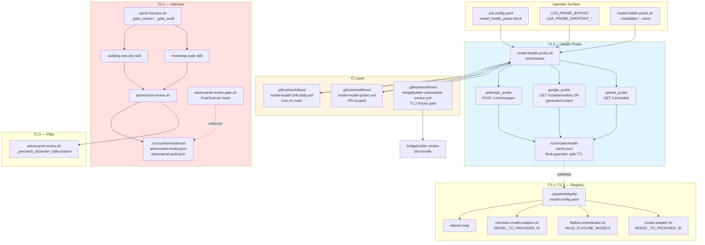
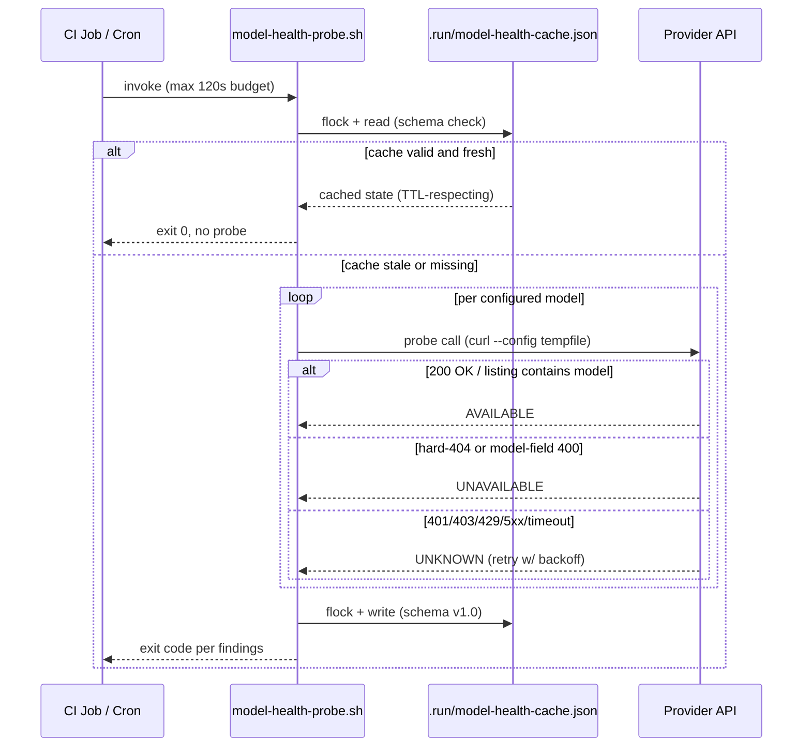
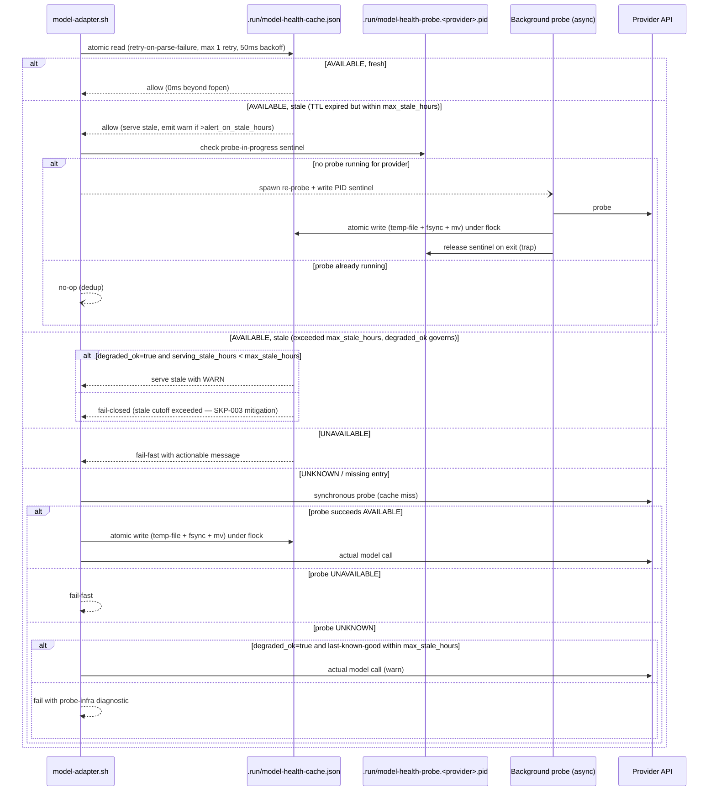
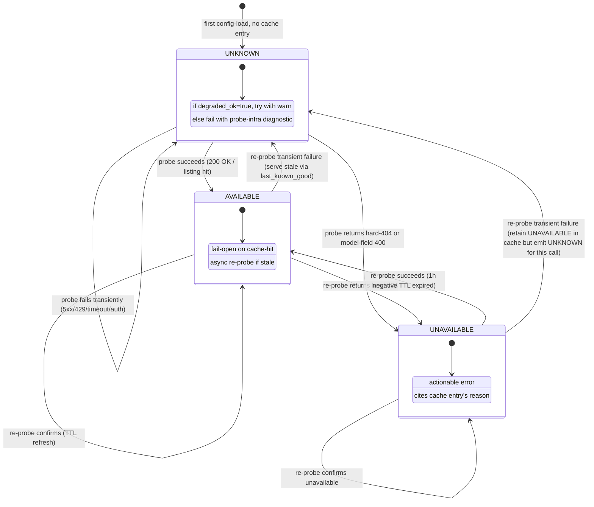

# Software Design Document: Loa Stabilization & Model-Currency Architecture

**Version:** 1.0
**Date:** 2026-04-24
**Author:** Architecture Designer Agent
**Status:** Draft
**PRD Reference:** `grimoires/loa/cycles/cycle-093-stabilization/prd.md`
**Cycle:** cycle-093-stabilization

> **Meta-sprint nature**: This SDD designs changes to the Loa framework's **System Zone** (`.claude/`), not product features. Template sections that normally cover Database/UI/API have been re-scoped to **Cache Design**, **Operator Interface**, and **Script/CLI Contracts**. All writes to `.claude/` are authorized by the cycle-093 PRD per `.claude/rules/zone-system.md`.
>
> **Output path**: This SDD is isolated at `grimoires/loa/cycles/cycle-093-stabilization/sdd.md` to avoid clobbering cycle-092's in-flight `grimoires/loa/sdd.md` (PR #603).

---

## Table of Contents

1. [System Architecture](#1-system-architecture)
2. [Software Stack](#2-software-stack)
3. [Cache Design — Model-Health Cache](#3-cache-design--model-health-cache)
4. [Operator Interface](#4-operator-interface)
5. [Script & CLI Contracts](#5-script--cli-contracts)
6. [Error Handling Strategy](#6-error-handling-strategy)
7. [Testing Strategy](#7-testing-strategy)
8. [Development Phases](#8-development-phases)
9. [Known Risks and Mitigation](#9-known-risks-and-mitigation)
10. [Open Questions](#10-open-questions)
11. [Appendix](#11-appendix)

---

## 1. System Architecture

### 1.1 System Overview

cycle-093 reshapes four cross-cutting slices of the Loa framework:

1. **Harness gate wiring (T1.1)** — the `spiral-harness.sh` gates invoke the review/audit skills (which already emit `adversarial-{review,audit}.json`) so the existing `adversarial-review-gate.sh` PostToolUse hook can structurally enforce artifact presence.
2. **Bridgebuilder build + submodule smoke test (T1.2)** — restore `dist/core/multi-model-pipeline.js` to the shipped bundle and add a fixture-submodule CI job that catches consumer-side dist regressions.
3. **Dissenter hallucination pre-check (T1.3)** — a bidirectional token-matching filter inside `adversarial-review.sh` that downgrades `{{DOCUMENT_CONTENT}}`-family findings when the token is absent from the diff.
4. **Model-health-probe pattern (T2.1 / T2.2 / T2.3 / T3.1)** — a new `.claude/scripts/model-health-probe.sh` plus CI workflows that probe live providers, a split-TTL flock-guarded cache, and registry entries that route through the probe.

The connective tissue is a single invariant: **what operators configure is what runs, and discrepancies are detected architecturally rather than manually.**

### 1.2 Architectural Pattern

**Pattern:** Bash-script-composed "probe → cache → adapter" pipeline with a CI-enforced invariant gate.

**Justification:**

Quoted from PRD (`prd.md:40-42`):

> "Ship a provider health-probe pattern (keystone) that makes availability a probed invariant — so the next model transition is handled architecturally rather than reactively. Lore context: The health-probe pattern is the same idea as the 'Route Table as General-Purpose Skill Router' captured in vision-008 — reality is queried, not declared."

The pattern is chosen over alternatives because:

- **vs. "keep maintaining by hand"**: The PRD cites `#574` (`prd.md:29`) as evidence this has repeatedly failed. Hand-maintenance produced the Gemini 3 phantom-prune defect and will recur with GPT-5.5.
- **vs. "scrape-and-regenerate model-config.yaml from provider listings"**: Scrape approaches destroy operator-curated fields (pricing, capability hints). The probe augments the registry with a live availability signal, leaving curated fields intact.
- **vs. "depend on vendor SDK health endpoints"**: Each vendor surfaces availability differently (OpenAI listing, Google listing OR generateContent, Anthropic no listing at all). A uniform bash-layer probe with per-provider adapters is the minimum coupling that delivers the invariant.

The design keeps **the probe code paths out of the model-adapter hot path** — config-load reads only the cached JSON (O(1) fopen + jq query), while re-probes happen in background with `flock` serialization.

### 1.3 Component Diagram



### 1.4 System Components

#### C1. `model-health-probe.sh` (new script)
- **Purpose:** Orchestrate per-provider availability probes and update the cache.
- **Responsibilities:**
  - Read configured models from `.claude/defaults/model-config.yaml`.
  - Dispatch to per-provider probe adapter (openai / google / anthropic).
  - Classify `ProbeResult` into `AVAILABLE | UNAVAILABLE | UNKNOWN` per state machine in §3.2.
  - Write to `.run/model-health-cache.json` under `flock`.
  - Enforce probe budget (max 10 calls / run, 120s invocation timeout, $0.05 cost cap).
  - Emit trajectory log entry per probe; summary JSON to stdout.
  - Support `--invalidate [model-id]`, `--once` (one-shot), `--provider <name>` (scope), `--dry-run`.
- **Interfaces:** CLI (see §5.2), exit codes (see §6.1).
- **Dependencies:** `jq`, `curl`, `flock` (via `_require_flock` shim), `yq` for config parsing.

#### C2. Per-provider probe adapters (inside C1)
- **openai_probe**: `GET /v1/models`, paginate via `next_page_token` (if present), assert model ID in any page's `data[].id`. Per §3.3 error taxonomy.
- **google_probe**: `GET /v1beta/models` + `generateContent` fallback. Per §3.3.
- **anthropic_probe**: `POST /v1/messages` with `max_tokens: 1` dummy body. **Rejects ambiguous 4xx** (core defect fix). Per §3.3.

#### C3. Cache layer (`.run/model-health-cache.json`)
- **Purpose:** Persistent model-availability state; source of truth for runtime.
- **Responsibilities:** Serialize probe results with split TTL; survive cold-start; tolerate concurrent readers/writers.
- **Schema:** See §3.1.
- **Concurrency:** `flock`-guarded read/modify/write; schema version check with auto-rebuild on corruption.

#### C4. Runtime adapters (T2.1 — touched via SSOT generator, NOT hand-edited)

**Canonical source of truth**: `.claude/defaults/model-config.yaml` — the single file operators edit. Bash maps across three scripts are **generated**, not hand-maintained. This closes the SKP-002 drift hazard class at the architectural layer.

Generator infrastructure (already present, delivered in PRs #566 + #571 / vision-011 / #548):
- `.claude/scripts/gen-adapter-maps.sh` — reads YAML, emits bash associative-array source.
- `.claude/scripts/generated-model-maps.sh` — emitted artifact; `source`d by consumers.

**Adapter surfaces (T2.1 add `gemini-3.1-pro-preview` via generator, NOT hand):**
- `.claude/defaults/model-config.yaml` — **operator edits here** (add provider model entry + alias).
- `.claude/scripts/model-adapter.sh` — `MODEL_TO_PROVIDER_ID` sourced from `generated-model-maps.sh`.
- `.claude/scripts/flatline-orchestrator.sh:302` — `VALID_FLATLINE_MODELS` derived from generator output (Sprint 4 task T4.2: wire allowlist extraction into `gen-adapter-maps.sh` so this surface also regenerates).
- `.claude/scripts/red-team-model-adapter.sh:55` — `MODEL_TO_PROVIDER_ID` sourced from `generated-model-maps.sh`.

**Build/commit workflow**: pre-commit hook (or explicit `make gen-maps` target) re-runs `gen-adapter-maps.sh` when `model-config.yaml` changes. Both files (YAML + generated) committed together. Generator is deterministic → commit diff shows 1:1 changes.

**CI invariant drift fuse (SKP-002 belt-and-suspenders)**:
- New test `.claude/tests/integration/model-registry-sync.bats` — diffs canonical model IDs across all four surfaces, fails on mismatch with actionable message pointing to the drifted file.
- Runs on every CI build (cheap: pure text diff, no network) regardless of path filter. Catches missed re-generations even if probe gate doesn't fire.

**Why both**: the generator is the primary mechanism (eliminates the sync work); the invariant test is the fuse that catches human-factor regressions (e.g., operator forgot to run generator, or `gen-adapter-maps.sh` has a bug). Redundancy here is load-bearing — SKP-002 specifically warned against assuming the generator alone is enough.

#### C5. CI workflows
- **C5a. `model-health-probe.yml`** — PR-triggered, path + dependency-graph scoped (§5.3 CI Policy), fork-safe listing-only mode when secrets unavailable.
- **C5b. `model-health-drift-daily.yml`** — cron on `main`, opens auto-issue labeled `model-health-drift` on UNAVAILABLE.
- **C5c. `bridgebuilder-submodule-smoke.yml`** — fork-safe submodule fixture check (T1.2 acceptance gate).

#### C6. `spiral-harness.sh` gate refactor (T1.1)
- **Preferred path**: `_gate_review` invokes the `reviewing-code` skill via `claude -p` with skill selector; `_gate_audit` invokes `auditing-security`. These skills already honor `flatline_protocol.{code_review,security_audit}.enabled` and emit evidence files.
- **Fallback**: If skill-invocation ergonomics block (e.g., skill selector doesn't resolve in harness context), `_gate_review` wraps its existing `_invoke_claude` call with a post-hoc `adversarial-review.sh` call gated on the same config flag, producing the same artifact filenames.
- **Integration contract**: `adversarial-review-gate.sh` (PostToolUse hook at `.claude/hooks/safety/`) already checks for `adversarial-review.json` / `adversarial-audit.json` presence before allowing gate PASS. No hook change needed — the gate enforcement is already in place.

#### C7. Dissenter hallucination pre-check (T1.3)
- **Purpose:** Reject `{{DOCUMENT_CONTENT}}`-family hallucinated findings deterministically before they reach the operator.
- **Location:** New function `_precheck_dissenter_hallucination` inside `adversarial-review.sh`, called after finding parse and before finding emission.
- **Algorithm:** See §5.4 and §3.4 normalization table.

#### C8. Bridgebuilder dist pipeline (T1.2)
- **Purpose:** Emit complete bundle including `dist/core/multi-model-pipeline.js`.
- **Root cause candidates:** `tsconfig.json` `exclude` glob, OR `package.json` `files`/`prepack` filter.
- **Fix:** Update whichever filter is culling the file; add CI smoke test + submodule-consumer fixture.

### 1.5 Data Flow

**Probe flow (cache miss path):**



**Runtime flow (cache hit path — target ≤50ms):**



*Key refinements from Flatline SDD review*:
- **Atomic reads** with retry-on-parse-failure (SKP-001 #2 / IMP-008): readers can observe torn writes even under flock-guarded writer, unless writes use temp-file + fsync + `mv`. Reader retries once after 50ms backoff on JSON parse failure.
- **Atomic writes** — see §3.6 for pattern.
- **PID sentinel** (SKP-001 #1 / IMP-003): `.run/model-health-probe.<provider>.pid` separate from cache lock; prevents probe-storm under concurrent harness invocations. Checked via `kill -0 $pid` before spawn.
- **Staleness cutoff** (SKP-003): `max_stale_hours` (default 72) escalates from warn to fail-closed. `alert_on_stale_hours` (default 24) emits operator alert to `.run/audit.jsonl`.

### 1.6 External Integrations

| Service | Purpose | API | Docs |
|---------|---------|-----|------|
| OpenAI | Probe + runtime | `GET /v1/models`; `POST /v1/chat/completions`, `POST /v1/responses` | https://platform.openai.com/docs/api-reference |
| Google Generative AI | Probe + runtime | `GET /v1beta/models`; `POST /v1beta/models/{model}:generateContent` | https://ai.google.dev/api |
| Anthropic | Probe + runtime | `POST /v1/messages` (with `max_tokens: 1` for probe) | https://docs.anthropic.com/en/api/messages |

### 1.7 Deployment Architecture

N/A — framework is in-repo; delivered via git (direct clone, submodule, or future contrib-land via post-merge automation v1.36.0). CI workflows deploy to `.github/workflows/` and run on GitHub Actions.

### 1.8 Performance Targets

| Metric | Target | Source |
|--------|--------|--------|
| Config-load overhead on cache hit | ≤ 50 ms | `prd.md:244` |
| Full probe run (all configured models) | ≤ 120 s total | `prd.md:181-182` (T2.2 budget) |
| Probe cost per run | ≤ $0.05 | `prd.md:180` |
| Cache write lock hold time | ≤ 500 ms (well below retry timeout) | Design invariant |

### 1.9 Security Architecture

- **Secrets handling (SKP-005 mitigation)**: `curl --config <tempfile>` pattern per `.claude/rules/shell-conventions.md`-implied conventions (corroborated by `MEMORY.md`: "curl config file pattern: `mktemp` + `chmod 600` + `--config` — standard across all scripts"). `set +x` around secret ops. Redaction regex applied to any logged output: `sk-[A-Za-z0-9-]+`, `AIza[A-Za-z0-9_-]+`, `ghp_[A-Za-z0-9]+`, `-----BEGIN[^-]+-----.*?-----END[^-]+-----` (multi-line).
- **No artifact upload of probe payloads**: workflow step that runs the probe MUST NOT `upload-artifact` the probe output directory (stdout to workflow log only, with redaction).
- **Fail-path redaction**: error handler MUST redact request body before logging (SKP-005).
- **Fork PR safety**: listing-only mode (no auth-required probes); missing secrets → UNKNOWN warn, not fail (SKP-005 + IMP-009).
- **Authorized System Zone writes**: this PRD authorizes writes to `.claude/` for cycle-093 scope only per `.claude/rules/zone-system.md`.

---

## 2. Software Stack

### 2.1 Frontend Technologies

Not applicable — this cycle has no UI surface. Operator interface is CLI + config files (§4).

### 2.2 Backend / Script Technologies

| Category | Technology | Version | Justification |
|----------|------------|---------|---------------|
| Shell | Bash | 5.0+ | Existing Loa convention; `spiral-harness.sh`, `adversarial-review.sh`, `model-adapter.sh` are bash |
| JSON parsing | `jq` | 1.6+ | Already required by Loa (per `MEMORY.md` — "jq injection fix, DLQ diagnostics"); use `--arg` / `--argjson` per `.claude/rules/shell-conventions.md` |
| YAML parsing | `yq` | 4.0+ | Already required (per CLAUDE.loa.md "Requires yq v4+") |
| HTTP client | `curl` | 7.70+ | Config-file pattern (`--config`) requires ≥7.70 for standard flags; already standard across Loa scripts |
| File locking | `flock` (util-linux) | any | Available on Linux/CI; require `_require_flock()` shim with `brew install util-linux` guidance for macOS (per `MEMORY.md` Event Bus Patterns) |
| Test framework (bash) | bats-core | 1.10+ | Existing Loa test framework — `.claude/tests/unit/`, `.claude/tests/integration/` |
| Test framework (Python) | pytest | 7.0+ | Existing Loa test framework for Python adapters (`loa_cheval`) |
| CI runtime | GitHub Actions | — | Existing Loa CI; workflows under `.github/workflows/` |
| Integration (Python) | `loa_cheval.providers.google_adapter` | existing | PRD `prd.md:118` confirms `google_adapter.py:476` already handles `gemini-3*` thinking_level — NO Python change needed |

**Key libraries (bash helpers):**
- `stash-safety.sh` — per `.claude/rules/stash-safety.md`, use for any stash-adjacent work (not expected in cycle-093).
- `compat-lib.sh` — per `MEMORY.md`, located at `.claude/scripts/compat-lib.sh` (NOT `.claude/scripts/lib/`).

### 2.3 Infrastructure & DevOps

| Category | Technology | Purpose |
|----------|------------|---------|
| CI | GitHub Actions (SHA-pinned per `MEMORY.md` audit lesson) | Three new workflows (C5a, C5b, C5c) |
| Secrets | GitHub Secrets (existing: `OPENAI_API_KEY`, `GOOGLE_API_KEY`, `ANTHROPIC_API_KEY`) | Probe auth |
| Artifact storage | `.run/model-health-cache.json` (committed-to-state-zone, regenerable) | Persistent cache |
| Drift alerting | `model-health-drift` GitHub issue label | Auto-created on daily cron failure |
| Audit log | `.run/audit.jsonl` (existing Loa append-only) | `LOA_PROBE_BYPASS`, `override-probe-outage` label events |

---

## 3. Cache Design — Model-Health Cache

*(Template "Database Design" re-scoped — this cycle has no database, but the cache is the most data-model-heavy artifact.)*

### 3.1 Cache File Schema

**File:** `.run/model-health-cache.json`
**Format:** JSON, UTF-8, LF line endings.
**Versioning:** `schema_version` field; version mismatch → discard and re-probe.

```json
{
  "schema_version": "1.0",
  "generated_at": "2026-04-24T14:30:00Z",
  "generator": "model-health-probe.sh",
  "entries": {
    "openai:gpt-5.3-codex": {
      "state": "AVAILABLE",
      "confidence": "high",
      "reason": "listed in /v1/models",
      "http_status": 200,
      "latency_ms": 342,
      "probed_at": "2026-04-24T14:30:00Z",
      "ttl_seconds": 86400,
      "expires_at": "2026-04-25T14:30:00Z",
      "last_known_good_at": "2026-04-24T14:30:00Z"
    },
    "openai:gpt-5.5": {
      "state": "UNAVAILABLE",
      "confidence": "high",
      "reason": "not present in /v1/models across 3 pages",
      "http_status": 200,
      "latency_ms": 891,
      "probed_at": "2026-04-24T14:30:00Z",
      "ttl_seconds": 3600,
      "expires_at": "2026-04-24T15:30:00Z",
      "last_known_good_at": null
    },
    "anthropic:claude-opus-4.7": {
      "state": "UNKNOWN",
      "confidence": "low",
      "reason": "429 rate-limited after 3 retries",
      "http_status": 429,
      "latency_ms": 29800,
      "probed_at": "2026-04-24T14:30:00Z",
      "ttl_seconds": 0,
      "expires_at": null,
      "last_known_good_at": "2026-04-24T08:15:00Z"
    }
  },
  "provider_circuit_state": {
    "openai":    { "consecutive_failures": 0, "open_until": null },
    "google":    { "consecutive_failures": 0, "open_until": null },
    "anthropic": { "consecutive_failures": 1, "open_until": null }
  }
}
```

**Entry key convention:** `<provider>:<model-id>` — matches the `MODEL_TO_PROVIDER_ID` bash-map value format already used in `model-adapter.sh`.

### 3.2 Availability State Machine



**Transition signals (from PRD `prd.md:143-149` error taxonomy):**

| HTTP signal | → State | Cache action |
|-------------|---------|--------------|
| 200 OK + model present in listing | AVAILABLE | Cache positive, 24h TTL |
| Hard 404 with model-specific error body | UNAVAILABLE | Cache negative, 1h TTL |
| 400 with model-field error | UNAVAILABLE | Cache negative, 1h TTL |
| 401 / 403 | UNKNOWN (auth) | No cache change; warn |
| 408 / 429 / 5xx / network | UNKNOWN (transient) | No cache change; retain last-known-good; retry with exponential backoff (3 attempts max) |
| 404 generic (no model-specific body) | UNKNOWN (probe-level) | No cache change |

### 3.3 Provider-Specific Correctness Rules (T2.2 core fix)

| Provider | Availability signal | Pagination | Scope gotchas |
|----------|--------------------|------------|---------------|
| **OpenAI** | Model ID present in `data[].id` across **all** pages | Follow `has_more` / `next_page_token`; aggregate before asserting | Account-scoped: model may not appear for restricted account. Auth error (401/403) → UNKNOWN, not UNAVAILABLE |
| **Google** | Model ID in `models[].name` **OR** minimal `generateContent` returns 200 | Handle `page_size` pagination if used | Region-scoped: listings differ by region. NOT_FOUND body matching regex `^models/[^ ]+ is not found for API version` → UNAVAILABLE. Other 404s → UNKNOWN |
| **Anthropic** | Minimal `POST /v1/messages` with `max_tokens: 1` → 200 OK **OR** 400 `invalid_request_error` with `model` in the error param field | N/A | **Reject ambiguous 4xx**: any 4xx lacking explicit model-field reference → UNKNOWN, not AVAILABLE. Previous behavior "any non-404 4xx = available" is the exact defect Flatline SKP-001 flagged |

**API schema drift defense (Flatline SDD SKP-004)**: The above rules hardcode response shapes and error-body strings. Upstream providers DO change these between versions. Defenses:

1. **Contract-test fixtures** at `.claude/tests/fixtures/provider-responses/{openai,google,anthropic}/{available,unavailable,transient}.json`. Three fixtures per provider minimum. Unit tests assert parser behavior against each. When upstream API evolves, a failing fixture test signals the divergence before production.
2. **Schema-tolerant parser**: on unexpected response shape (field missing, type mismatch), **bias to UNKNOWN** rather than guessing AVAILABLE/UNAVAILABLE. Emit `schema_mismatch` trajectory event so drift is observable.
3. **Version-pinned calls where possible**: use explicit API version in Google URL path (`v1beta` today — change flags cleanly); OpenAI and Anthropic use versioned headers.
4. **Unknown provider passthrough (Flatline IMP-006)**: If a model entry references a provider not in `{openai,google,anthropic}`, probe skips it (does NOT fail) and marks the model as UNKNOWN if `probe_required: true`, or passes through untouched if `probe_required: false`.

**Anthropic defect fix — concrete pseudocode:**

```
anthropic_probe(model_id):
    body = {"model": model_id, "max_tokens": 1, "messages": [{"role":"user","content":"ping"}]}
    response = POST /v1/messages with body
    if response.status == 200:
        return AVAILABLE, "200 OK on minimal probe"
    if response.status == 400:
        err = response.json.error
        if err.type == "invalid_request_error" and "model" in err.message:
            return UNAVAILABLE, "400 invalid_request_error on model field"
        return UNKNOWN, "400 but no model-field reference"  # <-- the fix
    if response.status in (401, 403):
        return UNKNOWN, "auth-level failure"
    if response.status in (408, 429) or response.status >= 500:
        return UNKNOWN_RETRY, "transient"
    return UNKNOWN, "unclassified response"
```

### 3.4 Probe Result Shape (in-memory)

All three per-provider adapters return the same struct (bash associative array):

```bash
declare -A probe_result=(
    [state]="AVAILABLE|UNAVAILABLE|UNKNOWN"
    [confidence]="high|medium|low"
    [reason]="human-readable short string (no secrets)"
    [http_status]="200"
    [latency_ms]="342"
    [error_class]="auth|transient|hard_404|listing_miss|ok"
)
```

### 3.5 Caching Strategy

| Aspect | Spec |
|--------|------|
| Positive cache TTL | 24 hours (operator-configurable via `.loa.config.yaml` `model_health_probe.positive_ttl_seconds`) |
| Negative cache TTL | **1 hour** (SKP-002 #1 mitigation — unavailability is volatile, positive-availability is stable-enough) |
| Unknown cache TTL | **0 (not cached)** — always re-probe next request |
| **Max stale hours (cutoff)** | **72 hours** (Flatline SDD SKP-003 mitigation — fail-closed beyond this when `degraded_ok=true`) |
| **Alert on stale hours** | **24 hours** — emit operator alert to `.run/audit.jsonl` when serving stale > this threshold |
| Concurrency — writes | **Atomic**: temp file + `fsync` + `mv` replace, under `flock`. See §3.6. |
| Concurrency — reads | Lock-free, but **retry-on-parse-failure** (1 retry, 50ms backoff) to handle rare read-during-write races in filesystems without true atomicity guarantees on rename. |
| Schema versioning | `schema_version` field; mismatch → discard + re-probe |
| Corruption recovery | Invalid JSON → log warning, auto-rebuild; not fatal |
| Runtime sync recheck | On first model use after provider error, force immediate re-probe (bypass cache) |
| Manual invalidation | `model-health-probe.sh --invalidate [model-id]` — clears single entry or full cache |
| **Cache persistence / git-tracking (IMP-004)** | `.run/model-health-cache.json` is **gitignored** (the entire `.run/` directory is gitignored in Loa). Each operator / CI runner / submodule consumer maintains independent cache. NOT a CI artifact passed between runners. Fresh runs cold-start and populate naturally. |
| **Cold-start / offline behavior (IMP-002)** | If cache absent AND probe infra reachable → cold probe runs, populates cache. If cache absent AND probe unreachable AND `degraded_ok=true` → runtime treats all models as UNKNOWN and passes through `_lookup()` untouched (registry is trust-of-last-resort). If cache absent AND probe unreachable AND `degraded_ok=false` → fail with cold-start diagnostic pointing at probe-infra diagnostics. |

### 3.6 Concurrency Discipline — Atomic Writes + `flock` + Reader Retry

**Pattern 1 — Atomic write (SKP-001 #2 / IMP-008 fix, CRITICAL)**:

Writers MUST write to a temp file, fsync, then atomically rename over the target. This combined with `flock` eliminates torn-read hazards for lock-free readers.

```bash
_cache_path="${LOA_CACHE_DIR:-.run}/model-health-cache.json"
_cache_lock="${_cache_path}.lock"

_cache_atomic_write() {
    local payload_file="$1"  # path to new full cache JSON
    local timeout=5

    exec {_lock_fd}>"${_cache_lock}"
    if ! flock -w "$timeout" "${_lock_fd}"; then
        log_error "cache lock timeout after ${timeout}s"
        exec {_lock_fd}>&-
        return 1
    fi

    # Atomic replace sequence:
    local tmpfile
    tmpfile="$(mktemp "${_cache_path}.tmp.XXXXXX")"
    cat "$payload_file" > "$tmpfile"
    sync "$tmpfile" 2>/dev/null || true   # best-effort fsync via coreutils sync
    if ! mv -f "$tmpfile" "$_cache_path"; then
        log_error "atomic rename failed; discarding write"
        rm -f "$tmpfile"
        exec {_lock_fd}>&-
        return 2
    fi

    exec {_lock_fd}>&-
    return 0
}

_require_flock() {
    command -v flock >/dev/null 2>&1 || {
        echo "ERROR: flock not found. On macOS: brew install util-linux" >&2
        exit 2
    }
}
```

**Pattern 2 — Lock-free read with retry (IMP-008)**:

```bash
_cache_read() {
    local attempt=0
    local max_attempts=2
    local backoff_ms=50
    local cache_json

    while (( attempt < max_attempts )); do
        if ! [[ -f "$_cache_path" ]]; then
            echo '{"schema_version":"1.0","entries":{},"provider_circuit_state":{}}'
            return 0
        fi
        cache_json=$(cat "$_cache_path" 2>/dev/null) || {
            attempt=$((attempt + 1))
            sleep "0.0${backoff_ms}"
            continue
        }
        if echo "$cache_json" | jq empty 2>/dev/null; then
            echo "$cache_json"
            return 0
        fi
        # Torn read or corruption: retry once, then surrender gracefully
        attempt=$((attempt + 1))
        sleep "0.0${backoff_ms}"
    done
    log_warn "cache read failed after ${max_attempts} attempts; treating as cold-start"
    echo '{"schema_version":"1.0","entries":{},"provider_circuit_state":{}}'
    return 0
}
```

**Pattern 3 — Background probe PID sentinel (SKP-001 #1 / IMP-003 fix)**:

Prevents probe-storm under concurrent harness invocations. PID lockfile is separate from cache lock (different lifecycle + semantics).

```bash
_bg_probe_sentinel_path() {
    local provider="$1"
    echo "${LOA_CACHE_DIR:-.run}/model-health-probe.${provider}.pid"
}

_spawn_bg_probe_if_none_running() {
    local provider="$1"
    local sentinel
    sentinel=$(_bg_probe_sentinel_path "$provider")

    if [[ -f "$sentinel" ]]; then
        local existing_pid
        existing_pid=$(cat "$sentinel" 2>/dev/null || echo "")
        if [[ -n "$existing_pid" ]] && kill -0 "$existing_pid" 2>/dev/null; then
            # Probe already running for this provider — dedup
            return 0
        fi
        # Stale sentinel (PID gone); clean up
        rm -f "$sentinel"
    fi

    (
        echo "$$" > "$sentinel"
        trap 'rm -f "$sentinel"' EXIT
        "$SCRIPT_DIR/model-health-probe.sh" --provider "$provider" --once --quiet
    ) &
    disown
}
```

**Invariants**:
- Writers always hold flock AND use atomic rename.
- Readers never hold flock; they retry once on parse failure; on second failure treat as cold-start.
- Background probe is deduplicated per-provider via PID sentinel.
- Circuit breaker state (§4.1) stored inside the cache (same atomic-write discipline).

### 3.7 Normalization Table — T1.3 Filter

Variants the pre-check filter MUST recognize as `{{DOCUMENT_CONTENT}}`-family tokens:

| Variant | Example | Normalized form |
|---------|---------|-----------------|
| Canonical | `{{DOCUMENT_CONTENT}}` | `{{DOCUMENT_CONTENT}}` |
| Escaped | `\{\{DOCUMENT_CONTENT\}\}` | `{{DOCUMENT_CONTENT}}` |
| Spaced (single) | `{{ DOCUMENT_CONTENT }}` | `{{DOCUMENT_CONTENT}}` |
| Spaced (multi) | `{{  DOCUMENT_CONTENT  }}` | `{{DOCUMENT_CONTENT}}` |
| Lowercase | `{{document_content}}` | `{{DOCUMENT_CONTENT}}` |
| TitleCase | `{{Document_Content}}` | `{{DOCUMENT_CONTENT}}` |
| Bare (no braces) | `DOCUMENT_CONTENT` in prose | matches (case-insensitive), matches only if standalone word |

**Normalization regex (sed-friendly):**

```bash
_normalize_tokens() {
    # Case-insensitive, collapse whitespace inside braces, strip escapes
    sed -E 's/\\\{\\\{/\{\{/g; s/\\\}\\\}/\}\}/g' \
      | sed -E 's/\{\{[[:space:]]*([Dd][Oo][Cc][Uu][Mm][Ee][Nn][Tt]_[Cc][Oo][Nn][Tt][Ee][Nn][Tt])[[:space:]]*\}\}/{{DOCUMENT_CONTENT}}/g'
}

_contains_doc_content_token() {
    local text="$1"
    echo "$text" | _normalize_tokens | grep -qE '\{\{DOCUMENT_CONTENT\}\}|\bDOCUMENT_CONTENT\b'
}
```

---

## 4. Operator Interface

*(Template "UI Design" re-scoped — no GUI; operator interface is config files, env vars, CLI.)*

### 4.1 Config Surface — `.loa.config.yaml`

**New block (all fields optional — defaults baked into probe script):**

```yaml
model_health_probe:
  enabled: true                      # master switch; default true
  degraded_ok: true                  # proceed with last-known-good if probe infra fails
  positive_ttl_seconds: 86400        # 24h
  negative_ttl_seconds: 3600         # 1h
  max_stale_hours: 72                # fail-closed cutoff (SKP-003 mitigation)
  alert_on_stale_hours: 24           # emit operator alert to .run/audit.jsonl beyond this
  probe_timeout_seconds: 30          # per-call
  invocation_timeout_seconds: 120    # total run
  max_probes_per_run: 10
  retry_attempts: 3
  backoff_initial_seconds: 1
  backoff_max_seconds: 16
  circuit_breaker:
    consecutive_failure_threshold: 5
    reset_timeout_seconds: 300
  endpoint_overrides:
    openai:    null  # e.g., "https://corp-proxy.example/openai/v1"
    google:    null
    anthropic: null
```

**Backward compatibility guarantee:** Operators with existing `.loa.config.yaml` and no `model_health_probe` block get the defaults (enabled=true, degraded_ok=true). No migration required.

### 4.2 Environment Variable Overrides

| Env var | Purpose | Effect |
|---------|---------|--------|
| `LOA_PROBE_BYPASS` | Skip probe entirely at runtime | Trust registry; emit audit-log entry to `.run/audit.jsonl` |
| `LOA_PROBE_BYPASS_REASON` | Justification text | Captured in audit log |
| `LOA_PROBE_ENDPOINT_OPENAI` | Endpoint override for OpenAI | Wins over config-file setting |
| `LOA_PROBE_ENDPOINT_GOOGLE` | Endpoint override for Google | Wins over config-file setting |
| `LOA_PROBE_ENDPOINT_ANTHROPIC` | Endpoint override for Anthropic | Wins over config-file setting |
| `HTTPS_PROXY` / `NO_PROXY` | Standard proxy | Respected by `curl` automatically |

### 4.3 Operator Flows

**Flow 1: Add a new model to registry (SSOT via generator — SKP-002 fix).**

```
1. Operator edits .claude/defaults/model-config.yaml ONLY
   — Adds entry under providers.<provider>.models
   — Adds alias if applicable
   — Sets probe_required: true if model is latent (e.g., GPT-5.5 before API ship)
2. Operator runs: .claude/scripts/gen-adapter-maps.sh
   — Regenerates .claude/scripts/generated-model-maps.sh (single deterministic output)
   — VALID_FLATLINE_MODELS array also re-derived (Sprint 4 task T4.2 wires this into the generator)
3. Operator commits both files together (YAML + generated maps)
4. Operator opens PR
5. CI runs TWO gates:
   a. model-registry-sync.bats — invariant: canonical model IDs agree across model-adapter.sh, flatline-orchestrator.sh, red-team-model-adapter.sh, model-config.yaml. Fails with file-pointer diagnostic if mismatched.
   b. model-health-probe.yml (path filter hits) — probe runs against configured models.
6. If new model AVAILABLE → PR passes (both gates green)
7. If new model UNAVAILABLE → probe gate fails with actionable message citing provider response
8. Operator reviews failure:
   — Fix model ID in model-config.yaml, re-run generator, push
   — OR apply label `override-probe-outage` (audit-logged to .run/audit.jsonl) if provider outage confirmed
9. If invariant test fails → operator forgot to re-run generator; fix is `gen-adapter-maps.sh` + re-commit
```

**Flow 1 anti-pattern (DO NOT)**: Hand-edit `model-adapter.sh` / `flatline-orchestrator.sh` / `red-team-model-adapter.sh` directly. The generator is the SSOT. Manual edits will be detected by the invariant test and rejected at CI.

**Flow 2: Provider outage during unrelated PR.**
```
1. Operator opens PR unrelated to model config
2. CI workflow does NOT trigger (path filter miss)
3. Merge proceeds normally
4. Daily cron model-health-drift-daily.yml detects provider outage on main
5. Auto-issue opened with label model-health-drift
6. Operator acknowledges; no PRs blocked
```

**Flow 3: Operator wants to force re-probe.**
```
1. Operator runs: .claude/scripts/model-health-probe.sh --invalidate gemini-3.1-pro-preview
2. Cache entry for that key removed under flock
3. Next config-load triggers fresh probe
```

**Flow 4: Enterprise/offline deployment.**
```
1. Operator sets endpoint overrides in .loa.config.yaml or env vars
2. Probe uses custom endpoints
3. If no network / all endpoints unreachable, probe returns UNKNOWN for all models
4. If degraded_ok=true, framework proceeds with last-known-good cache
5. If degraded_ok=false, framework fails with diagnostic
```

### 4.4 Console / Log Output

**Probe stdout (structured, human-readable):**
```
model-health-probe v1.0.0
config: .loa.config.yaml (enabled=true, degraded_ok=true)
probing 7 models across 3 providers...

[openai]    gpt-5.3-codex        AVAILABLE    342ms    (listed in /v1/models)
[openai]    gpt-5.5              UNAVAILABLE  891ms    (not in /v1/models across 3 pages)
[google]    gemini-3.1-pro-preview AVAILABLE  128ms    (listed in /v1beta/models)
[google]    gemini-2.5-pro       AVAILABLE    104ms    (listed in /v1beta/models)
[anthropic] claude-opus-4.7      AVAILABLE    215ms    (200 on minimal probe)
[anthropic] claude-opus-4.6      UNKNOWN      30001ms  (429 rate-limited; retained last-known-good=AVAILABLE)
[anthropic] claude-sonnet-4.6    AVAILABLE    189ms    (200 on minimal probe)

summary: 5 AVAILABLE, 1 UNAVAILABLE, 1 UNKNOWN
cache updated: .run/model-health-cache.json
exit 2 (unavailable findings → gate fails)
```

**Cache read on runtime (single line, no overhead beyond fopen):**
```
model_health_cache: openai:gpt-5.3-codex=AVAILABLE (fresh, 23h45m remaining)
```

**Redaction verification (no secrets ever in stdout/stderr):**
Every log line passes through the redaction filter (see §1.9 regex). Bats test asserts no match on `sk-`, `AIza`, `ghp_`, `-----BEGIN` in captured output.

### 4.5 Accessibility / i18n

N/A — CLI/config operator surface only.

---

## 5. Script & CLI Contracts

*(Template "API Specifications" re-scoped — no HTTP API surface; this section defines the bash-script/CLI interfaces.)*

### 5.1 Invocation Matrix

| Caller | Callee | Path | Mode |
|--------|--------|------|------|
| Operator | `model-health-probe.sh` | CLI (`--once`, `--invalidate`, `--dry-run`) | Synchronous |
| CI (PR) | `model-health-probe.sh` | Via `model-health-probe.yml` workflow | Synchronous, secret-gated |
| CI (cron) | `model-health-probe.sh` | Via `model-health-drift-daily.yml` workflow | Synchronous on main |
| `model-adapter.sh` | `.run/model-health-cache.json` | Direct file read (lock-free w/ retry-on-parse-failure, §3.6 Pattern 2) | Read-only cache hit path |
| `model-adapter.sh` | `model-health-probe.sh` | Spawn in background via `_spawn_bg_probe_if_none_running()` (§3.6 Pattern 3 — PID sentinel dedup) | Async re-probe on stale; NEVER spawns if one is already running for provider |
| `spiral-harness.sh::_gate_review` | `reviewing-code` skill (or fallback: `adversarial-review.sh`) | `claude -p` or shell invocation | Per T1.1 design (see §1.4 C6) |
| `adversarial-review.sh` | `_precheck_dissenter_hallucination` (internal) | Direct function call | Per T1.3 |

### 5.2 `model-health-probe.sh` CLI Contract

**Usage:**

```
model-health-probe.sh [OPTIONS]

Options:
  --once                    Run once, exit (default: same)
  --dry-run                 Parse config + registry; do NOT make HTTP calls
  --invalidate [MODEL_ID]   Remove cache entry (or all if no arg)
  --provider PROVIDER       Probe only one provider (openai|google|anthropic)
  --model MODEL_ID          Probe only this model
  --cache-path PATH         Override cache file path (default .run/model-health-cache.json)
  --output FORMAT           "text" (default) | "json"
  --fail-on STATE           Exit nonzero if any model in STATE (default: UNAVAILABLE)
  --quiet                   Suppress per-model lines; only summary + exit
  --help                    Usage
  --version                 Print version
```

**Exit codes:**

| Code | Meaning |
|------|---------|
| 0 | All probed models AVAILABLE or UNKNOWN; no UNAVAILABLE findings |
| 1 | Generic error (config parse failure, flock timeout, etc.) |
| 2 | At least one model UNAVAILABLE (CI gate failure trigger) |
| 3 | Probe infrastructure failure + `degraded_ok=false` (e.g., cache corrupt + no network) |
| 64 | Usage error (bad args) |

**JSON output shape (`--output json`):**
```json
{
  "schema_version": "1.0",
  "probed_at": "2026-04-24T14:30:00Z",
  "summary": { "available": 5, "unavailable": 1, "unknown": 1 },
  "entries": { ... same format as cache entries ... },
  "exit_code": 2
}
```

### 5.3 CI Workflow Contracts

#### 5.3.1 `model-health-probe.yml` (PR-scoped)

```yaml
name: Model Health Probe
on:
  pull_request:
    paths:
      - '.claude/defaults/model-config.yaml'
      - '.loa.config.yaml.example'
      - '.claude/scripts/model-adapter.sh'
      - '.claude/scripts/flatline-orchestrator.sh'
      - '.claude/scripts/red-team-model-adapter.sh'
      - '.claude/scripts/model-health-probe.sh'
      - '.claude/adapters/**/*.py'
      # Dependency-graph expansion (SKP-003 mitigation):
      - '.claude/scripts/**/*'  # broad; probe script internally scopes to files that `source` or `grep -l` match the above

jobs:
  probe:
    runs-on: ubuntu-latest
    permissions:
      contents: read
      pull-requests: write  # to post findings comment
    steps:
      - uses: actions/checkout@<sha-pinned>
      - name: Determine mode (fork vs. same-repo)
        id: mode
        run: |
          if [[ "${{ github.event.pull_request.head.repo.full_name }}" != "${{ github.repository }}" ]]; then
            echo "mode=listing-only" >>"$GITHUB_OUTPUT"
          else
            echo "mode=full" >>"$GITHUB_OUTPUT"
          fi
      - name: Check for override label
        id: override
        run: |
          if gh pr view ${{ github.event.pull_request.number }} --json labels \
             | jq -e '.labels[] | select(.name=="override-probe-outage")' >/dev/null; then
            echo "override=true" >>"$GITHUB_OUTPUT"
            echo '{"action":"probe_gate_override","by":"${{ github.actor }}","pr":${{ github.event.pull_request.number }},"ts":"'"$(date -u +%Y-%m-%dT%H:%M:%SZ)"'"}' >> .run/audit.jsonl
            git add .run/audit.jsonl && git -c user.email="ci@loa" -c user.name="CI" commit -m "audit: probe override applied" || true
          fi
        env:
          GH_TOKEN: ${{ secrets.GITHUB_TOKEN }}
      - name: Run probe
        if: steps.override.outputs.override != 'true'
        env:
          OPENAI_API_KEY: ${{ secrets.OPENAI_API_KEY }}
          GOOGLE_API_KEY: ${{ secrets.GOOGLE_API_KEY }}
          ANTHROPIC_API_KEY: ${{ secrets.ANTHROPIC_API_KEY }}
          LOA_PROBE_MODE: ${{ steps.mode.outputs.mode }}
        run: |
          set +x
          .claude/scripts/model-health-probe.sh --once --output json > probe-result.json
          exit_code=$?
          # Post findings as PR comment (redacted; no raw payloads)
          ...
          exit $exit_code
      # NOTE: NO upload-artifact step for probe payloads (SKP-005)
```

**Fork PR behavior (`mode=listing-only`):**
- OpenAI: `GET /v1/models` only (still requires key, but listing is lowest risk; skip if missing secret → UNKNOWN warn)
- Google: `GET /v1beta/models` only (skip `generateContent`)
- Anthropic: SKIP entirely (no listing endpoint); all Anthropic models → UNKNOWN warn
- Missing secrets → UNKNOWN, do NOT fail (per IMP-009)

#### 5.3.2 `model-health-drift-daily.yml` (cron on main)

```yaml
name: Model Health Drift (daily)
on:
  schedule:
    - cron: '0 14 * * *'  # 14:00 UTC daily
  workflow_dispatch:

jobs:
  probe:
    runs-on: ubuntu-latest
    permissions:
      contents: read
      issues: write
    steps:
      - uses: actions/checkout@<sha-pinned>
      - name: Run probe
        id: probe
        env:
          OPENAI_API_KEY: ${{ secrets.OPENAI_API_KEY }}
          GOOGLE_API_KEY: ${{ secrets.GOOGLE_API_KEY }}
          ANTHROPIC_API_KEY: ${{ secrets.ANTHROPIC_API_KEY }}
        run: |
          set +x
          .claude/scripts/model-health-probe.sh --once --output json > probe-result.json
          echo "exit_code=$?" >>"$GITHUB_OUTPUT"
      - name: Open drift issue on failure
        if: steps.probe.outputs.exit_code == '2'
        uses: actions/github-script@<sha-pinned>
        with:
          script: |
            const result = require('./probe-result.json');
            const unavailable = Object.entries(result.entries)
              .filter(([k,v]) => v.state === 'UNAVAILABLE')
              .map(([k,v]) => `- \`${k}\`: ${v.reason}`).join('\n');
            await github.rest.issues.create({
              owner: context.repo.owner,
              repo: context.repo.repo,
              title: `Model health drift detected (${new Date().toISOString().split('T')[0]})`,
              body: `Daily drift check found UNAVAILABLE models:\n\n${unavailable}\n\nInvestigate and either remove from registry or file upstream.`,
              labels: ['model-health-drift']
            });
```

#### 5.3.3 `bridgebuilder-submodule-smoke.yml` (T1.2 fixture gate)

```yaml
name: Bridgebuilder Submodule Smoke
on:
  pull_request:
    paths:
      - '.claude/skills/bridgebuilder-review/**'
      - '.claude/tests/fixtures/submodule-consumer/**'

jobs:
  smoke:
    runs-on: ubuntu-latest
    steps:
      - uses: actions/checkout@<sha-pinned>
      - name: Set up fixture repo
        run: |
          mkdir -p /tmp/submodule-consumer
          cd /tmp/submodule-consumer
          git init
          git -c protocol.file.allow=always submodule add "${GITHUB_WORKSPACE}" .loa
          cp -r "${GITHUB_WORKSPACE}/.claude/tests/fixtures/submodule-consumer/." .
      - name: Run bridgebuilder via submodule
        run: |
          cd /tmp/submodule-consumer
          .loa/.claude/skills/bridgebuilder-review/resources/entry.sh --dry-run > output.json
          # Assert exit 0 (dry-run always succeeds) AND JSON summary present
          jq -e '.reviewed != null and .skipped != null and .errors != null' output.json
```

### 5.4 `adversarial-review.sh::_precheck_dissenter_hallucination` Contract (T1.3)

**Input:** Array of parsed findings (each finding has `severity`, `category`, `description`, `title` fields) + the diff text.

**Output:** Mutated findings array — findings whose `description` contains a `DOCUMENT_CONTENT`-family token NOT present in the diff are downgraded.

**Downgrade semantics (per PRD `prd.md:89-98`):**

| Diff has token | Finding has token | Action |
|----------------|-------------------|--------|
| No | Yes | **Downgrade**: `severity: ADVISORY`, `category: MODEL_ARTEFACT_SUSPECTED`, prefix `[downgraded: dissenter-output contained {{DOCUMENT_CONTENT}} token that is absent from the diff]` |
| No | No | No-op |
| Yes | Yes | No-op (legitimate — docs, templates, actual issue) |
| Yes | No | No-op |

**Pseudocode:**

```bash
_precheck_dissenter_hallucination() {
    local diff_text="$1"
    local findings_json="$2"

    local diff_has_token="false"
    if _contains_doc_content_token "$diff_text"; then
        diff_has_token="true"
    fi

    jq --arg diff_has "$diff_has_token" '
        .findings |= map(
            if (.description | test("(?i)(\\\\?\\{\\\\?\\{\\s*document[_ ]?content\\s*\\\\?\\}\\\\?\\}|\\bdocument_content\\b)"))
               and $diff_has == "false"
            then
                . + {
                    severity: "ADVISORY",
                    category: "MODEL_ARTEFACT_SUSPECTED",
                    description: ("[downgraded: dissenter-output contained {{DOCUMENT_CONTENT}} token that is absent from the diff] " + .description)
                }
            else .
            end
        )
    ' "$findings_json"
}
```

---

## 6. Error Handling Strategy

### 6.1 Exit Code Taxonomy

| Script | Exit 0 | Exit 1 | Exit 2 | Exit 3 | Exit 64 |
|--------|--------|--------|--------|--------|---------|
| `model-health-probe.sh` | All probed AVAILABLE or UNKNOWN | Generic error | ≥1 UNAVAILABLE | Infra fail + !degraded_ok | Usage |
| `adversarial-review.sh` | Review completed | Generic error | BLOCKING findings present | — | Usage |
| Harness gates (T1.1) | Gate PASS | Retry possible | Circuit-break | — | — |

### 6.2 Error Categories (runtime)

| Category | Who emits | Action |
|----------|-----------|--------|
| Config parse failure | `model-health-probe.sh` | Exit 1, diagnostic to stderr, cite `.loa.config.yaml` line |
| Cache corruption | cache-read helper | Log warning, auto-rebuild, continue |
| Cache lock timeout | `_cache_with_lock` | Exit 1 if critical; warn + retry if non-critical |
| Probe transient failure | provider adapter | Classify UNKNOWN, retry per backoff table |
| Probe permanent failure | provider adapter | Classify UNAVAILABLE, cache negative |
| Circuit-breaker open | `model-health-probe.sh` | Mark all provider's models UNKNOWN, skip probes, emit diagnostic |
| Runtime model use, cache says UNAVAILABLE | `model-adapter.sh` | Fail-fast with actionable message: "model `X` marked UNAVAILABLE by probe on 2026-04-24T14:30Z: <reason>. Run: .claude/scripts/model-health-probe.sh --invalidate X to re-probe." |
| T1.3 filter — finding downgraded | `adversarial-review.sh` | Log info; emit downgraded finding |

### 6.3 Error Response Format (JSON from `--output json`)

```json
{
  "error": {
    "code": "PROBE_INFRA_FAILURE",
    "message": "cache file corrupt, auto-rebuild failed: disk full",
    "component": "cache-layer",
    "ts": "2026-04-24T14:30:00Z",
    "degraded_ok_respected": true,
    "action_taken": "using empty cache; all models UNKNOWN; gate warn"
  }
}
```

### 6.4 Retry / Backoff

| Stage | Attempts | Initial | Max | Jitter |
|-------|----------|---------|-----|--------|
| Per-call provider probe | 3 | 1s | 16s | ±25% |
| Circuit breaker reset | Automatic after `reset_timeout_seconds` (default 300) | — | — | — |
| Lock acquisition | 1 (timeout 5s) | — | — | — |

### 6.5 Logging Strategy

- **Log levels:** ERROR, WARN, INFO, DEBUG (env var `LOA_LOG_LEVEL` — existing convention)
- **Structured logging:** JSON line to `.run/audit.jsonl` for override events, probe_bypass events; plain text to stderr for human readability
- **Correlation IDs:** `probe_run_id` (UUIDv4) generated per `model-health-probe.sh` invocation; threaded through all log lines and cache entries for that run
- **Redaction:** All log output passes through `_redact_secrets` filter applying regex from §1.9

### 6.6 T1.1 Harness — `_gate_review` / `_gate_audit` Error Handling

**`_invoke_claude --skill` contract specification (Flatline IMP-001 resolution):**

Before either preferred or fallback path is chosen, the `--skill` contract for `_invoke_claude` must be specified so implementation cannot diverge.

| Aspect | Spec |
|---|---|
| **CLI signature** | `_invoke_claude <GATE> <prompt> <budget> <timeout_s> <model> [--skill <skill-name>] [--evidence-dir <path>]` |
| **Skill-arg semantics** | When `--skill <name>` is present, `_invoke_claude` constructs a `claude -p` invocation that selects the named skill. Skill must exist in `.claude/skills/<name>/SKILL.md`. |
| **Evidence path convention** | If `--evidence-dir` omitted, defaults to `.run/cycles/$CYCLE_NAME/evidence/`. Skill is expected to write its artifacts (`adversarial-review.json`, `adversarial-audit.json`) to this directory. |
| **Stdout schema** | JSON: `{"verdict":"APPROVED|CHANGES_REQUESTED|BLOCKED", "evidence_files":["adversarial-review.json"], "cost_usd":0.12, "duration_s":45}`. Failure cases include `"error": "..."` and non-zero exit. |
| **Exit code semantics** | `0` = verdict produced (any value); `2` = skill not found; `3` = evidence-dir write failure; `4` = timeout; `5` = budget exceeded; other non-zero = provider/protocol error |
| **Stdin** | Not consumed. Context passed via CLI args + file references. |
| **Redaction** | Any secret-like string in stdout automatically passes through `_redact_secrets` (§1.9 regex) before stdout emission. |

If `_invoke_claude` does NOT currently accept `--skill`, Sprint 1 adds the parameter (minor shim); if skill dispatch through `claude -p` proves ergonomically awkward (e.g., needs explicit skill-selector header or sub-shell marshaling), fallback path below is adopted for this cycle without rework cost.

**Preferred path (skill invocation):**

```bash
_gate_review() {
    local feedback_path="grimoires/loa/a2a/engineer-feedback.md"
    local cycle_evidence_dir=".run/cycles/${CYCLE_NAME}/evidence"
    mkdir -p "$cycle_evidence_dir"
    log "Gate: Independent review (skill=reviewing-code, model=$ADVISOR_MODEL, evidence=$cycle_evidence_dir)"

    local prompt
    prompt=$(jq -n --arg branch "$BRANCH" '"Invoke skill reviewing-code against branch " + $branch')

    _invoke_claude "REVIEW" "$prompt" "$REVIEW_BUDGET" 600 "$ADVISOR_MODEL" \
        --skill reviewing-code \
        --evidence-dir "$cycle_evidence_dir"

    # Skill emits adversarial-review.json to $cycle_evidence_dir
    # PostToolUse hook adversarial-review-gate.sh finds the artifact

    _verify_review_verdict "REVIEW" "$feedback_path"
}
```

**Fallback path (wrap existing with post-hoc adversarial call):**

```bash
_gate_review() {
    # ... existing _invoke_claude logic ...

    # Post-hoc adversarial review if config flag on
    if _yaml_get '.flatline_protocol.code_review.enabled' | grep -q '^true$'; then
        local cycle_evidence_dir=".run/cycles/${CYCLE_NAME}/evidence"
        mkdir -p "$cycle_evidence_dir"
        "$SCRIPT_DIR/adversarial-review.sh" \
            --branch "$BRANCH" \
            --output "$cycle_evidence_dir/adversarial-review.json" \
            --model "$(_yaml_get '.flatline_protocol.code_review.model')"
    fi

    _verify_review_verdict "REVIEW" "$feedback_path"
}
```

The fallback preserves the existing `_invoke_claude` flow but adds the adversarial step that emits the artifact the hook expects. Choice between preferred/fallback is made during T1.1 implementation based on feasibility of `--skill` dispatch through `_invoke_claude`.

---

## 7. Testing Strategy

### 7.1 Testing Pyramid

| Level | Coverage target | Tools | Location |
|-------|-----------------|-------|----------|
| Unit (bash) | 80% of new script lines | bats-core 1.10+ | `.claude/tests/unit/` |
| Unit (Python) | 80% of touched Python | pytest 7.0+ | `tests/unit/` (loa_cheval) |
| Integration (bash) | All cross-script flows | bats-core, real fs, mocked HTTP via `bats-mock` or local test server | `.claude/tests/integration/` |
| E2E | Full probe against live providers | bats-core + GitHub Actions + real API keys | `.github/workflows/model-health-probe.yml` |

### 7.2 Test Coverage Per T-Req

**T1.1 — Harness adversarial wiring:**
- Integration: `spiral-harness.sh` invocation with `flatline_protocol.code_review.enabled: true` → asserts `adversarial-review.json` exists in evidence dir
- Integration: `flatline_protocol.security_audit.enabled: true` → asserts `adversarial-audit.json` exists
- Integration: config flags off → no adversarial artifact; existing flow still passes
- Hook test: `adversarial-review-gate.sh` fails gate when artifact missing after flag-on run

**T1.2 — Bridgebuilder dist:**
- Unit (CI): `node dist/main.js --help` exits 0 — existing check, verify still passing
- Unit: all `dist/core/*.js` files present (glob count match to `src/core/*.ts`)
- **Fixture-submodule CI test** (`bridgebuilder-submodule-smoke.yml`): assertion per §5.3.3

**T1.3 — Dissenter filter:**

| Test case | Diff | Finding | Expected |
|-----------|------|---------|----------|
| TC1 (primary) | no token | contains `{{DOCUMENT_CONTENT}}` | Downgraded to ADVISORY |
| TC2 | no token | contains `{{document_content}}` (lowercase) | Downgraded |
| TC3 | no token | contains `{{ DOCUMENT_CONTENT }}` (spaced) | Downgraded |
| TC4 | no token | contains `\{\{DOCUMENT_CONTENT\}\}` (escaped) | Downgraded |
| TC5 | no token | contains bare `DOCUMENT_CONTENT` in description | Downgraded |
| TC6 | no token | 5 findings, 3 contain token | 3 downgraded, 2 untouched |
| TC7 (legitimate) | diff contains token (e.g., template file) | finding mentions token | **No-op** (diff-present rule) |
| TC8 | diff contains token in code comment only | finding mentions token | No-op |
| TC9 | no token | no findings contain token | No-op (no false-positive) |
| TC10 | no token | 20 synthetic hallucinated findings | All 20 downgraded, none BLOCKING (per G3) |

**T2.1 — Gemini re-add:**
- Unit: `yq` parse validates `providers.google.models[].id == "gemini-3.1-pro-preview"`
- Unit: `model-adapter.sh` map resolves `gemini-3.1-pro` → `google:gemini-3.1-pro-preview`
- Unit: `flatline-orchestrator.sh` allowlist contains `gemini-3.1-pro-preview`
- Unit: `red-team-model-adapter.sh` map resolves
- Integration: config-load succeeds with `flatline_tertiary_model: gemini-3.1-pro-preview`
- Integration (secret-gated): actual `gemini-3.1-pro-preview` call returns 200

**T2.2 — Provider health-probe (KEYSTONE):**

*State machine:*
- Unit: each `(current_state, signal) → next_state` transition from §3.2 table
- Unit: UNKNOWN→AVAILABLE only on successful probe
- Unit: AVAILABLE→UNKNOWN on transient failure preserves `last_known_good_at`
- Unit: UNAVAILABLE→AVAILABLE only after 1h negative TTL expires

*Provider adapters:*
- Unit (OpenAI): mock `/v1/models` 3-page response, target model on page 2 → AVAILABLE
- Unit (OpenAI): mock 3-page response, target absent → UNAVAILABLE
- Unit (OpenAI): 401 → UNKNOWN (not UNAVAILABLE) — regression for SKP-001
- Unit (Google): mock `/v1beta/models` response → AVAILABLE
- Unit (Google): mock NOT_FOUND body `"models/X is not found for API version Y"` → UNAVAILABLE
- Unit (Google): mock generic 404 → UNKNOWN
- Unit (Anthropic): mock 200 on minimal probe → AVAILABLE
- Unit (Anthropic): mock 400 with `model` in error field → UNAVAILABLE
- **Unit (Anthropic): mock 400 WITHOUT model-field reference → UNKNOWN** (regression for SKP-001 core fix)
- Unit (Anthropic): mock 401 → UNKNOWN

*Cache layer:*
- Unit: schema_version mismatch → auto-rebuild
- Unit: corrupted JSON → auto-rebuild, warn logged
- Unit: flock concurrent writers — two parallel `--invalidate` calls, final state consistent
- Unit: split TTL — positive 24h, negative 1h, unknown 0
- Unit: `--invalidate` single entry
- Unit: `--invalidate` (no arg) clears all

*Resilience:*
- Unit: feature flag `enabled: false` → probe exits 0, no HTTP calls
- Unit: `degraded_ok: true` + cache corrupt → proceeds with empty cache + warn
- Unit: circuit breaker — 5 consecutive failures → provider marked UNKNOWN en masse; skip probes; reset after timeout
- Unit: `LOA_PROBE_BYPASS=1` → probe exits 0, emits audit log entry
- Integration: PR label `override-probe-outage` → workflow skips gate, audit log entry written

*CI policy:*
- Unit: path filter hits on `.claude/defaults/model-config.yaml` change
- Unit: path filter hits on `.claude/scripts/model-adapter.sh` change
- Unit: fork PR → listing-only mode, missing secrets → UNKNOWN warn (not fail)
- Integration: daily cron → auto-issue with label `model-health-drift` on UNAVAILABLE

*Secrets discipline (SKP-005 — regression tests):*
- **Bats test (CRITICAL)**: `.claude/tests/unit/model-health-probe-secrets.bats` runs probe, captures stdout+stderr, asserts NO match on `sk-[A-Za-z0-9-]+`, `AIza[A-Za-z0-9_-]+`, `ghp_[A-Za-z0-9]+`, `-----BEGIN[A-Z ]+-----`
- Unit: `set +x` verified present around curl invocations
- Unit: `curl --config <tempfile>` verified (chmod 600, mktemp)
- Unit: fail-path redaction — force 401, assert no key in error log

*Probe budgets:*
- Unit: invocation timeout 120s enforced
- Unit: per-call timeout 30s enforced
- Unit: max 10 probe calls per run enforced

**T2.3 — GPT-5.5 latent:**
- Unit: `yq` parses `providers.openai.models` contains `gpt-5.5` with `probe_required: true`
- Integration: probe treats `probe_required: true` entry as UNKNOWN until OpenAI listing confirms
- Integration (mock): simulate OpenAI listing adding `gpt-5.5` → probe transitions entry UNKNOWN→AVAILABLE

**T3.1 — Dissenter currency audit:**
- Script: grep `.claude/` for `gpt-5.2` hard defaults — test asserts count == known list
- Unit: operator advisory string present in `.loa.config.yaml.example` (verify literal substring)

### 7.3 CI/CD Integration

- Tests run on every PR that touches `.claude/**`
- Required checks before merge (all mandatory per-PR):
  - bats-core unit tests
  - pytest unit tests (if Python touched)
  - `model-health-probe.yml` (if path filter hits)
  - `bridgebuilder-submodule-smoke.yml` (if bridgebuilder touched)
- Coverage reporting via existing bats-core JUnit integration

### 7.4 Test Fixture Layout

```
.claude/tests/
├── unit/
│   ├── model-health-probe-state-machine.bats      (T2.2)
│   ├── model-health-probe-openai.bats             (T2.2)
│   ├── model-health-probe-google.bats             (T2.2)
│   ├── model-health-probe-anthropic.bats          (T2.2, SKP-001 regression)
│   ├── model-health-cache-concurrency.bats        (T2.2, IMP-005)
│   ├── model-health-probe-secrets.bats            (T2.2, SKP-005 regression)
│   ├── adversarial-review-dissenter-filter.bats   (T1.3)
│   ├── spiral-harness-gate-review-wiring.bats     (T1.1)
│   └── model-registry-gemini-31.bats              (T2.1)
├── integration/
│   ├── model-health-probe-e2e.bats                (T2.2 secret-gated)
│   ├── harness-gate-adversarial-artifact.bats     (T1.1)
│   └── bridgebuilder-dist-completeness.bats       (T1.2)
└── fixtures/
    └── submodule-consumer/                         (T1.2 fixture)
        ├── .gitmodules  (template)
        ├── test.sh
        └── expected-output.json
```

---

## 8. Development Phases

Each phase maps to a proposed sprint (see PRD §9).

### Phase 1 — Sprint 1: Harness Adversarial Wiring (T1.1) — M

- [ ] Investigate feasibility of `--skill` dispatch through `_invoke_claude` (preferred path)
- [ ] Implement preferred or fallback path in `_gate_review`
- [ ] Implement preferred or fallback path in `_gate_audit`
- [ ] Verify `adversarial-review-gate.sh` PostToolUse hook still enforces artifact presence (no hook change expected)
- [ ] Add integration test: `harness-gate-adversarial-artifact.bats`
- [ ] Add unit test: `spiral-harness-gate-review-wiring.bats`
- [ ] Live test: run `/spiraling` harness cycle with `flatline_protocol.code_review.enabled: true` → confirm `adversarial-review.json` emitted

### Phase 2 — Sprint 2: Bridgebuilder Dist + Dissenter Filter (T1.2 + T1.3) — S+S

**T1.2:**
- [ ] Root-cause investigation: tsconfig `exclude` vs package.json `files` filter
- [ ] Fix identified filter
- [ ] Add `node dist/main.js --help` smoke assertion to existing CI
- [ ] Create `.claude/tests/fixtures/submodule-consumer/` (gitmodules template, entry.sh invocation, expected JSON)
- [ ] Create `.github/workflows/bridgebuilder-submodule-smoke.yml`
- [ ] Verify end-to-end via actual submodule consumer path

**T1.3:**
- [ ] Implement `_contains_doc_content_token` helper (normalization regex per §3.7)
- [ ] Implement `_precheck_dissenter_hallucination` in `adversarial-review.sh`
- [ ] Add 10 bats test cases per §7.2 T1.3 table
- [ ] Verify G3 metric: 20 synthetic hallucinated-finding runs produce 0 BLOCKING

### Phase 3 — Sprint 3: Provider Health-Probe Scaffolding (T2.2 — KEYSTONE) — L

- [ ] Write `.claude/scripts/model-health-probe.sh` skeleton with CLI parser
- [ ] Implement `_require_flock` + cache lock helper
- [ ] Implement cache schema + read/modify/write with auto-rebuild
- [ ] Implement OpenAI probe adapter (pagination, auth-vs-404 distinction)
- [ ] Implement Google probe adapter (listing + generateContent fallback, NOT_FOUND regex)
- [ ] Implement Anthropic probe adapter (**reject ambiguous 4xx — SKP-001 core fix**)
- [ ] Implement state machine classifier
- [ ] Implement retry/backoff with jitter
- [ ] Implement circuit breaker per provider
- [ ] Implement feature flag + degraded_ok behavior
- [ ] Implement `LOA_PROBE_BYPASS` with audit-log entry
- [ ] Implement `--invalidate` command
- [ ] Implement JSON output mode
- [ ] Implement secrets redaction filter
- [ ] Create `.github/workflows/model-health-probe.yml` (PR-scoped)
- [ ] Create `.github/workflows/model-health-drift-daily.yml` (cron)
- [ ] Implement fork-PR listing-only mode
- [ ] Implement `override-probe-outage` label handling + audit log
- [ ] Write bats tests per §7.2 T2.2 (state machine, 3 adapters, cache, resilience, secrets)
- [ ] Write integration test with live providers (secret-gated)
- [ ] **SKP-005 regression test**: `model-health-probe-secrets.bats` asserting no secrets leak to stdout/stderr

### Phase 4 — Sprint 4: Model Registry Currency (T2.1 + T2.3 + T3.1) — M

**T2.1 (Gemini 3.1 Pro Preview re-add):**
- [ ] Update `.claude/defaults/model-config.yaml` — add `gemini-3.1-pro-preview` entry, alias `deep-thinker`
- [ ] Update `model-adapter.sh` MODEL_TO_PROVIDER_ID with both `gemini-3.1-pro` and `gemini-3.1-pro-preview`
- [ ] Update `flatline-orchestrator.sh:302` VALID_FLATLINE_MODELS
- [ ] Update `red-team-model-adapter.sh:55` MODEL_TO_PROVIDER_ID
- [ ] Verify `google_adapter.py:476` handles thinking_level correctly (NO change expected per PRD)
- [ ] Bats tests per §7.2 T2.1

**T2.3 (GPT-5.5 latent):**
- [ ] Add `gpt-5.5` and `gpt-5.5-pro` entries to `model-config.yaml` with `probe_required: true`
- [ ] Verify probe infrastructure (from sprint 3) treats these as latent
- [ ] Integration test: mock OpenAI listing → probe auto-enables

**T3.1 (Dissenter audit):**
- [ ] Grep `.claude/` for any remaining `gpt-5.2` hard defaults (audit)
- [ ] Add operator-advisory comment to `.loa.config.yaml.example`
- [ ] Document any discrepancies as follow-up bug issues

---

## 9. Known Risks and Mitigation

| Risk | Probability | Impact | Mitigation |
|------|-------------|--------|------------|
| **R1. Probe-correctness false pos/neg across providers (SKP-001)** | Medium | **CRITICAL** | State machine with explicit UNKNOWN state (§3.2); provider-specific correctness rules (§3.3); Anthropic rejects ambiguous 4xx (§3.3 pseudocode + §7.2 regression test); secret-scanning test (§7.2) |
| **R2. Probe infra creates new SPOF (SKP-004)** | Low-Med | **CRITICAL** | Feature flag `model_health_probe.enabled` (§4.1); `degraded_ok` graceful degradation (§4.1); circuit breaker per provider (§4.1); `LOA_PROBE_BYPASS=1` (§4.2) with audit log; `override-probe-outage` PR label (§5.3.1); no CI artifact upload of probe payloads (§1.9) |
| **R3. SKILL invocation ergonomics block T1.1 preferred path** | Medium | Low | Fallback path defined in §1.4 C6 and §6.6 — wrap existing `_invoke_claude` with post-hoc `adversarial-review.sh` call producing same artifact names. Choose during implementation based on `--skill` dispatch feasibility. |
| **R4. Stale cache window masks new unavailability (SKP-002 #1)** | Medium | Medium | Split TTL (§3.5): 24h positive, 1h negative, 0 unknown; synchronous recheck on first runtime provider error (§3.5) |
| **R5. Provider outage blocks unrelated PRs (SKP-002 #2)** | Medium | Medium | Error taxonomy (§3.2): 429/5xx → UNKNOWN not UNAVAILABLE; last-known-good fallback; `override-probe-outage` label (§5.3.1) |
| **R6. CI trigger misses drift via indirect paths (SKP-003)** | Medium | Medium | Dependency-graph scope expansion in CI trigger (§5.3.1 paths); scheduled daily probe on main (§5.3.2) |
| **R7. Secret leak via probe output (SKP-005)** | Low | **CRITICAL** | `curl --config <tempfile>` pattern (§1.9); `set +x` discipline; redaction regex (§1.9); secret-scanning bats test (§7.2 regression); no CI artifact upload of probe payloads |
| **R8. Fork PRs lack secrets** | High | Low | Listing-only mode (§5.3.1); missing secrets → UNKNOWN warn, not fail (IMP-009) |
| **R9. Cache concurrent-write corruption / torn reads (Flatline SDD SKP-001 #2 / IMP-008)** | Medium | **CRITICAL** | **Atomic writes** (temp-file + fsync + mv) under `flock` (§3.6 Pattern 1); **reader retry-on-parse-failure** (§3.6 Pattern 2); schema versioning with auto-rebuild on mismatch (§3.5) |
| **R18. Background probe proliferation under concurrent harness (Flatline SDD SKP-001 #1 / IMP-003)** | Medium | High | **PID sentinel** `_spawn_bg_probe_if_none_running` (§3.6 Pattern 3) — dedup per-provider; concurrency cap = 1 background probe per provider |
| **R19. Stale-cache indefinite-serve under degraded_ok (Flatline SDD SKP-003)** | Medium | High | **Staleness cutoff** `max_stale_hours: 72` (§3.5, §4.1) — fail-closed beyond this; `alert_on_stale_hours: 24` emits operator alert to `.run/audit.jsonl` |
| **R20. Provider API schema drift flipping availability logic (Flatline SDD SKP-004)** | Low-Med | Medium | **Contract-test fixtures** at `.claude/tests/fixtures/provider-responses/` (§3.3); schema-tolerant parser biases to UNKNOWN + telemetry on shape mismatch (§3.3); version-pinned API calls |
| **R21. Model-registry 4-file hand-sync regression (Flatline SDD SKP-002)** | Medium | **CRITICAL** | **SSOT via `gen-adapter-maps.sh`** (§1.4 C4); **CI invariant test** `model-registry-sync.bats` (§1.4 C4, §4.3 Flow 1) as drift fuse; operator flow rewrite (§4.3 Flow 1) forbids hand-edits |
| **R10. Gemini 3.1 Pro Preview v1beta instability** | Medium | Medium | Health-probe (T2.2) handles transient UNKNOWN class; error taxonomy distinguishes transient from hard |
| **R11. `gpt-5.3-codex` exhibits same `{{DOCUMENT_CONTENT}}` pattern as `gpt-5.2`** | Low-Med | Medium | T1.3 pre-check (bidirectional + normalized per §3.7) is safety net; documented in T3.1 operator advisory |
| **R12. PR #603 (cycle-092) changes `spiral-harness.sh` — conflicts with T1.1** | Medium | Low | Branch from fresh `main` after #603 merges (PRD §6); T1.1 scope (gates) is distinct from cycle-092 scope (observability) — rebase expected to be mechanical |
| **R13. [ASSUMPTION] GPT-5.5 API ships within cycle window with announced IDs** | High | Low | `probe_required: true` keeps entry latent until probe confirms; config update is single-line if IDs differ |
| **R14. [ASSUMPTION] `adversarial-review-gate.sh` hook (v1.94.0) compatible with harness skill-invoked path** | Medium | Low | Verify during T1.1 implementation; fallback wiring if needed |
| **R15. [ASSUMPTION] Google v1beta `ListModels` surfaces `gemini-3.1-pro-preview` by exact ID** | Low | Medium | Probe parser handles paginated + aliased results; `generateContent` fallback signal (§3.3) |
| **R16. `flock` unavailable on macOS dev** | Low | Low | `_require_flock()` shim with `brew install util-linux` guidance (§3.6, per `MEMORY.md` Event Bus Patterns) |
| **R17. `(( var++ ))` under `set -e` with var=0** | Low | Low | Use `var=$((var + 1))` per `.claude/rules/shell-conventions.md` (lessons from PR #213 captured in `MEMORY.md`) |

---

## 10. Open Questions

| # | Question | Owner | Due | Status |
|---|----------|-------|-----|--------|
| Q1 | Preferred vs. fallback path for T1.1 — does `_invoke_claude` accept a `--skill` arg cleanly, or does the harness need to spawn a skill-aware subshell? | Sprint 1 impl | Phase 1 | Open |
| Q2 | Should `gpt-5.5-pro` be added separately or deferred until OpenAI publishes stable model ID? PRD says add with `probe_required: true`; probe auto-promotes. | Sprint 4 impl | Phase 4 | Resolved per PRD §T2.3 — add both, probe auto-promotes |
| Q3 | Does `adversarial-review.sh` currently accept a `--output` path arg, or does it always write to a fixed location? If fixed, fallback wiring in T1.1 may need path parameterization. | Sprint 1 impl | Phase 1 | Open — verify in script, patch if needed |
| Q4 | Cache file path — should it be under `.run/` (committed via state-zone) or `.run/cache/` (sub-dir)? PRD says `.run/model-health-cache.json`; aligns with existing `.run/cost-ledger.jsonl` pattern. | Sprint 3 impl | Phase 3 | Resolved per PRD §T2.2 — `.run/model-health-cache.json` |
| Q5 | Should the probe's per-call cost be tracked in `.run/cost-ledger.jsonl` for metering? PRD says $0.05/run cap but doesn't specify ledger integration. | Sprint 3 impl | Phase 3 | Recommend yes — integrate with existing `BudgetEnforcer`. Verify during impl. |
| Q6 | If `model_health_probe.enabled: false`, should the runtime still display a "probe disabled" notice on first call, or silent fallback? Recommend notice once per session to avoid trust drift. | Sprint 3 impl | Phase 3 | Open |
| Q7 | For fork PRs with no Anthropic secret, how do Anthropic-required flows (e.g., Flatline routing) behave? Recommend soft-fail with warn per IMP-009 philosophy. | Sprint 3 impl | Phase 3 | Open |

---

## 11. Appendix

### A. Glossary

| Term | Definition |
|------|------------|
| **Probed invariant** | A system property maintained by live queries to the ground-truth source (in this case, provider APIs) rather than by hand-maintained declaration. See PRD §2. |
| **Silent failure** | A framework defect where configured behavior does not match runtime behavior, with no observable error. The core pattern cycle-093 addresses. |
| **ProbeResult** | The bash-associative-array struct emitted by a per-provider probe adapter (§3.4). |
| **Keystone** | T2.2 — the architectural centerpiece of cycle-093. |
| **Operator advisory** | A comment block in `.loa.config.yaml.example` that guides operators toward best-practice config. |
| **Listing-only mode** | Fork-PR probe mode using only endpoints that don't require secrets or minimal ones (OpenAI/Google listings). |
| **Last-known-good** | Cache field `last_known_good_at` preserving the most recent AVAILABLE timestamp across transient UNKNOWN events. |

### B. References

- `grimoires/loa/cycles/cycle-093-stabilization/prd.md` — source PRD
- `grimoires/loa/cycles/cycle-093-stabilization/flatline-prd-integration.md` — Flatline integration provenance
- `.claude/rules/zone-system.md` — System Zone write authorization boundary
- `.claude/rules/shell-conventions.md` — bash strict mode, heredoc safety, JSON construction
- `.claude/rules/stash-safety.md` — git stash hazard patterns (not expected in cycle-093)
- `.claude/rules/skill-invariants.md` — SKILL.md frontmatter invariants (T1.1 implementation must respect)
- `.claude/scripts/spiral-harness.sh:550,568` — `_gate_review` and `_gate_audit` current implementations
- `.claude/scripts/adversarial-review.sh:74,102` — dissenter fallback default (verified `gpt-5.3-codex` per PRD T3.1)
- `.claude/hooks/safety/adversarial-review-gate.sh` — PostToolUse hook enforcing adversarial artifact presence
- `.claude/defaults/model-config.yaml:1-266` — canonical model registry
- `.claude/adapters/loa_cheval/providers/google_adapter.py:476` — existing Python `gemini-3*` thinking_level handler (no change expected)
- Provider docs:
  - [Gemini 3.1 Pro Preview](https://ai.google.dev/gemini-api/docs/models/gemini-3.1-pro-preview)
  - [Gemini 3 Developer Guide](https://ai.google.dev/gemini-api/docs/gemini-3)
  - [GPT-5.5 announcement — OpenAI](https://openai.com/index/introducing-gpt-5-5/)
  - [GPT-5.3-Codex — OpenAI](https://openai.com/index/introducing-gpt-5-3-codex/)
  - [Claude Opus 4.7 — Anthropic](https://www.anthropic.com/claude/opus)
  - [OpenAI Models API](https://platform.openai.com/docs/api-reference/models/list)
  - [Anthropic Messages API](https://docs.anthropic.com/en/api/messages)
  - [Google Generative AI ListModels](https://ai.google.dev/api/models#method:-models.list)
- Flatline SKP/IMP findings (from `flatline-prd-integration.md`):
  - SKP-001, SKP-002 #1 + #2, SKP-003, SKP-004, SKP-005 (6 BLOCKERs)
  - IMP-001, IMP-002, IMP-003, IMP-005, IMP-006, IMP-007, IMP-009 (7 HIGH)

### D. Incident Runbook (IMP-007)

New file to be created at `.claude/docs/runbooks/model-health-probe-incident.md` as part of Sprint 3. Runbook MUST cover:

1. **Diagnosis**: how to read the probe's stdout summary and the cache file to identify which model/provider is UNAVAILABLE
2. **Short-term unblock**: applying `override-probe-outage` PR label (CI path) or `LOA_PROBE_BYPASS=1` env var (runtime path) with mandatory audit-log reason
3. **Cache operations**: `model-health-probe.sh --invalidate [model-id]`, `--dry-run`, `--provider` scoping
4. **Audit-log query**: `jq '.[] | select(.action=="probe_bypass")' .run/audit.jsonl` — review override history
5. **Post-incident review requirement**: any `override-probe-outage` use requires a follow-up PR comment explaining root cause within 24h
6. **Provider-specific escalation paths**: OpenAI status page, Google Cloud status, Anthropic status — where to check before assuming it's a Loa bug

Runbook acceptance test: table-top exercise in Sprint 3 review where a mocked provider outage is simulated; runbook steps are walked through against the fixture.

### E. Change Log

| Version | Date | Changes | Author |
|---------|------|---------|--------|
| 1.0 | 2026-04-24 | Initial SDD from cycle-093 PRD (post-Flatline integration). All 7 T-reqs designed. T2.2 keystone covered in depth: state machine, 3 provider adapters with SKP-001 Anthropic fix, split-TTL flock-guarded cache, resilience layer (feature flag + circuit breaker + bypass env var + PR label override), CI policy (PR-scoped + daily cron + fork-safe listing mode), secrets discipline with regression test. | Architecture Designer |
| 1.1 | 2026-04-24 | **Flatline SDD integration (100% agreement, HIGH=7, BLOCKER=5, full confidence)**. Major changes: §1.4 C4 rewrite — SSOT via `gen-adapter-maps.sh` + CI invariant `model-registry-sync.bats` (SKP-002 CRITICAL); §1.5 Runtime flow — atomic reads/writes + PID sentinel background probe + staleness cutoff (SKP-001 #1+#2, SKP-003); §3.3 — contract-test fixtures + schema-tolerant parser (SKP-004); §3.5 — max_stale_hours, alert_on_stale_hours, atomic write note, cache persistence policy, cold-start/offline behavior (IMP-002, IMP-004); §3.6 — Pattern 1 (atomic write), Pattern 2 (reader retry), Pattern 3 (PID sentinel); §4.1 — max_stale_hours + alert_on_stale_hours config keys; §4.3 Flow 1 — rewritten for SSOT-via-generator workflow (SKP-002); §5.1 — PID sentinel in background-spawn invocation matrix; §6.6 — `_invoke_claude --skill` contract specification (IMP-001); §9 — added R18 (probe proliferation), R19 (stale-serve), R20 (API schema drift), R21 (4-file sync regression); §D — new incident runbook reference (IMP-007). | Architect (Flatline integration) |

---

*Generated by Architecture Designer Agent — `/home/merlin/Documents/thj/code/loa/.claude/skills/designing-architecture/SKILL.md`*
