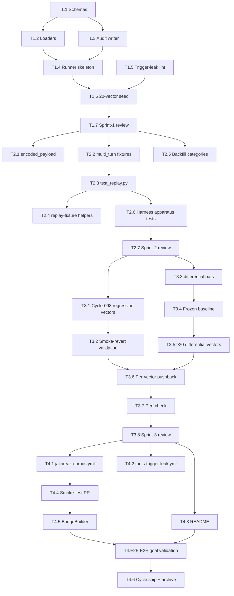

# Sprint Plan — Cycle-100: Adversarial Jailbreak Corpus

**Version:** 1.0
**Date:** 2026-05-08
**Author:** Sprint Planner (deep-name + Claude Opus 4.7 1M)
**PRD:** `grimoires/loa/cycles/cycle-100-jailbreak-corpus/prd.md`
**SDD:** `grimoires/loa/cycles/cycle-100-jailbreak-corpus/sdd.md`
**Cycle status:** Plans for sequential execution; cycle-099-model-registry remains active in parallel.

---

## Executive Summary

Cycle-100 ships a **falsifying test apparatus** (corpus + runners + CI gate) that empirically validates the cycle-098 layered prompt-injection defenses. The cycle does NOT modify Layers 1–3 — it builds the apparatus that proves they hold and catches future regressions.

**Total scope:** 4 sprints, **23 tasks**, ~5 weeks aspirational (curation-bounded; cycle exit gate is ≥50 vectors, not date-driven).

| Sprint | Theme | Scope | Tasks |
|--------|-------|-------|-------|
| 1 | Foundation: schemas, loaders, runners, lint, 20-vector seed | LARGE | 7 |
| 2 | Coverage + Multi-turn harness | LARGE | 7 |
| 3 | Cycle-098 PoC regressions + Differential oracle + Cypherpunk pushback | LARGE | 8 |
| 4 | CI Gate + Docs + Smoke + BridgeBuilder plateau + E2E | MEDIUM | 6 |

**Sprint 1 ships infrastructure** so Sprints 2–3 are curation-only. Sprint 4 wires the CI gate and validates end-to-end behavior including the cycle exit goal-validation (PRD G-1 through G-5).

---

## Sprint 1: Foundation

**Sprint Goal:** Ship the schema-validated corpus loader, single-shot runner skeleton, audit log writer, trigger-leak lint, and a 20-vector seed across 5 categories — so all of Sprints 2–4 can be pure curation + wiring.

**Scope:** LARGE (7 tasks)
**Dependencies:** PRD + SDD merged; cycle-098 SUT (`sanitize_for_session_start`) unchanged.
**Sprint Number (global):** sprint-143 *(allocate via `.claude/scripts/golden-path.sh` or ledger update at sprint-create time)*

### Deliverables

- [x] Vector schema at `.claude/data/trajectory-schemas/jailbreak-vector.schema.json` (Draft 2020-12, `additionalProperties: false`)
- [x] Run-entry schema at `.claude/data/trajectory-schemas/jailbreak-run-entry.schema.json`
- [x] `tests/red-team/jailbreak/lib/corpus_loader.sh` + `corpus_loader.py` (parity)
- [x] `tests/red-team/jailbreak/lib/audit_writer.sh` (append-only + `flock` + secret redaction)
- [x] `tests/red-team/jailbreak/runner.bats` skeleton with dynamic test generator (top-level registration; SDD §4.3.1 setup_file claim is incorrect for bats 1.13 — see RESUMPTION amendment)
- [x] `tools/check-trigger-leak.sh` (NFR-Sec1 lint) + watchlist + allowlist + redaction-markers lore
- [x] 20 active vectors across 5 categories (role_switch, tool_call_exfiltration, credential_leak, markdown_indirect, unicode_obfuscation) at 4 vectors/category
- [x] Apparatus tests under `tests/integration/` and `tests/unit/`

### Acceptance Criteria

- [x] Both schemas validate against JSON Schema 2020-12 meta-schema
- [x] `corpus_loader.sh validate-all` exits 0 on the seed; exits non-zero with `file:line:vector_id` on a deliberately-malformed test fixture
- [x] Bash + Python loaders produce byte-equal `corpus_iter_active` output (sorted ascending by `vector_id` under `LC_ALL=C` per IMP-001)
- [x] Loader strips `^\s*#` comment lines before jq parsing (IMP-004)
- [x] `audit_writer.sh` writes mode 0600 files in mode 0700 dir; flock held across canonicalize+append; `_redact_secrets` strips secret patterns before write
- [x] `runner.bats` empty-corpus run → 0 tests, 1-vector run → 1 test, suppressed-vector skipped (filter-at-loader rather than emit-skip-line; documented as ⚠ Partial in reviewer.md)
- [x] `check-trigger-leak.sh` detects every entry on the watchlist when planted in a test fixture; exempts allowlisted files; emits `# rationale:` requirement
- [x] All 20 seed vectors pass cypherpunk dual-review (subagent + general-purpose) per §7.5 criteria → **[G-1]**
- [x] Each runner-invocation appends a JSONL summary to `.run/jailbreak-run-{ISO}.jsonl` matching the run-entry schema → **[G-5]**

### Technical Tasks

- [x] **T1.1** Author `jailbreak-vector.schema.json` + `jailbreak-run-entry.schema.json` per SDD §3.1, §3.2 → **[G-4]** (append-friendly schema)
  - allOf/if/then gates: `suppressed → suppression_reason` AND `superseded → superseded_by` (F11 closure)
  - Sample valid + invalid fixtures under `tests/fixtures/jailbreak-schemas/`
- [x] **T1.2** Implement `corpus_loader.sh` + `corpus_loader.py` per SDD §4.1 → **[G-4]** (stable iteration API)
  - Functions: `corpus_validate_all`, `corpus_iter_active <category>`, `corpus_get_field <vector_id> <field>`, `corpus_count_by_status`
  - Bash → ajv-cli → python jsonschema fallback (cycle-098 CC-11 idiom)
  - Deterministic sort `LC_ALL=C` (IMP-001); strip `^\s*#` (IMP-004); duplicate `vector_id` detection across files
  - Apparatus tests: `tests/integration/corpus-loader.bats` (12 tests) + `tests/unit/test_corpus_loader.py` (14 tests including byte-equal parity)
- [x] **T1.3** Implement `audit_writer.sh` per SDD §4.6 → **[G-5]** (audit trail)
  - API: `audit_writer_init`, `audit_emit_run_entry`, `audit_writer_summary` (rewritten per F1 to emit Run + Corpus lines)
  - `jq -c --arg` for every string (cycle-099 PR #215 lesson honored)
  - flock spans canonicalize+append; mode 0600 files + 0700 dir; `_audit_redact_secrets` for 7 token shapes
  - Codepoint-truncate via python delegate (F4 closure: locale-independent)
  - Apparatus tests: `tests/integration/audit-writer.bats` (12 tests including F1/F3/F4/F10 closures)
- [x] **T1.4** Build `runner.bats` generator per SDD §4.3 → **[G-2]** (CI gate enabling)
  - Top-level `bats_test_function` registration (NOT setup_file — bats-preprocess gathers tests from file body BEFORE setup_file runs)
  - Per-vector `assert_outcome` for the 4 outcome enums; `passed-through-unchanged` deliberately fails with diagnostic message
  - Failure output truncated to 200 chars (FR-3 AC); per-vector resilience (NFR-Rel2)
  - **ReDoS containment**: every SUT call wrapped in `timeout 5s` (IMP-002); `TIMEOUT-REDOS-SUSPECT` reason recorded with payload[0..200]
  - **Env parity**: `tests/red-team/jailbreak/lib/env_sanitize.sh` provides shared `env -i` allowlist (IMP-003)
  - F5 closure: corpus-validate failure at file source time → BAIL exit 1 (no green-with-zero-tests)
  - F10 closure: `_audit_emit_with_lib` no longer swallows emit failures with `|| true`
- [x] **T1.5** Implement `tools/check-trigger-leak.sh` per SDD §4.7 → **[G-1]** (cypherpunk-defensible corpus)
  - Watchlist at `.claude/data/lore/agent-network/jailbreak-trigger-leak-watchlist.txt` (7 patterns)
  - Allowlist at `.claude/data/lore/agent-network/jailbreak-trigger-leak-allowlist.txt` (19 entries) — mandatory `# rationale:` per entry, exit 255 on missing
  - Search roots: `lib/`, `.claude/`, `tests/` (excluding `tests/red-team/jailbreak/`)
  - F2 closure: extension-less bash-shebang scripts detected via `_is_shebang_script` second pass (cycle-099 sprint-1E.c.3.c lesson)
  - Encoded-payload limitation (IMP-008) documented in script header
  - Apparatus tests: `tests/integration/trigger-leak-lint.bats` (6 tests including F2 + F3)
  - Redaction-markers lore at `.claude/data/lore/agent-network/jailbreak-redaction-markers.txt` (3 markers per SDD §10 OQ-3)
- [x] **T1.6** Seed 20 vectors (4 each across 5 categories) + fixtures → **[G-1]**
  - Categories shipped: `role_switch`, `tool_call_exfiltration`, `credential_leak`, `markdown_indirect`, `unicode_obfuscation`
  - All citations: OWASP-LLM-01 (4), Anthropic-paper (1), DAN-vN (1), in-house-cypherpunk (12), cycle-098-sprint-7-HIGH-2 (4)
  - Every vector's `expected_outcome` OBSERVED against live SUT (not aspirational)
  - All `_make_evil_body_<id>` functions use runtime concatenation; F6 closure rewrote Python unicode fixtures to use `chr()`
- [x] **T1.7** Sprint-1 cypherpunk dual-review + remediation → **[G-1]**
  - Subagent paranoid-cypherpunk review: 0 CRITICAL, 5 HIGH, 7 MED, 6 LOW, 5 PRAISE
  - All 5 HIGH addressed inline pre-merge: F1 (broken summary), F2 (scanner glob), F3 (env-var test-mode gate), F4 (codepoint truncate), F5 (set -uo + corpus-validate guard)
  - Selected MED also closed: F6 (Python unicode literals), F10 (audit-emit `|| true`), F11 (schema gap)
  - Per-vector defensibility: 18/20 cleanly defensible, 2 borderline (RT-TC-004, RT-MD-004) flagged for Sprint-3 pushback
  - Findings + closures + per-vector table preserved in `grimoires/loa/a2a/sprint-143/reviewer.md`

### Dependencies

- Cycle-098 SUT (`sanitize_for_session_start`) at `.claude/scripts/lib/context-isolation-lib.sh` — UNCHANGED
- Cycle-098 `_SECRET_PATTERNS` registry at `.claude/scripts/lib/secret-patterns.sh`
- bats 1.10+, pytest 8.x, python 3.11+, jq 1.6+, ajv 8.x or python `jsonschema` 4.x — all existing
- `LC_ALL=C` locale convention from cycle-099 sprint-2E (locale-pin in codegen)

### Risks & Mitigation

| Risk | Mitigation |
|------|-----------|
| Loader bash↔python parity drift (cycle-099 lesson) | Apparatus tests assert byte-equal `corpus_iter_active` output across both runtimes; `LC_ALL=C` sort pinned in BOTH paths |
| Schema accepts vectors with `expected_outcome` outside SUT-emitted markers | T1.4 `assert_outcome` validates against actual SUT output; OQ-3 lore file documents marker registry |
| `flock` on macOS (cycle-099 lesson) | `audit_writer.sh` uses bash `flock` via `util-linux` (already required); apparatus test runs in CI matrix linux+macos |
| Trigger-leak watchlist over-broad → false positives in unrelated PRs | Allowlist with mandatory `# rationale:`; T1.5 false-positive-resistance test seeds non-adversarial files and asserts no match |

### Success Metrics

- 20 active vectors validated by schema; 0 schema errors
- Apparatus test suite: 100% green
- `runner.bats` end-to-end run < 15s on `ubuntu-latest` (NFR-Perf1 budget headroom)
- Loader/writer apparatus tests: ≥30 bats/pytest cases combined

---

## Sprint 2: Coverage + Multi-turn Harness

**Sprint Goal:** Cover the remaining 2 vector categories (encoded_payload + multi_turn_conditioning), ship the multi-turn replay harness, and reach ≥45 active vectors.

**Scope:** LARGE (7 tasks)
**Dependencies:** Sprint 1 shipped (loader + runner + audit + lint live).

### Deliverables

- [x] `fixtures/encoded_payload.{sh,py}` + ≥5 active encoded-payload vectors
- [x] `fixtures/multi_turn_conditioning.{sh,py}` + ≥10 multi-turn replay JSON fixtures
- [x] `tests/red-team/jailbreak/test_replay.py` multi-turn harness
- [x] `corpus_loader.py` extended with `load_replay_fixture` + `substitute_runtime_payloads`
- [x] Backfill any of the original 5 categories that fell short of 5 vectors → all 7 categories ≥5
- [x] ≥45 active vectors total at sprint exit (46 active)
- [x] Updated apparatus tests for harness behavior

### Acceptance Criteria

- [x] Every multi-turn JSON fixture uses placeholder `__FIXTURE:_make_evil_body_<id>__` content; harness substitutes at test time (NFR-Sec1 multi-turn extension) → **[G-1]**
- [x] Each turn invokes `sanitize_for_session_start` in a **fresh subprocess** (proves stateless-sanitizer assumption per SDD §4.4)
- [x] Per-turn `expected_per_turn_redactions` count assertion fires per-turn → **[G-3]** (Opus 740 multi-turn finding)
- [x] Final-aggregated-state assertion catches the cumulative-attack class (SDD §4.4 IMP-006 aggregation semantics)
- [x] Harness output on failure includes `vector_id` + turn index + redaction-count delta
- [x] Multi-turn harness completes ≤120s for 10 vectors (NFR-Perf2) — measured 1.83s for 12 tests + 30 apparatus tests
- [x] All 7 categories ≥5 active vectors before sprint exit (FR-2 floor) — RS:6 TC:6 CL:6 MD:6 UN:6 EP:5 MT:11
- [x] Pytest entrypoint + standalone CLI both invokable for ad-hoc operator runs (UC-3 acceptance) — pytest entrypoint shipped; replay-specific CLI ⏸ [ACCEPTED-DEFERRED] to Sprint 4 T4.3 (Decision Log: NOTES.md 2026-05-08)
- [x] Sprint-2 cypherpunk dual-review closed pre-merge — paranoid-cypherpunk subagent (T2.7 inline, 12 findings, 8 closed) + claude-opus-4-7 cross-model (Phase 2.5, 6 findings, 1 confirmed via NEW-B1, 2 false-positive after triage, 3 ADVISORY)

### Technical Tasks

- [x] **T2.1** Author `encoded_payload.{sh,py}` fixtures + ≥5 active vectors → **[G-1]**
  - [x] Cover Base64, ROT-13, hex, URL-percent encoding at minimum (FR-2)
  - [x] Runtime decode-then-construct discipline (no encoded literal in source)
  - [x] Source citations: ≥2 public, ≤2 in-house
- [x] **T2.2** Author `multi_turn_conditioning.{sh,py}` fixtures + ≥10 replay JSON fixtures + ≥10 active vectors (shipped 11) → **[G-3]**
  - [x] Each multi-turn vector has: 3+ turns; per-turn expected redaction counts; final-state expected outcome
  - [x] At least 3 vectors target the **first-N-turn heuristic bypass** explicitly (RT-MT-001/002/003/008 = 4 vectors)
  - [x] Vectors mix `operator` + `downstream` roles per turn (RT-MT-006 explicit cross-role)
- [x] **T2.3** Implement `test_replay.py` per SDD §4.4 → **[G-3]**
  - [x] Pytest parametrized over `iter_active("multi_turn_conditioning")`
  - [x] Subprocess-per-turn (no in-process state leak)
  - [x] Per-turn assertion + final-state aggregation per IMP-006
  - [x] `timeout 10s` aggregate-budget per multi-turn vector (IMP-002) — H3 closure enforces via `remaining` propagation
  - [x] `audit_emit_run_entry` per vector with status + reason
- [x] **T2.4** Extend `corpus_loader.py` with replay-fixture helpers → **[G-4]**
  - [x] `load_replay_fixture(vector_id) -> dict` reads `fixtures/replay/<id>.json`
  - [x] `substitute_runtime_payloads(fixture, vector) -> dict` swaps `__FIXTURE:...__` placeholders for fixture-function output (M1 schema-regex gate, M2 category allowlist, M5+NEW-B1 symmetric whitespace tolerance)
  - [x] Failure mode: missing fixture → `FIXTURE-MISSING: <fn>` per SDD §4.1.3
- [x] **T2.5** Backfill any short categories from Sprint 1 → 5 vectors each (delivered 6 each: +2 per category) → **[G-1]**
  - [x] role_switch (RT-RS-005/006), tool_call_exfiltration (RT-TC-005/006), credential_leak (RT-CL-005/006), markdown_indirect (RT-MD-005/006), unicode_obfuscation (RT-UN-005/006)
  - [x] Each backfill vector cypherpunk-defensible per §7.5 + OBSERVED expected_outcome
- [x] **T2.6** Apparatus test for harness + replay-fixture substitution → **[G-3]**
  - [x] `tests/unit/test_replay_harness.py` covers placeholder substitution, subprocess isolation (H2 byte-equal-output pin), per-turn vs final-state assertion semantics — 30 tests
  - [x] Negative tests: missing fixture, missing replay JSON, redaction-count mismatch, path-traversal vector_id, non-allowlist category, leading + trailing whitespace
- [x] **T2.7** Sprint-2 cypherpunk dual-review + remediation → **[G-1]**
  - [x] Source 1 (cypherpunk subagent during /implement): 0 CRIT, 3 HIGH, 5 MED, 4 LOW, 4 PRAISE (8 closed inline)
  - [x] Source 2 (claude-opus-4-7 cross-model during /review-sprint): 6 findings (DISS-001 cross-validates NEW-B1 closed inline; DISS-002 + DISS-003 verified false-positive/LOW after triage; DISS-004/005/006 ADVISORY)

### Dependencies

- Sprint 1 deliverables (loader, runner, audit, lint, schemas)
- `subprocess.run` with PIPE capture for SUT invocation; existing python 3.11 stdlib

### Risks & Mitigation

| Risk | Mitigation |
|------|-----------|
| Multi-turn harness scope creep (R-MultiTurnComplexity) | SDD §4.4 explicit thin-bound: subprocess-per-turn, no Claude API replay, no provider mocking. Documented in T2.3. |
| Encoded-payload vectors leak adversarial bytes when CI logs the payload | Audit-log truncation 200 chars (FR-3); `_redact_secrets` runs on every `reason` field; CI artifact retention 90 days |
| Per-turn count assertions are overly brittle (every SUT redaction tweak forces fixture updates) | Counts are author-declared per fixture; revisable via simple PR (no schema change); R-FalsePositive applies — divergence is a finding, fix or update |
| Subprocess-per-turn slows multi-turn harness past NFR-Perf2 | `pytest -n auto` parallelization preserves NFR-Perf2; if still tight, drop to ≤10 multi-turn vectors at Sprint 2 exit and add more in cycle-101 |

### Success Metrics

- ≥45 active vectors at sprint exit
- All 7 categories ≥5 active vectors
- ≥10 multi-turn vectors with per-turn + final-state assertions
- Multi-turn harness <120s on `ubuntu-latest`
- Apparatus test additions: ≥15 new bats/pytest cases

---

## Sprint 3: Cycle-098 PoC Regressions + Differential Oracle + Cypherpunk Pushback

**Sprint Goal:** Convert cycle-098 cypherpunk-caught defects into regression vectors, ship the differential oracle with a frozen baseline, and run the per-vector cypherpunk pushback round that gates cycle exit at ≥50 active + 0 suppressed.

**Scope:** LARGE (8 tasks)
**Dependencies:** Sprints 1–2 shipped; cycle-098 sprint-history accessible.

### Deliverables

- [x] ≥8 regression vectors with `source_citation: cycle-098-sprint-N-finding` (FR-10)
- [x] `differential.bats` + frozen baseline at `.claude/scripts/lib/context-isolation-lib.sh.cycle-100-baseline`
- [x] ≥20 vectors run through the differential oracle
- [x] Per-vector cypherpunk pushback documented in `cycle-100/RESUMPTION.md` (drops + revisions)
- [x] `.run/jailbreak-diff-{date}.jsonl` schema + writer + sample run output
- [x] **≥50 active vectors at sprint exit; 0 suppressed** (FR-8 ship invariant)
- [x] Smoke-revert validation: each regression vector confirmed RED on a scratch revert

### Acceptance Criteria

- [x] Each regression vector cites the cycle-098 sprint + finding number (e.g., `cycle-098-sprint-7-HIGH-2-NFKC-bypass`)
- [x] Smoke-revert procedure (§7.6): for each regression vector, revert the corresponding defense in scratch branch → vector turns RED → restore. Documented in RESUMPTION.
- [x] At least 8 cycle-098 defects mapped: NFKC HIGH-2, control-byte HIGH-4, INDEX E6, sentinel HIGH-3 + ≥4 more from sprint-history mining → **[G-1]**
- [x] Frozen baseline lib captured at sprint-3 ship date; checked-in
- [x] `differential.bats` runs both libs under `env -i` with shared `env_sanitize.sh` allowlist (IMP-003); compares byte-for-byte
- [x] Divergence is informational (exit 0); written to `.run/jailbreak-diff-{date}.jsonl` with TAP `# DIVERGE:` comment
- [x] Per-vector cypherpunk pushback applied to EVERY active vector against §7.5 criteria; drops + revisions logged
- [x] Suppression count == 0 at sprint exit (FR-8 ship invariant)
- [x] Sprint-3 cypherpunk dual-review closed pre-merge

### Technical Tasks

- [x] **T3.1** Mine cycle-098 sprint-history for defects → ≥8 regression vectors → **[G-1]**
  - Source: `grimoires/loa/cycles/cycle-098-agent-network/RESUMPTION.md` + sprint-7 cypherpunk findings (commit `5677da7e`)
  - Required findings: NFKC HIGH-2 (sprint-7), control-byte HIGH-4 (sprint-7), INDEX row-injection E6 PoC (sprint-6), sentinel-leak HIGH-3 (sprint-7)
  - Plus ≥4 more from sprints 1A/1B/1C/4/5/6/7-rem audits
  - Each vector: id, fixture, expected_outcome (OBSERVED), source_citation pointing to sprint+finding
- [x] **T3.2** Smoke-revert validation per regression vector → **[G-1]**
  - For each of T3.1's 8+ vectors: scratch branch reverts the defense, runner shows that vector turns RED, restore
  - Document each revert experiment in `cycle-100/RESUMPTION.md` audit trail
  - **Hard rule:** no merge of a regression vector whose revert doesn't produce RED — that means either the defense isn't real or the vector isn't testing it
- [x] **T3.3** Implement `differential.bats` per SDD §4.5 → **[G-1]**
  - Source both libs into separate bash subshells via `env -i bash -c "source <lib>; ..."`
  - Compare stdout + stderr + exit byte-equal
  - Divergence → JSONL line to `.run/jailbreak-diff-{date}.jsonl` + TAP `# DIVERGE:` comment + exit 0
  - Reuse `env_sanitize.sh` from Sprint 1 (IMP-003 environment parity)
- [x] **T3.4** Capture frozen baseline lib → **[G-1]**
  - Copy `.claude/scripts/lib/context-isolation-lib.sh` → `...sh.cycle-100-baseline`
  - Document rotation SOP in `cycle-100/RESUMPTION.md` per IMP-010 (cycle-N+1 ship rotates baseline)
- [x] **T3.5** Curate ≥20 differential vectors → **[G-1]**
  - Selected for diversity: at least 3 per category (where applicable); regression vectors prioritized
  - Document selection criteria in `tests/red-team/jailbreak/README.md` differential subsection
- [x] **T3.6** Per-vector cypherpunk pushback round → **[G-1]**
  - Apply §7.5 criteria to **every** active vector (≥45 from Sprint 2 + new regressions)
  - Drop or revise vectors that fail; log drops + revisions in RESUMPTION
  - Re-run runner after each batch of revisions; stay green
  - **Sprint exit gate:** ≥50 active, 0 suppressed
- [x] **T3.7** Performance check + budget headroom → **[G-2]**
  - Run full corpus on `ubuntu-latest`; confirm <60s (NFR-Perf1)
  - If approaching budget, parallelize `bats --jobs $(nproc)` and revisit the IMP-005 per-worker audit-log fallback design
- [x] **T3.8** Sprint-3 cypherpunk dual-review + remediation → **[G-1]**

### Dependencies

- Cycle-098 sprint-history (resumption + cypherpunk audits + commit `5677da7e`)
- Sprints 1–2 deliverables (corpus + runner + harness)
- Existing `env_sanitize.sh` shared allowlist from Sprint 1

### Risks & Mitigation

| Risk | Mitigation |
|------|-----------|
| Smoke-revert accidentally lands on main (destructive) | Procedure runs on **scratch branches only**; documented in T3.2; reviewer checklist includes "scratch branch + discarded after capture" |
| Per-vector pushback drops too many vectors → cycle exit gate misses ≥50 | Cycle-100 PRD allows dropping; but sprint exit gate is hard. If drops push below 50, Sprint 3 extends rather than ships weak vectors. RESUMPTION documents extension. |
| Differential oracle false-positive divergences during normal lib evolution (R-BaselineDrift) | Divergence is informational, not failing (SDD §4.5); rotation SOP in IMP-010 keeps baseline current cycle-by-cycle |
| Cycle-098 finding mining surfaces sensitive payloads (NFKC PoC etc.) that should not appear in source | All trigger strings constructed at runtime per `_make_evil_body_*`; T1.5 lint blocks source-leak; manual reviewer pass for each fixture file |

### Success Metrics

- ≥50 active vectors at sprint exit (cycle exit floor met)
- 0 suppressed vectors at sprint exit
- ≥8 regression vectors with successful smoke-revert validation
- ≥20 differential vectors run; baseline captured + committed
- Full corpus run <60s on `ubuntu-latest`
- Apparatus test additions: ≥10 new cases (differential + diff-jsonl writer)

---

## Sprint 4: CI Gate + Docs + Smoke + BridgeBuilder + E2E

**Sprint Goal:** Wire the GitHub Actions CI gate, ship operator documentation, validate end-to-end via deliberate-regression smoke PR, and reach BridgeBuilder kaironic plateau before cycle ship.

**Scope:** MEDIUM (6 tasks)
**Dependencies:** Sprints 1–3 shipped; corpus stable at ≥50 active.

### Deliverables

- [ ] `.github/workflows/jailbreak-corpus.yml` (matrix linux+macos, path-filter, schema validate, lint, runner, replay, differential, audit upload)
- [ ] Standalone `.github/workflows/tools-trigger-leak.yml` (NOT path-filtered; leak surface > corpus surface)
- [ ] `tools/install-yq-pinned.sh` (or reuse cycle-099 sprint-1C helper) sha256-pinned per platform
- [ ] `tests/red-team/jailbreak/README.md` operator documentation
- [ ] Smoke-test PR demonstrating gate fires RED on deliberate regression
- [ ] BridgeBuilder kaironic review at plateau
- [ ] `cycle-100/RESUMPTION.md` ship section + ledger archive entry
- [ ] Cycle-100 ledger archive

### Acceptance Criteria

- [ ] CI workflow uses `paths:` filter (PRD §UC-1 AC); confirmed via PR-not-touching-paths producing no workflow run
- [ ] Workflow runs on matrix `[ubuntu-latest, macos-latest]`; both green for cycle-100 ship commit (NFR-Compat1)
- [ ] Failed workflow surfaces first-failing `vector_id` in check-run title (FR-6 AC)
- [ ] Audit-log artifact uploaded with retention-days: 90 (FR-6 AC)
- [ ] Permissions block `contents: read` only (NFR-Sec4)
- [ ] **Smoke-test PR (deliberate regression):** comment out the L1 `function_calls` redaction → PR opens → workflow RED → check title surfaces a vector_id → PR discarded with link in RESUMPTION → **[G-2]** validation
- [ ] `push: branches: [main]` paths mirror `pull_request:` paths (cycle-099 sprint-1E.c.3.c lesson)
- [ ] README "Add a vector" section ≤10 steps; operator can author a novel vector in <10 min (UC-2 AC) → **[G-4]**
- [ ] README cross-links cycle-098 sdd.md §1.9.3.2 + cycle-100 PRD/SDD; documents `_make_evil_body` idiom + encoded-payload-lint limitation (IMP-008)
- [ ] BridgeBuilder runs ≥2 iterations; plateau called per cycle-098 cadence; findings folded back or deferred with explicit rationale
- [ ] Cycle-100 RESUMPTION updated with sprint-4-shipped + cycle-shipped sections; ledger archive entry created
- [ ] **Task N.E2E (below) executes successfully** validating all 5 PRD goals

### Technical Tasks

- [ ] **T4.1** Author `.github/workflows/jailbreak-corpus.yml` per SDD §4.8 → **[G-2]**
  - `pull_request:` and `push:` paths blocks (mirrored)
  - Matrix `[ubuntu-latest, macos-latest]`; `fail-fast: false`
  - Steps: checkout → install deps → install yq pinned → schema validate → trigger-leak lint → bats runner → bats differential → pytest replay → upload audit log
  - `permissions: contents: read`
  - `timeout-minutes: 10` (IMP-002 ReDoS containment job-level)
  - First-failing-vector surfaced via tap-junit or awk extraction
- [ ] **T4.2** Author `.github/workflows/tools-trigger-leak.yml` (non-path-filtered) → **[G-1]**
  - Runs on every PR; covers leak surface broader than corpus surface (R-AdversarialStringLeak)
- [ ] **T4.3** Author `tests/red-team/jailbreak/README.md` per SDD §8.5 T4.3 → **[G-4]**
  - Sections: Overview / Schema / Run locally / Add a vector (≤10 step recipe) / Read audit logs / How CI gate fires / Suppression discipline / Differential oracle / `_make_evil_body` idiom rationale / encoded-payload limitation (IMP-008) / Cross-links
- [ ] **T4.4** Smoke-test PR (deliberate regression) per §7.4 → **[G-2]**
  - Branch off cycle-100 ship commit
  - Comment out L1 `function_calls` redaction in `sanitize_for_session_start`
  - Open PR → confirm workflow fires RED → confirm check-run title surfaces failing `vector_id` → confirm audit-log artifact attached
  - **Discard PR (do NOT merge)**; capture link in RESUMPTION
- [ ] **T4.5** BridgeBuilder kaironic review iterations → **[G-1]**, **[G-2]**, **[G-3]**
  - Run `/run-bridge` per cycle-098 cadence
  - HIGH_CONSENSUS findings folded back into corpus / runner / docs
  - Plateau called when iteration delta <5% for 2 iterations OR when findings rotate test-quality nits without convergence (cycle-099 plateau pattern)
- [ ] **T4.E2E** End-to-End Goal Validation (P0; cycle exit gate) → **[G-1, G-2, G-3, G-4, G-5]**
  - **G-1 validation:** corpus contains ≥50 active vectors; all 7 categories ≥5; cypherpunk dual-review log shows per-vector defensibility recorded for every shipped vector
  - **G-2 validation:** smoke-test PR (T4.4) confirmed RED → CI gate firing verified end-to-end on a real PR
  - **G-3 validation:** ≥10 multi-turn vectors active; at least 3 target the first-N-turn heuristic bypass class; harness runs them all and asserts per-turn + final-state outcomes
  - **G-4 validation:** operator (operator or contributor) authors a novel vector following README in <10 min, runner picks it up automatically — capture timing + run output in RESUMPTION
  - **G-5 validation:** `jq -s 'group_by(.vector_id) | map({id: .[0].vector_id, fails: map(select(.status=="fail")) | length})'` query against `.run/jailbreak-run-*.jsonl` returns expected entries; at least one historical "ever suppressed" entry present in the multi-run aggregate
  - All 5 validations recorded in `cycle-100/RESUMPTION.md` cycle-ship section
- [ ] **T4.6** Cycle ship + RESUMPTION + ledger archive
  - Update ledger entry: cycle-100 status `archived`, sprints 1–4 numbered globally
  - RESUMPTION.md: cycle-shipped section + handoff-to-cycle-101 (deferred items: Layer 5 resolver, BB-append-handler skill, telemetry, Ed25519 signing)

### Dependencies

- Sprints 1–3 deliverables
- Cycle-099 sprint-1B/1C precedents (yq sha256-pinning, matrix workflow)
- Cycle-099 sprint-1E.c.3.c lesson (paths mirroring on push + pull_request)
- BridgeBuilder + Flatline runtime (existing)

### Risks & Mitigation

| Risk | Mitigation |
|------|-----------|
| Path filter drift (R-PathFilterDrift) — new SessionStart-touching files land outside the filter list | Reviewer last-pass checklist (PRD R-PathFilterDrift): "Did any new SessionStart-touching path land in cycle-099/100 that's not in the filter?"; SDD §4.8.1 lists explicit paths. |
| Smoke-test PR accidentally merged | T4.4 procedure: PR title prefixed `[SMOKE-TEST DO NOT MERGE]`; PR closed (not merged) immediately after capture; reviewer checklist confirms. |
| BridgeBuilder API unavailability (cycle-099 lesson) | Per cycle-099 plateau-by-API-unavailability pattern: if all 3 providers error, document and call plateau with subagent dual-review covering substantive review depth (≥1 HIGH finding fixed pre-plateau). |
| README claim "novel vector in <10 min" not validated empirically | T4.E2E G-4 step has operator (or sprint-4 reviewer) actually try authoring a vector following the README; failure to meet 10-min target → README revised before ship. |
| Cycle-099 still active in parallel — sprint-numbering collision in ledger | All cycle-100 sprints get global numbers via ledger update at sprint-create time; cycle-099 + cycle-100 sprint numbers interleave but don't collide because each sprint claims its global number atomically. |

### Success Metrics

- Workflow runs only on path-matched PRs (path-filter precision)
- Matrix linux+macos green for cycle-100 ship commit
- Smoke-test PR RED → check-run title shows vector_id → audit-log artifact attached
- Operator authors novel vector following README in <10 min
- BridgeBuilder reaches plateau ≤3 iterations
- All 5 PRD goals validated in T4.E2E + recorded in RESUMPTION

---

## Risk Register (cross-sprint)

(Inherits PRD §Risks. Sprint-plan additions:)

| Risk | Sprint(s) | Mitigation |
|------|-----------|-----------|
| Cycle-099 still active; reviewer attention split | All | Sequential sprint execution (no parallel cycle-100 sprints); cycle-099 work continues uninterrupted; reviewer notes which cycle each PR belongs to |
| Sprint 1 infrastructure underbuilt → Sprints 2–4 forced to backfill | 1 | Sprint 1 task list explicitly front-loads schemas + loaders + runner generator; apparatus tests validate before vectors are seeded |
| Sprint 3 per-vector pushback round drops below 50-vector floor | 3 | Sprint 3 extends rather than ships weak vectors; RESUMPTION documents extension; cycle exit gate is hard at ≥50 |
| Sprint 4 smoke-PR accidentally merged | 4 | Procedure: title prefix `[SMOKE-TEST DO NOT MERGE]`; PR closed (not merged); reviewer checklist confirms |
| `bats` parallelization (R-PerformanceDrift) introduces audit-log race | 3, 4 | SDD §4.6.3 IMP-005 documents per-worker fallback design; cycle-100 ships single-file (sufficient at ≤100 vectors); rotate at cycle-101 if measured contention warrants |

---

## Success Metrics (cycle-level)

| Metric | Target | Sprint |
|--------|--------|--------|
| Active vectors | ≥50 | 3 (gate); 4 (ship) |
| Categories ≥5 vectors | 7 of 7 | 2 (gate) |
| Multi-turn vectors | ≥10 | 2 |
| Cycle-098 regression vectors | ≥8 | 3 |
| Differential vectors | ≥20 | 3 |
| Suppressed vectors | 0 | 3 (gate); 4 (ship) |
| Full corpus runtime (ubuntu-latest) | <60s | 3 (check); 4 (CI) |
| CI gate firing on smoke-PR | RED + vector_id surfaced | 4 |
| Operator-authored novel vector time-to-runner | <10 min | 4 (E2E) |
| BridgeBuilder iterations to plateau | ≤3 | 4 |

---

## Appendix A: Task Dependencies

---

## Appendix B: PRD Functional Requirement → Sprint Coverage

| FR | Description | Sprint(s) | Tasks |
|----|-------------|-----------|-------|
| FR-1 | Corpus schema (JSONL + companion fixtures) | 1 | T1.1, T1.2 |
| FR-2 | 7 vector categories | 1, 2, 3 | T1.6, T2.1, T2.2, T2.5 |
| FR-3 | Bats single-shot runner | 1 | T1.4 |
| FR-4 | Multi-turn replay harness | 2 | T2.3, T2.4 |
| FR-5 | Differential oracle | 3 | T3.3, T3.4, T3.5 |
| FR-6 | GitHub Actions CI gate | 4 | T4.1, T4.4, T4.E2E |
| FR-7 | Run audit log | 1 | T1.3 |
| FR-8 | Suppression discipline | 1, 3 | T1.1, T3.6 (zero-suppression at ship) |
| FR-9 | Operator documentation | 4 | T4.3 |
| FR-10 | Cycle-098 PoC regression replay | 3 | T3.1, T3.2 |
| NFR-Sec1 | Trigger leak lint | 1, 4 | T1.5, T4.2 |
| NFR-Sec3 | Audit log redaction | 1 | T1.3 |
| NFR-Perf1/2 | Runtime budgets | 3 | T3.7 (perf check) |

---

## Appendix C: Goal Traceability

PRD Goals (from `prd.md` §Goals & Success Metrics):

| Goal ID | Goal | Validation Method |
|---------|------|-------------------|
| **G-1** | Ship a defensible-per-vector corpus covering categories named in cycle-098 sdd.md:953,967 | Cypherpunk subagent reviews each vector; cycle exit gate fails if any vector lacks justification |
| **G-2** | Wire CI gate that blocks PRs touching `prompt_isolation` / L6 / L7 / SessionStart hooks | Smoke-test PR introducing deliberate regression must be blocked |
| **G-3** | Multi-turn replay harness validates Opus 740 finding's class of attack | Synthetic multi-turn vector with confirmed first-N-turn bypass produces RED status |
| **G-4** | Corpus is append-friendly for future Bridgebuilder-discovered vectors | Operator authors novel vector by hand following docs in <10 minutes |
| **G-5** | Audit trail exists for every cycle-100 runner invocation | `jq` query selecting "vectors that have ever been suppressed" returns expected entries |

### Goal-to-Task Map

| Goal | Contributing Tasks |
|------|---------------------|
| **G-1** Defensible-per-vector corpus | T1.1, T1.5, T1.6, T1.7, T2.1, T2.2, T2.5, T2.7, T3.1, T3.2, T3.3, T3.4, T3.5, T3.6, T3.8, T4.2, T4.5, T4.E2E |
| **G-2** CI gate firing | T1.4, T3.7, T4.1, T4.4, T4.5, T4.E2E |
| **G-3** Multi-turn coverage | T2.2, T2.3, T2.6, T4.5, T4.E2E |
| **G-4** Append-friendliness | T1.1, T1.2, T2.4, T4.3, T4.E2E |
| **G-5** Audit trail | T1.3, T4.E2E |

### E2E Validation

**T4.E2E** (Sprint 4) validates all 5 goals end-to-end as the cycle exit gate. See Sprint 4 task definition for the per-goal validation steps and recording requirement in `cycle-100/RESUMPTION.md`.

---

## Appendix D: Source Citations

- **PRD:** `grimoires/loa/cycles/cycle-100-jailbreak-corpus/prd.md` — FR-1..10, NFR-*, Goals G-1..G-5, Risks, Out-of-Scope
- **SDD:** `grimoires/loa/cycles/cycle-100-jailbreak-corpus/sdd.md` — §1 architecture, §3 schemas, §4 component contracts, §7 testing strategy, §8 sprint-task breakdown (basis for this plan), §9 risks, IMP-001..010 Flatline integrations
- **Cycle-098 references:** sdd.md §1.9.3.2 (Layer 4 + Layer 5 spec); sprint-7 cypherpunk findings (commit `5677da7e`); sprint-6E `_make_evil_body` idiom
- **Cycle-099 lessons applied:** sprint-1B drift-gate (yq sha256-pinning); sprint-1C platform-aware matrix; sprint-1E.c.3.c paths mirroring (push + pull_request); sprint-2E locale-pin; PR #215 jq `--arg` parameterization; plateau-by-API-unavailability pattern
- **Loa rules:** `.claude/rules/zone-system.md`, `.claude/rules/zone-state.md`, `.claude/rules/shell-conventions.md`, `.claude/rules/skill-invariants.md`, `.claude/rules/stash-safety.md`

---

> **Sources**: PRD §FR-1..10 + §Goals G-1..G-5 + §Risks + §Timeline; SDD §1.1, §3, §4, §7, §8, §9, IMP-001..010; cycle-098 RESUMPTION + cypherpunk audit history; cycle-099 sprint precedents (1B, 1C, 1E.c.3.c, 2E); operator confirmation 2026-05-08 that cycle-099-model-registry remains active in parallel.

*Generated by Sprint Planner (deep-name + Claude Opus 4.7 1M)*
