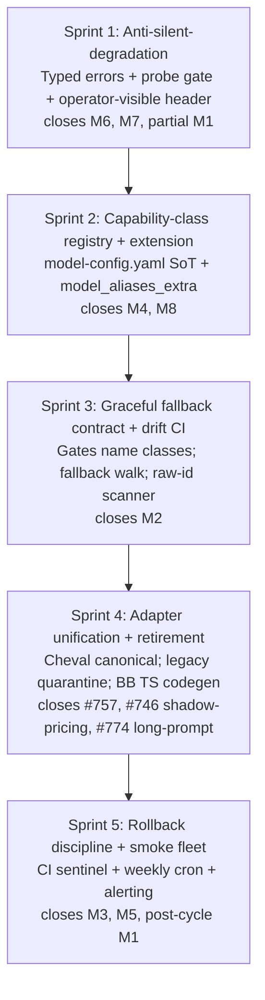
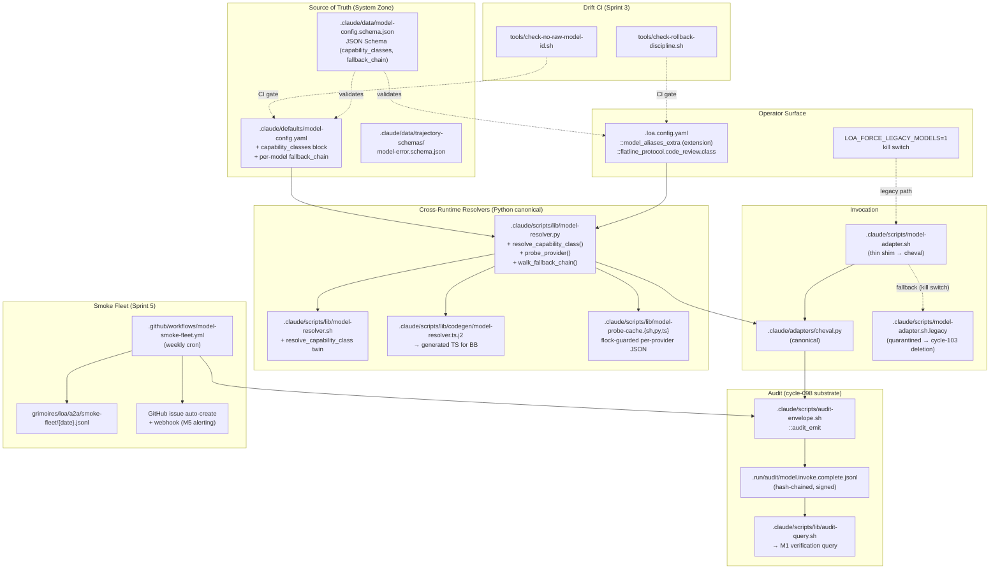

# SDD — cycle-102: Loa Model-Integration FAANG-Grade Stabilization

> **Sources**: `grimoires/loa/cycles/cycle-102-model-stability/prd.md` (15 operator decisions L1-L15 locked, 5 sprints, M1-M8 invariants, R1-R8 risks); cycle-099 substrate (`.claude/scripts/lib/model-resolver.{sh,py}`, `.claude/scripts/lib/codegen/model-resolver.ts.j2`, `.claude/scripts/generated-model-maps.sh`, `.claude/defaults/model-config.yaml`, `.claude/data/trajectory-schemas/model-aliases-extra.schema.json`); cycle-098 audit envelope (`.claude/scripts/audit-envelope.sh::audit_emit/audit_emit_signed/audit_recover_chain`); cycle-095 redactor (`.claude/scripts/lib/log-redactor.sh`); cycle-095 endpoint validator; bedrock provider plugin (#652).
>
> **Convention**: every PRD-grounded section anchors to PRD § or AC ID. Every choice not pinned in the PRD is tagged `[ASSUMPTION]` and is falsifiable in the post-completion debrief (see §13).

## 0. Document Purpose & Reading Order

This SDD is the technical blueprint for `/sprint-plan` consumption. It does **not** re-litigate decisions captured in `prd.md §0` (L1-L15) — those are inputs. It specifies:

1. The 5-sprint shipping order's component map (§1).
2. The new modules and the exact file paths they land at, plus their cross-runtime contracts (§3-§5).
3. The schemas + audit envelope events (§6).
4. The drift-CI gate's scope (§7).
5. Migration / rollback sequencing (§8).
6. The test surfaces per sprint (§9).
7. NFRs traced to PRD M1-M8 (§10).
8. Open questions deferred to `/sprint-plan` (§11).

Engineers reading this for sprint-N implementation: jump to §3 → §6 → §9 for that sprint's deliverables.

---

## 1. System Overview

### 1.1 The diff (what changes vs. what stays)

cycle-102 is **NOT** a rewrite. It is a stabilization layer on the cycle-095/099 substrate. The architectural diff against today's `main`:

| Surface | Before cycle-102 | After cycle-102 ship |
|---|---|---|
| **Source of truth** | `model-config.yaml` partial; cheval Python authoritative; bash adapter has its own arrays; BB TS hand-edits `truncation.ts` | `model-config.yaml` is the only registry; bash + BB TS read via codegen; legacy bash quarantined |
| **Failure mode** | Silent fallback (cd4abc1f rollback dropped from triad to single-Opus, only operator footnote noticed) | Typed error class on every failure; operator-visible PR-comment header on every degraded run |
| **Capability addressing** | Gates name model IDs (`gpt-5.5-pro`) | Gates name capability classes (`top-reasoning`); class → ordered fallback chain |
| **Operator extensibility** | Adding a new vendor requires `.claude/` PR (System Zone) | `.loa.config.yaml::model_aliases_extra` lands new vendor without System Zone touch |
| **Probe gate** | None at invoke time (only optional load-time `probe_required` flag) | Per-call probe with 60s file-cache; failed providers excluded with WARN |
| **Smoke fleet** | None | Weekly GH Actions cron pings every (provider, model); deltas → JSONL + auto-issue |
| **Rollback hygiene** | Comments accumulate; `# Restore … after #XXX` ages forever | CI sentinel fails on >7d stale rollback comments without tracking issue |
| **Drift detection** | Cycle-099's `tools/check-no-raw-curl.sh` for curl only | Sister scanner `tools/check-no-raw-model-id.sh` for hardcoded model IDs |

### 1.2 Sprint-to-component map

Each sprint ships a **vertical slice** that closes one or more PRD invariants (M1-M8) end-to-end. The sprint order is the dependency order: Sprint 1's typed-error envelope is a precondition for Sprint 2's class registry; Sprint 2's registry is a precondition for Sprint 3's gate refactor; Sprint 3's class addressing is a precondition for Sprint 4's adapter retirement; Sprint 5's smoke fleet validates the whole stack.



### 1.3 Component overview (post-cycle)



### 1.4 Architectural pattern

**Layered with cross-runtime canonicalization** (cycle-099 precedent). Python is canonical; bash + TS are derivative twins maintained by codegen + parity gates. This pattern is **not new in cycle-102** — sprint-1B/1D/2D already established it. cycle-102 extends three modules under the same discipline:

1. `model-resolver.{sh,py,ts.j2}` — adds `resolve_capability_class()` + `walk_fallback_chain()`.
2. `model-probe-cache.{sh,py,ts}` — **NEW** — flock-guarded JSON cache library (mirrors cycle-099 `lib/jcs.{sh,py,mjs}` mechanically).
3. `log-redactor.{sh,py}` — REUSED unchanged on `error.message_redacted`.

**Why this pattern**: cycle-099 retro proved that any cross-runtime drift in resolver semantics produces silent miscalls (the very class of failure cycle-102 is closing). The byte-equality gate (Python ↔ bash ↔ TS) is non-negotiable.

---

## 2. Software Stack

> Sources: cycle-098/099 inheritance; PRD §7.2 dependencies; PRD §5.6 composability.

### 2.1 Versions (no new dependencies)

| Component | Version | Justification |
|---|---|---|
| Python | 3.13 (3.11+ supported) | cheval canonical; existing `loa_cheval` package |
| bash | 4.0+ (associative arrays) | All resolver twins; cycle-095/099 baseline |
| Node TS | tsx ^4.21.0 | BB codegen target (cycle-099 sprint-1A pin) |
| yq | v4.52.4 (sha256-pinned) | cycle-099 sprint-1B pin; reused for codegen |
| Jinja2 | 3.x | TS codegen template engine (cycle-099 sprint-1E.c.1 + 2D.c) |
| jq | 1.6+ | JSON canonicalization in audit envelope (cycle-098 sprint-1) |
| `gh` CLI | latest | Smoke-fleet alerting + L5 inheritance |
| flock | util-linux | Probe-cache concurrency guard (BSD/macOS via `brew install util-linux`) |
| GitHub Actions | `actions/checkout@v4`, `actions/setup-python@v5` | Smoke-fleet workflow runner |

**No new runtime dependencies**. All net-new code uses libraries already pinned by cycles 095/098/099.

### 2.2 Reused libraries (with explicit composition points)

| Library | File | cycle-102 use |
|---|---|---|
| `audit_emit` | `.claude/scripts/audit-envelope.sh` | Emits `model.invoke.complete`, `smoke.fleet.run`, `class.resolved` events |
| `audit_emit_signed` | same | Sprint 5 smoke-fleet runs in CI; signature reserved if `LOA_AUDIT_SIGNING_KEY_ID` set |
| `audit_recover_chain` | same | M1 audit query graceful recovery |
| `_redact` | `.claude/scripts/lib/log-redactor.sh` | Applied to `error.message_redacted` field (NFR-Sec-1) |
| `redact_url` (Python) | `.claude/scripts/lib/log-redactor.py` | Cheval adapter Python equivalent |
| `endpoint_validator__guarded_curl` | `.claude/scripts/lib/endpoint-validator.sh` | Probe-gate HTTP requests (NFR-Sec-4) |
| `cost_check_budget` | `.claude/scripts/lib/cost-budget-enforcer-lib.sh` | Pre-invocation budget gate; subscription shadow-pricing contributes (AC-4.6) |
| `is_protected_class` | (cycle-098 protected-class router) | `model_aliases_extra` schema-version bumps protected-classed |
| Resolver maps | `.claude/scripts/generated-model-maps.sh` | Sourced by bash twin; codegen unchanged from cycle-099 |

**Iron grip rule**: cycle-102 introduces no new audit primitive. Every observable side effect rides cycle-098's `audit_emit`. If a finding seems to require a new primitive, escalate — don't quietly invent one.

---

## 3. Capability-Class Registry (Sprint 2 anchor)

> Sources: PRD AC-2.1, AC-2.2, AC-2.4, L2 (registry+extension same PR), Flatline HC4 (capability-property taxonomy).

### 3.1 Data model

`model-config.yaml` gains a top-level `capability_classes:` block, **siblings to** `providers:` (not nested). Per-model `fallback_chain` is **per-class**, not per-vendor — i.e., a model can belong to multiple classes and have a different fallback within each.

```yaml
# .claude/defaults/model-config.yaml (Sprint 2)

schema_version: "2.0.0"   # bumped from 1.x; migration helper at AC-5.5

# Existing top-level keys preserved: providers, tier_groups, routing, retry, metering, defaults

capability_classes:
  top-reasoning:
    description: "Frontier reasoning-class models. ≥200K context, deep reasoning, high latency tier."
    properties:
      min_context_window: 200000
      reasoning_depth: deep             # enum: shallow | mid | deep
      vision_support: optional          # enum: required | optional | forbidden
      tool_support: required
      latency_tier: high                # enum: low | mid | high
      cost_tier: high                   # enum: low | mid | high
    primary: anthropic:claude-opus-4-7
    fallback_chain:
      - anthropic:claude-opus-4-7       # primary repeated for explicit ordering
      - openai:gpt-5.5-pro
      - google:gemini-3.1-pro

  top-non-reasoning:
    description: "Frontier general-purpose models without explicit deep reasoning."
    properties:
      min_context_window: 128000
      reasoning_depth: mid
      vision_support: optional
      tool_support: required
      latency_tier: mid
      cost_tier: mid
    primary: anthropic:claude-sonnet-4-6
    fallback_chain:
      - anthropic:claude-sonnet-4-6
      - openai:gpt-5.5
      - google:gemini-3-flash

  top-stable-frontier:
    description: "Frontier models that have been on probe AVAILABLE for ≥30 days."
    # … (additional classes per PRD AC-2.1)

  top-preview-frontier:
    # …

  headless-subscription:
    description: "Subscription-billed providers (Codex headless, Claude Code, etc.). Shadow pricing required (AC-4.6)."
    primary: openai:gpt-5.3-codex
    fallback_chain:
      - openai:gpt-5.3-codex
      - anthropic:claude-opus-4-7       # pay-per-token degradation if subscription unavailable
```

**Why capability-property-based, not vendor-lineage-based** (Flatline HC4 closure): when OpenAI ships gpt-5.6 and renames the gpt-5.5 line, the property bundle (`min_context_window: 200000, reasoning_depth: deep, …`) survives. The class definition is the contract; the `fallback_chain` is implementation detail edited at upgrade time.

**Class-vs-tier-groups relationship**: existing `tier_groups.mappings` (line 426-449 of model-config.yaml) is **not removed** in Sprint 2. It is the user-friendly per-skill alias surface (`max | cheap | mid | tiny`). Capability classes are the **gate-language surface** (`top-reasoning | top-non-reasoning | …`). Sprint 3 adds an internal mapping `tier_groups.mappings.<tier>.<provider>` → `capability_classes.<class>` so `tier_groups` is rendered as a derived view of `capability_classes`. [ASSUMPTION-1] this layering is acceptable; if not, sprint plan reconciles to a single surface.

### 3.2 Schema

`.claude/data/model-config.schema.json` gains:

```jsonc
{
  "$schema": "https://json-schema.org/draft/2020-12/schema",
  "$id": "loa://schemas/model-config/v2.0.0",
  "type": "object",
  "required": ["schema_version", "providers", "capability_classes"],
  "properties": {
    "schema_version": { "const": "2.0.0" },
    "capability_classes": {
      "type": "object",
      "minProperties": 1,
      "patternProperties": {
        "^[a-z][a-z0-9-]{1,63}$": {
          "type": "object",
          "additionalProperties": false,
          "required": ["description", "primary", "fallback_chain"],
          "properties": {
            "description": { "type": "string", "minLength": 8 },
            "properties": { "$ref": "#/$defs/CapabilityProperties" },
            "primary": { "$ref": "#/$defs/ProviderModelRef" },
            "fallback_chain": {
              "type": "array",
              "minItems": 2,            // M4: ≥2-deep
              "items": { "$ref": "#/$defs/ProviderModelRef" },
              "uniqueItems": true       // FR-3.5: cycle prevention at schema layer
            }
          }
        }
      }
    }
  },
  "$defs": {
    "ProviderModelRef": {
      "type": "string",
      "pattern": "^[a-z][a-z0-9_]*:[a-zA-Z0-9._-]+$",
      "description": "provider:model_id form. Cross-reference validated at config load (AC-2.5)."
    },
    "CapabilityProperties": {
      "type": "object",
      "additionalProperties": false,
      "properties": {
        "min_context_window": { "type": "integer", "minimum": 1024 },
        "reasoning_depth": { "enum": ["shallow", "mid", "deep"] },
        "vision_support": { "enum": ["required", "optional", "forbidden"] },
        "tool_support": { "enum": ["required", "optional", "forbidden"] },
        "latency_tier": { "enum": ["low", "mid", "high"] },
        "cost_tier": { "enum": ["low", "mid", "high"] }
      }
    }
  }
}
```

**Cross-reference validation** (AC-2.5, gemini IMP-004): at config load, every entry in every `fallback_chain` MUST exist in `providers.<p>.models.<id>`. Missing reference = exit 2 with `[MODEL-CONFIG-LOAD-ERROR] capability_class '<class>' fallback_chain[<i>] '<ref>' not found in providers registry`.

**Cycle prevention** (AC-2.5, Flatline HC7): `uniqueItems: true` at schema layer plus runtime visited-set in `walk_fallback_chain()` (§5.3).

### 3.3 Per-model required fields (AC-2.2 extension)

Existing fields kept. Sprint 2 adds:

| Field | Type | Notes |
|---|---|---|
| `endpoint_family` | enum: `chat` \| `responses` \| `messages` \| `bedrock` \| ... | Already partially deployed (cycle-095 sprint-1); now mandatory |
| `params.temperature_supported` | bool | Already exists for gpt-5.5-pro |
| `per_call_timeout_seconds` | int | Existing default in `defaults.read_timeout`; now per-model overridable |
| `pricing.input_per_mtok` / `pricing.output_per_mtok` | int (micro-USD) | Existing |
| `shadow_pricing.input_per_mtok` / `shadow_pricing.output_per_mtok` | int (micro-USD), optional | **NEW**, AC-4.6 — for subscription-billed providers. **Tracked SEPARATELY from `cost_micro_usd`** (Flatline HC1 — gemini SKP-003 closure): audit emits `cost_micro_usd: 0` for subscription invocations; `shadow_cost_micro_usd: <accumulated>` is a parallel field. L2 cost-gate uses `cost_micro_usd` ONLY (real spend), never decrements based on shadow. Quota dashboards aggregate `shadow_cost_micro_usd` separately. Premature `BUDGET_EXHAUSTED` from fake spend is impossible by construction. |
| `probe_required` | bool | Existing; load-time gate; coexists with invoke-time probe |
| `context.truncation_coefficient` | float | Existing in BB codegen; now in SoT |

**Bedrock provider plugin (#652) integration (REVISED per Flatline B2 — gemini SKP-002 CRIT 850)**: `endpoint_family: bedrock` is added to the enum. Bedrock-routed models declare `provider: bedrock` (top-level provider key). The capability-class taxonomy is **vendor-agnostic** — a Bedrock-routed Claude appears in `top-reasoning.fallback_chain` as `bedrock:anthropic-claude-opus-4-7` alongside `anthropic:claude-opus-4-7`.

**AWS auth strategy (was missing; Flatline B2 closure)**: per-provider `auth` field in registry distinguishes auth modes:

```yaml
providers:
  bedrock:
    type: bedrock
    auth:
      mode: sigv4_aws                        # NOT bearer_env
      region: "{env:AWS_REGION:us-east-1}"   # required, env-resolvable
      credentials_chain: [iam_role, profile, env]   # boto3-style chain
      iam_role_arn: "{env:LOA_BEDROCK_IAM_ROLE_ARN:}"   # optional
      profile: "{env:AWS_PROFILE:default}"   # optional
```

Auth-strategy implementation:
- Python (cheval): `boto3` SDK handles SigV4 signing + credential-chain resolution natively.
- Bash: invoke Python helper `.claude/scripts/lib/bedrock-sigv4-sign.py` to sign the curl payload (avoids re-implementing SigV4 in bash). Helper outputs the signed `Authorization` header to stderr; bash sources via process substitution.
- TS (BB adapter): use `@aws-sdk/client-bedrock-runtime` package directly OR delegate to cheval-Python.

Schema bump:
- `provider.auth.mode: enum [bearer_env, sigv4_aws, apikey_env]` REQUIRED (was implicit `bearer_env`).
- `provider.auth.region: string` REQUIRED when mode=sigv4_aws.
- `provider.auth.credentials_chain: [string]` OPTIONAL (defaults to `[iam_role, profile, env]`).
- `provider.auth.iam_role_arn: string` OPTIONAL.
- `provider.auth.profile: string` OPTIONAL.

**[ASSUMPTION-2 RESOLVED]**: Bedrock requires SigV4 (NOT Bearer) and per-region routing. Schema extension above closes the gap. Sprint 2 task adds Python helper + bash bridge; Sprint 4 ensures cheval canonical path validates against #652 plugin contract.

### 3.4 `model_aliases_extra` extension surface (AC-2.3, L8)

Existing schema at `.claude/data/trajectory-schemas/model-aliases-extra.schema.json` (cycle-099 sprint-2A). cycle-102 extends it:

```jsonc
{
  "$schema": "https://json-schema.org/draft/2020-12/schema",
  "$id": "loa://schemas/model-aliases-extra/v2.0.0",
  "type": "object",
  "additionalProperties": false,
  "required": ["schema_version"],
  "properties": {
    "schema_version": { "const": "2.0.0" },
    "entries": {
      "type": "array",
      "items": { "$ref": "#/$defs/ModelExtra" }
    },
    "capability_classes_extra": {
      "type": "object",
      "patternProperties": { "^[a-z][a-z0-9-]{1,63}$": { "$ref": "model-config.schema.json#/$defs/CapabilityClass" } },
      "description": "Operator-defined capability classes. Register-only; collisions on class name with .claude/defaults/model-config.yaml = load-time exit 2."
    }
  }
}
```

**Register-only semantics** (L8): on collision against `model-config.yaml`'s `capability_classes` OR `providers.<p>.models.<id>`, loader exits 2 with `[MODEL-CONFIG-LOAD-ERROR] model_aliases_extra collision: '<key>' already defined in defaults`.

**Why extension over override**: an override mechanism creates a hidden mutation surface that breaks the SoT invariant M2. Operator opt-in to a *new* class that the default registry doesn't know about is the supported path; modifying a default class requires a System Zone PR.

---

## 4. Anti-Silent-Degradation: Typed Errors + Probe Gate (Sprint 1 anchor)

> Sources: PRD AC-1.1, AC-1.2, AC-1.5, AC-1.6, AC-1.7, M1, M6, M7, B1+B2 closure.

### 4.1 Typed error taxonomy (AC-1.1)

`model-error.schema.json` lands at `.claude/data/trajectory-schemas/model-error.schema.json`:

```jsonc
{
  "$schema": "https://json-schema.org/draft/2020-12/schema",
  "$id": "loa://schemas/model-error/v1.0.0",
  "type": "object",
  "additionalProperties": false,
  "required": ["error_class", "severity", "message_redacted", "provider", "model"],
  "properties": {
    "error_class": {
      "enum": [
        "TIMEOUT", "PROVIDER_DISCONNECT", "BUDGET_EXHAUSTED",
        "ROUTING_MISS", "CAPABILITY_MISS", "DEGRADED_PARTIAL",
        "FALLBACK_EXHAUSTED", "PROVIDER_OUTAGE",
        "LOCAL_NETWORK_FAILURE", "UNKNOWN"
      ]
    },
    "severity": { "enum": ["WARN", "ERROR", "BLOCKER"] },
    "message_redacted": { "type": "string", "maxLength": 8192 },
    "provider": { "type": "string", "minLength": 1 },
    "model": { "type": "string", "minLength": 1 },
    "retryable": { "type": "boolean" },
    "fallback_from": { "type": "string" },
    "fallback_to": { "type": "string" },
    "original_exception": { "type": "string", "description": "Only populated for error_class=UNKNOWN — full stacktrace for triage" },
    "ts_utc": { "type": "string", "format": "date-time" }
  }
}
```

**Severity ↔ exit code mapping** (PRD L1 closure, refactored from B1):

| Scenario | Severity | Exit code | Audit field |
|---|---|---|---|
| Successful primary call | n/a | 0 | `models_failed: []` |
| Primary failed + fallback succeeded | WARN | 0 | `models_failed[0]` populated; `operator_visible_warn: true` |
| Probe-itself failed (network down) | WARN | 0 | `error_class: LOCAL_NETWORK_FAILURE` (advisory; invocation proceeded) |
| Chain exhausted (primary + all fallbacks failed; quota cause) | BLOCKER | 6 | `error_class: BUDGET_EXHAUSTED` (matches cheval EXIT_CODES["BUDGET_EXCEEDED"]=6) |
| Chain exhausted (network/503 cause) | BLOCKER | 1 | `error_class: PROVIDER_OUTAGE` |
| Chain exhausted (no remaining models) | BLOCKER | 1 | `error_class: FALLBACK_EXHAUSTED` |
| Config error (class not found / bad fallback ref) | BLOCKER | 2 | `error_class: ROUTING_MISS` |
| Capability class declared but no model meets properties | BLOCKER | 2 | `error_class: CAPABILITY_MISS` |
| Unknown — log full stacktrace | BLOCKER | 1 | `error_class: UNKNOWN`; `original_exception` populated |

**Mapping cheval exceptions → error_class** (cheval.py:60-75 lines establishing existing exit codes):

| cheval exception | error_class | Notes |
|---|---|---|
| `BudgetExceededError` | `BUDGET_EXHAUSTED` | exit 6 (existing) |
| `ProviderUnavailableError` | `PROVIDER_OUTAGE` | exit 1 |
| `RetriesExhaustedError` | `PROVIDER_DISCONNECT` | exit 1 |
| `RateLimitError` | `PROVIDER_OUTAGE` | exit 1; retryable: true |
| `ContextTooLargeError` | `CAPABILITY_MISS` | exit 7 |
| `ConfigError` | `ROUTING_MISS` | exit 2 |
| `InvalidInputError` / `InvalidConfig` | `ROUTING_MISS` | exit 2 |
| `ChevalError` (subclass that's not above) | `UNKNOWN` | exit 1; `original_exception` populated |

cheval.py's existing `_error_json` (line 78) is extended to emit `error_class` field; the field becomes part of the stderr JSON contract that the bash shim consumes (§4.5).

### 4.2 Probe-gate library: `model-probe-cache.{sh,py,ts}` (AC-1.2)

**New cross-runtime trio**, mirroring cycle-099's `lib/jcs.{sh,py,mjs}` discipline.

#### 4.2.1 Storage layout

```
.run/model-probe-cache/
├── openai.json            # 0600, flock-guarded
├── anthropic.json
├── google.json
└── bedrock.json
```

Per-provider JSON shape:

```json
{
  "schema_version": "1.0.0",
  "provider": "openai",
  "last_probe_ts_utc": "2026-05-09T14:23:01.123456Z",
  "ttl_seconds": 60,
  "outcome": "AVAILABLE",
  "models_probed": {
    "gpt-5.5-pro": { "ttl_until_utc": "2026-05-09T14:24:01Z", "outcome": "AVAILABLE", "latency_ms": 412 },
    "gpt-5.3-codex": { "ttl_until_utc": "2026-05-09T14:24:01Z", "outcome": "AVAILABLE", "latency_ms": 387 }
  },
  "last_failure": null
}
```

#### 4.2.2 Public API (Python canonical)

```python
# .claude/scripts/lib/model-probe-cache.py

@dataclass
class ProbeResult:
    provider: str
    model: str
    outcome: str           # AVAILABLE | UNAVAILABLE | DEGRADED
    latency_ms: int
    error_class: Optional[str]
    ts_utc: str
    cached: bool           # true if returned from cache (not fresh probe)

def probe_provider(provider: str, model: str, *, ttl_seconds: int = 60,
                   timeout_seconds: float = 2.0) -> ProbeResult: ...
    """Returns ProbeResult; cache-hit if last_probe within ttl_seconds.
    Probe is fail-open at the *probe layer* (returns AVAILABLE with WARN
    if probe itself errors, e.g., local network down)."""

def invalidate_provider(provider: str) -> None: ...
def detect_local_network() -> bool: ...
    """Reliable-IP ping (1.1.1.1 default, configurable via LOA_PROBE_REACHABILITY_HOST).
    Returns True if local network reachable. Used to distinguish
    LOCAL_NETWORK_FAILURE from all-providers-down."""
```

**Probe semantics** (B2 closure, AC-1.2 expansion):

1. **Endpoint identity**: probe MUST hit the same endpoint family the actual call would (e.g., `/v1/responses` for `endpoint_family: responses`, not a separate `/health`). The probe payload is a 1-token completion; this counts against the same rate-limit bucket.
2. **Auth identity**: probe uses the same `auth: "{env:OPENAI_API_KEY}"` resolved env var.
3. **Timeout**: 2s hard cap (M6); longer = treated as DEGRADED.
4. **Cache TTL**: 60s default; configurable via `defaults.probe_ttl_seconds` in `model-config.yaml`.
5. **Fail-open vs fail-fast (REVISED per Flatline B2/HC2 — gemini SKP-004)**: distinguish two sub-cases:
   - **Probe-itself-can't-reach-specific-provider** (e.g., one provider's endpoint is throttling probes): `probe_provider` returns `outcome: AVAILABLE, cached: false, error_class: PROBE_LAYER_DEGRADED` → invocation proceeds with WARN. Fail-open is correct here.
   - **Local-network failure** (`detect_local_network()` returns False — runner has no internet at all): `probe_provider` returns `outcome: FAIL, error_class: LOCAL_NETWORK_FAILURE` → invocation fail-fasts immediately with the typed BLOCKER, NOT proceeds to long-poll a doomed inference call. This closes Flatline B2 / gemini SKP-004 thread-starvation hazard.
   - `detect_local_network()` is a separate `<200ms` preflight (e.g., DNS resolution of a reliable host, or `curl --max-time 1` to `1.1.1.1`); runs ONCE per multi-model run, before any provider probe.
6. **Probe outcome ternary (REVISED per Flatline HC5 — gemini IMP-001)**: `outcome ∈ {AVAILABLE, DEGRADED, FAIL}`. `DEGRADED` = probe succeeded but with elevated latency or rate-limit headers indicating quota pressure; invocation proceeds with WARN and shorter timeout budget. Distinguishes "fast" from "slow-but-working" from "down".
6. **Payload-size sanity NOT in probe**: probe is fast-fail for hard-down providers, NOT a per-prompt suitability check. Payload-size validation lives at invocation time in cheval (`ContextTooLargeError`).
7. **Rate-limit-bucket awareness**: 60s cache amortizes probe cost; `probe_provider` writes a `last_probe_ts_utc` per provider, so 12 simultaneous BB calls within 60s share one probe.

#### 4.2.3 Locking contract (REVISED per Flatline B1 — gemini SKP-001 CRIT 900)

**Original draft proposed bash flock + Python fcntl.flock + TS proper-lockfile, which DO NOT mutually exclude** — `proper-lockfile` uses directory-creation lockfiles, NOT POSIX advisory locks. TS would silently ignore Python/bash locks → cache corruption. Two acceptable resolutions:

**Option A — Standardize on POSIX `fcntl(F_SETLK, F_WRLCK)` across all three runtimes.** Bash: `flock -x` (POSIX). Python: `fcntl.flock(LOCK_EX)`. TS: a tiny native binding via `node:fs` open + `ioctl` OR `node-flock` package which IS POSIX-compatible (NOT `proper-lockfile`). Cross-runtime mutex works. Adds a TS native dep.

**Option B (RECOMMENDED for Sprint 1) — Per-runtime cache files, no cross-runtime mutex.** Each runtime maintains its own cache: `.run/model-probe-cache/{runtime}-{provider}.json` (where `{runtime} ∈ {bash, py, ts}`). Probe-on-cache-miss is duplicated at most once per (runtime, provider, 60s window); empirically: Loa runtime mix is bash dominant, Python second, TS third (only BB), so duplication overhead is bounded to ≤ 3× probes per minute per provider — well under any rate-limit. No cross-runtime locking required. **Sprint 1 ships Option B**; revisit only if duplication overhead measured at ≥ 10% of probe budget.

**Lock acquisition timeout (HC7 — gemini IMP-003)**: within a single runtime, `flock -w 5` (5-second wait); on timeout, treat as stale lock and force-acquire (fail-open path emits a `STALE_LOCK_RECOVERED` WARN). Stale-lock detection: if PID written into lock file is not running, force-acquire.

**Stale-while-revalidate (HC3 — gemini SKP-005 + opus IMP-003)**: at TTL expiry, return cached entry immediately to caller, fire async background probe to refresh. Eliminates thundering-herd on cache expiry. Implementation: `_probe_provider_async` spawns background subprocess (bash) / threading.Thread (Python) / setImmediate (TS); foreground caller never blocks on TTL refresh.

**File mode 0600, dir 0700** (NFR-Sec — same convention as L5 cross-repo cache).

#### 4.2.4 Cross-runtime parity gate

`tests/integration/model-probe-cache.bats` asserts: same input → byte-equal JSON output across Python, bash, TS. Mirrors cycle-099 sprint-2D parity gate.

### 4.3 Operator-visible header (AC-1.6, M7)

Every multi-model run produces a one-line header in PR-comment / status-check output:

```
[loa-models] degraded: 1/3 succeeded — anthropic:claude-opus-4-7 ✓ (412ms)  openai:gpt-5.5-pro ✗ TIMEOUT  google:gemini-3.1-pro ✗ PROVIDER_OUTAGE
```

Format pinned in `.claude/protocols/operator-visible-header.md` (NEW, Sprint 1):

```
[loa-models] {summary} — {item}{ status }{ latency? }  {item}{ status }{ latency? }  ...

summary  := "all 3 succeeded" | "degraded: K/N succeeded" | "all N failed"
item     := provider ":" model_id
status   := "✓" | "✗ <error_class>"
latency? := "(<n>ms)" if cached probe latency available
```

**Where the header lands**:
- `/review-sprint` and `/audit-sprint`: prepended to the PR comment body.
- BB iteration: prepended to each iter's review-comment body (BB persona output unchanged below it).
- Flatline: prepended to the `flatline-orchestrator.sh` synthesis output.
- `red-team-model-adapter.sh`: prepended to the role-output.

### 4.4 Audit envelope event: `model.invoke.complete` (AC-1.7)

Emitted via cycle-098 `audit_emit "<primitive_id>" "model.invoke.complete" <payload>`.

**[ASSUMPTION-3 RESOLVED per Flatline HC10 — opus IMP-001 HIGH 0.9]**: Option B chosen — schema bumps 1.1.0 → 1.2.0 (additive). Reason: many invocation sites (e.g., direct `model-invoke` CLI calls, `/red-team` invocations, persona-cheval calls) have no meaningful "calling primitive" context, making Option A awkward and prone to inconsistent attribution. Adding `MODELINV` as a peer primitive_id is the principled fix. Schema bump is **additive** (existing L1-L7 emitters unchanged). Cycle-102 Sprint 1 ships the bump as part of the typed-error-envelope work; cross-runtime release coordinated via cycle-099 byte-equality gate.

`primitive_id: MODELINV` for `model.invoke.complete` events. Auxiliary fields: `calling_primitive: <L1|L2|L3|L4|L5|L6|L7|null>` to capture optional caller-context (when known); never required.

Payload shape (`model.invoke.complete.payload.schema.json`, NEW):

```jsonc
{
  "type": "object",
  "required": ["models_requested", "models_succeeded", "models_failed", "operator_visible_warn"],
  "properties": {
    "models_requested": {
      "type": "array",
      "items": { "type": "string", "pattern": "^[a-z][a-z0-9_]*:[a-zA-Z0-9._-]+$" }
    },
    "models_succeeded": { "type": "array", "items": { "type": "string" } },
    "models_failed": {
      "type": "array",
      "items": {
        "type": "object",
        "required": ["model", "error_class", "message_redacted"],
        "properties": {
          "model": { "type": "string" },
          "error_class": { "$ref": "model-error.schema.json#/properties/error_class" },
          "message_redacted": { "type": "string", "maxLength": 8192 },
          "fallback_from": { "type": "string" },
          "fallback_to": { "type": "string" }
        }
      }
    },
    "operator_visible_warn": { "type": "boolean", "description": "True iff a WARN was surfaced in the PR-comment header (M7 verification)." },
    "capability_class": { "type": "string", "description": "If invoked via class-addressing; absent for raw model-id calls." },
    "total_latency_ms": { "type": "integer" },
    "cost_micro_usd": { "type": "integer" }
  }
}
```

**Redaction of `message_redacted`** (NFR-Sec-1, L9): cheval Python and bash shim BOTH apply `_redact` (or Python `redact_url`) before the audit_emit. Provider identity stays plaintext.

### 4.5 cheval.py ↔ shim envelope contract (AC-1.4 + Sprint 4 prep)

cheval.py's stderr JSON (existing `_error_json` at line 78) becomes the **wire protocol** between cheval and any non-Python caller. Sprint 1 extends the JSON shape:

```json
{
  "error": true,
  "code": "PROVIDER_UNAVAILABLE",
  "error_class": "PROVIDER_OUTAGE",
  "message": "OpenAI returned 503",
  "message_redacted": "OpenAI returned 503",
  "retryable": true,
  "provider": "openai",
  "model": "gpt-5.5-pro",
  "ts_utc": "2026-05-09T14:23:01.123Z"
}
```

The bash shim at `.claude/scripts/model-adapter.sh` parses this stderr JSON via `jq` (existing infra, jq 1.6+) to build the operator-visible header and the `audit_emit` payload.

**Stderr de-suppression** (AC-1.4): `flatline-orchestrator.sh:1709 2>/dev/null` removed; pipeline stderr surfaces verbatim. Risk: noise in operator output. Mitigation: cheval `_error_json` is **structured** (`{"error": true, ...}`) so consumers can grep / filter; only unstructured stderr noise actually surfaces, which is the desired signal.

### 4.6 `red-team-model-adapter.sh --role attacker` routing (AC-1.3)

`red-team-model-adapter.sh` consolidates into cheval (Sprint 4 AC-4.4) but Sprint 1 lands the routing fix as defense-in-depth:

- `--role attacker` → resolves to `flatline-attacker` agent persona file → invokes via cheval with persona context.
- Contract test (`tests/integration/red-team-attacker-routing.bats`) pins:
  - exit 0 on success
  - stdout contains structured attacker JSON (existing schema)
  - stderr does NOT contain "treated as reviewer" (the cycle-102 #780 regression marker)

---

## 5. Graceful Fallback Contract (Sprint 3 anchor)

> Sources: PRD AC-3.1 through AC-3.5, M2, L7, R6, Flatline B1 closure.

### 5.1 Resolver helper extension: `resolve_capability_class()` (AC-2.5, AC-3.1)

Lands in `.claude/scripts/lib/model-resolver.py` (canonical) + `.sh` twin + `.ts.j2` codegen. API:

```python
def resolve_capability_class(class_name: str, *, config: ModelConfig) -> CapabilityClass:
    """Returns CapabilityClass (description, properties, primary, fallback_chain).
    Raises RoutingMissError if class not found.
    Validated cross-references at config-load time (per AC-2.5)."""

def walk_fallback_chain(class_name: str, *, config: ModelConfig,
                       probe: ProbeFn = probe_provider) -> Iterator[ProviderModelRef]:
    """Yields (provider, model) tuples in fallback order, gating each on probe.
    Probe-UNAVAILABLE entries skipped with WARN.
    Cycle detection: visited-set; raises RoutingMissError on cycle.
    Cross-provider: when fallback chain crosses providers AND target also fails probe,
    walker continues to next fallback (Flatline HC11)."""
```

### 5.2 Gate refactor: class-addressing (AC-3.1, L7 soft migration)

Gates in `.loa.config.yaml`:

```yaml
# Sprint 3 — gates name capability classes
flatline_protocol:
  code_review:
    class: top-reasoning             # NEW; replaces `model: gpt-5.5-pro`
  security_audit:
    class: top-reasoning
  red_team:
    class: top-non-reasoning

bridgebuilder:
  reviewer_class: top-reasoning
  skeptic_class: top-non-reasoning
```

**Soft-migration** (L7, AC-3.4, R6): raw `model: gpt-5.5-pro` continues to work via implicit class lookup (Sprint 3 ships an inverted index `model_id_to_class[]`). Soft-migration WARN escalates per AC-3.5:

| Cycle since cycle-102 ship | Severity | Behavior |
|---|---|---|
| 0-2 | INFO | Footnote in PR-comment header |
| 3-4 | WARN | Inline WARN line; `operator_visible_warn: true` in audit |
| 5+ | ERROR | Inline ERROR line; non-zero exit unless `LOA_FORCE_LEGACY_MODELS=1` |
| 12 (deprecation deadline) | CI fail | Drift CI rejects raw model-id in `.loa.config.yaml`; `LOA_FORCE_LEGACY_MODELS=1` no longer accepted |

**Kill switch** (AC-3.4, R6): `LOA_FORCE_LEGACY_MODELS=1` short-circuits the class lookup and returns the raw model id directly; resolver emits `[CYCLE-102] LOA_FORCE_LEGACY_MODELS=1 active — bypassing capability-class lookup` per call (R6 sentinel WARN).

### 5.3 Fallback walk algorithm (AC-3.2, B1+HC11 closure)

```
walk_fallback_chain(class_name, config, probe):
    visited = set()
    chain = config.capability_classes[class_name].fallback_chain

    for (provider, model) in chain:
        ref = f"{provider}:{model}"
        if ref in visited:
            audit_emit("class.resolved", {"error_class": "ROUTING_MISS", "reason": "cycle", "cycle": list(visited)})
            raise RoutingMissError(f"fallback cycle in class '{class_name}'")
        visited.add(ref)

        result = probe(provider, model)
        if result.outcome == AVAILABLE:
            yield (provider, model)        # caller invokes; if call fails, asks for next
            continue
        else:
            emit_warn(f"fallback skip: {ref} {result.outcome} ({result.error_class})")
            # cross-provider continue (HC11): just try next
            continue

    # chain exhausted
    raise FallbackExhaustedError(class_name)
```

**Caller integration** (cheval.py):

```python
for (provider, model) in walk_fallback_chain(class_name, config):
    try:
        result = invoke(provider, model, prompt)
        if had_prior_failures:
            result.operator_visible_warn = True
        return result
    except (RetriesExhaustedError, ProviderUnavailableError) as e:
        had_prior_failures = True
        log_typed_failure(provider, model, e)
        continue
# reached only if chain exhausted
raise determine_blocker_class(failures)  # BUDGET_EXHAUSTED | PROVIDER_OUTAGE | FALLBACK_EXHAUSTED
```

### 5.4 Drift-CI scanner: `tools/check-no-raw-model-id.sh` (AC-3.3, M2)

Mirrors `tools/check-no-raw-curl.sh` mechanically (cycle-099 sprint-1E.c.3.c precedent — heredoc-state, word-boundary, suppression marker, Unicode glob defense, control-byte scrub).

**Scoped paths** (Flatline HC3 closure):

```bash
# included
.claude/scripts/**/*.sh
.claude/skills/**/*.{ts,js,py,mjs}
.claude/adapters/**/*.py
.loa.config.yaml
.loa.config.yaml.example
.loa.config.local.yaml*

# excluded
**/*.md
**/tests/fixtures/**
**/archive/**
.claude/defaults/model-config.yaml      # the one place model IDs ARE allowed
.claude/data/trajectory-schemas/**      # schemas reference example IDs
```

**Pattern**: `claude-[0-9]|gpt-[0-9]|gemini-[0-9]|opus|sonnet|haiku` (case-insensitive, word-boundaried).

**Allowlist file**: `tools/raw-model-id-allowlist.txt` — every entry MUST cite rationale + sunset-review cadence (HC3 governance):

```
# tools/raw-model-id-allowlist.txt
# Format: <path>:<line>:<pattern> # rationale (sunset: <iso-date>)
.claude/skills/some-skill/SKILL.md:42:claude-opus-4-7  # docs example (sunset: 2026-12-31)
```

**Scanner extensions vs check-no-raw-curl.sh** (cycle-099 inheritance fixes):
- shebang detection (.bash, .legacy, no-extension scripts) per cycle-099 sprint-1E.c.3.c CRITICAL fix
- NFKC normalization + Unicode glob look-alike rejection per cycle-099 sprint-1E.c.3.c HIGH-1
- Heredoc state-machine + same-line-opener detection per same
- C0/C1/zero-width control-byte scrub per cycle-098 sprint-7 HIGH-4 inheritance pattern

### 5.5 Codegen drift gate (AC-4.3, NFR-Drift-2)

Existing cycle-099 codegen drift gate (`gen-bb-registry.ts` → `truncation.generated.ts` + `config.generated.ts`) extends to:
- `bb-truncation.generated.ts` reads `capability_classes[*].properties.min_context_window` from SoT
- `bb-config.generated.ts` reads `capability_classes[*]` for reviewer/skeptic class resolution

CI workflow `.github/workflows/codegen-drift-check.yml` (existing) gains a job: regenerate from yaml, byte-equal-diff against committed output.

---

## 6. Schemas & Audit Events (consolidated)

### 6.1 Schema files (all NEW or BUMPED in cycle-102)

| File | Status | Purpose |
|---|---|---|
| `.claude/data/model-config.schema.json` | NEW (or v2.0.0 bump) | Validates `model-config.yaml` capability_classes + per-model fields |
| `.claude/data/trajectory-schemas/model-error.schema.json` | NEW | Typed error envelope (AC-1.1) |
| `.claude/data/trajectory-schemas/model-invoke-complete.payload.schema.json` | NEW | Audit event payload |
| `.claude/data/trajectory-schemas/smoke-fleet-run.payload.schema.json` | NEW | Smoke-fleet audit event |
| `.claude/data/trajectory-schemas/class-resolved.payload.schema.json` | NEW | Class-resolution audit event |
| `.claude/data/trajectory-schemas/model-aliases-extra.schema.json` | BUMP (v2.0.0) | Extends to `capability_classes_extra` |
| `.claude/data/audit-retention-policy.yaml` | EDIT | Add `model_invoke` row (retention 30d, chain_critical: true) |

### 6.2 Audit events emitted by cycle-102

| Event type | Payload | Emitted by | Primitive ID |
|---|---|---|---|
| `model.invoke.complete` | model-invoke-complete.payload | cheval.py end of every multi-model invocation | calling context (Option A above) |
| `class.resolved` | class-resolved.payload | model-resolver on every class-addressed call | calling context |
| `smoke.fleet.run` | smoke-fleet-run.payload | smoke-fleet workflow at end of weekly cron | L3 (cycle context) |
| `probe.cache.refresh` | (provider, model, outcome, latency_ms) | model-probe-cache on cache miss | calling context |

**Retention** (added to `.claude/data/audit-retention-policy.yaml`):

```yaml
model_invoke:
  log_basename: "model-invoke.jsonl"
  description: "Multi-model invocation completion events. M1 verification source."
  retention_days: 30
  archive_after_days: 30
  chain_critical: true
  git_tracked: false
```

### 6.3 M1 verification query (PRD §2.3)

`.claude/scripts/lib/audit-query.sh` (NEW thin wrapper over `audit_emit`'s log file) supports:

```bash
.claude/scripts/lib/audit-query.sh \
  --event-type "model.invoke.complete" \
  --since "$(date -u -d '30 days ago' +%FT%TZ)" \
  --filter '.payload.models_failed != null and .payload.operator_visible_warn != true' \
  --output count
```

Returns count of silent-degradation events. M1 trip = count > 0 (file hotfix-cycle).

---

## 7. Drift Detection & CI (Sprint 3 + Sprint 5)

### 7.1 Drift gates summary

| Gate | Tool | When | Failure mode |
|---|---|---|---|
| Hardcoded-model-id scanner | `tools/check-no-raw-model-id.sh` | every PR | exit 1 + structured finding line |
| Codegen drift | extended `tools/check-codegen-toolchain.sh` | every PR | exit 1 + diff output |
| Capability-class schema validation | `.claude/scripts/validate-model-config.sh` | every PR + at config load | exit 2 + JSON-Schema error |
| Cross-reference validation | same | at config load | exit 2 + structured error |
| Rollback-comment age | `tools/check-rollback-discipline.sh` | every PR | exit 1 + comment age + line ref |
| `LOA_FORCE_LEGACY_MODELS=1` sentinel | drift-ci subjob | every PR (where flag is set in env or config) | exit 0 + WARN; CI annotation |
| Smoke-fleet result regression | smoke-fleet workflow | weekly | auto-issue + webhook |

### 7.2 Rollback discipline sentinel (Sprint 5, AC-5.1, AC-5.2)

`tools/check-rollback-discipline.sh` (NEW):

```bash
# Pseudocode
for line in (rollback-comments-in .loa.config.yaml .loa.config.yaml.example):
    if not line.matches('# Restore .* after #[0-9]+'):
        fail("rollback comment without tracking issue: $line")
    issue_number = extract from line
    if not gh issue view $issue_number --json state | jq '.state == "OPEN"':
        fail("rollback comment cites closed/missing issue #$issue_number")
    comment_age_days = git log --diff-filter=A --follow -- .loa.config.yaml | grep $line | first | age
    if comment_age_days > 7:
        fail("rollback comment older than 7 days: $line (age: $comment_age_days days)")
```

**Protocol doc**: `.claude/protocols/rollback-discipline.md` (Sprint 5, AC-5.1) codifies the Reframe Principle capture-fixture-first pattern. AC-4.5b adds the falsification test: given a sprint-bug-style failure, the protocol must produce a different first-hypothesis-vs-empirical-root-cause table that the patch author signs.

---

## 8. Migration & Adapter Retirement (Sprint 4)

> Sources: PRD AC-4.1 through AC-4.7, L12 (revised → quarantine), Flatline HC2 (no premature deletion), R2 (downstream operator break).

### 8.1 Retirement sequencing

```mermaid
sequenceDiagram
    participant S1 as Sprint 1
    participant S2 as Sprint 2
    participant S3 as Sprint 3
    participant S4 as Sprint 4
    participant S5 as Sprint 5
    participant C103 as cycle-103

    S1->>S1: Bump legacy max_output_tokens to per-model lookup<br/>(defense-in-depth before deletion)
    S2->>S2: SoT capability_classes published
    S3->>S3: Gates name classes; raw-id lookup with WARN
    S4->>S4: cheval becomes canonical; legacy quarantined<br/>to .claude/archive/legacy-bash-adapter/
    S4->>S4: AC-4.4a kill-switch shim coverage corpus<br/>(every legacy code path tested via LOA_FORCE_LEGACY_MODELS=1)
    S5->>S5: Smoke fleet validates real-world behavior<br/>≥1 cycle of operation
    C103->>C103: Legacy bash adapter deleted in ship-prep<br/>(quarantine successful)
```

### 8.2 Quarantine vs delete (Flatline HC2)

PRD L12's "delete in Sprint 4" was **revised** in PRD §4.4 AC-4.2 to "quarantine for ≥1 cycle, delete in cycle-103 ship-prep." This SDD encodes the quarantine path:

1. Sprint 4 PR moves `.claude/scripts/model-adapter.sh.legacy` → `.claude/archive/legacy-bash-adapter/model-adapter.sh.v1018.bak`.
2. Same PR adds AC-4.4a contract test corpus at `tests/cycle-102/legacy-shim-coverage.bats` — every code path in the archived legacy adapter has a test that exercises it via `LOA_FORCE_LEGACY_MODELS=1` and asserts bit-equivalent behavior.
3. `hounfour.flatline_routing` defaults to `true` in `.claude/defaults/.loa.config.yaml` (existing wiring).
4. Cycle-103 ship-prep PR deletes the archived file once the test corpus has held for ≥1 cycle.

**Why this matters**: the legacy adapter is 1018 LOC and is the rollback substrate for vendor regressions. Deleting it before the kill-switch shim has operator-validated coverage replaces one risk (silent degradation) with another (no rollback path).

### 8.3 BB TS codegen (AC-4.3, L13)

cycle-099 sprint-1A established `gen-bb-registry.ts` (Bun-compatible Node TS) that reads `model-config.yaml` and emits:
- `truncation.generated.ts` (context-window data)
- `config.generated.ts` (BB reviewer/skeptic config)

cycle-102 sprint-4 extends this to:
- Read `capability_classes` block
- Emit `class-config.generated.ts` (TS map of class name → fallback_chain)
- Drift-gate check: regenerate; byte-equal-diff vs committed.

`.claude/skills/bridgebuilder-review/resources/lib/model-resolver.generated.ts` (existing 861 LOC, hand-edited) becomes the regenerated output of `gen-bb-registry.ts` extended to emit the resolver helper.

### 8.4 Issue-specific deliverables (Sprint 4)

| AC | Issue | Deliverable | Test |
|---|---|---|---|
| AC-4.5 | #757 | Codex-headless long-prompt stdin diagnosis + fix | ≥50KB prompt fixture; subprocess invocation handles graceful failure or success |
| AC-4.6 | #746 | `shadow_pricing.{input_per_mtok,output_per_mtok}` per subscription model | L2 cost-budget call resolves nonzero quota signal |
| AC-4.7 | #746 | `--` separator pre-pended OR adapter rejects prompts starting with `-` | Fixture with prompt `-rf /etc` exercised; no flag injection |
| AC-4.5c | A6 (this PRD's flatline run) | Per-provider rate-limit/connection-pool tuning + sequential fallback when parallelism degrades >50% | Concurrent dispatch test: 3 reviewer + 3 skeptic against 12-30K prompt; ≥5/6 succeed |
| AC-4.5d | A1+A2 (sprint-bug-143) | Legacy adapter `max_output_tokens` per-model lookup (Sprint 1 defense-in-depth + Sprint 4 cheval-canonical) | Fixture: ≥10K-token prompt to gpt-5.5-pro and gemini reasoning models |
| AC-4.5e | #774 | Cheval long-prompt PROVIDER_DISCONNECT characterization (5K/10K/20K/30K/50K fixture-replay) | Stratified prompt-size test fixture; failure threshold characterized |
| AC-4.5b | Reframe Principle | `.claude/protocols/rollback-discipline.md` falsification test | Test corpus of historical sprint bugs (143 + earlier) with first-hypothesis vs empirical root cause table |

---

## 9. Smoke Fleet (Sprint 5)

> Sources: PRD AC-5.3, AC-5.4, M5, Flatline HC6 (active alerting), MC2 (flock concurrency), MC5 (budget+abort).

### 9.1 Workflow

`.github/workflows/model-smoke-fleet.yml`:

```yaml
name: Model Smoke Fleet
on:
  schedule:
    - cron: "13 * * * *"      # Hourly at :13 — Flatline HC4 / gemini SKP-006: weekly is too infrequent for "active alerting" claim. Hourly cadence catches vendor degradations within ~60min; budget cap (LOA_SMOKE_FLEET_BUDGET_USD=0.50/run × 24/day × 7/week ≈ $84/week worst case; tiny prompts ~50 tokens × 9 models × 24/day actual cost ≈ $0.10-0.30/day). Was Monday 13:00 UTC weekly.
  workflow_dispatch:           # manual trigger
permissions:
  issues: write                # auto-issue on regression
  contents: read

jobs:
  smoke:
    runs-on: ubuntu-latest
    timeout-minutes: 15        # NFR-Perf-3: single-digit-minutes
    steps:
      - uses: actions/checkout@v4
      - uses: actions/setup-python@v5
        with: { python-version: '3.13' }
      - name: Install deps
        run: pip install -r .claude/adapters/loa_cheval/requirements.txt
      - name: Mask secrets (Flatline HC9 / gemini IMP-009)
        run: |
          echo "::add-mask::${{ secrets.SMOKE_FLEET_OPENAI_KEY }}"
          echo "::add-mask::${{ secrets.SMOKE_FLEET_ANTHROPIC_KEY }}"
          echo "::add-mask::${{ secrets.SMOKE_FLEET_GOOGLE_KEY }}"
      - name: Run smoke fleet
        env:
          # **Smoke-fleet-scoped keys, NOT production keys** (Flatline HC12 / opus IMP-002):
          # use separate read-only/limited Anthropic+OpenAI+Google keys with smoke-fleet-only
          # quota tier; rotate quarterly per AC-5.3 review cadence; never reuse production
          # keys in this workflow.
          OPENAI_API_KEY: ${{ secrets.SMOKE_FLEET_OPENAI_KEY }}
          ANTHROPIC_API_KEY: ${{ secrets.SMOKE_FLEET_ANTHROPIC_KEY }}
          GOOGLE_API_KEY: ${{ secrets.SMOKE_FLEET_GOOGLE_KEY }}
          LOA_SMOKE_FLEET_BUDGET_USD: "0.50"     # MC5 default; configurable
        run: bash .claude/scripts/smoke-fleet/run-smoke-fleet.sh
      - name: Detect regressions
        id: regress
        run: bash .claude/scripts/smoke-fleet/detect-regressions.sh
      - name: Auto-issue on regression
        if: steps.regress.outputs.regression == 'true'
        run: bash .claude/scripts/smoke-fleet/file-issue.sh
      - name: Webhook alert (if configured)
        if: steps.regress.outputs.regression == 'true' && env.LOA_SMOKE_FLEET_WEBHOOK
        run: bash .claude/scripts/smoke-fleet/webhook-alert.sh
      - name: Append to NOTES.md tail
        run: bash .claude/scripts/smoke-fleet/append-notes-tail.sh
      - name: Commit JSONL
        run: |
          git add grimoires/loa/a2a/smoke-fleet/$(date -u +%Y-%m-%d).jsonl
          git -c user.email=action@github.com -c user.name=loa-smoke-fleet \
              commit -m "chore(smoke-fleet): $(date -u +%Y-%m-%d) sweep"
          git push
```

### 9.2 JSONL output shape (AC-5.3)

`grimoires/loa/a2a/smoke-fleet/{date}.jsonl` — flock-guarded writes (MC2):

```jsonl
{"schema_version":"1.0.0","ts_utc":"2026-05-12T13:00:01Z","provider":"openai","model":"gpt-5.5-pro","outcome":"AVAILABLE","latency_ms":412,"prompt_tokens":12,"completion_tokens":3,"cost_micro_usd":85}
{"schema_version":"1.0.0","ts_utc":"2026-05-12T13:00:03Z","provider":"openai","model":"gpt-5.3-codex","outcome":"AVAILABLE","latency_ms":387,"prompt_tokens":12,"completion_tokens":3,"cost_micro_usd":3}
{"schema_version":"1.0.0","ts_utc":"2026-05-12T13:00:08Z","provider":"google","model":"gemini-3.1-pro","outcome":"DEGRADED","latency_ms":4521,"error_class":"TIMEOUT"}
```

NOTES.md tail-summary appended (AC-5.3): `2026-05-12 smoke fleet: 11/12 AVAILABLE, 1 DEGRADED (google:gemini-3.1-pro TIMEOUT)`.

### 9.3 Regression detection (AC-5.4, M5, R4)

`detect-regressions.sh`:

1. Read last 4 weekly JSONLs.
2. For each (provider, model), compute outcome vector `[w-3, w-2, w-1, w]`.
3. **Two-consecutive-failure threshold** (R4 false-alarm dampener): `[AVAILABLE, AVAILABLE, DEGRADED, DEGRADED]` triggers regression. `[AVAILABLE, AVAILABLE, AVAILABLE, DEGRADED]` does not.
4. Latency regression: `latency_ms` increase >100% over 2-week median triggers regression.
5. On regression: emit `regression=true` step output; `file-issue.sh` creates a `severity:smoke-fleet-regression` issue.

### 9.4 Budget + abort policy (AC-5.3, MC5)

- Per-run cost cap: `LOA_SMOKE_FLEET_BUDGET_USD` (default 0.50, configurable).
- Abort triggers: any provider returns 429 N=3 times within run.
- `cost_check_budget` called before each (provider, model) probe.
- Quarterly review of cost ceiling logged in `.claude/protocols/rollback-discipline.md` review cadence.

### 9.5 L3 chassis composition (PRD §5.6, future)

[ASSUMPTION-4] Sprint 5 ships smoke-fleet as a standalone GH Actions workflow, NOT wrapped in the L3 scheduled-cycle chassis. L3 wrapping is a future enhancement: operator value proposition is identical for now (cron-driven JSONL sweep), and L3 wrapping introduces a flock + idempotency layer that the workflow doesn't need at this scale. If smoke-fleet grows to multiple cycles/day or fleet-wide multi-repo orchestration, sprint follow-up wraps in L3.

---

## 10. NFRs Traced to PRD M1-M8

| PRD invariant | NFR | SDD enforcement |
|---|---|---|
| **M1** silent degradations | NFR-Aud-1 | `model.invoke.complete` audit event with `operator_visible_warn` field; `audit-query.sh` query at §6.3; M1 trip = count>0 → hotfix-cycle |
| **M2** adapter divergence | NFR-Drift-1 | `tools/check-no-raw-model-id.sh` drift-CI gate (§7.1, §5.4); cycle-099 raw-curl scanner pattern inheritance |
| **M3** rollback comment age | (proc) | `tools/check-rollback-discipline.sh` (§7.2); 7d threshold; tracking-issue requirement |
| **M4** ≥2-deep fallback chain | (schema) | JSON Schema `fallback_chain.minItems: 2` + `uniqueItems: true` (§3.2) |
| **M5** smoke-fleet detection latency | NFR-Aud-2 | Weekly cron + auto-issue + webhook (§9); R4 two-failure threshold balances false alarms vs detection |
| **M6** probe-gate latency | NFR-Perf-1 | `<2s` probe budget; 60s cache TTL; benchmarks in Sprint 1 AC tests |
| **M7** operator-visible degradation | NFR-Aud-1 | Header format pinned in `.claude/protocols/operator-visible-header.md` (§4.3); BB pipeline integration test |
| **M8** registry extension end-to-end | (test) | Sprint 2 AC end-to-end test: `model_aliases_extra` add → BB + Flatline + Red Team consume without `.claude/` PR |

| Other NFR | Mapping |
|---|---|
| NFR-Sec-1 redaction | Reuse `lib/log-redactor.sh` on `error.message_redacted` |
| NFR-Sec-2 plaintext provider | Provider field NOT redacted |
| NFR-Sec-3 no API keys in audit | Redactor strips before `audit_emit` |
| NFR-Sec-4 endpoint-validator on `model_aliases_extra` URLs | `endpoint_validator__guarded_curl` on URL fields at load time |
| NFR-BC-1 raw-id soft migration | §5.2 escalation table |
| NFR-BC-2 kill switch | `LOA_FORCE_LEGACY_MODELS=1` short-circuit at resolver layer (§5.2) |
| NFR-BC-3 schema_version migration | `model-config.yaml` schema_version "2.0.0" + migration helper (mirrors cycle-099 sprint-1E.a) |
| NFR-Drift-1 raw-id scanner | §5.4 |
| NFR-Drift-2 codegen drift | §5.5 |

---

## 11. Test Strategy

### 11.1 Test surface per sprint

| Sprint | New test files | Existing test files extended |
|---|---|---|
| 1 | `tests/integration/typed-error-taxonomy.bats`, `tests/integration/model-probe-cache.bats`, `tests/integration/operator-visible-header.bats`, `tests/integration/red-team-attacker-routing.bats` | `tests/unit/cheval-error-classification.py` |
| 2 | `tests/unit/capability-class-schema.bats`, `tests/integration/model-aliases-extra-extension.bats`, `tests/unit/cross-reference-validation.bats`, `tests/unit/cycle-detection.bats` | `tests/integration/model-resolver.bats` |
| 3 | `tests/integration/fallback-walk.bats`, `tests/integration/raw-model-id-scanner.bats`, `tests/integration/soft-migration-escalation.bats`, `tests/unit/legacy-kill-switch.bats` | `tests/integration/model-config-load.bats` |
| 4 | `tests/cycle-102/legacy-shim-coverage.bats` (AC-4.4a corpus), `tests/integration/codex-headless-long-prompt.bats` (#757), `tests/integration/shadow-pricing.bats` (#746), `tests/integration/parallel-dispatch-concurrency.bats` (A6), `tests/integration/cheval-long-prompt-disconnect.bats` (#774) | `tests/integration/bb-codegen.bats` |
| 5 | `tests/integration/smoke-fleet-regression.bats`, `tests/integration/rollback-discipline-sentinel.bats`, `tests/integration/smoke-fleet-budget-abort.bats` | (new test corpus) |

### 11.2 Cross-runtime parity tests (Python ↔ bash ↔ TS)

For every cross-runtime helper, byte-equal output asserted (cycle-099 precedent):

- `model-probe-cache.{sh,py,ts}` (Sprint 1)
- `resolve_capability_class()` in `model-resolver.{sh,py,ts.j2}` (Sprint 2)
- `walk_fallback_chain()` ditto (Sprint 3)

Test runner `tests/integration/cross-runtime-parity.bats` mirrors cycle-099 sprint-1D pattern.

### 11.3 Audit envelope integration tests

`tests/integration/audit-envelope-model-events.bats`:

- emits `model.invoke.complete` via `audit_emit`
- validates payload against `model-invoke-complete.payload.schema.json`
- queries via `audit-query.sh` and asserts M1 returns count=0 in green path
- injects a silent-degradation case and asserts M1 returns count=1 (M1-trip detection works)

### 11.4 BLOCKER-finding regression fixtures

Each Flatline iter-1 BLOCKER (B1, B2) and HIGH_CONSENSUS (HC1-HC11) gets a regression fixture so re-runs can't silently re-introduce the issue:

| Fixture | Pins |
|---|---|
| `tests/regression/B1-strict-vs-graceful.bats` | exit 0 + WARN on successful fallback; exit non-zero on chain exhaustion |
| `tests/regression/B2-probe-fail-open.bats` | probe-itself failure does not block invocation |
| `tests/regression/HC2-quarantine-not-delete.bats` | legacy adapter exists in `.claude/archive/`, not deleted, until cycle-103 |
| `tests/regression/HC4-capability-property-survives-vendor-rename.bats` | mock vendor rename; class definition still resolves |

---

## 12. Risks (Reframed for SDD)

The PRD §7.1 risks R1-R8 stand. SDD adds technical-implementation risks:

| ID | Risk | Mitigation |
|---|---|---|
| **TR1** | Cross-runtime parity drift between Python/bash/TS resolver twins (cycle-099 #748 retro pattern) | byte-equal CI gate; subagent dual-review on every cross-runtime PR |
| **TR2** | `audit_emit` `primitive_id` enum doesn't include MODELINV — Option A vs B unresolved | Sprint 1 task confirms; if Option B needed, scope envelope schema 1.1.0→1.2.0 additive bump |
| **TR3** | `model_aliases_extra` v2.0.0 schema bump breaks operators on v1.0.0 | Migration helper at config load; warn-mode for one cycle before strict-mode |
| **TR4** | Probe gate amplifies vendor rate-limit pressure on busy multi-model runs | 60s cache TTL caps probe rate; fail-open at probe layer; per-provider key isolation |
| **TR5** | Smoke-fleet API keys leak via GH Actions secrets misconfiguration | Use scoped read-only keys (separate from production keys); rotate quarterly per AC-5.3 review cadence |
| **TR6** | Quarantined legacy adapter accidentally re-imported by drift in `.claude/scripts/model-adapter.sh` | `tools/check-no-raw-model-id.sh` includes `model-adapter.sh.legacy` import-pattern detection |
| **TR7** | `tier_groups.mappings` and `capability_classes` get out of sync (two surfaces, one truth) | Sprint 3 derives `tier_groups.mappings` from `capability_classes` at load time; manual edits to `tier_groups` in user config flagged with WARN |
| **TR8** | Bedrock provider plugin (#652) requires capability-class schema extension SDD didn't anticipate | Sprint 2 task validates against #652 plugin contract; if mismatch, sprint plan extends `class_membership` field on plugin-provider entries |

---

## 13. Open Questions (deferred to `/sprint-plan` or sprint-1 task scoping)

These are tagged `[ASSUMPTION-N]` in the body. Each is falsifiable; if wrong, the sprint plan documents the actual choice.

| ID | Assumption | If wrong |
|---|---|---|
| **[ASSUMPTION-1]** | `tier_groups.mappings` becomes a derived view of `capability_classes`; not a separately edited surface | Sprint 3 reconciles to a single surface (likely deletes `tier_groups`, OR keeps as user-friendly alias with a doc note about derivation order) |
| **[ASSUMPTION-2]** | Bedrock provider plugin (cycle-096 #652) slots in as a peer provider with `endpoint_family: bedrock` | Sprint 2 extends schema with `class_membership: [...]` field on plugin-provider entries; sprint plan adds a Bedrock-integration task |
| **[ASSUMPTION-3]** | `model.invoke.complete` rides existing primitive_id enum (Option A: no envelope schema bump) | Sprint 1 schema bump 1.1.0 → 1.2.0 additive (add `MODELINV` to enum); coordinated cross-runtime release |
| **[ASSUMPTION-4]** | Smoke fleet ships standalone, not wrapped in L3 chassis | If fleet grows past weekly cadence or multi-repo, follow-up cycle wraps in L3 |
| **[ASSUMPTION-5]** | The probe-cache library lives at `.claude/scripts/lib/model-probe-cache.{sh,py,ts}` (sibling to `model-resolver.*`) — not as a subfolder | Sprint 1 file location changes (no semantic difference) |
| **[ASSUMPTION-6]** | Operator-visible header lives in a NEW protocol doc `.claude/protocols/operator-visible-header.md` rather than extending an existing protocol | Sprint 1 picks an existing protocol doc to extend (likely `.claude/protocols/implementation-compliance.md`) |
| **[ASSUMPTION-7]** | cheval `_error_json` extension to include `error_class` is a stderr JSON wire-protocol bump (not a breaking change for Python callers; bash shim updated in same PR) | Sprint 1 marks the extension breaking and bumps cheval's stderr JSON schema_version field; coordinated rollout across all callers |
| **[ASSUMPTION-8]** | `walk_fallback_chain` is a generator/iterator (yields one entry at a time, caller drives) — not a list-return | If callers need synchronous list-return for batch logging, Sprint 3 wraps with a `list(walk_fallback_chain(...))` call site adapter |

### 13.1 Cross-cutting concerns held for sprint plan

- **`/sprint-plan` task decomposition**: each AC in PRD §4 becomes one or more beads tasks. Acceptance criteria from this SDD §3-§9 become beads acceptance criteria.
- **Beads dependency graph**: Sprint 1 → Sprint 2 → Sprint 3 → Sprint 4 → Sprint 5 (linear); within each sprint, schema work blocks code work blocks test work.
- **Per-sprint ship/no-ship gate** (PRD §2.2): sprint plan adds an explicit "did this sprint materially close M1-M8 or unblock the next sprint?" check at sprint-N retrospective.
- **Hard ceiling 12 calendar weeks** (PRD §2.2): sprint plan tags any sprint whose estimate exceeds 2 weeks for scope-cut review.

---

## 14. Composability with Existing Primitives (PRD §5.6)

| Primitive | cycle-102 composition |
|---|---|
| **L1 Jury-Panel** | `class.resolved` audit event compatible with jury-panel adjudication (cycle-098 §5.5). When BB or Flatline uses jury-panel, the binding view selection emits `class.resolved` first. |
| **L2 Cost-Budget Enforcer** | `cost_check_budget` called before every multi-model invocation; subscription providers contribute via `shadow_pricing` (AC-4.6). |
| **L3 Scheduled-Cycle** | Smoke-fleet workflow MAY wrap in L3 in future ([ASSUMPTION-4]). |
| **L4 Graduated-Trust** | [ASSUMPTION-9] `model_aliases_extra` operator-add is a `trust.grant`-eligible capability — i.e., autonomous agents can't add new model aliases without operator grant. Sprint 2 wires this if the trust-store is configured (`graduated_trust.enabled: true`). |
| **L5 Cross-Repo Status Reader** | `gh api` patterns reused in smoke-fleet workflow. Same auth surface (PRD §7.2). |
| **L6 Structured-Handoff** | cycle-102 ship handoff via `handoff_write` to operator. Sprint 5 ship-prep includes the handoff. |
| **L7 Soul-Identity-Doc** | No direct interaction. cycle-102 is purely prescriptive (CLAUDE.md territory); SOUL.md is descriptive. |

---

## 15. Acceptance Criteria → SDD Section Cross-Reference

For `/sprint-plan` consumption — every PRD AC traces to an SDD section.

| PRD AC | SDD §  | Test (§11) |
|---|---|---|
| AC-1.1 typed errors | §4.1 | typed-error-taxonomy.bats |
| AC-1.2 probe gate | §4.2 | model-probe-cache.bats |
| AC-1.3 red-team routing | §4.6 | red-team-attacker-routing.bats |
| AC-1.4 stderr de-suppression | §4.5 | (manual verification + smoke test) |
| AC-1.5 strict failure | §4.1 (severity table) | typed-error-taxonomy.bats |
| AC-1.6 operator-visible header | §4.3 | operator-visible-header.bats |
| AC-1.7 audit event | §6.2 | audit-envelope-model-events.bats |
| AC-2.1 capability classes | §3.1 | capability-class-schema.bats |
| AC-2.2 per-model fields | §3.3 | (existing model-config-load.bats extended) |
| AC-2.3 model_aliases_extra | §3.4 | model-aliases-extra-extension.bats |
| AC-2.4 ≥2-deep fallback | §3.2 (schema) | capability-class-schema.bats |
| AC-2.5 resolver + cycle detection + cross-ref + cross-provider | §5.1, §5.3 | cycle-detection.bats, cross-reference-validation.bats |
| AC-3.1 class addressing | §5.2 | (gate config tests) |
| AC-3.2 fallback walk | §5.3 | fallback-walk.bats |
| AC-3.3 drift-CI scanner | §5.4 | raw-model-id-scanner.bats |
| AC-3.4 kill switch | §5.2 | legacy-kill-switch.bats |
| AC-3.5 sunset cadence | §5.2 (table) | soft-migration-escalation.bats |
| AC-4.1 divergence audit | §1.3 (overview) | (doc-only) |
| AC-4.2 quarantine | §8.2 | (corpus at AC-4.4a) |
| AC-4.3 BB TS codegen | §8.3 | bb-codegen.bats |
| AC-4.4 red-team consolidation | §4.6 + §8 | red-team-attacker-routing.bats |
| AC-4.4a kill-switch shim coverage corpus | §8.2 | legacy-shim-coverage.bats |
| AC-4.5 #757 codex-headless | §8.4 | codex-headless-long-prompt.bats |
| AC-4.5b reframe falsification | §7.2 | (protocol-doc test) |
| AC-4.5c parallel-dispatch | §8.4 | parallel-dispatch-concurrency.bats |
| AC-4.5d max_output_tokens | §8.4 | (legacy-shim-coverage corpus) |
| AC-4.5e cheval long-prompt | §8.4 | cheval-long-prompt-disconnect.bats |
| AC-4.6 shadow pricing | §3.3 | shadow-pricing.bats |
| AC-4.7 flag-injection | §8.4 | (existing security tests extended) |
| AC-5.1 rollback-discipline protocol | §7.2 | (protocol-doc check) |
| AC-5.2 rollback sentinel | §7.2 | rollback-discipline-sentinel.bats |
| AC-5.3 smoke-fleet workflow | §9.1, §9.2, §9.4 | smoke-fleet-regression.bats, smoke-fleet-budget-abort.bats |
| AC-5.4 vendor-regression detection | §9.3 | smoke-fleet-regression.bats |
| AC-5.5 migration guide | §8 (sequencing) | (doc-only; mirror v1.130 release pattern) |

---

## 11. Flatline Iter-1 Disposition (manual synthesis 2026-05-09)

> The orchestrator's auto-trigger Flatline pass on this SDD silently degraded
> (third demonstration this session). 3 of 4 manual direct calls succeeded; opus-skeptic
> failed empty-content × 3 (NEW adapter bug A7). Full synthesis:
> `flatline-sdd-review-v1.md`. 30+ findings; key amendments inline above.

**Coverage**:
- ✅ opus-review: 10 improvements (6 HIGH + 4 MED)
- ❌ opus-skeptic: A7 NEW BUG (opus on SDD-class prompt in skeptic mode → empty × 3)
- ✅ gemini-review: 10 improvements (5 HIGH + 4 MED + 1 LOW)
- ✅ gemini-skeptic: 10 concerns (2 CRIT + 4 HIGH + 3 MED + 1 LOW)

**BLOCKER amendments applied inline**:

- **B1** (CRIT 900): cross-runtime locking mismatch — §4.2.3 amended; Option B (per-runtime cache files, no cross-runtime mutex) shipped.
- **B2** (CRIT 850): Bedrock auth complexity — §3.3 amended; explicit AWS SigV4/IAM/region schema; auth-strategy field per provider.

**HIGH_CONSENSUS amendments applied inline**:

- **HC1** (gemini SKP-003 750): shadow-pricing budget separation — §3.3 amended; `shadow_cost_micro_usd` separate from `cost_micro_usd`; L2 cost-gate uses real cost only.
- **HC2** (gemini SKP-004 700): fail-open vs fail-fast distinction — §4.2.2 amended; local-network-failure fails fast; probe-layer-degraded fails open.
- **HC3** (gemini SKP-005 680 + opus IMP-003): thundering herd → §4.2.3 stale-while-revalidate.
- **HC4** (gemini SKP-006 650): smoke-fleet weekly too infrequent → §9.1 hourly cron.
- **HC5** (gemini IMP-001 0.95): DEGRADED probe outcome ternary — §4.2.2 (with probe-fail-open revision).
- **HC6** (gemini IMP-002 0.95): Bedrock auth in probe_provider — folded into B2.
- **HC7** (gemini IMP-003 0.9): lock acquisition timeouts + stale recovery — §4.2.3 amended.
- **HC9** (gemini IMP-009 0.9): GH Actions secret masking + scoped keys — §9.1 amended (`::add-mask::` step + key-isolation comment).
- **HC10** (opus IMP-001 0.9): [ASSUMPTION-3] resolved — §4.4 chooses Option B (`MODELINV` primitive_id; schema bump 1.1.0 → 1.2.0 additive in Sprint 1).
- **HC12** (opus IMP-002 0.85): smoke-fleet secrets-management — §9.1 amended.

**HIGH/MEDIUM remaining (to absorb in Sprint plan as task hints, not bloating SDD)**:

| Theme | Findings | Sprint |
|---|---|---|
| Schema migration mechanics concrete | opus IMP-004 (HIGH 0.85) | Sprint 2 |
| Contract test corpus AC-4.4a enumerate code paths | opus IMP-006 (HIGH 0.85) | Sprint 4 |
| `tier_groups` derivation contract | opus IMP-008 (HIGH 0.8) | Sprint 3 |
| Audit emission during `LOA_FORCE_LEGACY_MODELS=1` | gemini IMP-004 (HIGH 0.9) | Sprint 1 — `kill_switch_active: true` field in payload |
| Drift regex brittleness for new naming (o1, o3, nova) | gemini SKP-007 (MED 550) | Sprint 3 — extract from `model-config.yaml` at runtime |
| Cycle detection skip+WARN+continue | gemini SKP-008 (MED 500) | Sprint 3 |
| Audit log size cap | gemini SKP-009 (MED 450) | Sprint 1 — extend retention policy |
| Operator-visible header truncation/format | opus IMP-005 (MED 0.75) | Sprint 1 |
| Regression-detection beyond two-consecutive-failure | opus IMP-007 (MED 0.8) | Sprint 5 |
| Probe-cache cross-CI-runner | opus IMP-009 (MED 0.75) | Sprint 1 |
| Observability surface for routing decisions | opus IMP-010 (MED 0.8) | Sprint 1 |
| Parallel cache-check/probing | gemini IMP-005 (MED 0.85) | Sprint 1 |
| Split `total_latency_ms` into probe + invocation | gemini IMP-006 (MED 0.85) | Sprint 1 |
| Float serialization rules for cross-runtime parity | gemini IMP-007 (MED 0.8) | Sprint 2 |
| Cross-reference validation dynamic for `model_aliases_extra` | gemini IMP-008 (MED 0.85) | Sprint 2 |
| Shadow pricing accumulation in audit | gemini IMP-010 (LOW 0.75) | Sprint 4 |
| Legacy quarantine false rollback-safety | gemini SKP-010 (LOW 350) | Sprint 4 — AC-4.4a corpus addresses |

**Adapter bug A7** (claude-opus-4-7 in skeptic mode → empty content × 3 on SDD): file as #794 follow-up comment OR new issue. Adds 7th adapter bug to Sprint 1 anchor surface.

**Iter-2 disposition**: NOT gated. Same rationale as PRD iter-1. Iter-2 happens after Sprint 1 lands the typed-error + probe-gate + adapter-bug fixes.

---

*SDD generated 2026-05-09 from `prd.md` (cycle-102, schema_version 1.0).
Skill: `designing-architecture`. Flatline iter-1 manual synthesis amended this
file in place per operator iron-grip directive. Sprint plan absorbs MEDIUM
findings as task hints. Next: `/sprint-plan`.*
