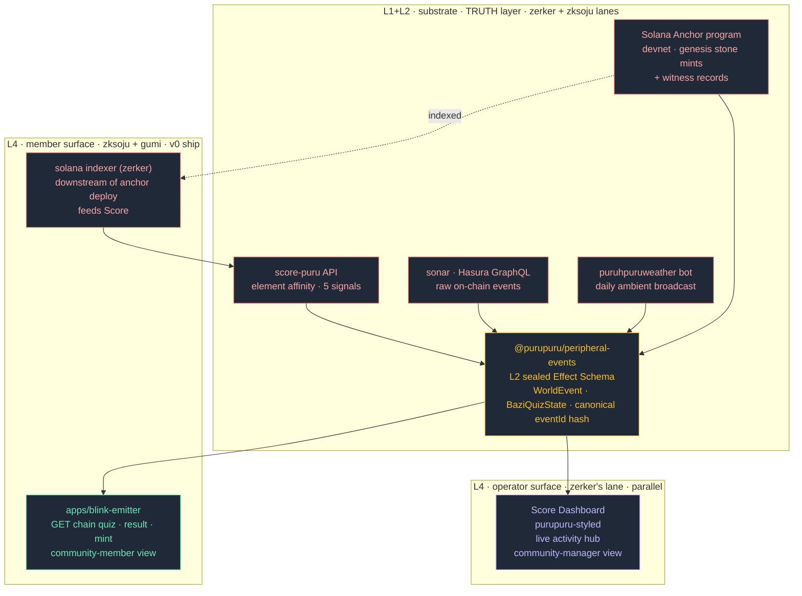
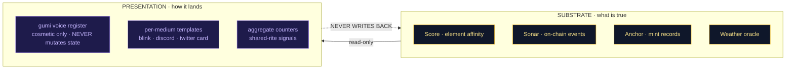
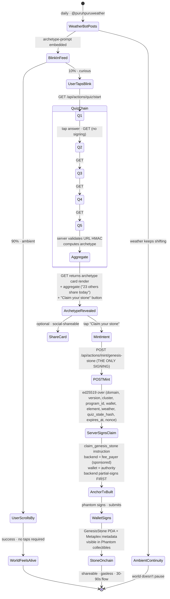
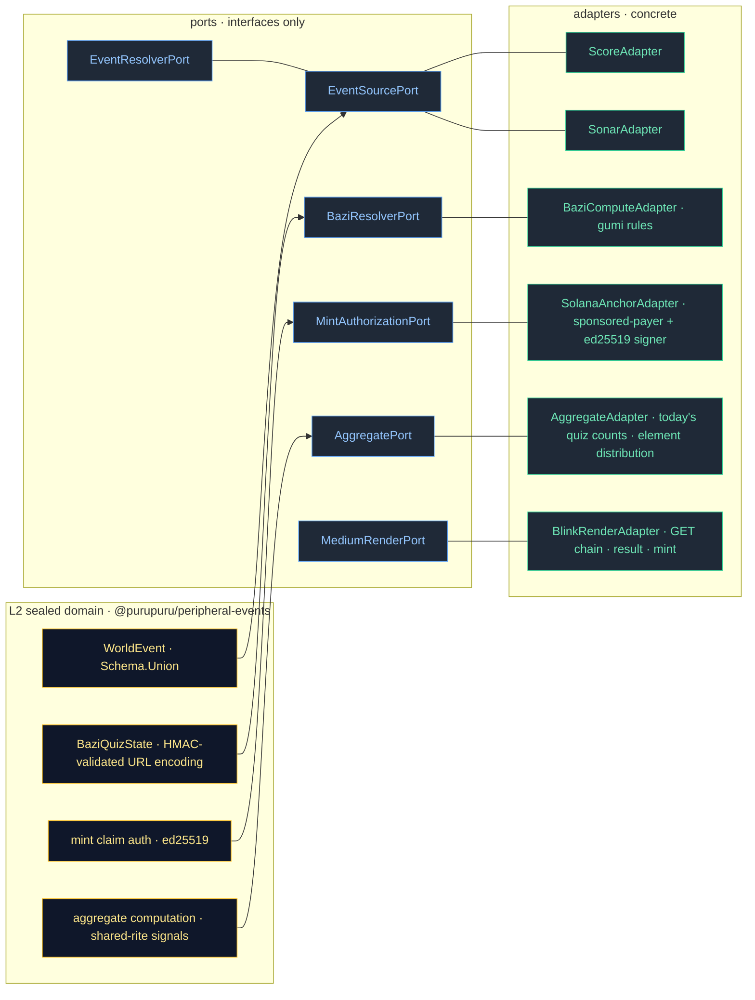

# PRD · purupuru awareness layer · solana frontier hackathon · v0 · r5

> **Genesis PRD · post-eileen-alignment revision 2026-05-07.**
> Eileen's framework forced honest re-audit against Frontier reality (NO theme · founder/business-viability hackathon · MVP + user-acquisition + monetization + team credentials are required artifacts). The "infrastructure-first" deck framing aligns with Frontier IF user-acquisition and monetization are crisp. The architectural separation (substrate truth vs presentation voice) is THE moat — agents present, never mutate state, hallucinations become cosmetic not financial.
>
> **Scope tightens from r4**: Score dashboard moves to **zerker's parallel lane** (we provide events; he ships dashboard via Score's API/CLI/MCP). Quiz chain is **GET-only** between Q1-Q5 (only final mint is POST · 1 signing prompt instead of 6). Mint is **Metaplex Token Metadata** (visible NFT in Phantom collectibles · stone is the on-chain artifact users SEE). Quiz designed by **gumi** (5 resonant questions · archetype that feels familiar · not birthday/gender). 4-day clock holds.

---

## 0 · tl;dr

```
🎯 product             communities can't see what's actually happening on-chain
                       we make it visible · live · native to the feeds they already use

🪨 mechanism (the moat) substrate (sonar/score) holds truth · agents (gumi voice) present with personality
                        SEPARATION = no hallucination · agents talk but don't mutate state ON PURPOSE
                        most AI agent products fail because the same model that decides
                        what to SAY also decides what to DO · we split them

🔮 v0 demo proof       tap tweet → take 5-Q archetype quiz (GET chain · no signing) →
                       reveal archetype → mint Genesis Stone (visible NFT · Metaplex) →
                       see the world keep speaking (weather bot + simulated activity feed)

🪺 monetization        sponsored awareness slots · brands/communities pay to surface
                       their on-chain activity in feeds where audiences already scroll

👥 user acquisition    meet players in social feeds · twitter native · then discord/telegram
                       same substrate fans out · BLINK_DESCRIPTOR contributed upstream

🌟 north star          "in a social experience, you should feel others were there with you"
                        v0 expression: simulated activity feed + aggregate counters +
                        2-wallet live demo (operator + zerker tap visibly during recording)

⛓ solana lock-in      Anchor program · DEVNET ONLY v0
                       claim_genesis_stone · ed25519 server-signed · Metaplex Token Metadata
                       sponsored-payer (gasless) · upgrade-authority frozen post-deploy

🚧 zksoju learning     Solana smart contracts (new for operator) · sprint-1 setup risk
🚧 zerker learning     Solana indexer (Score → on-chain mint events) · post-anchor-deploy
🌸 gumi parallel       quiz design · archetype copy · voice register · NOT blocking
                       working in parallel · we scaffold placeholders · she swaps in

🛡 mvd floor LOCKED    ambitious + 4 binding triggers (per §7.5)
```

**🟢 elevator pitch**: *"Communities can't see what's actually happening on-chain. We make it visible — in the social feeds they already use."*

**🟣 problem-led narrative (deck open)**: *"On-chain games go silent the moment you close the app. We make them speak — in tweets, casts, discord, wherever your community already is."*

---

## 1 · genesis context & supersession

### what changed across revisions (5 total)

| frame | r1 | r2 | r3 | r4 | r5 (THIS) |
|---|---|---|---|---|---|
| **scope** | weather+vote | awareness-layer | + flatline rigor | + demo flow | + eileen alignment |
| **anchor program** | none | minimal witness | sponsored payer | + genesis mint | ed25519 sig · frozen authority |
| **mint shape** | n/a | n/a | n/a | PDA only | **Metaplex Token Metadata · visible** |
| **quiz chain** | n/a | n/a | n/a | POST chain (5 sigs) | **GET chain (1 sig at mint)** |
| **score dashboard** | n/a | n/a | n/a | implicit | **zerker's parallel lane** |
| **monetization** | none | none | none | none | **sponsored awareness slots** |
| **deck framing** | n/a | infra-first | infra-first | infra-first | **separation-as-moat punchline** |
| **shared rite** | n/a | implicit | implicit | implicit | **simulated feed + aggregate + 2-wallet demo** |

### the eileen alignment summary (operator 2026-05-07 PM · third operator Q&A round)

operator's distilled positions:
- stone = POAP-like genesis · evolves into puruhani character (vision · roadmap)
- v0 ships GENESIS only · evolution mechanic deferred
- agents talk · don't mutate state · separation is the architectural feature, not bug
- zerker owns Score dashboard + Solana indexer · we own substrate + emitter + anchor + quiz + mint + demo
- gumi parallel · no blocking · 4 days achievable
- universality emerges through Score dashboard's bespoke purupuru styling · expertise-replicated, not template-replicated
- monetization via sponsored awareness slots · communities pay to surface their activity
- "in a social experience, you should feel others were there with you" — north star insight

---

## 2 · problem & vision (keeper eye · v5)

### the problem (what users actually feel)

> **the keeper observes**: a community member opens twitter on a wednesday morning. they follow `@puruhpuruweather` because they like the warm aesthetic of the daily weather post. they don't know about the 18-card battle system, the burn loop, the transcendence cards, the cosmic weather oracle. they see one post a day and that's all the world tells them.
>
> meanwhile, on chain, *something is happening*: someone minted a pack 11 minutes ago, a wood-element puruhani's affinity surged 3% overnight, a fire battle resolved with `Setup Strike` triggering a chain break. **none of this is visible.**
>
> the community manager opens GitHub or Dune to check what's happening. members don't follow her there. they make things up. conversations drift away from reality. **awareness is the first step of meaningful action, and there's no awareness layer.**

### the vision (problem-led)

*"On-chain games go silent the moment you close the app. We make them speak — in tweets, casts, discord, wherever your community already is."*

build **the awareness layer** — a sealed-schema substrate that:

- 🪺 emits canonical world-events (mint · weather shift · element surge · quiz completion)
- 🪞 fans out to multiple presentation surfaces · same data, different shape per audience
- 🌬 ships **Blinks first** with a **bazi-style archetype quiz → mint your stone** demo
- 🪨 honors `[[puruhani-as-spine]]` — the stone is your POAP-like genesis · evolves into puruhani
- 🪶 **separates substrate (truth) from presentation (voice) by design** — agents talk · never mutate state · hallucinations become cosmetic not financial
- 🌟 makes you feel **others were here with you** — simulated activity feed · aggregate counters · live multi-wallet demo

### why now (4-day frontier clock)

- colosseum frontier deadline 2026-05-11 · NO theme · MVP + user-acquisition + monetization + team are required artifacts
- `@0xhoneyjar/medium-registry@0.2.0` shipped cycle-R · `BLINK_DESCRIPTOR` is the cycle-X follow-up
- web dig 2026-05-06: NO shipped TTRPG-weather-as-ambient-feed-surface example · genuine whitespace
- existing components (genesis stone contract on Base · weather bot · score · sonar · bazi quiz UI in game's `/`) compose into a coherent demo with minimal net-new code · per operator: "Most components are already completed"

### why us · founder credibility

- existing live infrastructure across the org (sonar · score · weather bot · medium-registry)
- doctrine library load-bearing (chathead-in-cache · metadata-as-integration-contract · environment-surfaces · chat-medium-presentation-boundary)
- team executes (cycle-R shipped 2026-05-04 · constructs-network-migration shipped 2026-05-05 · score live · sonar live · medium-registry live)
- gumi's existing pitch articulates the 5-year vision (soul-stage agents · daily friend duels · cosmic weather oracles) · v0 is a precursor that proves the awareness substrate

---

## 3 · architecture (three views · visual first)

### 3.1 · the three-view architecture (eileen alignment)



**three views, one truth**:
- **substrate**: sources of truth · zerker (sonar/score) + zksoju (anchor program) · never voiced directly
- **operator surface**: Score dashboard · purupuru-styled · live activity for community managers · **zerker's lane**
- **member surface**: Blinks (twitter) + future discord/telegram · ambient + interactive · **zksoju + gumi · v0 ship**

universality emerges through bespoke styling: judges see the dashboard styled per-purupuru and infer "this is expertise replicated, not a template."

### 3.2 · the separation-as-moat (the architectural punchline)



**the deck punchline**:

> *"Most AI agent products fail because the same model that decides what to say also decides what to do. We split them. Substrate (what's true) is owned by data. Voice (how it lands) is owned by personality. Agents present · they never mutate state. Hallucinations become cosmetic, not financial."*

### 3.3 · the demo state machine (GET chain · 1 signing prompt)



### 3.4 · hexagonal at the substrate boundary



---

## 4 · functional requirements (with explicit acceptance criteria)

### FR-1 · L2 substrate package · `@purupuru/peripheral-events`

**THE SYSTEM SHALL** publish a package providing:

- `WorldEvent` sealed Effect Schema discriminated union (v0 variants):
  - `MintEvent` · Solana genesis stone claim
  - `WeatherEvent` · daily oracle
  - `ElementShiftEvent` · score-derived element-affinity delta
  - `QuizCompletedEvent` · NEW · for aggregate signals
- `BaziQuizState` sealed Effect Schema:
  - URL-encoded state with **proper HMAC-SHA256 integrity check** (per flatline r3 · NOT raw sha256-with-prepended-secret · length-extension safe)
  - `mac = HMAC-SHA256(secret, canonicalEncode({step, answers, account}))` using Node `crypto.createHmac('sha256', secret)` or Web Crypto `HMAC` algorithm
  - canonicalEncode = length-prefixed CBOR or canonical-JSON · ambiguous concatenation forbidden
  - server validates HMAC at every step transition · constant-time comparison (`timingSafeEqual`)
  - server **recomputes element from HMAC-validated answers** at mint (NEVER trusts client-supplied element)
  - golden test asserts length-extension forgery FAILS (canonical attack vector test)
- canonical `eventId` derivation: `sha256(canonicalEncode(event) || schema_version || source_tag)`
- ports: `EventSourcePort` · `EventResolverPort` · `BaziResolverPort` · `MintAuthorizationPort` · `AggregatePort` · `MediumRenderPort` · `NotifyPort`
- typed accessors and effect-schema validation at every boundary
- additive-only schema bumps

**Acceptance Criteria**:
- AC-1.1 through AC-1.6 (eventId stability · roundtrip · cross-source uniqueness · HMAC verification · element recomputation)
- AC-1.7 NEW · invalid HMAC → step transition rejected with 400
- AC-1.8 NEW · client-supplied element ignored at mint · server uses HMAC-validated answers only

> Sources: vault doctrines · flatline r2 SKP-001/SKP-003 (HMAC) · IMP-003 (canonical eventId)

### FR-2 · L3 medium-registry contribution · `BLINK_DESCRIPTOR`

**THE SYSTEM SHALL** PR a new `BLINK_DESCRIPTOR` to `freeside-mediums/packages/protocol`:

- 5th variant of `MediumCapability` discriminated union
- captures Solana Action constraints:
  - `iconMaxBytes`: 128 KiB · `titleMaxChars`: 80 · `descriptionMaxChars`: 280 · `buttonsMax`: 5
  - `inputFields`: disallowed v0 (button-multichoice)
  - `txShape`: `"anchor-witness" | "anchor-genesis-stone-claim"` (sponsored-payer · no payment instruction)
  - `actionChaining`: **GET-only chain via `links.next`** v0 (POST chain v1+ when input fields enable richer state)
  - `presentationBoundary`: `cmp-boundary-presentation`
  - `walletAwareGet`: `false`
  - `nftStandard`: `"metaplex-token-metadata"` (NEW · captures the visibility commitment)
- `MEDIUM_REGISTRY_VERSION = "0.3.0"` per architect-lock A7

**Acceptance Criteria**: AC-2.1 through AC-2.5 (CONST singleton · typed accessor · upstream PR · actionChaining documented · local-link fallback)

### FR-3 · solana anchor program · TWO instructions · DEVNET LOCKED

**Instruction A · `attest_witness(event_id, event_kind)`** — ambient presence trail · sponsored-payer · WitnessRecord PDA seeded `[b"witness", event_id, witness_wallet]` · idempotent.

**Instruction B · `claim_genesis_stone(message: ClaimMessage)`** — server-signed genesis mint:

- **CryptoLOCK ed25519 · Solana-correct pattern** (per flatline r3 SKP-002 fix · in-program signature verification is NOT supported · must use Ed25519 program instruction + instructions sysvar):
  - transaction MUST include an `Ed25519Program` instruction BEFORE `claim_genesis_stone` containing: signer pubkey · message bytes · signature
  - `claim_genesis_stone` reads the `instructions` sysvar at index `current_index - 1` and verifies:
    - prior instruction is the Ed25519 program (`Ed25519SigVerify111111111111111111111111111`)
    - signer pubkey matches the expected claim-signer (program-authority hardcoded)
    - message bytes deserialize to a valid `ClaimMessage` matching the instruction args
    - offsets match the Ed25519 instruction format (per Solana docs)
  - backend uses dedicated Solana Ed25519 keypair (separate from sponsored-payer)
  - **canonical byte serialization for `ClaimMessage`** (per flatline r3) · frozen via Anchor's IDL-derived layout · documented in code · golden test asserts byte-stable across versions
- **structured signed payload** (per flatline r2 SKP-004):
  ```rust
  ClaimMessage {
    domain: "purupuru.awareness.genesis-stone",
    version: u8,         // schema version
    cluster: u8,         // 0=devnet, 1=mainnet (rejects cross-cluster)
    program_id: Pubkey,  // domain separation
    wallet: Pubkey,
    element: u8,         // 1=Wood, 2=Fire, 3=Earth, 4=Metal, 5=Water
    weather: u8,         // cosmic weather imprint at mint time
    quiz_state_hash: [u8; 32], // hash of HMAC-validated quiz state
    issued_at: i64,
    expires_at: i64,     // 5min after issued · prevents replay
    nonce: [u8; 16],     // server-tracked · prevents replay
  }
  ```
- `GenesisStone` PDA seeded `[b"stone", wallet]` · one per wallet · idempotent
- **Metaplex Token Metadata** (per T1 lock):
  - `mpl-token-metadata` instruction creates Metaplex PDA alongside GenesisStone PDA
  - metadata `name`, `symbol`, `uri` (gumi art), `creators`, `collection`
  - visible in Phantom collectibles tab · proves "on-chain artifact" claim
- sponsored-payer (backend partial-signs FIRST as fee_payer · wallet signs SECOND as authority · per flatline r2 SKP-002)
- **upgrade authority FROZEN post-deploy** (per flatline r2 SKP-005 · D-12 closed) · cannot patch v0 · must redeploy as new program ID if needed
- emits `StoneClaimed` event for indexer consumption (zerker's lane)

**Automated invariant tests**:
- `test_no_lamport_transfers_from_authority` (no payment from witness wallet)
- `test_no_token_state_mutation_outside_genesis_stone`
- `test_double_claim_rejected`
- `test_unsigned_claim_rejected`
- `test_expired_signature_rejected` (NEW · per flatline r2 SKP-004)
- `test_cross_cluster_rejected` (NEW · cluster byte mismatch)
- `test_replay_with_used_nonce_rejected` (NEW)

**Acceptance Criteria**: AC-3.1 through AC-3.10 (devnet success · invariant tests · PDA idempotency · server-side validation · Metaplex visibility · sponsored-payer end-to-end · upgrade frozen)

### FR-4 · `apps/blink-emitter` · GET-chained quiz + final mint POST

**Quiz chain endpoints (GET · no signing)**:

- `GET /api/actions/quiz/start` → ActionGetResponse for Q1 with 4 answer buttons (each is a GET link with state in URL)
- `GET /api/actions/quiz/step?step=N&answers=...&account=...&mac=...` → next Q's GET (server validates HMAC · returns next 4 buttons)
- `GET /api/actions/quiz/result?...` → final ActionGetResponse with archetype card icon + aggregate ("23 others share this archetype today") + 1 button "Claim your stone" pointing at mint POST

**Mint endpoint (POST · the only signing prompt)**:

- `POST /api/actions/mint/genesis-stone` with `{ account, quiz_state_token }`
  - quiz_state_token = short-lived JWT-shape (per flatline r2 SKP-005) issued at result reveal · expires 5min · binds wallet+element+weather+quiz_state_hash
  - server validates token + recomputes element from HMAC-validated quiz state
  - server signs `ClaimMessage` with ed25519 keypair (using `nacl.sign.detached` or `tweetnacl`)
- **Solana transaction assembly (specified per flatline r3 SKP-006 fix)**:
  - **transaction version**: legacy (v0 not strictly needed; legacy is broadly compatible with Phantom + Dialect)
  - **fee_payer**: backend sponsored-payer pubkey
  - **recent_blockhash**: fetched server-side via `getLatestBlockhash` (commitment: `confirmed`) at request time
  - **instruction order**: `[Ed25519Program (signature verification), claim_genesis_stone (with Metaplex CPI inside)]`
  - **required signers**: backend sponsored-payer (already added via partial-sign before return) + wallet (authority · phantom signs at submit-time)
  - **serialization**: base64-encoded transaction in ActionPostResponse `transaction` field per Solana Actions spec
  - **submission**: wallet submits (NOT backend) · backend already partially signed before return
  - early compatibility spike (sprint-1 day-1) tests against Phantom + Dialect inspector with minimal Ed25519+claim_genesis_stone tx · validates this assembly works before building full flow

**Sybil protection (per flatline r2+r3)**:
- IP-based vercel rate limit: 50 quiz-starts / IP / hour · 5 mint-POSTs / IP / hour
- **wallet balance check ONLY** (per flatline r3 SKP-001 fix · wallet-age check via `getSignaturesForAddress` is too slow for Action timeout — single `getBalance` RPC call only):
  - require ≥0.01 SOL balance on Solana wallet to qualify for sponsored-payer mint
  - dropped: 7-day age check (impractical RPC cost)
- **tiered sponsored-payer alerts** (per flatline r3 SKP-005 · single threshold caused 0-warning outage risk):
  - < 5 SOL: warn (vercel log + slack)
  - < 2 SOL: page operator (urgent · alert webhook)
  - < 1 SOL: halt mint endpoint (returns 503)
  - day-of-demo: top up to >10 SOL the morning of recording · disable halt for recording window via `DISABLE_PAYER_HALT=true` env flag · re-enable post-recording
  - pre-staged refill script keyed to backup keypair

**Acceptance Criteria**: AC-4.1 through AC-4.10 (GET chain · HMAC validation · result token · partial-sign sequence · indexer confirmation · sybil rejection · sponsored-payer halt)

### FR-5 · score integration · existing API (read-side)

**THE SYSTEM SHALL** consume score's existing surfaces (read-only):
- `score-puru` API · element affinity for archetype lore-coherence
- Sonar/Hasura GraphQL · ERC-721 Transfer events for ambient WeatherEvent

**Acceptance Criteria**: AC-5.1 through AC-5.3 (5min cron · subscription · daily oracle read).

### FR-6 · cache invalidation · TTL fallback locked

**ERC-4906 NOT IMPLEMENTED** in any puru contract (verified 2026-05-07). v0 uses TTL-based refresh exclusively · 60s for blink GET · 24h for icon · 60s for score-puru. Solana side has real-time PDA reads (no staleness).

### FR-7 · per-medium voice authority (gumi)

**gumi authors v0 voice corpus** (parallel work · not blocking):
- 5 archetype quiz questions (resonant · familiar · NOT birthday/gender)
- 4 answer copy strings per question (5 × 4 = 20)
- 5 archetype reveals (one per element · ≤280 chars each)
- 1 "Claim your stone" mint button copy
- 1 daily-archetype-prompt copy for `@puruhpuruweather` (the Blink that wraps the quiz)
- guidance for Score dashboard purupuru styling (zerker consumes)

**voice register**: cosmic-weather observer voice · third-person · sora-tower lyric · gumi tone authority. zksoju scaffolds 25 acceptable placeholders ahead of time so demo records cleanly even if gumi's handoff slips · gumi swaps in real voice when ready.

### FR-8 · cmp-boundary enforcement (load-bearing)

substrate truth ≠ presentation. GET wallet-agnostic per Solana Actions spec. POST result-token includes wallet-aware narrative. enforced via FR-10 lint + golden tests.

### FR-9 · observability (extended)

structured logs · vercel dashboards · alerts on:
- quiz GET-chain dropoff funnel (Q1 → Q5)
- mint POST failure rate >10%
- sponsored-payer balance < 1 SOL devnet
- claim-signer keypair signing rate (anomaly detection)
- HMAC validation failure rate (tampering signal)
- StoneClaimed event indexer lag (zerker's surface · we monitor for our deploy health)

### FR-10 · cmp-boundary lint + golden test suite

automated tooling enforces FR-8. CI gate. blocks raw substrate-canonical tokens (event_id · puruhani_id · raw element codes) from leaking into render output.

### FR-11 · demo simulator (operator cooking · sprint-4 work)

100x-speed simulation for the 3min demo recording. design space:
- 📦 fixture replay (pre-recorded events · deterministic) · 0.5d
- 🎲 synthetic generator (high-cadence plausible events) · 1d
- 🎬 post-recording acceleration (real cadence · video editing) · 0d

operator decides at sprint-4 start. **constraint**: simulator MUST be opt-in (env flag · never live in production by default).

### FR-12 · NEW · Score dashboard integration (zerker's lane · downstream of anchor deploy)

**zerker SHALL** ship a Score dashboard surface that reads:
- existing Score API + Sonar GraphQL (already live)
- NEW: Solana indexer for `StoneClaimed` events from our anchor program (sprint-3 deploy)

**zksoju + this repo provide**:
- ed25519-signed `StoneClaimed` event emissions (FR-3 emit)
- documented event shape for indexer consumption
- coordination: anchor deploy date confirmed to zerker for indexer integration

**out of scope for this repo**:
- the dashboard UI (zerker's repo · likely additions to score-puru SvelteKit app)
- the Solana indexer code (zerker's lane · operator+zerker learning curve)
- dashboard purupuru styling (zerker consumes gumi's design tokens)

**Acceptance Criteria**:
- AC-12.1: anchor program emits `StoneClaimed` event with documented schema
- AC-12.2: event schema available to zerker as Effect Schema export from `@purupuru/peripheral-events`
- AC-12.3: deploy timing coordinated · zerker has 24h notice before our anchor deploys
- AC-12.4: post-anchor-deploy demo includes a Score dashboard view (zerker integrates · we record)

---

## 5 · technical & non-functional

### stack (locked)

| layer | choice | rationale |
|---|---|---|
| L2 substrate | TypeScript + Effect Schema (peerDep `^3.10.0`) | matches freeside-mediums · isolated compute (Q4 ECS · operator decree) |
| L3 contribution | freeside-mediums upstream | existing repo · architect-locks A1-A8 |
| L4 emitter app | Next.js 15 · App Router · Vercel | Q1 lock · OG image · GET chain endpoints |
| Solana program | Anchor 0.30+ · Rust · ed25519 sig | ed25519 idiomatic · `ed25519_program` syscall |
| NFT standard | Metaplex Token Metadata (mpl-token-metadata) | T1 lock · visible in Phantom collectibles · matches "on-chain artifact" framing |
| package manager | bun | bonfire/loa-constructs default |
| testing | vitest + msw + anchor-test | matches existing patterns |

### performance

- quiz GET p95 < 600ms (no signing · vercel edge)
- mint POST p95 < 1.5s (anchor tx build + Metaplex metadata + sponsored-payer co-sign)
- archetype card composition cached 60s per (element, weather)

### security (extended for r5)

- POST validates `account` field (well-formed pubkey)
- HMAC validation at every quiz GET transition
- result_token (JWT-shape · 5min expiry · binds quiz state to wallet)
- mint signature verification (ed25519 · `ed25519_program` syscall)
- structured ClaimMessage payload (domain · cluster · program_id · expires_at · nonce)
- separate keypairs: claim-signer (cold · vercel env) vs sponsored-payer (warm · funded operationally)
- IP-based rate limits + wallet age/balance minimum (anti-sybil)
- sponsored-payer balance halt threshold (DoS protection)
- NO session keys · NO custom wallet flows · NO LLM verdicts (eileen)
- presentation-boundary lint blocks raw ID leakage in CI
- automated invariant tests on anchor program (7 tests · FR-3)
- **upgrade authority FROZEN post-deploy** (cannot patch · must redeploy as new program ID)

### deploy

- preview deployments per PR
- production: `purupuru-blinks.vercel.app` (or D-1 rename)
- **anchor program: DEVNET LOCKED v0** · mainnet deferred post-audit
- THREE keypairs (devnet):
  - sponsored-payer · funds tx fees · refilled per FR-9 alerts
  - claim-signer (ed25519) · signs ClaimMessage · vercel env · rotation per D-13
  - upgrade-authority · **set to None post-deploy**

---

## 6 · stakeholders & lanes (revised for r5)

| handle | lane | clock |
|---|---|---|
| 🪨 **zksoju** | substrate (`@purupuru/peripheral-events`) · BLINK_DESCRIPTOR · anchor program (witness + claim_genesis_stone) · blink-emitter (GET chain + mint POST) · vercel deploy · demo recording · demo simulator | 4d critical path · single owner |
| 🌬 **eileen** | architecture ratification · `[[mibera-as-npc]]` §6.1 enforcement · keypair posture (D-12 closed · D-13 open) · separation-as-moat conceptual authority | review gate before merge |
| 🌊 **zerker** | Score dashboard (purupuru-styled) · Solana indexer (downstream of anchor deploy) · Score API/CLI/MCP read-side | parallel · integrates post-sprint-3 |
| 🌸 **gumi** | quiz design (5 resonant questions · 4 answers each · NOT birthday/gender) · 5 archetype reveals · voice register · Metaplex metadata art (genesis stone visual) · dashboard purupuru styling guidance | parallel · NOT blocking · zksoju scaffolds placeholders |

**learning curves flagged**:
- 🪨 zksoju learns Solana smart contract development (Anchor + Metaplex + ed25519 sysvar) · sprint-1+2 risk
- 🌊 zerker learns Solana indexer (subscribe to anchor program events · feed Score) · post-sprint-3 work

---

## 7 · scope & prioritization

### MVP (must-ship by 2026-05-11)

- ✅ FR-1 — substrate package · WorldEvent + BaziQuizState (HMAC-validated) · ports + adapters
- ✅ FR-2 — `BLINK_DESCRIPTOR` PR'd (actionChaining: GET-chain · nftStandard: metaplex)
- ✅ FR-3 — Anchor program · BOTH instructions · DEVNET LOCKED · ed25519 sig · Metaplex metadata · 7 invariant tests · upgrade-authority frozen
- ✅ FR-4 — blink-emitter · GET-chained quiz + result + mint POST · sybil protection · sponsored-payer
- ✅ FR-5 — score adapter (read-only existing API)
- ✅ FR-6 — TTL-based cache (ERC-4906 absent verified)
- ✅ FR-7 — voice corpus (gumi · parallel · placeholders ready)
- ✅ FR-8 — cmp-boundary enforcement
- ✅ FR-9 — observability + dashboards + alerts
- ✅ FR-10 — cmp-boundary lint + golden tests (CI gate)
- 🟡 FR-11 — demo simulator (operator cooking · sprint-4)
- 🌊 FR-12 — Score dashboard integration (**zerker's parallel lane** · downstream of anchor deploy)
- ✅ dialect blink registry submission
- ✅ 3min demo video
- ✅ submission deck (separation-as-moat punchline · monetization · user acquisition)

### 7.5 · MVD floor LOCKED · day-1 spine + stretch (per T2 + flatline r3 SKP-003 fix)

**flatline r3 critical reframe**: previous trigger-tree fired too late · scope was "MVP + cut-on-trigger" · should be "spine-first + stretch-additive." this revision adopts the spine model.

**🦴 Day-1 runnable spine (must work end-to-end by EOD 2026-05-08)**:

THESE FIVE THINGS MUST RUN BY EOD DAY 1. ANYTHING NOT IN THIS LIST IS STRETCH.

1. **GET quiz endpoint** with placeholder voice (5 Q's · button-multichoice · returns ActionGetResponse · runs locally + on vercel preview)
2. **Result card render** (any image · element-determined by hardcoded answer-mapping if Bazi compute not done)
3. **Devnet transaction** — EITHER:
   - (a) `attest_witness` instruction working end-to-end (witness-only anchor · PDA only · NOT genesis stone) — this is the day-1 minimum
   - (b) hardcoded mock transaction (memo-only) if anchor scaffold not compiling
4. **Vercel production deployment** serving the blink (preview URL works in dialect inspector)
5. **Deck draft** — separation-as-moat slide + product demo description + monetization line + user-acq line (rough but coherent)

**🌱 Stretch goals (sprint-2-4 · in priority order · cut from top if behind)**:

if spine is verified end-to-end by EOD day-1, sprint-2 onward LAYERS THESE IN:

| order | stretch | gate |
|---|---|---|
| 1 | proper HMAC-validated quiz state · result_token issuance | sprint-2 morning |
| 2 | anchor `claim_genesis_stone` instruction with structured ClaimMessage + ed25519-via-instructions-sysvar | sprint-2 EOD · IF day-1 spike (FR-4 last bullet) confirmed Phantom+Dialect compatibility |
| 3 | gumi voice corpus integration | sprint-3 morning · IF gumi handoff lands by then |
| 4 | Metaplex Token Metadata for visible NFT | sprint-3 EOD · **IF day-1 Phantom devnet visibility spike succeeds** (critical risk per flatline r3 SKP-004) |
| 5 | sybil protection (IP rate limit + balance check) | sprint-3 EOD |
| 6 | upstream BLINK_DESCRIPTOR PR | sprint-3 EOD |
| 7 | observability + tiered alerts + golden tests + cmp-boundary lint | sprint-3 EOD |
| 8 | Score dashboard integration (zerker parallel) | sprint-4 · post-anchor-deploy |
| 9 | demo simulator | sprint-4 |
| 10 | dialect blink registry submission | sprint-4 morning |

**🚨 Day-1 SMOKE TEST (must pass before stretch starts)**:
- minimal Solana transaction with Ed25519Program instruction + a stub anchor instruction reading instructions sysvar — does it WORK in Phantom + Dialect inspector?
- minimal Metaplex Token Metadata mint on devnet — does Phantom render it in the collectibles tab?
- if EITHER fails: revert mint flow to PDA-only OR memo-only · rename language from "mint" to "claim record" · update deck framing to honest

**Cut-tree (binding triggers · sharpened from r5)**:

```
DAY-1 EOD · spine MUST be running end-to-end
  → if NO: HALT and operator-pair to fix · all stretch deferred · spine is only ship target

SPRINT-2 EOD · if Phantom devnet visibility spike FAILED
  → drop Metaplex from stretch list · ship PDA-only · update deck

SPRINT-3 EOD · if gumi voice not landed
  → ship placeholders · note in deck

SPRINT-3 EOD · if BLINK_DESCRIPTOR PR not merged upstream
  → ship local-only descriptor · open PR but don't gate on merge

SPRINT-4 MORNING · if demo simulator not built
  → post-recording video acceleration · 0d work

SPRINT-4 MORNING · if zerker dashboard not ready
  → text-only mention in deck · post-hackathon integration
```

**lock confirmed 2026-05-07 · operator decision · spine-first model binding**.

### post-hackathon (the bonfire surface)

unchanged from r4 plus: Score dashboard polish (zerker) · Solana indexer hardening (zerker) · cross-chain identity unification (D-11) · evolution-into-puruhani mechanic (gumi+codex pair · separate clock) · mainnet deploy (post-audit).

### explicit non-goals (v0)

unchanged from r4 plus:
- ❌ Score dashboard styling/scope decisions (zerker owns)
- ❌ Solana indexer (zerker owns · we provide event schema only)
- ❌ Evolution-into-puruhani mechanic (vision/roadmap · v1+)
- ❌ Multi-chain twin reconciliation (D-11)

---

## 8 · doctrine composition

unchanged from r4 plus:
- `[[separation-of-truth-and-voice-as-architectural-moat]]` (NEW · this PRD names it · doctrine page after first ship · the deck punchline that distinguishes us at Frontier)
- `[[shared-rite-as-social-feel]]` (NEW · operator's north-star · "in a social experience you should feel others were there") · v0 expression via aggregate counters + simulated feed + multi-wallet demo

---

## 9 · open decisions

unchanged from r4 plus tactical closures:

| # | decision | r5 status |
|---|---|---|
| T1 | NFT shape | **CLOSED · Metaplex Token Metadata** (visible · matches "on-chain artifact" · simpler than cNFT on 4d clock) |
| T2 | MVD floor | **CLOSED · ambitious + 5 binding triggers** (per §7.5) |
| T3 | quiz POST signing | **CLOSED by Solana Actions spec** · GET-chain · only final mint is POST · 1 signing prompt |
| D-12 | upgrade authority | **CLOSED · frozen post-deploy** (set to None) per flatline r2 SKP-005 |
| D-13 | claim-signer keypair | **PARTIAL CLOSE · ed25519 dedicated keypair** (separate from sponsored-payer · cold-storage option for post-mainnet · rotation procedure post-hackathon) |
| D-15 | bazi computation source | **CLOSED · gumi authors fresh design** (5 resonant questions · NOT extracted from existing game `/`) |

still open:
| D-1 | repo rename · operator preference |
| D-4 | witness PDA cleanup posture · post-hackathon |
| D-5 | score new endpoints · zerker · post-hackathon |
| D-6 | 2 unnamed of 5 cosmic weather oracles · gumi · sprint-2 |
| D-10 | sponsored-payer keypair management · post-hackathon |
| D-11 | cross-chain identity unification · post-hackathon |
| D-14 | demo simulator design · operator cooking · sprint-4 |
| D-16 | NEW · gumi handoff timing · operator-paced parallel work · sprint-2 close target |
| D-17 | NEW · zerker indexer ready-by-date · coordinated post-anchor-deploy · sprint-3 close target |

---

## 10 · gaps (operator's explicit ask · honest)

🪶 **substrate gaps (vault doctrine)**
- `[[purupuru-world-event-schema]]` (vault flagged CRITICAL · this PRD authors in code)
- `[[presence-broadcast-without-spam]]` (cadence rules · seeded by FR-9 data)
- `[[blink-descriptor-spec]]` (after upstream PR)
- `[[purupuru-surface-vs-game-boundary]]` (operator framing · unwritten)
- `[[ecs-pda-projection-pattern]]`
- `[[cross-chain-identity-twin-pattern]]`
- `[[bazi-quiz-action-chain-pattern]]` (now: `[[get-chain-action-quiz-pattern]]` since we're GET-chained not POST-chained)
- **NEW · `[[separation-of-truth-and-voice-as-architectural-moat]]`** — eileen's framework · the deck punchline
- **NEW · `[[shared-rite-as-social-feel]]`** — north-star insight

🪶 **technical gaps**
- ERC-4906 absent · TTL locked
- 2 of 5 cosmic weather oracles unnamed (gumi · sprint-2)
- bazi quiz design · gumi parallel · placeholders ready
- zksoju Solana smart-contract learning curve (sprint-1+2 risk)
- zerker Solana indexer learning curve (post-sprint-3)
- result_token format (JWT-shape · sprint-2 implementation detail)

🪶 **process gaps**
- codex pairing pattern (game work · separate clock)
- the `project-purupuru/game` ↔ awareness-layer event-emission contract
- freeside-mediums upstream PR review owner (zksoju self-merge viable)
- coordination protocol with zerker for anchor deploy → indexer integration

🪶 **scope gaps**
- ambient broadcast cadence rules · undefined v0
- demo path for judges (3min recording shape)
- demo simulator (operator cooking)
- monetization PROOF in demo (currently slide-only · per Eileen's "show, don't tell" — could we slip a sponsored slot into the demo?)

---

## 11 · risks & dependencies (revised for r5)

### technical risks

| risk | likelihood | impact | mitigation |
|---|---|---|---|
| zksoju Solana learning curve eats sprint-1-2 | **medium-high** (new) | high | use anchor-init template · Metaplex CPI examples · pair with codex if blocked · KEEP scope minimal (TWO instructions only) |
| anchor program scope (TWO instructions + Metaplex CPI) eats sprint-2-3 | medium | high | scope tight per §4 FR-3 · invariant tests catch issues early · trigger 1 in MVD cuts Metaplex if needed |
| HMAC quiz state implementation bugs | low | medium | golden tests · property-based tests on URL roundtrip · refer to OWASP cheatsheet |
| ed25519 signing inconsistencies between Anchor and TS backend | medium | medium | use `@solana/web3.js` ed25519 utils · test signing roundtrip end-to-end before sprint-3 |
| Metaplex Token Metadata setup overhead | low | medium | use `mpl-token-metadata` SDK · standard CPI pattern · trigger reverts to PDA-only if blocked |
| **Metaplex Phantom devnet visibility unverified** (flatline r3 SKP-004) | medium | high | **day-1 smoke test** — mint minimal Metaplex token on devnet · verify Phantom renders in collectibles tab · IF fails: revert to PDA-only · prepare fallback (explorer link · in-app stone card) regardless |
| **ed25519-via-instructions-sysvar Solana pattern unfamiliar** (flatline r3 SKP-002) | medium | high | day-1 spike: minimal Anchor program reads instructions sysvar after Ed25519Program instruction · refer to `solana-program` examples + Anchor docs · validate before sprint-2 starts |
| **Solana transaction assembly for partial-sign** (flatline r3 SKP-006) | low-medium | medium | day-1 spike: backend partial-signs minimal tx · returned via Action POST · Phantom signs and submits · validates serialization + blockhash + fee_payer · before sprint-2 |
| 5 quiz GETs feel sluggish at edge | low | medium | vercel edge runtime · 60s cache on archetype card composition · target p95 <600ms per GET |
| gumi voice corpus delays | low (now parallel · placeholders exist) | low | trigger 3 · ship placeholders · gumi swaps post-handoff |
| zerker indexer not ready at demo recording | medium | low | trigger 5 · demo records without dashboard · post-hackathon integration |
| sponsored-payer drained by sybil | medium | high | IP rate limits · wallet age minimum · balance halt threshold (FR-4 + FR-9) |
| sponsored-payer keypair compromise | low | high | vercel env · separate per-environment · devnet-only blast radius v0 |
| claim-signer keypair compromise | low | very high | mainnet impact deferred (devnet only) · cold-storage option for post-mainnet |
| dialect blink registry approval delays | medium | medium | submit registration day 1 · fall back to direct unfurl |
| demo simulator scope creep | medium | medium | trigger 4 · post-recording acceleration is 0d |
| game emits no events v0 | high | low | doesn't matter for v0 demo |
| solana account constraint forces single voice | high | low | accepted limitation · observer voice |

### dependency risks

| dep | owner | status |
|---|---|---|
| score-puru API + Sonar GraphQL | zerker | live · low risk |
| `@puruhpuruweather` X bot | zksoju | live · low risk |
| freeside-mediums upstream | zksoju (self-merge) | low risk |
| eileen architecture ratification | eileen | medium · sprint-1 close gate |
| gumi voice corpus | gumi | parallel · low risk (placeholders exist) |
| zerker Solana indexer + dashboard | zerker | medium · post-anchor-deploy · trigger 5 fallback |
| Solana devnet stability | external | low · standard reliability |
| anchor + Metaplex SDK availability | external | low · stable libraries |

### business risks

| risk | mitigation |
|---|---|
| Frontier judges read this as "just another infra project" | deck framing leads with **separation-as-moat punchline** + **product demo** + **monetization** + **user acquisition** + **future potential** · Frontier's required artifacts all addressed |
| MVP not impressive enough for "most impactful product" criterion | demo simulation + multi-wallet live demo + Score dashboard view (if zerker ships) all amplify the "real social behavior" feel |
| team coordination eats build time | parallel work pattern (zksoju + gumi + zerker) · async-first · operator orchestrates |
| demo doesn't convey monetization clearly | deck slide explicit · second-game mockup proves universality (per P4 · need to deck-author) |
| MVD triggers fire and we ship degraded | acceptable · MVD locked · trigger order honors deck-critical-path-first |

---

## 12 · timeline · 4-day ship (sprint shape r5)

| day | date | mode | output | gate |
|---|---|---|---|---|
| 0 | 2026-05-07 | ARCH | r5 PRD · separation-as-moat doctrine · supersedes r4 · re-flatline-r3 pending | operator-approved + flatline-r3-clean |
| 1 | 2026-05-08 AM | ARCH | SDD via `/architect` · sprint-plan via `/sprint-plan` | review-passed |
| 1 | 2026-05-08 PM | SHIP | **DAY-1 SPINE** (must run end-to-end EOD) · scaffold next.js + GET quiz endpoint w/ placeholder voice + result card render + vercel preview deploy + deck draft · plus 3 day-1 spikes (Metaplex Phantom devnet visibility · ed25519-via-instructions-sysvar · partial-sign tx assembly) · day-1 minimum anchor = `attest_witness` only | spine runs end-to-end · 3 spikes pass-or-degrade |
| 2 | 2026-05-09 | SHIP | layer in proper HMAC quiz state · `claim_genesis_stone` instruction (if spike #2 passed) · Metaplex CPI (if spike #1 passed) · BLINK_DESCRIPTOR upstream PR · gumi voice integration (if handoff lands) | result card with mint button works in dialect inspector |
| 3 | 2026-05-10 | SHIP | devnet anchor deploy + upgrade-authority frozen · result_token issuance + mint POST · sybil protection (IP rate limit + balance check · NO age check) · tiered sponsored-payer alerts · cmp-boundary lint + golden tests · observability · zerker indexer integration starts | review + audit |
| 4 | 2026-05-11 | SHIP + FRAME | dialect registry submitted · demo simulator (per D-14) · multi-wallet demo recording · deck written (separation-as-moat + monetization + universality + roadmap) · pre-recording sponsored-payer top-up to >10 SOL · colosseum submission filed | submitted before deadline |

### sprint shape

- **sprint-1** (day 1): substrate + adapters + repo bootstrap + anchor scaffold + 3 keypairs + HMAC encoder + placeholder voice + D-9 confirm
- **sprint-2** (day 2): BLINK_DESCRIPTOR upstream + GET-chained quiz + result_token issuer + cmp-boundary lint + gumi voice integration
- **sprint-3** (day 3): anchor deploy (devnet) + Metaplex metadata + mint POST + sybil protection + observability + indexer coordination with zerker
- **sprint-4** (day 4): production deploy + dialect registry + demo simulator + multi-wallet demo recording + deck + submission

---

## 13 · team-facing issue draft (smol register · normal casing version available · ready for operator)

> **Operator note**: replace stale issue #1 (vote-persistence) and align with #2/#3 (operator's smol-style and my mermaid-version). Use whichever framing fits the audience.

```markdown
🪺 awareness layer · solana frontier · 4d ship · r5 demo-locked

building the awareness layer for purupuru — what's happening on-chain surfacing natively in social feeds, with a concrete demo experience and an architectural moat that wins at frontier.

## the pitch

🟢 elevator: communities can't see what's actually happening on-chain. we make it visible — in the social feeds they already use.

🟣 narrative: on-chain games go silent the moment you close the app. we make them speak — in tweets, casts, discord, wherever your community already is.

## the architectural moat (eileen's design)

most AI agent products fail because the same model that decides what to SAY also decides what to DO. we split them. substrate (what's true) is owned by data. voice (how it lands) is owned by personality. agents present, never mutate state. hallucinations become cosmetic, not financial.

## the demo

🌬 cosmic weather post (already live · @puruhpuruweather)
🔮 tap blink → 5-step archetype quiz (GET chain · 1 signing prompt only at mint)
📜 archetype card revealed (shareable · aggregate "23 others share this today")
🪨 mint your Genesis Stone on Solana (devnet · Metaplex · visible in Phantom collectibles)
🌊 weather + simulated activity feed keeps speaking · the world doesn't pause

## three views, one truth

🪨 substrate: sonar · score · anchor · weather oracle (zerker + zksoju lanes)
🌊 operator surface: Score dashboard · purupuru-styled · live activity hub (zerker · parallel)
🪞 member surface: Blinks first · discord/telegram next (zksoju + gumi · v0 ship)

## what's already shipped

✅ Genesis Stone (Element Stone · element + cosmic weather imprint) on Base Sepolia
✅ score-puru API · 4-stage scoring pipeline · 5 behavioral signals
✅ @puruhpuruweather X bot · daily ambient broadcast
✅ Loa mounted on this repo (v1.130.0) · post-flatline-r1+r2 PRD at grimoires/loa/prd.md

## what we're shipping v0

🆕 Solana twin Genesis Stone (Anchor + Metaplex · devnet · D-11 unifies later)
🆕 GET-chained archetype quiz (5 questions · 1 signing prompt at mint)
🆕 BLINK_DESCRIPTOR upstream PR to freeside-mediums (cycle-X sibling to cycle-R)
🆕 L2 substrate package (@purupuru/peripheral-events · sealed Effect Schema · HMAC quiz state)

## lanes (parallel · no blocking)

🪨 zksoju · substrate · BLINK_DESCRIPTOR · anchor program · deploy · demo · simulator
🌬 eileen · architecture ratification · separation-of-truth doctrine authority
🌊 zerker · Score dashboard (purupuru-styled) · Solana indexer (downstream of our deploy)
🌸 gumi · 5 archetype questions · 4 answers each · 5 archetype reveals · voice register · stone art

## monetization

sponsored awareness slots — brands and community operators pay to surface their on-chain activity in the feeds where their audiences already scroll. we are the infrastructure FOR them. platform/medium agnostic.

## user acquisition

meet players where they already are. twitter native (Blinks), then discord/telegram (same substrate, different mediums). zero install friction.

## the open question

the loop above is r5 after eileen alignment. is this the shape, or does it need pivoting? specifically: does the "separation as moat" framing resonate, or is there a sharper way to say it?

📚 PRD · grimoires/loa/prd.md (post-flatline-r1+r2 + post-eileen-alignment · r5)
⏰ Clock · 2026-05-11 Solana Frontier
```

---

## 14 · vocabulary bank (extended for r5)

(unchanged from r4 plus:)

### tier 1 · substrate-truth (engineering)

- `ClaimMessage` · structured ed25519 signed payload (domain · cluster · program_id · wallet · element · weather · quiz_state_hash · expires_at · nonce)
- `result_token` · short-lived JWT after Q5 · binds wallet+element+weather to mint flow
- `HMAC quiz state` · server-validated URL state per step
- `Metaplex Token Metadata` · NFT standard for visible genesis stone
- `StoneClaimed` event · indexer surface for zerker

### tier 2 · operator-handle (planning)

- "separation-as-moat" · the architectural punchline
- "three views, one truth" · substrate / operator / member surfaces
- "shared rite" · the social-feel north star
- "GET-chained quiz" · 5 GETs + 1 mint POST = 1 signing prompt
- "sponsored awareness slots" · monetization frame

### tier 3 · player-felt (storytelling)

(unchanged plus:)
- "your genesis · your beginning" — gumi-authored stone reveal copy direction
- "47 others took fortune today" — aggregate signal copy
- never use: "claim" in DeFi sense (only "claim your stone" in genesis context) · "fee" · "rent" (use "gasless" affirmatively)

### tier 4 · cold-deployed (operator-only)

(unchanged plus:)
- "ed25519_program syscall" · "Metaplex CPI" · "HMAC quiz state token" · "sponsored-payer halt threshold" — all internal vocabulary

---

## sources

- **vault**: same as r4 plus new gaps `[[separation-of-truth-and-voice-as-architectural-moat]]` and `[[shared-rite-as-social-feel]]`
- **bonfire research**: same as r4
- **repos recon**: same as r4
- **flatline reviews**:
  - r1 (2026-05-07 · 190s · $0): 7 high-consensus + 9 blockers integrated
  - r2 (2026-05-07 · 147s · $0): 17 high-consensus + 16 blockers (5 fixed inline · 11 surfaced for operator decisions · all integrated in r5)
  - r3 (PENDING · this revision)
- **interview rounds**:
  - mid (Q1-Q4 architecture)
  - post-flatline-r1 (Q1'-Q4' devnet · sponsored-payer · ECS+PDA · MVD-deferred)
  - post-demo-frame (Q1''-Q3'' Solana twin · multi-step quiz · simulator-open)
  - post-flatline-r2 (NFT shape · MVD lock · POST signing)
  - post-eileen-alignment (P1 stone-evolution-deferred · P2 separation-as-moat · P3 shared-rite-aggregates · P4 universality-via-dashboard · F1 gumi-parallel · F2 zerker-owns-dashboard)
- **gumi's pitch**: same as r4 (vision: 18 cards · burn loop · soul-stage agents · cosmic weather oracles · daily friend duels)
- **eileen's framing document** (2026-05-07 · `/Users/zksoju/Downloads/message (4).txt`): 10-category judging rubric · "what loses" diagnostic list · the strong-version Web3/AI test
- **upstream operator brief** (2026-05-07 PM · post-eileen): full reframe · separation-as-moat doctrine · zerker dashboard parallel · gumi quiz design · 4d achievable · simulation in demo
