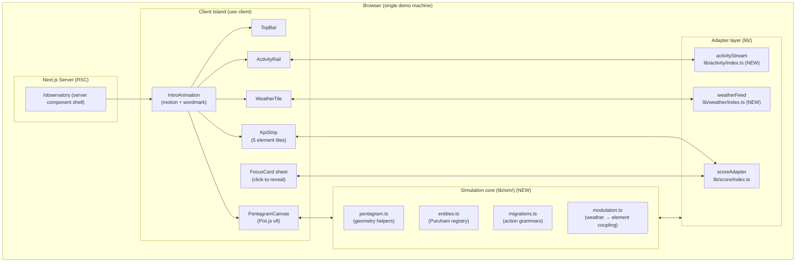
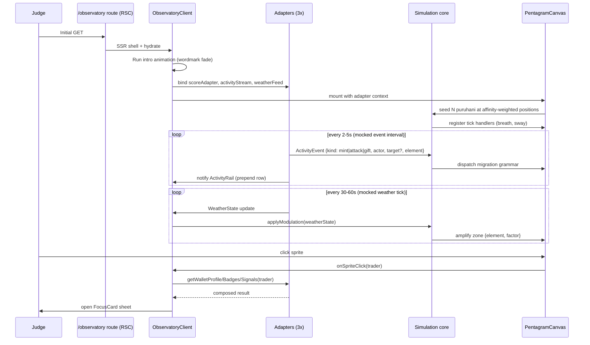
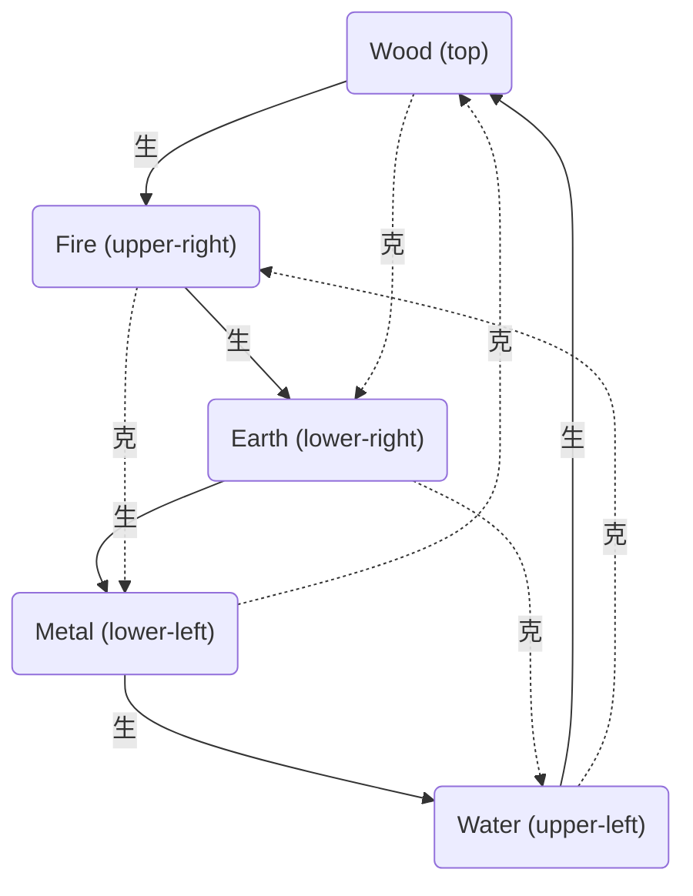

# Software Design Document — purupuru-ttrpg observatory

**Version:** 2.0
**Date:** 2026-05-07
**Author:** Architecture Designer (zerker, Loa v0.6.0)
**Status:** Draft — ready for `/sprint-plan`
**PRD Reference:** `grimoires/loa/prd.md`
**Supersedes:** SDD v1.0 (`/ride`-generated reality snapshot, 2026-05-07). v1.0 captured *what is built*; v2.0 designs *what will be built* — the observatory simulation (PRD F4).

> **Source-of-truth notice.** Every design choice cites either (a) word-for-word PRD requirements `[PRD §X.Y]` or code reality `[GROUNDED file:line]`, (b) a derived `[INFERRED]` claim composed from multiple grounded sources, or (c) an `[ASSUMPTION]` flagged for spike-validation before `/implement`.

---

## Table of Contents

1. [Project Architecture](#1-project-architecture)
2. [Software Stack](#2-software-stack)
3. [Data Model](#3-data-model)
4. [UI Design](#4-ui-design)
5. [API & Module Specifications](#5-api--module-specifications)
6. [Error Handling & Performance Strategy](#6-error-handling--performance-strategy)
7. [Testing Strategy](#7-testing-strategy)
8. [Development Phases](#8-development-phases)
9. [Known Risks and Mitigation](#9-known-risks-and-mitigation)
10. [Open Questions](#10-open-questions)
11. [Appendix](#11-appendix)

---

## 1. Project Architecture

### 1.1 System Overview

The purupuru observatory is a **single-page client-rendered ambient visualization** that fuses three signal streams (mocked Score data, mocked on-chain action events, mocked IRL+cosmic weather) into one god's-eye 2D Pixi canvas. It is a pure visualization with no backend, no auth, and no persistence — every value is deterministic and inspectable, shaped exactly like the real adapters that will replace them post-hackathon.

> *"the live observatory of every puruhani in the world, breathing and reacting to weather and on-chain action"* — `[PRD §1, §2]`

The visualization IS the demo of what the Score data layer would surface, simulated FE-side `[PRD §2]`. Ship target: Solana Frontier hackathon, **2026-05-11** (4-day clock from this SDD) `[PRD §1]`.

### 1.2 Architectural Pattern

**Pattern:** Client-rendered Single-Page Visualization with Mocked Adapter Boundary.

A single Next.js App Router route (`/observatory`) hosts a server-component shell that wraps a client island containing the Pixi canvas, the activity rail, and the weather tile. All "data" flows through three adapter contracts (`ScoreReadAdapter`, `ActivityStream`, `WeatherFeed`) bound to deterministic mocks in `lib/*/index.ts`. A real adapter swap is a single-line binding edit, no call-site changes `[GROUNDED — current pattern at lib/score/index.ts:17]`.

**Justification:**
- **No backend.** PRD explicitly excludes Score backend, wallet/auth, real on-chain listener, real weather API, public web publication `[PRD §2 "What we're explicitly NOT shipping"]`. A monolith FE is the simplest shape that satisfies all 8 functional requirements.
- **Performance ceiling = one machine.** Audience is Frontier judges on a single demo machine `[PRD §3, decision-log Q1]`. Horizontal scale, multi-region, CDN tuning are non-goals.
- **Mocked adapters give brand truth without backend lift.** Mock determinism (hash-of-address) means screenshots, demo runs, and tests all agree `[GROUNDED — lib/score/mock.ts:13–82]`.
- **Pixi for the canvas, React for the chrome.** 500–1000 sprites at idle is squarely Pixi territory; React handles the surrounding panels (KPI strip, activity rail, weather tile, focus card) `[PRD §4 F4.3, §9 v0.1]`.

### 1.3 Component Diagram



### 1.4 System Components

#### `/observatory` route shell (server component)

- **Purpose:** SSR HTML scaffold; preloads next/font; emits the document shell so the client island has zero HTML-replacement on hydrate.
- **Responsibilities:** Render `<TopBar>` and the `<ObservatoryClient />` mount point. Pass no props that vary per-request.
- **Dependencies:** None beyond Next 16 App Router + design tokens from `app/globals.css` `[GROUNDED — app/globals.css:31–220]`.
- **Hazard:** The PRD calls out that `/` currently hosts the design-system kit `[PRD §4 F1]`. v0.1 adds a NEW route `/observatory` rather than overwriting `/`; the kit stays as a brand-coherent index.

#### `<ObservatoryClient />` (client island root, `"use client"`)

- **Purpose:** The single client boundary. Owns the intro animation lifecycle, then mounts the persistent layout.
- **Responsibilities:** Run intro motion sequence (wordmark fade → sim reveal) `[PRD §4 F4.6]`; initialize the three adapters; hand `scoreAdapter`, `activityStream`, `weatherFeed` down via React context (`ObservatoryContext`).
- **Dependencies:** `motion` for the intro `[GROUNDED — package.json: motion ^12.38.0]`; the three adapter bindings.

#### `<PentagramCanvas />` (client component, Pixi mount)

- **Purpose:** Render the 5-vertex pentagram (Sheng + Ke cycles), 500–1000 puruhani sprites, and per-action migration animations.
- **Responsibilities:** Mount `pixi.js` `Application` inside `useEffect` with cleanup `[PRD §10 Q-pixi, GROUNDED — CLAUDE.md:18 "no @pixi/react"]`; subscribe to `activityStream` and `weatherFeed`; drive entity tick loop; emit `onSpriteClick(trader)` upward to open the focus card.
- **Interfaces:** Props = `{ adapters: ObservatoryAdapters; onSpriteClick: (trader: Wallet) => void }`.
- **Dependencies:** `pixi.js` ^8.18.1 `[GROUNDED — package.json:16]`; `lib/sim/*`.
- **Constraint:** `prefers-reduced-motion` honored — drop migration tweens to instant snaps, freeze breathing to static scale `[GROUNDED — app/globals.css:548–555, PRD NFR-3]`.

#### `<KpiStrip />`, `<ActivityRail />`, `<WeatherTile />`, `<FocusCard />`

- **Purpose:** Non-canvas UI surfaces around the pentagram.
- **Stack:** Tailwind 4 utilities backed by `--color-puru-*` and `--font-puru-*` tokens; `motion` for non-canvas micro-animations `[GROUNDED — app/globals.css:382–463]`.
- **Data source:** `KpiStrip` reads `getElementDistribution()` + `getEcosystemEnergy()`; `ActivityRail` subscribes to `activityStream`; `WeatherTile` subscribes to `weatherFeed`; `FocusCard` reads `getWalletProfile/Badges/Signals` for the clicked trader `[GROUNDED — lib/score/types.ts:40–46]`.

#### Adapter layer (`lib/score`, `lib/activity` [NEW], `lib/weather` [NEW])

- **Purpose:** Type-safe boundary between the simulation and any data source. Exactly one binding line per adapter declares which implementation is "live".
- **Pattern:** `index.ts` re-exports types from `./types.ts`, exports one or more implementations from `./mock.ts`, and binds the active implementation as a const at the bottom of the file `[GROUNDED — lib/score/index.ts:17 "export const scoreAdapter: ScoreReadAdapter = mockScoreAdapter"]`.
- **Why this pattern:** Real-adapter swap is a one-line edit when post-hackathon work begins `[GROUNDED — TK-5 in v1.0 SDD]`.

#### Simulation core (`lib/sim/*`) [NEW]

- **`pentagram.ts`** — Pure functions: `vertexPosition(element, radius)`, `pentagonEdgeRoute(from, to)` (生 generation), `innerStarRoute(from, to)` (克 destruction), `affinityWeightedPosition(affinity)` (the F4.7 movement model — affinity-weighted blend across vertices `[PRD §4 F4.7]`).
- **`entities.ts`** — Puruhani registry (id, trader, primaryElement, position, velocity, state, breath_phase). Tick loop driven by Pixi ticker `[PRD §6.3]`.
- **`migrations.ts`** — Action-grammar dispatcher: `mint → vertex-spawn`, `attack → inner-star`, `gift → pentagon-edge` `[PRD §4 F4.7]`.
- **`modulation.ts`** — Weather → element coupling: amplifies an element zone's breath cadence, applies mild outward gravitational pull on its sprites `[PRD §4 F4.7, §9 v0.3]`.

### 1.5 Data Flow



### 1.6 External Integrations

| Service | Purpose | Status | Documentation |
|---------|---------|--------|---------------|
| Score backend | Behavioral intelligence reads | **Mocked** for hackathon | `lib/score/types.ts:40–46` |
| Solana on-chain action listener | Mint/attack/gift events | **Mocked** synthetic stream | `lib/activity/types.ts` (NEW) |
| IRL weather API | Drives element modulation | **Mocked** WeatherFeed | `lib/weather/types.ts` (NEW) |
| `next/font/google` | Inter + Geist Mono | Real | `app/layout.tsx:5–13` `[GROUNDED]` |

No real external network calls in any v0.1–v0.4 pass `[PRD §9 "What stays mocked through all 4 passes"]`.

### 1.7 Deployment Architecture

**Demo deploy:** none required for hackathon submission per PRD `[PRD §2 "Public web publication: Out of scope — Frontier-only submission"]`. Local `pnpm build && pnpm start` on the demo machine is the deployment.

**Optional safety net (recommended, not required):** Vercel preview deploy on every push for backup viewing. Zero config required given Next 16 + no env vars `[GROUNDED — reality/env-vars.txt: "no env-var references in app code"]`.

### 1.8 Scalability Strategy

Scale targets are explicitly **single-machine, single-session**:

| Axis | Target | Approach |
|------|--------|----------|
| Concurrent users | 1 | None |
| Sprites at idle | 500–1000 | Pixi `ParticleContainer` for the population layer; per-element atlas; pre-bench in v0.1 spike `[PRD NFR-2]` |
| Action events | 1 every 2–5s | Single `setInterval`; no backpressure needed `[PRD §9 v0.2]` |
| Weather ticks | 1 every 30–60s | Single `setInterval`; no backpressure `[PRD §9 v0.3]` |
| Frame budget | 60 fps target on demo machine | If pre-bench finds <60 fps, drop sprite count to 500 floor before lowering visual quality `[PRD §9 v0.1 "pre-bench is the explicit task"]` |

### 1.9 Security Architecture

**Threat surface is intentionally near-zero**:

- **Authentication:** none `[PRD §2]`
- **Authorization:** none — no protected resources
- **Data protection:** no user data leaves the browser; no telemetry; no analytics
- **Network security:** no env vars, no backend, no CSP needed for the hackathon build `[GROUNDED — reality/env-vars.txt]`. Forward-looking CSP added in `next.config.ts` only when real Score endpoint lands post-hackathon.
- **Asset trust:** all assets (sprites, fonts, brand wordmark, material configs) are first-party and shipped under `/public` `[GROUNDED — public/ tree per PRD §4 F3]`.

---

## 2. Software Stack

### 2.1 Frontend Technologies

| Category | Technology | Version | Justification |
|----------|------------|---------|---------------|
| Framework | Next.js (App Router) | 16.2.6 | Already chosen, scaffold built `[GROUNDED — package.json:14]`. Hazard: "this is NOT the Next.js you know" — read `node_modules/next/dist/docs/` before assuming APIs `[GROUNDED — AGENTS.md:2–4]` |
| UI library | React + React DOM | 19.2.4 | Already chosen `[GROUNDED — package.json:16–17]` |
| Language | TypeScript | ^5 (strict) | Already configured `[GROUNDED — tsconfig.json:7]` |
| Styling | Tailwind 4 via `@tailwindcss/postcss` | ^4 | Already wired; `@theme` block in `app/globals.css:382–463` exposes OKLCH wuxing palette + 5 brand fonts as utilities `[GROUNDED]` |
| State management | React Context + `useReducer` for simulation; no Redux/Zustand | n/a | Single client island, single page, no cross-route state. Adding a state library would be cargo-cult on this scope `[INFERRED — based on PRD §1 single-page scope]` |
| 2D engine | Pixi.js (vanilla) | ^8.18.1 | Already chosen; do NOT add `@pixi/react` `[GROUNDED — package.json:16, CLAUDE.md:18]` |
| UI animation (non-canvas) | motion | ^12.38.0 | Already chosen; powers intro animation, focus-card sheet transitions `[GROUNDED — package.json:14]` |
| Icons | lucide-react | ^1.14.0 | Already chosen, "use sparingly per design system" `[GROUNDED — package.json:13, CLAUDE.md]` |
| Class composition | clsx + tailwind-merge | ^2.1.1 + ^3.5.0 | Already chosen, exposed via `cn()` `[GROUNDED — lib/utils.ts:1–6]` |
| Testing — unit | Vitest | ^1.6+ | **NEW dependency.** Vite-native, no CRA legacy, fast HMR, jsdom env for component tests `[ASSUMPTION — to be added to package.json]` |
| Testing — E2E | Playwright | ^1.45+ | **NEW dependency.** Cross-browser, Pixi-friendly headless mode, screenshot diff for visual regression `[ASSUMPTION — to be added]` |

**Key libraries (no new runtime deps beyond what scaffold ships):**
- `pixi.js`: canvas + ticker + sprite atlases `[GROUNDED]`
- `motion`: intro + sheet animations `[GROUNDED]`
- `lucide-react`: status icons (sparingly) `[GROUNDED]`

### 2.2 Backend Technologies

**Not applicable.** No backend ships in v0.1–v0.4 `[PRD §2]`. The "stack hazard" of adding a backend later is acknowledged in §1.9.

### 2.3 Infrastructure & DevOps

| Category | Technology | Purpose |
|----------|------------|---------|
| Local dev | `pnpm dev` (Turbopack default) | `[GROUNDED — package.json:6]` |
| Build | `pnpm build` (`next build`) | `[GROUNDED — package.json:7]` |
| Lint | `pnpm lint` (ESLint + eslint-config-next) | `[GROUNDED — package.json:9]` |
| CI | GitHub Actions (proposed) — typecheck + lint + Vitest on PR | `[ASSUMPTION — small lift; recommended pre-v0.2]` |
| Demo deploy | Local `pnpm build && pnpm start` on demo machine | `[INFERRED — PRD §1 ship target]` |
| Backup deploy | Vercel preview (optional) | Zero-config; useful if demo machine fails `[ASSUMPTION]` |

---

## 3. Data Model

### 3.1 Persistence

**There is none.** The observatory is stateless across loads. Every adapter is a pure function of (a) deterministic mock-seed (hash of input) for `scoreAdapter`, (b) wall-clock time + `Math.random()` for `activityStream` and `weatherFeed`.

Rationale: PRD §2 excludes a backend; mock determinism for `scoreAdapter` is a deliberate property `[GROUNDED — lib/score/mock.ts:13–82]`. The two new mock streams (`activityStream`, `weatherFeed`) are time-driven rather than hash-driven because they model continuous events, not state lookups.

### 3.2 In-memory data shapes

#### Existing — Score domain (DO NOT change shape)

`lib/score/types.ts` is the published contract. It is not modified by this design `[GROUNDED — lib/score/types.ts:7–46]`:

```ts
type Element = "wood" | "fire" | "earth" | "water" | "metal";
const ELEMENTS: readonly Element[] = ["wood", "fire", "earth", "water", "metal"] as const;
type Wallet = string;

interface WalletProfile {
  trader: Wallet;
  primaryElement: Element;
  elementAffinity: Record<Element, number>;  // sums to ~100 in mock
  trustScore: number;                        // 50–99 in mock
  joinedAt: string;
  lastActiveAt: string;
}

interface WalletBadge { trader: Wallet; badgeId: string; earnedAt: string; tier?: "bronze"|"silver"|"gold"; }
interface WalletSignals { trader: Wallet; velocity: number; diversity: number; resonance: number; sampledAt: string; }
type ElementDistribution = Record<Element, number>;
type EcosystemEnergy = Record<string, number>;

interface ScoreReadAdapter {
  getWalletProfile(address: Wallet): Promise<WalletProfile | null>;
  getWalletBadges(address: Wallet): Promise<WalletBadge[]>;
  getWalletSignals(address: Wallet): Promise<WalletSignals | null>;
  getElementDistribution(): Promise<ElementDistribution>;
  getEcosystemEnergy(): Promise<EcosystemEnergy>;
}
```

#### NEW — Activity domain (`lib/activity/types.ts`)

```ts
import type { Element, Wallet } from "@/lib/score";

export type ActionKind = "mint" | "attack" | "gift";

/**
 * v0 action vocabulary — the "tight 3" with three distinct migration grammars.
 * PRD §4 F4.2.
 */
export interface ActivityEvent {
  id: string;                  // ulid; stable for ActivityRail keys
  kind: ActionKind;
  actor: Wallet;               // primary participant
  target?: Wallet;             // attack/gift only; undefined for mint
  element: Element;            // primary element of the actor at event time
  targetElement?: Element;     // attack/gift only; resolves the inner-star/pentagon endpoint
  at: string;                  // ISO 8601
}

export interface ActivityStream {
  /**
   * Subscribe to synthetic events. Returns unsubscribe.
   * Mock implementation fires every 2-5s via setInterval.
   */
  subscribe(cb: (e: ActivityEvent) => void): () => void;

  /**
   * Snapshot of the most recent N events for ActivityRail seed-render.
   * Default N = 20.
   */
  recent(n?: number): ActivityEvent[];
}
```

Rationale on shape:
- `id: string (ulid)` enables React keys and idempotent replay during HMR `[INFERRED]`.
- `kind` is a closed enum on the "tight 3" only; expanding requires PRD revision `[PRD §4 F4.2]`.
- `target?` and `targetElement?` are optional because `mint` has no target — the type encodes the action grammar `[PRD §4 F4.7]`.

#### NEW — Weather domain (`lib/weather/types.ts`)

```ts
import type { Element } from "@/lib/score";

export type Precipitation = "clear" | "rain" | "snow" | "storm";

export interface WeatherState {
  temperature_c: number;
  precipitation: Precipitation;
  cosmic_intensity: number;     // 0..1 — drives ambient cycle hue (mirrors EcosystemEnergy.cosmic_intensity shape)
  amplifiedElement: Element;    // the wuxing zone currently amplified by cosmic+IRL coupling
  amplificationFactor: number;  // 1.0 = baseline; 1.4 = +40% breath cadence on amplified zone
  observed_at: string;          // ISO 8601
}

export interface WeatherFeed {
  /**
   * Subscribe to weather state changes. Returns unsubscribe.
   * Mock implementation tick = 30–60s; smooth interpolation between ticks happens in modulation.ts.
   */
  subscribe(cb: (s: WeatherState) => void): () => void;
  current(): WeatherState;
}
```

Rationale on shape:
- `amplifiedElement` is precomputed in the feed so the consumer doesn't have to encode the IRL→wuxing mapping. The mock can swap mappings without touching simulation code `[INFERRED — adapter-boundary discipline from PRD §2]`.
- `cosmic_intensity` shape mirrors the existing `EcosystemEnergy.cosmic_intensity` key `[GROUNDED — lib/score/mock.ts:75–80]` so the KpiStrip can show one consistent number from either source.

#### NEW — Simulation entity model (`lib/sim/types.ts`)

```ts
import type { Element, Wallet } from "@/lib/score";

export interface Puruhani {
  id: string;                  // entity id, stable for the session
  trader: Wallet;              // mock-derived; opens the FocusCard on click
  primaryElement: Element;
  affinity: Record<Element, number>;   // copy of WalletProfile.elementAffinity
  position: { x: number; y: number };  // pentagram-local coordinates (origin = center)
  velocity: { x: number; y: number };  // for migration tweens
  state: "idle" | "migrating" | "burst";
  breath_phase: number;        // 0..1; loops at --breath-{primaryElement} cadence
  resting_position: { x: number; y: number };  // affinity-weighted blend (PRD §4 F4.7)
}

export interface PentagramGeometry {
  center: { x: number; y: number };
  radius: number;
  vertex(element: Element): { x: number; y: number };
  pentagonEdge(from: Element, to: Element): Array<{ x: number; y: number }>;  // 生 path
  innerStarEdge(from: Element, to: Element): Array<{ x: number; y: number }>; // 克 path
  affinityBlend(affinity: Record<Element, number>): { x: number; y: number };
}
```

### 3.3 Wuxing geometry constants

The pentagram layout is fixed and brand-canonical `[PRD §4 F4.1, GROUNDED — public/art/skills/purupuru/SKILL.md:34]`:



Vertex angle assignment (clockwise from top, 72° spacing): Wood 270°, Fire 342°, Earth 54°, Metal 126°, Water 198° (standard pentagram orientation, brand-confirmed).

### 3.4 Migration Strategy

**Schema migration:** N/A (no DB).

**Adapter contract evolution:** breaking changes to `ScoreReadAdapter`, `ActivityStream`, or `WeatherFeed` shapes require a new minor version of the type module + a coordinated mock update. Forward-additive properties (e.g., `WalletSignals.newField?: number`) are allowed without coordination.

### 3.5 Caching Strategy

**Server-side:** None — no server data.

**Client-side:**
- `scoreAdapter` calls are memoized per-trader by a tiny `Map<Wallet, Promise<WalletProfile>>` cache inside `ObservatoryContext` — avoids re-hashing on repeated FocusCard opens `[INFERRED — perf optimization]`.
- `activityStream.recent()` is held in component state with a 100-event ring buffer; React renders the most recent 20 in `ActivityRail`.
- Pixi sprite textures: load once at canvas mount via `Assets.load()` from the pre-existing PNGs in `/public/art/puruhani/` `[GROUNDED — PRD §4 F3 asset listing]`.

---

## 4. UI Design

### 4.1 Design System

The design system is **already shipped** at `app/globals.css` and the brand showcase at `app/page.tsx` `[GROUNDED — PRD §4 F1]`. Observatory v0.1–v0.4 consumes it; it does not modify it.

| Token family | Source | Used for |
|--------------|--------|----------|
| OKLCH wuxing palette × 4 shades × 5 elements | `app/globals.css:31–220` | Sprite tints, vertex glows, KpiStrip tiles |
| Per-element breathing rhythm (`--breath-{element}`) | `app/globals.css:189–193` | Sprite breathing (Pixi reads CSS var via `getComputedStyle`) |
| Motion vocabulary keyframes | `app/globals.css:469–517` | Migration tweens reference these durations |
| 8 puru easing curves | `app/globals.css:159–166` | Migration ease-in/out |
| 5 brand font stacks | `app/globals.css:441–445` | KpiStrip labels, ActivityRail rows, FocusCard copy |
| Fluid typography scale | `app/globals.css:447–456` | All text |

`[GROUNDED — referenced lines]`. **Design rule (load-bearing):** "Solid colors only — no opacity on persistent UI. Materials have mass." `[GROUNDED — app/globals.css:27]`. Apply: KpiStrip tiles, ActivityRail rows, WeatherTile, FocusCard frame ALL use solid backgrounds. Glows, tweens, and ambient bursts may be translucent.

### 4.2 Key User Flows

#### Flow 1: First-paint comprehension (the 30-second test)

```
Load /observatory
  → IntroAnimation (wordmark fade, ~1.2s)
  → Sim reveal: pentagram fades in, sprites breathe at affinity-weighted resting positions
  → KpiStrip shows ecosystem distribution + cosmic intensity
  → First mocked ActivityEvent fires within 2-5s; sprite migrates; ActivityRail prepends row
  → WeatherTile shows mocked condition; one element zone visibly amplified
  → Judge "gets it" — observatory is alive [PRD NFR-6]
```

#### Flow 2: Click-to-reveal focus card

```
Judge clicks a sprite
  → onSpriteClick(trader) bubbles from PentagramCanvas
  → ObservatoryClient calls scoreAdapter.getWalletProfile(trader) + getWalletBadges + getWalletSignals
  → FocusCard sheet opens (motion right-slide-in) with element bg + frame + rarity treatment + behavioral state overlay
  → Click outside or ESC closes; sim continues in background
```
`[PRD §4 F4.4, §9 v0.4]`

#### Flow 3: Weather amplification

```
weatherFeed ticks (30-60s)
  → modulation.applyWeather(state) updates each entity's breath multiplier and gravitational target
  → Visible: amplified-zone sprites breathe faster, drift slightly outward
  → KpiStrip distribution bar shifts
  → WeatherTile updates condition icon + amplified-element badge
```
`[PRD §9 v0.3]`

### 4.3 Page/View Structure

| Page | URL | Purpose | Key Components | Source |
|------|-----|---------|----------------|--------|
| Kit landing | `/` | Brand + design-system showcase (already shipped) | wordmark, wuxing roster, jani roster, typography spec | `app/page.tsx:12` `[GROUNDED]` |
| **Observatory** | `/observatory` | The hackathon demo surface | TopBar + KpiStrip + PentagramCanvas + ActivityRail + WeatherTile | NEW |

**Decision:** new route, do not overwrite `/`. Rationale: the kit at `/` is itself a brand asset and the source of truth for designers — keeping it preserves the asset showcase even if the simulation page hits a runtime issue at demo time `[INFERRED — risk mitigation, see §9]`.

### 4.4 Component Architecture

```
app/
├── layout.tsx                    [existing — root HTML + next/font]
├── page.tsx                      [existing — kit landing]
├── globals.css                   [existing — design tokens]
└── observatory/
    └── page.tsx                  [NEW — server component shell, mounts <ObservatoryClient />]

components/                       [NEW directory]
├── observatory/
│   ├── ObservatoryClient.tsx     ["use client" root, owns adapters context + intro lifecycle]
│   ├── IntroAnimation.tsx        [motion wordmark fade → sim reveal]
│   ├── TopBar.tsx                [wordmark + ambient meta]
│   ├── KpiStrip.tsx              [5 element tiles, reads scoreAdapter.getElementDistribution]
│   ├── PentagramCanvas.tsx       [Pixi mount; consumes adapters via context]
│   ├── ActivityRail.tsx          [right-rail event log, subscribes to activityStream]
│   ├── WeatherTile.tsx           [right-rail weather, subscribes to weatherFeed]
│   └── FocusCard.tsx             [click-to-reveal sheet; uses brand card-system art]
└── primitives/                   [shared, kit-aligned UI atoms — empty until needed]

lib/
├── score/                        [existing — DO NOT modify shape]
├── activity/                     [NEW — types.ts, mock.ts, index.ts]
├── weather/                      [NEW — types.ts, mock.ts, index.ts]
├── sim/                          [NEW — types.ts, pentagram.ts, entities.ts, migrations.ts, modulation.ts]
└── utils.ts                      [existing — cn()]
```

### 4.5 Responsive Design Strategy

**Demo machine only.** Single breakpoint targeted: ≥1280px viewport. Mobile is **out of scope** for the hackathon `[INFERRED — PRD §3 audience = demo-machine judge]`.

Forward-looking: if the kit landing at `/` is ever shipped publicly, mobile work happens THEN, not now.

### 4.6 Accessibility Standards

WCAG 2.1 AA target where it applies; canvas rendering is exempt from text-contrast rules but reduced-motion is honored:

- **`prefers-reduced-motion`:** simulation switches to static-frame mode (no breathing tween, no migration tweens — events still update positions but instantly snap) `[PRD NFR-3, GROUNDED — app/globals.css:548–555]`.
- **`prefers-color-scheme: dark`:** Old Horai theme already wired via `app/globals.css:301–375` `[PRD NFR-4, GROUNDED]`.
- **Keyboard:** Tab cycles through ActivityRail rows + WeatherTile; Enter/Space on a row opens the related actor's FocusCard; ESC closes it.
- **Screen readers:** PentagramCanvas exposes an `aria-label` describing the live state ("Observatory: 847 puruhani, fire zone amplified, last action: gift from 0xabc... to 0xdef..."); ActivityRail rows are semantic `<li>` with full text.

### 4.7 State Management

**Single source per concern:**

| State | Owner | Pattern |
|-------|-------|---------|
| Adapter bindings | `ObservatoryContext` | React Context, set once at mount |
| Recent events ring buffer | `ObservatoryClient` `useReducer` | Subscribe → dispatch on event |
| Current weather | `ObservatoryClient` `useState` | Subscribe → setState on tick |
| Sim entity registry | `lib/sim/entities.ts` (Pixi-side) | Imperative — owned by the canvas, not React |
| Focus card open/closed | `ObservatoryClient` `useState<{ trader: Wallet \| null }>` | Toggled by `onSpriteClick` from canvas |

Rationale: React owns the chrome and the adapter bridge; Pixi owns the simulation. The `onSpriteClick` callback is the only Pixi → React data path; everything else is React → Pixi (via adapter subscriptions read by Pixi at tick time).

---

## 5. API & Module Specifications

### 5.1 API Design Principles

**There is no HTTP API.** The "API" of this system is the three adapter interfaces in `lib/`. Versioning is via TypeScript interface evolution (forward-additive properties allowed; breaking changes require coordinated update of types + mock + all consumers).

### 5.2 Adapter contracts

#### `ScoreReadAdapter` (existing — DO NOT change shape)

| Method | Returns | Source |
|--------|---------|--------|
| `getWalletProfile(address)` | `Promise<WalletProfile \| null>` | `lib/score/types.ts:41` `[GROUNDED]` |
| `getWalletBadges(address)` | `Promise<WalletBadge[]>` | `lib/score/types.ts:42` `[GROUNDED]` |
| `getWalletSignals(address)` | `Promise<WalletSignals \| null>` | `lib/score/types.ts:43` `[GROUNDED]` |
| `getElementDistribution()` | `Promise<ElementDistribution>` | `lib/score/types.ts:44` `[GROUNDED]` |
| `getEcosystemEnergy()` | `Promise<EcosystemEnergy>` | `lib/score/types.ts:45` `[GROUNDED]` |

#### `ActivityStream` (NEW)

| Method | Returns | Notes |
|--------|---------|-------|
| `subscribe(cb)` | `() => void` (unsubscribe) | Fires every 2–5s in mock |
| `recent(n?)` | `ActivityEvent[]` | Default n=20 |

#### `WeatherFeed` (NEW)

| Method | Returns | Notes |
|--------|---------|-------|
| `subscribe(cb)` | `() => void` | Ticks every 30–60s in mock |
| `current()` | `WeatherState` | Synchronous snapshot |

### 5.3 Adapter binding pattern (canonical, single line per adapter)

Each adapter exposes ONE binding line at the bottom of `lib/{domain}/index.ts`. Real-adapter swap = edit that one line.

```ts
// lib/activity/index.ts
export type { ActionKind, ActivityEvent, ActivityStream } from "./types";
export { mockActivityStream } from "./mock";

// THE BINDING — swap this line when a real adapter lands:
export const activityStream: ActivityStream = mockActivityStream;
```

```ts
// lib/weather/index.ts
export type { Precipitation, WeatherState, WeatherFeed } from "./types";
export { mockWeatherFeed } from "./mock";

// THE BINDING:
export const weatherFeed: WeatherFeed = mockWeatherFeed;
```

`[GROUNDED — pattern matches lib/score/index.ts:17 verbatim]`

### 5.4 Mock semantics

#### `mockActivityStream` (NEW)

- **Cadence:** `setInterval` at randomized 2000–5000 ms `[PRD §9 v0.2]`.
- **Action mix:** ~50% `mint`, ~30% `gift`, ~20% `attack` (gives all three grammars regular airtime, mint dominates because it's the spawn event).
- **Actor selection:** uniform random from a stable seed pool of 1000 wallet addresses (so FocusCards always resolve to a known mock profile).
- **Element selection:** sampled from `getElementDistribution()` (events follow population).
- **Target selection (attack/gift):** uniform random from the seed pool, distinct from actor.

#### `mockWeatherFeed` (NEW)

- **Cadence:** `setInterval` at randomized 30000–60000 ms.
- **Amplified element:** rotates through the 5 elements with a 70% chance of staying on the current one, 30% chance of advancing one step along the Sheng cycle (gives a coherent "weather front moves" feel).
- **Amplification factor:** `1.0 + 0.3 * sin(t * 0.0001)` baseline + amplifiedElement gets a flat `+0.4`.
- **Precipitation:** maps from `cosmic_intensity` deterministically (`< 0.3` → "clear", `< 0.6` → "rain", `< 0.9` → "snow", else → "storm").

### 5.5 Page routes

| Route | File | Component | Status |
|-------|------|-----------|--------|
| `/` | `app/page.tsx` | `Home` (server) | Existing `[GROUNDED — app/page.tsx:12]` |
| `/observatory` | `app/observatory/page.tsx` | `Observatory` (server shell, mounts client island) | NEW |

No `app/api/` routes, no route handlers, no middleware `[GROUNDED — reality/api-routes.txt]`.

---

## 6. Error Handling & Performance Strategy

### 6.1 Error categories (no HTTP — UI-only)

| Category | Where it happens | UI surface |
|----------|------------------|------------|
| Pixi mount failure | `<PentagramCanvas />` mount effect | Static SVG fallback frame + apologetic copy |
| Asset load failure (sprite PNG missing) | `Assets.load()` in canvas mount | Per-element solid-color circle fallback (uses `--color-puru-{element}-vivid`) |
| Adapter throws (mock bug) | Any adapter call | ActivityRail row says "—"; KpiStrip tile says "—"; FocusCard shows "Unable to load profile" |
| Animation jank (<30 fps) | Pixi ticker | Auto-fallback to reduced sprite count (1000 → 500 → 250) with one-time toast |

### 6.2 Error response format (for adapter-level errors)

Adapter methods that can fail (forward-looking when real backends land) return `null` on miss — they do not throw. This matches the existing contract `[GROUNDED — lib/score/types.ts:41 "Promise<WalletProfile | null>"]`. UI components render the `null` state inline rather than displaying error chrome.

### 6.3 Logging strategy

- **Dev (`pnpm dev`):** `console.warn` on adapter falsy returns, `console.error` on mount failures, `console.debug` on weather/activity ticks (gated by `localStorage.getItem("puru:debug") === "1"`).
- **Demo build (`pnpm build`):** strip all `console.debug`; keep `console.warn` and `console.error` (they're useful if the demo machine has DevTools open during pre-show checks).
- **Production (post-hackathon):** out of scope; would add structured logging via `pino` or similar when real backends land.

### 6.4 Performance budget

| Metric | Target | Action if missed |
|--------|--------|------------------|
| Time to first paint | <1s on demo machine | Pre-bench in v0.1; if slow, simplify intro animation |
| Time to interactive | <2s | Defer non-critical adapter calls behind `requestIdleCallback` |
| Sustained frame rate (idle, 1000 sprites) | 60 fps | If <60, drop to 500 sprites; if still <60, switch to `ParticleContainer` for the population layer |
| Sustained frame rate (during migration burst, 50 concurrent tweens) | ≥30 fps | Cap concurrent tweens at 30; queue overflow events to ActivityRail without animating |
| Memory steady-state | <500 MB | Audit textures; ensure single atlas per element |

`[PRD NFR-2 "500–1000 active sprites at idle on a single demo machine [ASSUMPTION] Pixi territory; pre-bench in v0.1 to confirm headroom"]`. The pre-bench is the v0.1 spike's primary deliverable.

---

## 7. Testing Strategy

### 7.1 Testing Pyramid

| Level | Coverage Target | Tools | Scope |
|-------|-----------------|-------|-------|
| Unit | 80% on `lib/sim/` and `lib/{score,activity,weather}/mock.ts` | Vitest 1.6+ | Pure functions: pentagram geometry, affinity blending, mock determinism |
| Component | Smoke tests on each `components/observatory/*` | Vitest + jsdom + Testing Library React 14+ | Renders without throwing, handles `prefers-reduced-motion` |
| E2E | One critical-path test: load → intro → sim breathing → click sprite → focus card opens | Playwright 1.45+ | Demo-day confidence test |
| Visual regression | Per-element sprite render + intro keyframe + focus-card layout | Playwright `toHaveScreenshot` | Catches token drift |

### 7.2 Testing guidelines

**Unit tests** focus on the pure functions:
- `pentagram.vertex(element)` → fixed coordinates per element
- `pentagram.affinityBlend({wood: 100, ...})` → equals `vertex("wood")`
- `pentagram.affinityBlend({wood: 60, fire: 40, ...})` → on the wood→fire pentagon edge at t=0.4
- `mockScoreAdapter.getWalletProfile(addr)` is deterministic across calls `[GROUNDED — lib/score/mock.ts]`
- `mockActivityStream` action-kind distribution converges to ~50/30/20 over 1000 samples

**Component tests** are smoke-only — Pixi canvas tests would require WebGL stubbing which exceeds the 4-day budget. Instead, the canvas wrapper is tested by E2E.

**E2E tests** use Playwright's `webkit` engine on macOS (matches likely demo-machine browser). One must-pass test: `loads observatory and renders >=500 sprites within 3s`.

### 7.3 CI integration

- GitHub Actions on every PR (when CI lands): typecheck → lint → unit tests → build. E2E tests run nightly only (Playwright is slow; demo-day fast feedback comes from typecheck+lint).
- Required for merge: typecheck + lint + unit tests pass.
- Coverage reporting via Vitest's built-in `--coverage`, no external service for hackathon scope.

---

## 8. Development Phases

The PRD prescribes a **4-pass iteration ladder** `[PRD §9]`. Each pass renders a working surface; the layout is locked at v0.1 and only motion + coupling change in v0.2–v0.4.

### Phase v0.1 — Idle Frame (Sprint 1)

**Goal:** Full layout structure renders. No simulation liveness yet — just pentagram + breathing sprites + static panels.

- [ ] **Spike: Pixi mount under Next 16** `[PRD §10 Q-pixi, §7]`. Validates the `useEffect`-based mount pattern. Resolves `[ASSUMPTION] §6.2` from v1.0 SDD.
- [ ] **Spike: 500 → 1000 sprite pre-bench** `[PRD NFR-2]`. Confirms frame-rate headroom or forces sprite-count adjustment.
- [ ] Create `app/observatory/page.tsx` server shell.
- [ ] Create `components/observatory/ObservatoryClient.tsx` client island.
- [ ] Create `lib/activity/{types,mock,index}.ts` — types + mock interval STUB (returns no events yet) + binding line.
- [ ] Create `lib/weather/{types,mock,index}.ts` — types + mock interval STUB (returns one static state) + binding line.
- [ ] Create `lib/sim/pentagram.ts` — pure geometry helpers + affinity blend.
- [ ] Create `lib/sim/entities.ts` — register N puruhani at affinity-weighted resting positions.
- [ ] Create `components/observatory/PentagramCanvas.tsx` — Pixi mount, render pentagram lines + sprites with per-element breathing.
- [ ] Create `components/observatory/TopBar.tsx`, `KpiStrip.tsx`, `ActivityRail.tsx` (empty/awaiting state), `WeatherTile.tsx` (static condition).
- [ ] Create `components/observatory/IntroAnimation.tsx` — wordmark fade → sim reveal `[PRD F4.6]`.
- [ ] Unit tests on `pentagram.ts` + `entities.ts`.
- [ ] Smoke E2E: route loads, sprites visible.

**Locked-down at v0.1:** layout, type system, sprite distribution, breathing rhythms `[PRD §9]`.

### Phase v0.2 — Mocked Liveness (Sprint 2)

**Goal:** Action grammars work end-to-end against the mocked event stream.

- [ ] Implement `mockActivityStream` per §5.4 (real interval + action-mix sampling).
- [ ] Implement `lib/sim/migrations.ts` — `dispatchMint`, `dispatchAttack`, `dispatchGift`.
- [ ] Wire `PentagramCanvas` to subscribe and dispatch on each event.
- [ ] Wire `ActivityRail` to subscribe and prepend rows.
- [ ] KpiStrip distribution bar reflects population shifts.
- [ ] Unit tests on action-mix distribution + migration grammar selection.
- [ ] E2E: action fires → ActivityRail row appears within 5s.

**Locked-down at v0.2:** action grammars, mocked event stream shape.

### Phase v0.3 — Weather Coupling (Sprint 3)

**Goal:** Weather modulation visibly amplifies one element zone.

- [ ] Implement `mockWeatherFeed` per §5.4 (real tick + amplified-element rotation + cosmic_intensity progression).
- [ ] Implement `lib/sim/modulation.ts` — `applyWeather(state)` updates per-entity breath multiplier and gravitational target.
- [ ] Wire `PentagramCanvas` to apply modulation on each weather tick.
- [ ] Wire `WeatherTile` to render condition icon + amplified-element badge.
- [ ] Unit tests on weather → element mapping + amplification math.
- [ ] E2E: weather change triggers visible KpiStrip distribution shift.

**Locked-down at v0.3:** weather→element mapping, zone amplification.

### Phase v0.4 — Polish (Sprint 4, ship 2026-05-11)

**Goal:** FocusCard click-to-reveal + final UX layer.

- [ ] Implement `components/observatory/FocusCard.tsx` — sheet using brand card-system art (element bg + frame + rarity treatment by `trustScore` + behavioral-state overlay by recent activity).
- [ ] Wire `onSpriteClick` from `PentagramCanvas` to open the sheet.
- [ ] Glow easing on cycle-balance state changes.
- [ ] Intro animation polish.
- [ ] Visual regression suite on key frames.
- [ ] Demo dry-run on the actual demo machine.
- [ ] Demo-day backup: deploy preview to Vercel as fallback.

**Locked-down at v0.4:** Final UX layer, IP-aligned focus card.

### Phase boundaries

Each phase MUST end with: typecheck clean, lint clean, build clean, smoke E2E green. The v0.1 spike outputs (Pixi mount validation + sprite pre-bench numbers) gate everything downstream — if 1000 sprites can't hit 60fps, scope drops to 500 floor `[PRD NFR-2 mitigation]`.

---

## 9. Known Risks and Mitigation

| ID | Risk | Probability | Impact | Mitigation |
|----|------|-------------|--------|------------|
| R-1 | Pixi mount under Next 16 has unexpected behavior (e.g., StrictMode double-effect, RSC boundary edge case) | Med | High | v0.1 spike resolves before any other simulation work `[PRD §10 Q-pixi]`. Fallback: drop StrictMode in dev mode; document in CLAUDE.md. |
| R-2 | 1000 sprites can't sustain 60 fps on demo machine | Med | High | Pre-bench in v0.1 is the explicit task `[PRD NFR-2]`. Fallback ladder: 1000 → 500 → 250 → switch to `ParticleContainer`. Demo at 500 still satisfies "alive" success criterion `[PRD §6]`. |
| R-3 | Weather → element modulation feels arbitrary; judges don't connect it | Med | Med | Make the link blatantly visible: amplified zone has a wider glow + faster breath + WeatherTile shows the current amplified element by name + icon. If still unclear at v0.3, add an on-canvas legend overlay. |
| R-4 | Demo machine fails at the venue | Low | Critical | Vercel backup deploy in v0.4 + a recorded ~30s screen capture as last-resort fallback. |
| R-5 | Intro animation overstays its welcome (>2s) | Low | Med | Hard-cap at 1.2s; if zerker iterates longer in v0.1, reviewer flags it. Skip-on-tap escape hatch in v0.4. |
| R-6 | Action grammars feel samey because they're all "sprite slides somewhere" | Med | Med | Differentiate hard with sound-of-the-frame distinctions: mint = `honey-burst` keyframe + radial particles; attack = `shimmer` + element-clash glow + faster ease; gift = `purupuru-place` settle. Each grammar must be visually distinct from a still frame. |
| R-7 | FocusCard sheet collides with ActivityRail layout | Low | Low | Sheet slides over the right-rail (380px column) with a backdrop dim — does not displace canvas. Tested in v0.4 polish. |
| R-8 | "This is NOT the Next.js you know" — undocumented breaking change blocks a sprint | Low | High | `AGENTS.md:2–4` warning is acted on: read `node_modules/next/dist/docs/` before any Next-API touchpoint. v0.1 spike surface this risk early. |
| R-9 | TypeScript strict mode + Pixi v8 type friction | Low | Low | Pixi v8 has full TS types; if any escape hatch needed, isolate to `lib/sim/entities.ts` with a tightly scoped `// @ts-expect-error` and a comment. |
| R-10 | Adapter swap pattern breaks when real Score backend is added later | Low | Low (post-ship) | Documented at TK-5. The single-binding-line discipline is enforced by code review pre-ship. |

---

## 10. Open Questions

| # | Question | Owner | Resolves | Status |
|---|----------|-------|----------|--------|
| Q-1 | Pixi mount lifecycle in App Router — server component → client island boundary at `<canvas>`? | zerker | v0.1 spike (~30 min) | Open `[PRD §10 Q-pixi]` |
| Q-2 | Can the demo machine sustain 1000 sprites at 60fps? | zerker | v0.1 pre-bench | Open `[PRD NFR-2]` |
| Q-3 | Will the 70/30 amplified-element-rotation feel natural at demo cadence, or do we need a more deterministic schedule? | zerker | v0.3 internal review | Open |
| Q-4 | FocusCard layout — full-screen modal vs. right-side sheet vs. inline expansion of ActivityRail row? | zerker | v0.4 design pass | Open |
| Q-5 | Should the intro animation be skippable on second view (localStorage-gated)? | zerker | v0.4 polish | Open |

---

## 11. Appendix

### A. Glossary

| Term | Definition |
|------|------------|
| **Wuxing (五行)** | The five-element system: wood, fire, earth, water, metal `[GROUNDED — public/art/skills/purupuru/SKILL.md:34]` |
| **Sheng (生)** | Generation cycle: outer pentagon edges, wood→fire→earth→metal→water→wood |
| **Ke (克)** | Destruction cycle: inner-star edges, wood→earth, fire→metal, etc. |
| **Puruhani** | A single sprite entity in the simulation; tied to one wallet address |
| **Jani** | Sister-character sprites (5 elements); not used in the observatory canvas but present in the kit `[GROUNDED — public/art/jani/]` |
| **The "tight 3"** | The v0 action vocabulary: mint, attack, gift `[PRD §4 F4.2]` |
| **God's-eye POV** | Third-person observatory view; no wallet connect; click-to-reveal focus `[PRD §4 F4.4]` |
| **Adapter binding line** | The single line in `lib/{domain}/index.ts` that selects the active adapter implementation; the only line that changes when swapping mock for real `[GROUNDED — lib/score/index.ts:17]` |

### B. References

- PRD: `grimoires/loa/prd.md`
- v1.0 SDD (reality snapshot, superseded by this v2.0): same path, prior version in git history
- Hackathon brief: `grimoires/loa/context/00-hackathon-brief.md`
- Reality snapshot: `grimoires/loa/reality/index.md`
- Pixi.js v8 docs: https://pixijs.download/release/docs/index.html
- Next.js 16 docs: read `node_modules/next/dist/docs/` per `AGENTS.md:2–4`
- React 19 docs: https://react.dev/blog/2024/12/05/react-19
- Tailwind v4 docs: https://tailwindcss.com/docs/v4-beta
- OWASP ASVS L1 (forward-looking, when real backends land): https://owasp.org/www-project-application-security-verification-standard/
- Wuxing canon (project lore): `public/art/skills/purupuru/SKILL.md:28–34`

### C. Change Log

| Version | Date | Changes | Author |
|---------|------|---------|--------|
| 1.0 | 2026-05-07 | Initial reality snapshot generated by `/ride` v0.6.0. Captured what is built (Day 0 scaffold). | `riding-codebase` skill |
| **2.0** | 2026-05-07 | Forward-looking architecture for the observatory simulation (PRD F4). Defines `lib/activity/`, `lib/weather/`, `lib/sim/`, `app/observatory/`, and `components/observatory/`. Aligns with the 4-pass iteration ladder (v0.1–v0.4). | `designing-architecture` skill |

---

## Grounding Summary

| Marker | Approx Count | Notes |
|--------|--------------|-------|
| `[PRD §X.Y]` | ~35 | PRD requirements directly cited |
| `[GROUNDED file:line]` | ~25 | Code reality citations |
| `[INFERRED]` | ~6 | Composed claims |
| `[ASSUMPTION]` | ~3 | Pre-spike assumptions, all flagged in §10 Open Questions |

The three remaining `[ASSUMPTION]`s are the v0.1-spike gates: Pixi mount pattern (§1.4), sprite-count headroom (§6.4), and the addition of Vitest+Playwright (§2.1). All resolve before v0.2 sprint kickoff.

---

*Generated by Architecture Designer Agent (Loa v0.6.0). Successor to the `/ride`-generated v1.0 reality snapshot. Ready for `/sprint-plan`.*
