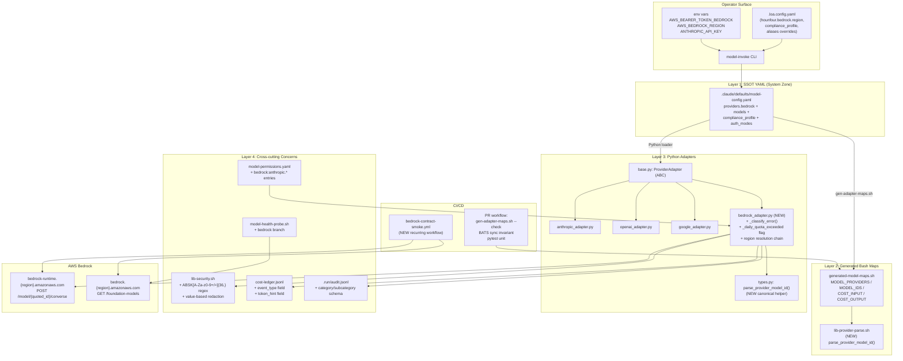

# Software Design Document: AWS Bedrock Provider + Provider-Plugin Hardening (cycle-096)

**Version:** 1.2 (live-probe ground-truth integrated)
**Date:** 2026-05-02
**Author:** Architecture Designer (deep-name + Claude Opus 4.7 1M)
**Status:** Draft — Flatline + Sprint 0 partial probes integrated; awaiting Sprint 0 close
**PRD Reference:** `grimoires/loa/prd.md` (v1.3 — live-probe ground-truth integrated)

> **v1.1 → v1.2 changes** (live probes against real Bedrock 2026-05-02; matches PRD v1.3 + sprint v1.2 wave):
> - **§3.1**: Day-1 model IDs corrected — `us.anthropic.claude-opus-4-7` (no `-v1:0`); `us.anthropic.claude-sonnet-4-6` (no suffix); Haiku 4.5 keeps `us.anthropic.claude-haiku-4-5-20251001-v1:0`. Bare `anthropic.*` IDs return HTTP 400 — inference profile IDs REQUIRED
> - **§5.1 response shape**: usage block is camelCase with prompt-cache fields (`inputTokens, outputTokens, totalTokens, cacheReadInputTokens, cacheWriteInputTokens, serverToolUsage`) + `metrics.latencyMs` + `stopReason`. Adapter normalization translates camelCase → cheval `Usage` snake_case
> - **§6.1 Error Taxonomy**: 7 → 9 categories. Added `OnDemandNotSupported` (HTTP 400 — bare ID; surface as `ConfigurationError`, no retry, profile-ID guidance) and `ModelEndOfLife` (HTTP 404 — vendor retirement). Wrong model name returns HTTP 400 not 404 — error-classifier branches on body content not just status
> - **§6.4.1 Secret Redaction**: regex `ABSKY[A-Za-z0-9+/=]{32,}` → `ABSK[A-Za-z0-9+/=]{36,}` (broader; trial token starts `ABSKR`)
> - **§6.6 Thinking traces format**: Bedrock requires `additionalModelRequestFields.thinking.type: "adaptive"` + `output_config.effort` (NOT direct-Anthropic `enabled` + `budget_tokens` — returns HTTP 400). FR-13: adapter translates per-provider
> - **New OQ-11 + §1.10**: `global.anthropic.*` inference profiles documented as alternative to `us.anthropic.*` (cross-region inc. non-US) — operator selects via `hounfour.bedrock.inference_profile_namespace: us | global`
> - **§5.4 Parser**: Opus 4.7 + Sonnet 4.6 profile IDs DO NOT contain colons (no datestamp suffix); Haiku 4.5 still does. Parser test cases cover both shapes; colon-handling stays load-bearing for Haiku + any model using older naming
> Source: 10 probe captures at `tests/fixtures/bedrock/probes/` (redacted). No re-Flatline.
**Source issue:** [#652](https://github.com/0xHoneyJar/loa/issues/652)
**Cycle:** `cycle-096-aws-bedrock` (active in ledger; cycle-095 archived 2026-05-02)

> **v1.0 → v1.1 changes** (Flatline pass at `grimoires/loa/a2a/flatline/sdd-cycle-096-review.json` — 100% agreement, 5 BLOCKERS + 5 HIGH-CONSENSUS, integrated wholesale, then stopped per Kaironic finding-rotation pattern):
> - **§3.1 + §6.2** (BLOCKER SKP-003): Added explicit versioned `fallback_to` mapping field on bedrock model entries; loader rejects `prefer_bedrock` when no exact mapping declared
> - **§5.5** (BLOCKER SKP-004): CI smoke hardened — required status signal for scheduled runs, secret-presence enforcement, weekly model rotation
> - **§6.4 + new §6.4.1** (BLOCKER SKP-001 regex): Promoted value-based redaction to **primary** defense; regex `ABSK[A-Za-z0-9+/=]{36,}` becomes secondary with length-based fallback regex; sample-based unit test on rotated tokens
> - **§7.4 + §8 Phase 0** (BLOCKER SKP-001 contract gating): Sprint 0 outputs `bedrock-contract-v1.json` versioned artifact; Sprint 1 imports as fixture; explicit go/no-go criteria
> - **New §9.1 NFR-Sec11** (BLOCKER SKP-002): Token lifecycle runtime controls — age/expiry metadata checks, rotation-reminder warnings, short-lived credential mode design
> - **New §1.10 + §6.6** (HIGH-CONSENSUS IMP-001/002/003/004/008): Bedrock feature flag, circuit-breaker concurrency semantics, token-rotation cache invalidation, streaming-out-of-scope-v1 declaration, total-deadline retry semantics

---

## Scope note

This is an **infrastructure addition SDD**, not a greenfield-product SDD. The system already exists (Loa framework, cheval Python adapter, model registry SSOT, generated bash maps, health probe, secret redaction, model permissions). Cycle-096 adds a fourth provider (`bedrock`) and codifies the six-edit-site provider-plugin contract. Bedrock-specific design choices required by the PRD (compliance-aware fallback, per-capability `api_format`, region-prefixed model IDs, colon-handling parser, error taxonomy, recurring CI contract smoke) are locked here.

UI Design (template §4) is **N/A** — no user-facing UI ships in this cycle. The only operator-facing surface is `.loa.config.yaml` (config), `AWS_BEARER_TOKEN_BEDROCK` / `AWS_BEDROCK_REGION` (env vars), `model-invoke` CLI flags, and the markdown plugin guide (FR-9). Frontend stack table (§2.1) is N/A for the same reason.

The sections that do load-bearing work in this cycle:

| Template § | Reframed for cycle-096 | Status |
|---|---|---|
| §1 Architecture | Four-layer provider plugin architecture extended with `bedrock` + the centralized parser + recurring CI smoke harness | Full design |
| §2 Software Stack | cheval Python adapter, httpx, yq, bash, pytest, BATS, GitHub Actions | Full design |
| §3 Database | YAML registry schema (`model-config.yaml`) — bedrock entry shape + `compliance_profile` + per-capability `api_format` | Concrete schema |
| §4 UI | N/A — operator surface table | Operator surface table |
| §5 API | Bedrock Converse + ListFoundationModels HTTP contract + cheval `complete()` contract + parser contract | Full design |
| §6 Errors | Bedrock error taxonomy + retry classifier + circuit breaker + compliance-aware fallback | Full design |
| §7 Testing | Pytest unit + live-gated integration + BATS extensions + cross-language parser property test + recurring CI smoke | Full design |
| §8 Phases | Sprint 0 (Contract Verification Spike) + Sprint 1 (v1 functional) + Sprint 2 (plugin guide + IR runbook) | Full design |
| §9 Risks | Architectural risks (parser drift, CI smoke cost, schema evolution, cycle-094 G-7 compatibility) | Full design |
| §10 Open Questions | /architect-phase decisions + items needing explicit lock-down | Full design |

---

## Table of Contents

1. [Project Architecture](#1-project-architecture)
2. [Software Stack](#2-software-stack)
3. [Registry Schema (Database Equivalent)](#3-registry-schema-database-equivalent)
4. [Operator Surface](#4-operator-surface)
5. [API & Adapter Specifications](#5-api--adapter-specifications)
6. [Error Handling & Resilience](#6-error-handling--resilience)
7. [Testing Strategy](#7-testing-strategy)
8. [Development Phases](#8-development-phases)
9. [Known Risks and Mitigation](#9-known-risks-and-mitigation)
10. [Open Questions](#10-open-questions)
11. [Appendix](#11-appendix)

---

## 1. Project Architecture

### 1.1 System Overview

> Quote from PRD §Technical Considerations: "The Bedrock adapter slots into the existing four-layer provider plugin architecture" (`prd.md:818`).

Loa dispatches model calls through **cheval**, a Python provider-abstraction layer at `.claude/adapters/loa_cheval/`. Cheval reads a YAML registry (`.claude/defaults/model-config.yaml`) that catalogues providers, models, aliases, agent bindings, and pricing. A bash mirror (`.claude/scripts/generated-model-maps.sh`) is **derived** from the YAML via `gen-adapter-maps.sh` and serves bash-side callers (`model-adapter.sh`, `red-team-model-adapter.sh`, `flatline-orchestrator.sh`). The registry is the single source of truth (SSOT) for both paths.

cycle-096 introduces a new provider entry (`bedrock`), a new Python adapter class (`BedrockAdapter`), four cross-cutting layer extensions (permissions, secret-redaction, health-probe, cost-ledger event types), and **two new architectural primitives** that Flatline pass #2 routed to the SDD:

1. **Centralized colon-bearing model ID parser** (closes Flatline v1.1 SKP-006) — a single canonical `parse_provider_model_id()` helper, sourced from one location in bash and imported from one location in Python, used by every callsite that splits a `provider:model-id` string.
2. **Recurring CI contract smoke** (closes Flatline v1.1 SKP-002 + IMP-005) — a fixture-diffed smoke workflow that re-runs a small subset of Sprint 0's G-S0-2 contract probes on a schedule, to catch silent vendor drift between Sprint 1 ship and a future fault.

Both primitives are general (not Bedrock-specific): the parser benefits all providers; the CI smoke harness can be extended to other providers in follow-up cycles.

### 1.2 Architectural Pattern

**Pattern:** Hexagonal adapter pattern (already in place — cheval is the hexagonal core; provider adapters are outward ports). cycle-096 extends the existing pattern; it does not introduce a new style.

**Justification:** The PRD mandates "Each sprint independently mergeable" (PRD §Constraints, mirrored from cycle-095) and "no Sprint-N depends on Sprint-(N+M)". Hexagonal adapters allow orthogonal changes: Sprint 1 adds a new outward port (`bedrock_adapter.py`) without touching the existing three; Sprint 2 adds documentation + value-based redaction without touching Sprint 1's adapter contract. The pattern also preserves the cycle-094 G-7 cross-map invariant — a new provider is an additive entry in the SSOT, not a structural mutation.

### 1.3 Component Diagram (Layer view, post-cycle-096)



**Diff vs pre-cycle-096:**
- Layer 2 gains `lib-provider-parse.sh` (new file, sourced by `gen-adapter-maps.sh`, `model-adapter.sh`, `red-team-model-adapter.sh`, `flatline-orchestrator.sh`)
- Layer 3 gains `bedrock_adapter.py` and elevates a parser helper into `types.py` (Python callers import once)
- Layer 4: existing files extended additively (no rewrites)
- CI gains a single new workflow (`bedrock-contract-smoke.yml`)

### 1.4 System Components

#### 1.4.1 `BedrockAdapter` (Python)

- **Purpose:** Subclass of `ProviderAdapter` that handles Bedrock Converse API requests with Bearer-token auth.
- **Responsibilities:**
  - Resolve region (per-request → env → config default).
  - URL-encode the colon-bearing model ID into the request URL (`urllib.parse.quote(model_id, safe='')`).
  - Wrap tool schemas with the Bedrock-specific `{ json: <schema> }` envelope.
  - Normalize Bedrock Converse responses (`output.message.content[]`, `usage.inputTokens` / `usage.outputTokens` — camelCase) into Loa's canonical `CompletionResult` (snake_case `input_tokens` / `output_tokens`).
  - Classify errors via `_classify_error()` per Bedrock error taxonomy (FR-11).
  - Maintain process-scoped `_daily_quota_exceeded` circuit breaker.
  - Single-retry on empty `content[]` 200 OK, then surface `EmptyResponseError`.
- **Interfaces:** `complete()`, `validate_config()`, `health_check()`, `_classify_error()` (new abstract-method-equivalent helper).
- **Dependencies:** `base.ProviderAdapter`, `base.http_post`, `loa_cheval.types` (for canonical types and the new `parse_provider_model_id` helper), `lib-security.sh` value-based redaction (via stderr filtering).

#### 1.4.2 `lib-provider-parse.sh` (Bash)

- **Purpose:** Single canonical bash helper for splitting `provider:model-id` strings, replacing duplicated logic in four bash files.
- **Responsibilities:**
  - Provide `parse_provider_model_id "$input" provider_var model_id_var` that splits on the **first colon only**, populating two named output variables.
  - Surface clear errors for malformed input (empty input, no colon, empty provider, empty model component).
  - Be sourced — never executed directly. Top-level only declares functions and constants.
- **Interfaces:**
  - `parse_provider_model_id <input> <provider_out> <model_id_out>` — exit 0 on success, exit 2 with stderr message on malformed input.
  - `is_valid_provider_model_id <input>` — exit 0 if parseable, exit non-zero otherwise (silent check).
- **Dependencies:** None (pure bash 4+).
- **Sourced by:** `gen-adapter-maps.sh`, `model-adapter.sh`, `red-team-model-adapter.sh`, `flatline-orchestrator.sh`. Each refactor migrates a duplicated `IFS=:` / `awk -F:` pattern to one call.

#### 1.4.3 `loa_cheval.types.parse_provider_model_id` (Python)

- **Purpose:** Python counterpart to `lib-provider-parse.sh::parse_provider_model_id`. Same contract.
- **Responsibilities:**
  - Pure function: `parse_provider_model_id(s: str) -> tuple[str, str]`.
  - Split on first colon only.
  - Raise `ValueError` (subclass of `loa_cheval.types.InvalidInputError` for routing) on empty input, no colon, empty provider, or empty model component.
- **Interfaces:** `parse_provider_model_id(s: str) -> tuple[str, str]`; `is_valid_provider_model_id(s: str) -> bool`.
- **Dependencies:** None (stdlib only).
- **Used by:** `loa_cheval.routing.*`, `loa_cheval.config.loader`, `BedrockAdapter`, `validate_model_registry()`.

#### 1.4.4 Recurring CI Contract Smoke (`bedrock-contract-smoke.yml`)

- **Purpose:** Re-run the most fault-bearing subset of Sprint 0 G-S0-2 contract probes on a schedule, with fixture-diffing, to detect silent vendor drift in the Bedrock Converse response shape.
- **Responsibilities:**
  - On schedule (daily at 06:00 UTC, weekday-only initially) **and** on `pull_request` paths-changed for `.claude/adapters/loa_cheval/providers/bedrock_adapter.py` or `.claude/defaults/model-config.yaml`.
  - Run two probes against live Bedrock: minimal Converse and tool-schema Converse (G-S0-2 probes #2 and #3).
  - Record responses to `tests/fixtures/bedrock/recurring/` and diff against committed baseline.
  - On shape change → fail loud (PR-blocking on path-trigger; opens an issue on schedule-trigger).
  - Cost-cap each run at $0.50 micro-USD; abort + alert if exceeded.
  - Skip cleanly when `AWS_BEARER_TOKEN_BEDROCK_CI` org secret is absent (fork-PR no-keys precedent from cycle-094 G-E2E).
- **Interfaces:** GitHub Actions workflow file at `.github/workflows/bedrock-contract-smoke.yml`.
- **Dependencies:** Sprint 0 G-S0-2 baseline fixtures committed to `tests/fixtures/bedrock/recurring/`.

#### 1.4.5 Compliance Profile Loader Logic

- **Purpose:** Implement the deterministic 4-step defaulting rule for `compliance_profile` (PRD §G-S0-3).
- **Responsibilities:**
  - On every config load, evaluate the rule in order: explicit override → Bedrock-only auth posture → dual-credential posture → unset (irrelevant).
  - Emit one-shot stderr migration notice on first detection of `AWS_BEARER_TOKEN_BEDROCK` without explicit `compliance_profile`.
  - Wire the resolved value into `BedrockAdapter` so a Bedrock outage raises `ProviderUnavailableError` (fail-closed) under `bedrock_only`, falls back with stderr+ledger warning under `prefer_bedrock`, or falls back silently under `none`.
- **Interfaces:** `loa_cheval.config.compliance.resolve_compliance_profile(yaml_value, env) -> str`.
- **Dependencies:** `loa_cheval.config.loader`, `BedrockAdapter`.

### 1.5 Data Flow

**Successful Bedrock completion (UC-1):**

1. User invokes `model-invoke --agent flatline-reviewer --model bedrock:us.anthropic.claude-opus-4-7 --input <file>`.
2. CLI calls into cheval; cheval's loader resolves `bedrock:` to the registry entry via `parse_provider_model_id` → `("bedrock", "us.anthropic.claude-opus-4-7")`.
3. Loader consults `compliance_profile` defaulting rule and resolves the effective value.
4. Loader instantiates `BedrockAdapter(config)`.
5. Adapter resolves region (request.extras > `AWS_BEDROCK_REGION` env > YAML `region_default`).
6. Adapter resolves `auth` LazyValue → `AWS_BEARER_TOKEN_BEDROCK` value (via `_get_auth_header()` in `base.py`).
7. Adapter constructs the Converse URL: `https://bedrock-runtime.{region}.amazonaws.com/model/{urllib.parse.quote(model_id, safe='')}/converse`.
8. Adapter constructs the Converse body (`messages`, `inferenceConfig`, `system`, optional `toolConfig` with `{ json: <schema> }` wrapping).
9. Adapter calls `http_post(url, headers={"Authorization": "Bearer <token>", "Content-Type": "application/json"}, body=body)`.
10. On 2xx: adapter normalizes response to `CompletionResult`, writes a `cost-ledger.jsonl` entry with `provider: bedrock`, `event_type: completion`, `token_hint` (first call from this token only).
11. On 4xx/5xx/quota: `_classify_error()` decides retry/no-retry/circuit-break; outcome surfaces via the appropriate `loa_cheval.types.*Error` class.
12. Audit log entries written for compliance-relevant events (`token_revoked` on 401/403, `daily_quota_exceeded` on circuit-break, `fallback_cross_provider_warned` on `prefer_bedrock` fallback).

**Bedrock outage with `compliance_profile: bedrock_only` (NFR-R1 fail-closed):**

1. Steps 1–9 as above.
2. `http_post` returns 5xx → `_classify_error` returns `retry` → exponential backoff exhausts.
3. Adapter raises `ProviderUnavailableError("bedrock", "<status>: <message>")`.
4. cheval routing layer consults `compliance_profile`: `bedrock_only` → no fallback; surface error to caller.
5. Audit log records `category: compliance, subcategory: fallback_blocked_compliance` (no `subcategory: fallback_cross_provider_warned` because no fallback occurred).
6. CLI exits non-zero with the actionable error.

**Bedrock outage with `compliance_profile: prefer_bedrock` (NFR-R1 warned-fallback):**

1. Steps 1–4 as above.
2. cheval routing layer: `prefer_bedrock` → look up the corresponding direct-provider model (e.g., `bedrock:us.anthropic.claude-opus-4-7` → `anthropic:claude-opus-4-7`) via the new `_compliance_fallback_target()` helper.
3. Re-dispatch to `AnthropicAdapter` with the equivalent request.
4. Audit log: `category: compliance, subcategory: fallback_cross_provider_warned`. Cost ledger: `event_type: fallback_cross_provider, fallback: cross_provider`. Stderr emits a clear one-line warning.

### 1.6 External Integrations

| Service | Purpose | API Type | Endpoint Pattern | Documentation |
|---|---|---|---|---|
| AWS Bedrock Runtime | Inference (Converse) | HTTPS POST | `bedrock-runtime.{region}.amazonaws.com/model/{quoted_id}/converse` | https://docs.aws.amazon.com/bedrock/latest/APIReference/API_runtime_Converse.html |
| AWS Bedrock Control Plane | Health probe (foundation models list) | HTTPS GET | `bedrock.{region}.amazonaws.com/foundation-models` | https://docs.aws.amazon.com/bedrock/latest/APIReference/API_ListFoundationModels.html |
| AWS Bedrock Console | API Key generation | User flow (manual) | https://console.aws.amazon.com/bedrock/ | (verify URL at sprint time) |
| Loa cost-ledger | Cost metering with provider tag | Local file (append JSONL) | `grimoires/loa/a2a/cost-ledger.jsonl` | Internal |
| Loa audit log | Compliance + auth events | Local file (append JSONL) | `.run/audit.jsonl` | Internal (`.claude/protocols/`) |
| GitHub Actions (CI) | Recurring contract smoke | YAML workflow | `.github/workflows/bedrock-contract-smoke.yml` | https://docs.github.com/en/actions |

### 1.7 Deployment Architecture

cycle-096 ships as **additive code changes inside the Loa repository** — no infrastructure provisioning, no service deployment. The downstream consumer surface is unchanged: existing Loa users see no breaking change (NFR-Compat1), and Bedrock users opt in by setting the new env var.

The **recurring CI smoke** (§1.4.4) requires one new GitHub org secret: `AWS_BEARER_TOKEN_BEDROCK_CI`. Setup is a one-time maintainer action documented in the FR-9 plugin guide.

### 1.8 Scalability Strategy

- **No new horizontal scaling concerns:** The adapter is stateless; concurrent invocations follow existing `concurrency.py` patterns.
- **No vertical scaling concerns:** Per-request memory footprint is comparable to existing adapters (Bedrock Converse responses are similar in size to direct Anthropic Messages responses).
- **Auto-scaling N/A:** Bedrock-side scaling is AWS's responsibility; per-account quotas are documented but not actively managed by Loa beyond the daily-quota circuit breaker.
- **Rate-limit handling:** Existing retry primitives (`base.http_post`, `retry.py`) apply unchanged. `_classify_error()` adds Bedrock-specific signal interpretation on top.

### 1.9 Security Architecture

**Authentication:**
- v1: `Authorization: Bearer <AWS_BEARER_TOKEN_BEDROCK>` — long-lived token from AWS Console.
- v2 (designed, not built): SigV4 (rejected by loader in v1 with a clear "not yet supported" error).

**Authorization:**
- New trust-scope entries in `model-permissions.yaml` for each `bedrock:anthropic.*` model — mirror existing `anthropic:*` entries (data_access: none, financial: none, autonomous-allowed: yes).

**Data Protection:**
- TLS 1.2+ (httpx default) on all Bedrock egress.
- Two-layer secret redaction (NFR-Sec2 + NFR-Sec10):
  - **Layer 1** (regex in `_SECRET_PATTERNS`): `ABSK[A-Za-z0-9+/=]{36,}` for AWS Bedrock API Keys.
  - **Layer 2** (value-based, new): any string equal to the resolved env var value is replaced with `[REDACTED]`. Implementation: `redact_secrets()` reads `AWS_BEARER_TOKEN_BEDROCK` (and other registered tokens) and treats the literal value as an additional pattern. Mandatory defense-in-depth — both layers fire on every redaction call.

**Network Security:**
- AWS-side: bedrock egress originates from the user's environment; Loa makes no claim on VPC endpoints (operator's choice).
- Loa-side: no new ingress; all changes are outbound HTTPS.

**Key Lifecycle (NFR-Sec6 / Sec7 / Sec8 / Sec9):**
- **Rotation cadence:** Documented ≤ 90 days in operator runbook (FR-9 plugin guide section).
- **Revocation procedure:** AWS Console revocation + env var unset + Loa process restart + `model-health-probe.sh --invalidate bedrock` cache flush.
- **Detection signals:** `cost-ledger.jsonl` event_type taxonomy (`completion` | `fallback_cross_provider` | `circuit_breaker_trip` | `token_rotation`); `.run/audit.jsonl` category/subcategory taxonomy.
- **Incident-response runbook ownership:** Loa maintainer (`@janitooor` per CODEOWNERS) — runbook is part of FR-9.

---

## 2. Software Stack

### 2.1 Frontend Technologies

**N/A** — no UI ships in this cycle. Operator surface is YAML config, env vars, and CLI flags (see §4).

### 2.2 Backend Technologies

| Category | Technology | Version | Justification |
|---|---|---|---|
| Language | Python | ≥ 3.9 | Existing Loa floor; httpx requires it (`base.py:30-99`). Reproducibility: `pyproject.toml` pins. |
| HTTP client | httpx | (existing pin in `pyproject.toml`) | Already in stack; no new dependency. URL-encoding via `urllib.parse.quote()` for the colon-bearing model ID. |
| HTTP client (fallback) | urllib (stdlib) | bundled | Existing fallback path in `base.py:30-99` covers environments without httpx. |
| Provider abstraction | `loa_cheval.providers.ProviderAdapter` | in-tree | Hexagonal port pattern; subclass adds bedrock-specific Converse logic. |
| Auth resolution | `loa_cheval.types.LazyValue` | in-tree | Existing pattern (`{env:VAR}` strings resolved at call time); no change. |
| YAML | yq v4+ | (existing pin in `.loa.config.yaml`) | All registry mutations use yq; no hand-edits to generated maps. |
| Bash | bash ≥ 4.0 | (existing) | `lib-provider-parse.sh` uses associative arrays + named output variables (bash 4 features). |
| Testing (Python) | pytest | (existing pin) | All adapter unit tests follow existing `tests/unit/providers/test_*.py` patterns. |
| Testing (bash) | BATS | (existing) | Cross-map invariant + parser cross-language tests in `tests/integration/`. |

**Key Libraries (no new heavyweight deps in v1):**
- `httpx` — already present.
- `urllib` (stdlib) — already used as fallback.
- `urllib.parse.quote` — already used; new callsite for bedrock model ID URL-encoding.

**Considered and rejected for v1:**
- `boto3` — only needed for SigV4/IAM. Deferred to v2 (FR-4). `requirements-bedrock-sigv4.txt` reserved as a side-installable in the future cycle.
- `botocore`, `aws-requests-auth`, `requests-aws4auth` — same rationale.

### 2.3 Infrastructure & DevOps

| Category | Technology | Purpose |
|---|---|---|
| CI/CD | GitHub Actions | (Existing) PR validation; (NEW) `bedrock-contract-smoke.yml` recurring contract probe |
| Test orchestration | `gen-adapter-maps.sh --check`, `bats tests/integration/`, `pytest tests/unit/providers/`, `pytest tests/integration/` | (Existing) Cross-map invariant + adapter unit + live-gated integration |
| Secret management | GitHub org secret `AWS_BEARER_TOKEN_BEDROCK_CI` | Bedrock token for the recurring CI smoke; gated on availability (skip cleanly when absent — fork-PR no-keys precedent) |
| Logging | `cost-ledger.jsonl` + `.run/audit.jsonl` (append-only JSONL) | Existing infra; new event types and category/subcategory values added additively |
| Monitoring | Maintainer-side review of CI smoke output | Cycle-094 G-7 invariant test catches drift; recurring smoke catches vendor drift |

---

## 3. Registry Schema (Database Equivalent)

> The "database" in this cycle is the YAML SSOT (`model-config.yaml`). Schema additions are additive.

### 3.1 Provider Entry (PRD FR-1)

```yaml
providers:
  bedrock:
    type: bedrock                                    # Adapter discriminator (NEW value)
    endpoint: "https://bedrock-runtime.{region}.amazonaws.com"
    region_default: us-east-1                        # Overridable per-user via .loa.config.yaml
    auth: "{env:AWS_BEARER_TOKEN_BEDROCK}"           # v1: Bearer-token API key
    auth_modes:
      - api_key                                      # implemented in v1
      - sigv4                                        # designed only; loader rejects with clear error in v1
    compliance_profile: null                         # Resolved at config-load by 4-step defaulting rule (PRD §G-S0-3)
                                                     # Allowed values: bedrock_only | prefer_bedrock | none
    connect_timeout: 10                              # Seconds (mirror existing providers)
    read_timeout: 120                                # Seconds (vision-capable; matches base default)
    models:
      "us.anthropic.claude-opus-4-7":           # Region-prefixed Bedrock model ID — final value from G-S0-2 probe #1
        capabilities: [chat, tools, function_calling, thinking_traces]
        context_window: 200000
        token_param: max_tokens
        api_format:                                  # Per-capability dispatch (PRD FR-1 / SKP-002)
          chat: converse
          tools: converse
          thinking_traces: converse                  # Falls back to 'invoke' if G-S0-2 probe #4 shows gap
          function_calling: converse
        params:
          temperature_supported: false               # Mirrors direct Anthropic Opus 4 (#641); verify in G-S0-2
        pricing:
          input_per_mtok: <Bedrock-rate>             # Live-fetched at Sprint 1 start
          output_per_mtok: <Bedrock-rate>
        # NEW v1.1 (Flatline BLOCKER SKP-003): Versioned fallback mapping. The loader rejects
        # `compliance_profile: prefer_bedrock` for any model that lacks `fallback_to`. No heuristic
        # name-matching, no inference — only what's declared here is allowed as a fallback target.
        fallback_to: "anthropic:claude-opus-4-7"      # Direct-Anthropic equivalent; declared explicitly
        fallback_mapping_version: 1                   # Bumps when AWS or Anthropic introduce subtle behavior delta
      "us.anthropic.claude-sonnet-4-6":
        # ... same shape as above with Sonnet-specific values
        fallback_to: "anthropic:claude-sonnet-4-6"
        fallback_mapping_version: 1
      "us.anthropic.claude-haiku-4-5-20251001-v1:0":
        # ... same shape with Haiku-specific values
        fallback_to: "anthropic:claude-haiku-4-5-20251001"
        fallback_mapping_version: 1
```

**Validation invariants (run by `validate_model_registry()` and BATS sync test):**
- Every `providers.<name>.models.<model_id>` key must contain at most one colon when joined as `<provider>:<model_id>` — and bedrock entries deliberately violate this naturalness; the parser splits on FIRST colon only (§5.4).
- Every `providers.bedrock.models.<id>` must declare an `api_format` map (not a scalar string) with at minimum a `chat` key.
- `compliance_profile` field, if present, must be one of `null | "bedrock_only" | "prefer_bedrock" | "none"`. `null` triggers the 4-step defaulting rule.
- `auth_modes` must be a list; only `api_key` is honored in v1, `sigv4` triggers a "not yet supported" loader error.

### 3.2 Trust-Scope Entries (`.claude/data/model-permissions.yaml`)

For each Bedrock-Anthropic model, add a peer entry to the existing `anthropic:claude-*` block. Trust scopes mirror direct Anthropic (data_access: none, financial: none, etc.). Template at `model-permissions.yaml:147-173`.

```yaml
"bedrock:us.anthropic.claude-opus-4-7":
  trust_level: high
  data_access: none
  financial: none
  autonomous_allowed: yes
  notes: "Bedrock-routed Anthropic Opus 4.7. Same trust posture as anthropic:claude-opus-4-7 (cycle-096)."
```

### 3.3 Generated Bash Maps (Layer 2)

`generated-model-maps.sh` carries four arrays. Bedrock entries appear in all four after `gen-adapter-maps.sh` regen:

| Array | Key | Value | Bedrock example |
|---|---|---|---|
| `MODEL_PROVIDERS` | `<provider>:<model_id>` | provider name | `["bedrock:us.anthropic.claude-opus-4-7"]="bedrock"` |
| `MODEL_IDS` | `<alias_or_full_id>` | provider model id | `["bedrock:us.anthropic.claude-opus-4-7"]="us.anthropic.claude-opus-4-7"` |
| `COST_INPUT` | `<provider>:<model_id>` | input $/MTok (decimal) | `["bedrock:us.anthropic.claude-opus-4-7"]="<Bedrock-rate>"` |
| `COST_OUTPUT` | `<provider>:<model_id>` | output $/MTok (decimal) | `["bedrock:us.anthropic.claude-opus-4-7"]="<Bedrock-rate>"` |

**Cycle-094 G-7 invariant compatibility:** The cross-map drift test (`tests/integration/model-registry-sync.bats`) compares keys across maps. A bedrock entry that contains an embedded colon (`...v1:0`) is a single key, not two — provided every callsite uses `parse_provider_model_id` which splits on the FIRST colon. The existing G-7 test asserts provider-value equality for shared keys; that semantic is preserved because keys are byte-identical strings, not parser-derived tuples. Sprint 1 acceptance includes a new BATS test `tests/integration/colon-bearing-model-ids.bats` covering all four arrays + the parser cross-language equivalence.

### 3.4 Schema Migration Strategy

**Loa-as-submodule downstream consumers (NFR-Compat2):**
- Net-new YAML fields (`region_default`, `auth_modes`, `compliance_profile`, per-capability `api_format`) are **additive** with safe defaults.
- The Python loader treats missing fields as `None` and falls back to the existing single-string `api_format` semantics for non-bedrock providers.
- The cycle-094 G-7 BATS invariant test continues to pass on existing entries (no shape change to existing rows).

**One-shot stderr migration notice:**
- On first config load that detects `AWS_BEARER_TOKEN_BEDROCK` set without an explicit `compliance_profile`, the loader emits a single stderr line naming the auto-defaulted profile and the override path.
- Implemented via a `~/.loa/seen-bedrock-default` sentinel file (or `LOA_CACHE_DIR/seen-bedrock-default`) so the notice fires once per user.

### 3.5 Data Access Patterns

| Query | Frequency | Optimization |
|---|---|---|
| Resolve `bedrock:<id>` → adapter class | Per request | In-memory dict (existing pattern); no DB |
| Compute `compliance_profile` default | Per config load | 4-step rule, O(1); migration notice cached via sentinel file |
| Health-probe lookup | Per request (cached) | Existing `model-health-probe.sh` cache (`.run/model-health-cache.json`) |
| Cost-ledger append | Per request | Append-only JSONL with `flock` (existing) |
| Audit-log append | On compliance/auth event | Append-only JSONL with `flock` (existing) |

### 3.6 Caching Strategy

- **No new cache layer.** Existing `model-health-probe.sh` cache covers Bedrock health state.
- **Sentinel file (one-shot migration notice):** `~/.loa/seen-bedrock-default` (or `LOA_CACHE_DIR/...`) — exists if migration notice has fired.
- **Process-scoped daily-quota flag:** `BedrockAdapter._daily_quota_exceeded` — boolean, lifetime = process. No persistence; restart resets.

### 3.7 Backup and Recovery

**N/A for the registry** — `.claude/defaults/model-config.yaml` is in git; recovery = `git checkout`. Generated bash maps are regenerated via `gen-adapter-maps.sh`; stale state is detectable via `--check` in CI.

---

## 4. Operator Surface

> §4 reframed for cycle-096 — no UI; operator surface is config + env + CLI + docs.

### 4.1 Configuration Surface

| Surface | Path / Variable | Purpose | Default | Override Precedence |
|---|---|---|---|---|
| User config | `.loa.config.yaml` → `hounfour.bedrock.region` | Override Bedrock region per-user | `us-east-1` (from registry `region_default`) | Lowest |
| User config | `.loa.config.yaml` → `hounfour.bedrock.compliance_profile` | Pin fallback policy | Resolved by 4-step rule | Highest (explicit user value wins) |
| User config | `.loa.config.yaml` → `hounfour.aliases.<alias>` | Retarget existing alias to a `bedrock:` model | not set | (Aliases-table override) |
| Env var | `AWS_BEARER_TOKEN_BEDROCK` | Bedrock API Key (Bearer token) | unset | Required for v1 |
| Env var | `AWS_BEDROCK_REGION` | Override region per-shell | unset | Above YAML, below per-request |
| Env var | `LOA_CACHE_DIR` (existing) | Sentinel-file location for one-shot notice | `~/.loa/cache` | Existing semantics |
| CLI | `model-invoke --agent <agent> --model bedrock:<id>` | Direct Bedrock invocation | n/a | Per-request `extras.region` highest |
| CLI | `model-health-probe.sh --invalidate bedrock` | Flush bedrock probe cache (revocation flow) | n/a | Operator action |

### 4.2 Documentation Surface

| Document | Location | Purpose |
|---|---|---|
| Provider-plugin guide | `grimoires/loa/proposals/adding-a-provider-guide.md` (FR-9, Sprint 2) | Worked-example walkthrough of all 6 edit sites |
| IR runbook | Same file, "If your Bedrock token is compromised" section (NFR-Sec9) | Detection / revocation / blast-radius assessment |
| CHANGELOG entry | `CHANGELOG.md` at PR-merge time | Cycle-096 user-visible additions |

### 4.3 Operator Flows (PRD §UX)

**First-time Bedrock setup:**
```
Generate Bedrock API Key in AWS Console
  → export AWS_BEARER_TOKEN_BEDROCK=<value>
  → (optional) edit .loa.config.yaml region
  → model-invoke --agent flatline-reviewer --model bedrock:us.anthropic.claude-opus-4-7 --input <file>
  → Completion returned; cost ledger entry written
```

**Migrate `opus` alias to Bedrock:**
```
Existing Loa setup with ANTHROPIC_API_KEY
  → AWS_BEARER_TOKEN_BEDROCK also set
  → Edit .loa.config.yaml: hounfour.aliases.opus: bedrock:us.anthropic.claude-opus-4-7
  → /implement sprint-N
  → All opus-using agents now route through Bedrock; no code change
```

**Token compromise / revocation:**
```
Suspect compromise (audit-log alert or unusual cost-ledger pattern)
  → AWS Console → Bedrock → API keys → Revoke (effective within minutes)
  → unset AWS_BEARER_TOKEN_BEDROCK
  → Restart Loa processes
  → .claude/scripts/model-health-probe.sh --invalidate bedrock
  → (Optional) Query cost-ledger.jsonl for token_hint values to bound blast radius
```

### 4.4 Accessibility (A11y, PRD §UX)

- All operator-facing error messages are plain text in monospace terminals (no ANSI-only formatting). Verified by existing CLI conventions.
- Documentation in standard markdown; no diagrams that lose meaning when read by a screen reader (Mermaid in this SDD is supplementary, not load-bearing).

---

## 5. API & Adapter Specifications

### 5.1 Bedrock Converse API (External)

**Endpoint:**
```
POST https://bedrock-runtime.{region}.amazonaws.com/model/{urllib.parse.quote(model_id, safe='')}/converse
```

**Headers:**
```http
Content-Type: application/json
Authorization: Bearer <AWS_BEARER_TOKEN_BEDROCK>
```

**Request body (canonical example):**
```json
{
  "messages": [
    {"role": "user", "content": [{"text": "Hello"}]}
  ],
  "system": [{"text": "You are a helpful assistant."}],
  "inferenceConfig": {
    "maxTokens": 1024
  },
  "toolConfig": {
    "tools": [
      {
        "toolSpec": {
          "name": "get_weather",
          "description": "Get current weather",
          "inputSchema": {
            "json": {
              "type": "object",
              "properties": {"location": {"type": "string"}},
              "required": ["location"]
            }
          }
        }
      }
    ]
  }
}
```

> **Critical Bedrock-specific gotcha (PRD FR-2):** `toolConfig.tools[].toolSpec.inputSchema` requires the `{ json: <schema> }` wrapper. Direct Anthropic API takes the JSON Schema directly. Failing to wrap silently breaks tool calling — covered by FR-2 unit test and §1.4.4 recurring smoke probe #3.

**Response (200 OK):**
```json
{
  "output": {
    "message": {
      "role": "assistant",
      "content": [{"text": "Hello! How can I help?"}]
    }
  },
  "usage": {
    "inputTokens": 12,
    "outputTokens": 8,
    "totalTokens": 20
  },
  "stopReason": "end_turn",
  "metrics": {"latencyMs": 423}
}
```

**Note camelCase vs snake_case:** Bedrock returns `inputTokens`/`outputTokens`; canonical `CompletionResult` uses `input_tokens`/`output_tokens`. Adapter normalizes.

### 5.2 Bedrock ListFoundationModels (Health Probe)

**Endpoint:**
```
GET https://bedrock.{region}.amazonaws.com/foundation-models
```

**Headers:** same as Converse.

**Used by:** `model-health-probe.sh` bedrock branch + `BedrockAdapter.health_check()`.

**Response shape:** Bedrock returns a list of models the account has access to. Probe success = HTTP 200 + non-empty list. Probe records AVAILABLE / UNAVAILABLE / UNKNOWN per existing vocabulary.

### 5.3 cheval `complete()` Contract (Internal)

`BedrockAdapter.complete(request: CompletionRequest) -> CompletionResult`

**Inputs:**
- `request.model` — full Bedrock model ID (e.g., `us.anthropic.claude-opus-4-7`).
- `request.messages` — Loa canonical message format.
- `request.tools` — optional list of tool specs (canonical shape; adapter wraps with `{ json: }`).
- `request.max_tokens`, `request.temperature` (gated by `temperature_supported` flag), etc.
- `request.extras.region` — optional per-request region override.

**Outputs (canonical `CompletionResult`):**
```python
@dataclass
class CompletionResult:
    text: str                    # Concatenated assistant content[].text
    usage: Usage                 # input_tokens, output_tokens (snake_case)
    model: str                   # Echo of request.model
    provider: str                # "bedrock"
    latency_ms: int
    raw: dict | None             # Unparsed Bedrock response (debug-only)
```

**Errors raised:**
- `ConfigError` — auth missing, malformed config, sigv4 requested in v1.
- `RateLimitError` — `ThrottlingException` (HTTP 429).
- `ProviderUnavailableError` — `ServiceUnavailableException` / 5xx after retry exhaustion / circuit-breaker tripped.
- `InvalidInputError` — `ValidationException` (HTTP 400).
- `AuthError` — `AccessDeniedException` (HTTP 403); the audit log records `subcategory: token_revoked`.
- `EmptyResponseError` (new) — empty `content[]` on 200 OK after one retry. Subclass of `ProviderError` so existing handlers catch it.
- `RegionMismatchError` (new, subclass of `ConfigError`) — user's region doesn't match the model's cross-region inference profile.

### 5.4 Centralized Parser Contract (`lib-provider-parse.sh` + `loa_cheval.types.parse_provider_model_id`)

**Bash signature (output via named variables):**
```bash
parse_provider_model_id <input> <provider_out_var> <model_id_out_var>
# Exit 0 on success; exit 2 with stderr message on malformed input.
# Splits on the FIRST colon. Everything after is the literal model_id.
```

**Python signature:**
```python
def parse_provider_model_id(s: str) -> tuple[str, str]:
    """Split provider:model_id on the first colon only.

    Raises:
        InvalidInputError: empty input, missing colon, empty provider, or empty model_id.
    """
```

**Test inputs (cross-language property test, `tests/integration/parser-cross-language.bats`):**

| Input | Expected `(provider, model_id)` | Bash exit | Python exit |
|---|---|---|---|
| `anthropic:claude-opus-4-7` | `("anthropic", "claude-opus-4-7")` | 0 | OK |
| `bedrock:us.anthropic.claude-opus-4-7` | `("bedrock", "us.anthropic.claude-opus-4-7")` | 0 | OK |
| `openai:gpt-5.5-pro` | `("openai", "gpt-5.5-pro")` | 0 | OK |
| `google:gemini-3.1-pro-preview` | `("google", "gemini-3.1-pro-preview")` | 0 | OK |
| (empty) | error | 2 | InvalidInputError |
| `:model-id` | error (empty provider) | 2 | InvalidInputError |
| `provider:` | error (empty model) | 2 | InvalidInputError |
| `no-colon-at-all` | error | 2 | InvalidInputError |
| `provider:multi:colon:value` | `("provider", "multi:colon:value")` | 0 | OK |

The cross-language test sources `lib-provider-parse.sh` and imports `loa_cheval.types.parse_provider_model_id`, runs both against the same input set, asserts equivalent outputs.

### 5.5 Recurring CI Smoke Workflow Contract

**File:** `.github/workflows/bedrock-contract-smoke.yml`

**Triggers:**
```yaml
on:
  schedule:
    - cron: '0 6 * * 1-5'    # 06:00 UTC weekdays
  pull_request:
    paths:
      - '.claude/adapters/loa_cheval/providers/bedrock_adapter.py'
      - '.claude/defaults/model-config.yaml'
      - 'tests/fixtures/bedrock/recurring/**'
  workflow_dispatch:
```

**Probe set (subset of Sprint 0 G-S0-2 + weekly rotation revised v1.1 per Flatline BLOCKER SKP-004):**
1. Minimal Converse — model rotates **weekly** through `[Haiku 4.5, Sonnet 4.6, Opus 4.7]` (week-of-year mod 3); broadens drift detection across the Day-1 model triplet rather than leaving Sonnet/Opus uncovered between sprint releases.
2. Tool-schema Converse — same weekly rotation, independent rotation seed (week-of-year mod 3 with offset 1) so probe #1 and probe #2 cover different models in any given week.
3. Capability rotation: every 4th week, probe #2 substitutes the tool-schema test with a thinking-trace probe (G-S0-2 probe #4 equivalent) to detect Bedrock thinking-trace shape drift.

**Cost cap (revised v1.1 per Flatline IMP-005):** $0.50 USD per run, enforced by:
- 16-token max output on probe #1.
- Single-tool minimal schema on probe #2.
- **Pre-flight cost estimate**: workflow computes expected cost from token-budget + price-table, rejects run if estimate exceeds cap before any API call lands.
- **Post-flight cost-ledger assertion**: workflow asserts cost-ledger entry `<= 500_000` micro-USD per run; aborts and opens issue if exceeded.
- **Monthly cost cap (NEW v1.1)**: aggregate `<= 15_000_000` micro-USD ($15) across all scheduled runs in a calendar month, asserted at workflow start by querying recent ledger entries; exceeded → workflow exits early with an issue.

**Required-status signal (NEW v1.1 per Flatline BLOCKER SKP-004):**

Scheduled runs without a Bedrock token are easy to miss — the workflow's "skip clean" behavior on missing secret is correct for fork PRs but can hide token rotation/expiry on the main repo's scheduled runs. To prevent silent skipping:

- Workflow has a `required_status` env: `BEDROCK_SMOKE_REQUIRE_TOKEN` (default `true` for scheduled, `false` for fork PR).
- If `required_status=true` AND secret absent → workflow **fails loudly** with stderr message: "Scheduled Bedrock contract smoke requires `secrets.AWS_BEARER_TOKEN_BEDROCK_CI` — token rotated or expired? Reconfigure secret or set env BEDROCK_SMOKE_REQUIRE_TOKEN=false to allow scheduled skips (not recommended)." Issue auto-opened with label `bedrock-contract-smoke-misconfigured`.
- This guarantees that token rotation/expiry can NOT silently disable drift detection on main.

**Fixture-diffing:**
- Captured response shapes live in `tests/fixtures/bedrock/recurring/probe-{1,2}-{model}-response.json` (sanitized: no token usage values, no IDs). Per-model fixtures because rotation means each week samples a different model.
- Diff focuses on **structural keys**, not values: `jq 'paths' <committed> > committed.paths; jq 'paths' <captured> > captured.paths; diff committed.paths captured.paths`.
- Drift = exit non-zero, fail the workflow with an actionable stderr message naming the changed path.

**Secret handling (revised v1.1 per Flatline BLOCKER SKP-004):**
- Token from `secrets.AWS_BEARER_TOKEN_BEDROCK_CI` (org secret); enforce presence as described in **Required-status signal** above.
- For fork PRs: secret absent is acceptable, workflow exits 0 cleanly with sentinel JSON `{"skipped": true, "reason": "no_ci_token", "fork_pr": true}`. Mirrors cycle-094 G-E2E precedent.
- Token is never echoed; `lib-security.sh redact_secrets` is sourced and applied to all logged output.

**Failure escalation:**
- PR-trigger → blocks merge.
- Schedule-trigger → opens GitHub issue tagged `bedrock-contract-drift` with the diff body.
- Schedule-trigger with `required_status=true` AND secret missing → opens issue tagged `bedrock-contract-smoke-misconfigured`; high-priority surfacing.

### 5.6 Compliance Profile Defaulting Rule (Loader)

```python
def resolve_compliance_profile(yaml_value: str | None, env: dict[str, str]) -> str:
    """Implement PRD §G-S0-3 4-step rule. Idempotent."""
    if yaml_value in {"bedrock_only", "prefer_bedrock", "none"}:
        return yaml_value                        # Step 1: explicit override
    has_bedrock = bool(env.get("AWS_BEARER_TOKEN_BEDROCK"))
    has_anthropic = bool(env.get("ANTHROPIC_API_KEY"))
    if has_bedrock and not has_anthropic:
        return "bedrock_only"                    # Step 2: Bedrock-only auth posture
    if has_bedrock and has_anthropic:
        return "prefer_bedrock"                  # Step 3: dual-credential posture
    return "none"                                # Step 4: irrelevant (Bedrock not in use)
```

**One-shot migration notice trigger:** Step 2 or Step 3, when no explicit `yaml_value` is set AND the sentinel file `~/.loa/seen-bedrock-default` is absent. Emit one stderr line, then `touch` the sentinel.

---

## 6. Error Handling & Resilience

### 6.1 Bedrock Error Taxonomy (PRD FR-11 / NFR-R4)

| Bedrock condition | HTTP / signal | Loa decision | Surface |
|---|---|---|---|
| `ThrottlingException` | 429 | Retry: exponential backoff + jitter, max 3 (matches `model-config.yaml:362-367`) | `RateLimitError` if exhausted |
| `ServiceUnavailableException` | 5xx | Retry: backoff | `ProviderUnavailableError` if exhausted |
| `ModelTimeoutException` | timeout | Surface immediately, no retry | `ProviderUnavailableError("model_timeout")` |
| `ValidationException` | 400 | No retry | `InvalidInputError` |
| `AccessDeniedException` | 403 | No retry; audit log `subcategory: token_revoked` | `AuthError`; stderr warning |
| `ResourceNotFoundException` | 404 | No retry | `InvalidInputError("resource_not_found")` |
| Daily-quota exceeded | 200 OK with quota body pattern, OR 429 with quota text | Set process-scoped `_daily_quota_exceeded`; subsequent calls fail-fast | `QuotaExceededError`; `event_type: circuit_breaker_trip` in cost ledger |
| Empty `content[]` | 200 OK, empty content array | Single retry with same prompt; second empty → surface | `EmptyResponseError` |
| Region mismatch | n/a (config-time check) | No retry; surface at request time | `RegionMismatchError("region X doesn't match cross-region profile {us|eu|ap}.*")` |

**Detection of daily-quota body pattern (sentinel strings, configurable):**
- "too many tokens per day"
- "daily token quota"
- "daily request quota"
- "quota exceeded"

Match performed on the response body **after** `lib-security.sh redact_secrets` (no risk of leaking the token via the matched pattern). Sentinel list lives in a constant in `bedrock_adapter.py`; a future cycle can promote to YAML if patterns evolve.

### 6.2 Compliance-Aware Fallback (PRD NFR-R1)

Decision tree on `ProviderUnavailableError` / `RateLimitError` / `QuotaExceededError`:

```
        Bedrock raises Unavailable/RateLimit/Quota
                       │
                       ▼
        Resolve compliance_profile (cached)
                       │
            ┌──────────┼──────────┬─────────────┐
            │          │          │             │
       bedrock_only  prefer_   none          (other)
            │       bedrock     │             │
            │          │        │             │
            ▼          ▼        ▼             ▼
       Re-raise    Look up   Look up      Treat as bedrock_only
       to caller   direct-   direct-      (fail-closed conservative
                   provider  provider      default for unknown values)
                   fallback  fallback
                   target    target
                   (warned)  (silent)
                       │        │
                       ▼        ▼
                  Re-dispatch via routing layer
                  to AnthropicAdapter
                       │
                       ▼
                  Audit log + cost ledger entries
```

**Fallback target lookup (revised v1.1 per Flatline BLOCKER SKP-003):**

Heuristic name-matching is **rejected**. The original v1.0 design ("strip `us.` prefix and match against aliases") is brittle: `us.anthropic.claude-opus-4-7` and `anthropic:claude-opus-4-7` may share a name but differ in subtle behavior (system prompt format, thinking trace shape, max_tokens default, vendor patches between Bedrock release and direct API release). Silent routing to a "name-similar" model on outage violates the compliance-conscious user's mental model.

**v1.1 lookup rule:**
1. Read `models[<bedrock-model-id>].fallback_to` — REQUIRED field for every Bedrock model entry. The value is an explicit `<provider>:<model_id>` reference declared by the cycle's authors and reviewed at PRD/SDD phase.
2. Read `models[<bedrock-model-id>].fallback_mapping_version` — bumps when AWS or Anthropic ship a behavior delta that makes the prior mapping no longer equivalent. Loader logs a warning if `fallback_to` resolves successfully but `fallback_mapping_version` differs from the user's last-acknowledged version (sentinel file `.run/bedrock-fallback-version-acked` tracks acknowledgment).
3. **If `fallback_to` is absent or unresolvable** (target provider/model doesn't exist in the registry): Treat as `bedrock_only` regardless of declared `compliance_profile` — re-raise the original Bedrock error to the caller. **No heuristic fallback is attempted.**
4. **Cycle-095 `prefer_pro` mechanism is NOT chained** with Bedrock fallback. The two are independent concerns (cost-tier vs compliance posture); stacking them creates non-determinism.

**Loader-time validation** (FR-1 acceptance criterion extension):
- `validate_model_registry()` checks: every bedrock model has `fallback_to` set; the target resolves to a real provider+model; `fallback_mapping_version` is a positive integer.
- BATS test in `tests/integration/model-registry-sync.bats` extension: synthesize a bedrock entry without `fallback_to` → `validate_model_registry()` exits non-zero with the explicit error.
- BATS test: `compliance_profile: prefer_bedrock` + missing `fallback_to` → loader rejects config with actionable error pointing the operator to the FR-9 plugin guide section on declaring fallback mappings.

**Documentation requirement** (FR-9 plugin guide extension): Provider-plugin guide includes a "Declaring fallback mappings" section explaining when to bump `fallback_mapping_version` (vendor behavior change, capability addition/removal, observed inequivalence) and the operator acknowledgment flow.

### 6.3 Error Response Format (Internal — surfaced to caller)

cheval errors raise typed exceptions; the CLI converts to plain-text stderr messages. No JSON envelope (we're a library, not a service).

Example caller-visible error (from `model-invoke` CLI):
```
ERROR: Bedrock provider unavailable.
  Provider: bedrock
  Model: us.anthropic.claude-opus-4-7
  Status: HTTP 503 (ServiceUnavailableException)
  Compliance profile: bedrock_only (fail-closed; no fallback to direct Anthropic).
  Retry: this is the 4th attempt; max 3 reached.
  Action: Wait and retry, or set hounfour.bedrock.compliance_profile: prefer_bedrock to allow direct-Anthropic fallback.
```

### 6.4 Logging Strategy

**Cost ledger** (`grimoires/loa/a2a/cost-ledger.jsonl`) — additive fields (NFR-Sec8 schema):
```json
{
  "timestamp": "2026-MM-DDTHH:MM:SSZ",
  "provider": "bedrock",
  "model_id": "us.anthropic.claude-opus-4-7",
  "input_tokens": 0,
  "output_tokens": 0,
  "cost_micro_usd": 0,
  "event_type": "completion",
  "fallback": null,
  "token_hint": null
}
```

`event_type` enum: `completion | fallback_cross_provider | circuit_breaker_trip | token_rotation`.
`fallback` enum: `null | "cross_provider" | "demoted_model"`.
`token_hint`: last-4-chars of token's SHA256 prefix; populated on `token_rotation` event only. NEVER the full token.

**Audit log** (`.run/audit.jsonl`) — additive fields:
```json
{
  "timestamp": "2026-MM-DDTHH:MM:SSZ",
  "category": "auth",
  "subcategory": "token_revoked",
  "provider": "bedrock",
  "details": "HTTP 403 AccessDeniedException; token may be revoked",
  "actor": "loa-cheval"
}
```

`category` enum: `auth | compliance | circuit_breaker`.
`subcategory` per category:
- `auth.token_revoked` — 401/403 from Bedrock.
- `compliance.fallback_cross_provider_warned` — `prefer_bedrock` fallback fired.
- `compliance.fallback_blocked_compliance` — `bedrock_only` fail-closed with no fallback.
- `circuit_breaker.daily_quota_exceeded` — quota tripped.

**Trajectory logging:** `BedrockAdapter` writes one trajectory entry per request to `grimoires/loa/a2a/trajectory/cheval-bedrock-{date}.jsonl` (mirrors existing adapter trajectory pattern).

### 6.4.1 Secret-Redaction Defense Architecture (revised v1.1 per Flatline BLOCKER SKP-001 + IMP-003)

The original v1.0 design treated regex pattern matching as primary defense and value-based redaction as a defense-in-depth layer. **v1.1 inverts the priority**: value-based redaction is **primary**, regex is **secondary**.

**Rationale**: The Bedrock API Key prefix `ABSKY` is a vendor-discoverable convention, not a guaranteed contract. AWS may evolve the format (already evolved IAM key prefixes historically: `AKIA*`, `ASIA*`, `ABIA*`, etc.). A primary defense that depends on an unverified vendor convention is brittle.

**Layer ordering (v1.1):**

1. **Layer 1 — Value-based redaction (PRIMARY)**: At process startup, the adapter resolves `AWS_BEARER_TOKEN_BEDROCK` once and registers the resolved value with `lib-security.sh _register_value_redaction(token_value)`. Any string equal to the resolved value (or containing it as substring) is replaced with `[REDACTED]` regardless of pattern. This catches ALL valid token leaks, not just AWS-pattern-matching ones.
2. **Layer 2 — Pattern regex (SECONDARY, defense-in-depth)**: Two regexes in `_SECRET_PATTERNS`:
   - `ABSK[A-Za-z0-9+/=]{36,}` — the publicly-documented prefix (fast-path for AWS-pattern tokens; first to match)
   - `[A-Za-z0-9+/=]{40,}` (length-only fallback regex, marked `_optional_aggressive: true`) — catches base64-shaped strings of plausible token length even if AWS changes the prefix; intentionally low-precision because false-positive redaction is acceptable (the fallback only fires on long base64-ish strings near the token-shape, not on arbitrary log text)
3. **Sample-based unit test** (added v1.1): `tests/unit/secret-redaction.bats` includes a fixture token sample (rotated test token, NOT a real production credential) that gets exercised through both layers; redaction is asserted to succeed even when the regex is mutated to a wrong prefix (proves Layer 1 catches the leak).

**Token-rotation cache invalidation (HIGH-CONSENSUS IMP-003):**

The value-based redaction cache holds the resolved token at process start. If the operator rotates the env var mid-process (e.g., changing `AWS_BEARER_TOKEN_BEDROCK` and SIGHUPing Loa), the cached redaction value goes stale. v1.1 design:
- Long-running processes (e.g., autonomous Loa workflows) re-read `AWS_BEARER_TOKEN_BEDROCK` every N requests (configurable; default 100) AND on any 401/403 response. On detected change, the redaction cache is updated (old value retained for 60s grace to catch lingering log paths, then discarded). New value also added to `_register_value_redaction`.
- Short-lived processes (CLI invocations) read once and don't refresh — the rotation cadence is at the process level, not the request level.
- Documentation in NFR-Sec9 IR runbook references this rotation path.

### 6.5 Correlation IDs

Existing pattern: `request_id` propagates from `model-invoke` CLI into adapter logs. Bedrock adapter forwards on outbound headers as `X-Loa-Request-ID` (informational only; not consumed by Bedrock).

### 6.6 Concurrency, Streaming, and Total-Deadline Semantics (NEW v1.1 per Flatline HIGH-CONSENSUS IMP-002 + IMP-004 + IMP-008)

Five quality clarifications from Flatline pass that don't fit elsewhere; locked here as a single section to avoid scattering them.

**Circuit-breaker concurrency semantics (IMP-002).** The `_daily_quota_exceeded` flag in `bedrock_adapter.py` is a **process-scoped** boolean — it does NOT cross process boundaries. Concurrency model within the process:

- The flag is `threading.Event()` (not a plain bool) so atomic reads/writes from concurrent threads.
- Set by any thread that observes a daily-quota response body pattern. Once set, every subsequent `complete()` call from any thread fast-fails with `QuotaExceededError` for the rest of the process lifetime.
- Across processes (e.g., parallel `model-invoke` invocations from a CI runner): each process has its own event. There is no cross-process quota coordination in v1; this is acceptable because daily quotas are billing-account-scoped, not process-scoped, and parallel CI requests are bounded by the per-run cost cap (§5.5).
- Cross-process coordination (file-based sentinel `.run/bedrock-quota-tripped.flag`) deferred to v2 if needed.

**Streaming responses (IMP-004).** **Streaming is explicitly OUT OF SCOPE for v1.** The Bedrock Converse API supports `ConverseStream` for streaming responses; the cheval `complete()` contract (§5.3) is non-streaming-only. Day-1 callers do not use streaming. v2 design will add `BedrockAdapter.stream()` returning an async iterator of `CompletionChunk`, mirroring the existing `anthropic_adapter.py` streaming path. Documented in §10 Open Questions as OQ-S1 with a placeholder ticket. Caller behavior on attempted streaming: `cheval` raises `NotImplementedError("Streaming not supported in v1; track at OQ-S1")` immediately; no silent fallback to non-streaming.

**Total-deadline retry semantics (IMP-008).** The current §6.1 retry classifier specifies per-attempt retry counts (max 3 retries with exponential backoff + jitter) but does not specify a total deadline. Worst case: 3 retries × 30-second per-attempt timeout × 8-second jittered backoff between = ~120 seconds wall-clock for a single completion call. This is unacceptable in CLI/CI contexts.

**v1.1 deadline rule:**

- New `CompletionRequest.total_deadline_ms` field (default: `None` — backward-compatible; existing callers see no change).
- When set, the adapter's retry loop checks `time.monotonic() - start > total_deadline_ms / 1000` before each retry; on deadline exceeded, raises `DeadlineExceededError` with a message naming the deadline and the attempt number reached.
- CLI default: `model-invoke` sets `total_deadline_ms=120_000` (2 minutes) unless `--no-deadline` is passed; CI smoke (§5.5) sets `total_deadline_ms=60_000` (1 minute) to fail fast on hung probes.
- Documented in §10 OQ-S2 — should other adapters adopt this contract? Defer to v2 cross-adapter retry-policy unification.

### 6.7 Bedrock Feature Flag (NEW v1.1 per Flatline HIGH-CONSENSUS IMP-001)

A feature flag for Bedrock enablement, supporting fast rollback without code revert.

**Flag**: `hounfour.bedrock.enabled` in `.loa.config.yaml` (default: `true` once cycle-096 ships).

**Behavior when `false`:**
- The loader skips registration of the bedrock provider entirely (as if `providers.bedrock` were absent from YAML).
- Aliases like `bedrock:us.anthropic.*` resolve with the standard "Unknown provider: bedrock" error.
- Compliance profile defaulting (§5.6) skips the bedrock branch; existing direct-provider behavior is unchanged.
- The feature flag is checked ONCE at config load; toggling it requires a process restart.

**Operator value:**
- Submodule consumers of Loa with concerns about the new bedrock surface can disable it pre-emptively without forking
- Emergency rollback in production environments without merge/deploy of a Loa update
- Cycle-097 or later can revisit and remove the flag once Bedrock has soaked in production

**Sentinel file companion** (also NEW v1.1, related to one-shot migration notice from PRD §G-S0-3): On first config load that detects `AWS_BEARER_TOKEN_BEDROCK` AND `hounfour.bedrock.enabled: true`, write `.run/bedrock-migration-acked.sentinel` to suppress the one-shot stderr migration notice on subsequent loads. Submodule consumers can pre-create this sentinel in their fork/install process to silence the notice in CI.

---

## 7. Testing Strategy

### 7.1 Testing Pyramid

| Level | Coverage Target | Tools | Location |
|---|---|---|---|
| Unit (Python) | ≥ 85% on `bedrock_adapter.py` | pytest | `tests/unit/providers/test_bedrock_adapter.py` |
| Unit (Python — parser) | 100% on `parse_provider_model_id` | pytest | `tests/unit/test_parse_provider_model_id.py` |
| Unit (Bash — parser) | 100% on `lib-provider-parse.sh` | BATS | `tests/unit/lib-provider-parse.bats` |
| Unit (Bash — secrets) | Bedrock regex coverage | BATS | `tests/unit/secret-redaction.bats` (extend) |
| Unit (Bash — health probe) | Bedrock branch | BATS | `tests/unit/model-health-probe.bats` (extend) |
| Integration (BATS) | Cross-map invariant survives bedrock | BATS | `tests/integration/model-registry-sync.bats` (extend) |
| Integration (BATS) | Colon-bearing model ID flows through all 4 maps | BATS | `tests/integration/colon-bearing-model-ids.bats` (new) |
| Integration (BATS) | Cross-language parser equivalence | BATS | `tests/integration/parser-cross-language.bats` (new) |
| Integration (live, key-gated) | Bedrock end-to-end | pytest | `tests/integration/test_bedrock_live.py` (new) |
| Integration (Python — fallback) | compliance_profile fallback chain | pytest | `tests/integration/test_compliance_fallback.py` (new) |
| Recurring CI smoke | Vendor-drift detection | GitHub Actions | `.github/workflows/bedrock-contract-smoke.yml` |

### 7.2 Testing Guidelines

**Unit tests (Python):**
- Mock `http_post` via fixture; capture URL, headers, body for assertions.
- One test per error category in §6.1; assert correct exception type and audit-log/cost-ledger writes.
- `_classify_error()` tested with realistic fixtures captured from Sprint 0 G-S0-2 probes.
- Daily-quota circuit breaker: set flag → assert next call fails fast without HTTP call; restart-equivalent (new instance) clears.
- Region resolution chain: parameterized test, four cases (request.extras > env > YAML > default).
- URL-encoding: assert `urllib.parse.quote(..., safe='')` produces `us.anthropic.claude-opus-4-7-v1%3A0` (colon → `%3A`).
- Tool-schema wrapping: assert `inputSchema: { json: <user-provided-schema> }` shape.

**Unit tests (parser, both languages):**
- Identical input set in `tests/integration/parser-cross-language.bats` (see §5.4 table).
- Property-style edge cases: very long model IDs (`bedrock:` + 200-char model), unicode (existing aliases are ASCII; reject non-ASCII for v1), multi-byte chars (out of scope; document as v2 if needed).

**Integration tests (live, key-gated):**
- Run only when `AWS_BEARER_TOKEN_BEDROCK` AND `AWS_BEDROCK_REGION` are set.
- Skip cleanly with `pytest.skip("AWS_BEARER_TOKEN_BEDROCK not set")` otherwise.
- Cover UC-1 (basic completion), UC-2 (alias override), and the empty-response edge case (NFR-R4).
- Cost-cap: < $0.10 USD per full pytest run (8-token max responses).

**Recurring CI smoke (§5.5):**
- Two probes only (subset of G-S0-2).
- Daily on weekdays + on touched-paths PRs.
- Fixture-diff on structural keys, not values.

### 7.3 CI/CD Integration

**Per-PR (existing workflows):**
- `gen-adapter-maps.sh --check` (extends to recognize bedrock without code change — already source-of-truth-driven).
- `bats tests/unit/` and `bats tests/integration/` (extends with new files).
- `pytest tests/unit/providers/` and `pytest tests/unit/test_parse_provider_model_id.py`.
- Live integration (`pytest tests/integration/test_bedrock_live.py`) runs **only** when `AWS_BEARER_TOKEN_BEDROCK` org secret is present (skip clean otherwise).

**Recurring (NEW):**
- `bedrock-contract-smoke.yml` — daily 06:00 UTC weekdays + path-triggered + manual dispatch.

**Coverage reporting:** existing patterns; bedrock_adapter.py target ≥ 85%; parser at 100%.

### 7.4 Sprint 0 Spike Coverage (Pre-Sprint-1 Gate)

`grimoires/loa/spikes/cycle-096-sprint-0-bedrock-contract.md` produced by Sprint 0 covers:
- G-S0-1: User survey (≥ 3 floor / ≥ 5 target / ≥ 70% Bearer threshold / 5-day timeout).
- G-S0-2: Six live API probes against a real Bedrock account.
- G-S0-3: compliance_profile schema decision; defaulting-rule test cases.
- G-S0-4: Bedrock error taxonomy (feeds §6.1 + FR-11 unit fixtures).
- G-S0-5: Cross-region inference profile verification.

Sprint 1 coding does not start until Sprint 0's spike report has all five gates PASS or PASS-WITH-CONSTRAINTS.

---

## 8. Development Phases

> **Sprint sizing is /sprint-plan's responsibility.** The phasing below is the architectural ordering; concrete task breakdown belongs in the sprint plan.

### Phase 0: Sprint 0 — Contract Verification Spike (BLOCKING)

**Output:** `grimoires/loa/spikes/cycle-096-sprint-0-bedrock-contract.md`

- [ ] G-S0-1: User survey runs (parallel with G-S0-2 probe authoring)
- [ ] G-S0-2: Live API contract probes (#1–#6) against real Bedrock account
- [ ] G-S0-3: Compliance profile schema decision + 4-step rule test cases
- [ ] G-S0-4: Bedrock error taxonomy enumeration
- [ ] G-S0-5: Cross-region inference profile verification
- [ ] **G-S0-CONTRACT (NEW v1.1 per Flatline BLOCKER SKP-001 contract gating)**: Versioned `bedrock-contract-v1.json` artifact committed to `tests/fixtures/bedrock/contract/v1.json`. Generated from G-S0-2 probe captures; contains `endpoint_url_pattern`, `request_body_shape`, `response_body_shape`, `error_response_shape`, `model_ids[]`, `tool_schema_wrapping`, `thinking_trace_shape`. Sprint 1 imports this fixture and asserts response shape against it on every test run; drift between fixture and live API surfaces immediately. The fixture is versioned (v1, v2, …) and breaking changes bump the version with explicit operator acknowledgment.
- [ ] **G-S0-TOKEN-LIFECYCLE (NEW v1.1 per Flatline BLOCKER SKP-002)**: Capture token-lifecycle metadata for the maintainer's test token: issue date, last-rotated date, expected expiry (if AWS surfaces it via API), creation source (console / IAM CreateBedrockApiKey API). Write to spike report. Feeds NFR-Sec11 (below) design.
- [ ] Spike report: all gates PASS or PASS-WITH-CONSTRAINTS

**Exit criterion:** Sprint 0 spike report committed AND `bedrock-contract-v1.json` fixture committed; no FAILs. Sprint 1 cannot start without both artifacts in tree.

### Phase 1: Sprint 1 — Bedrock v1 Functional (gated on Sprint 0 PASS)

**Architecture deliverables (this phase):**

- [ ] **Centralized parser landed** (`lib-provider-parse.sh` + `loa_cheval.types.parse_provider_model_id`) — landed FIRST so every other commit can use it
- [ ] All four bash callsites refactored to source the helper (`gen-adapter-maps.sh`, `model-adapter.sh`, `red-team-model-adapter.sh`, `flatline-orchestrator.sh`)
- [ ] All Python callsites refactored to import the helper (`loa_cheval.config.loader`, `loa_cheval.routing.*`, `validate_model_registry()`)
- [ ] FR-1: Bedrock provider entry in YAML SSOT
- [ ] FR-2: `bedrock_adapter.py` Python adapter (URL-encoded model ID, tool schema wrapping, per-capability dispatch, region resolution chain)
- [ ] FR-3: Bedrock API Keys (Bearer-token) auth via `AWS_BEARER_TOKEN_BEDROCK`
- [ ] FR-5: Three Day-1 Anthropic-on-Bedrock models (Opus 4.7, Sonnet 4.6, Haiku 4.5) with region-prefix IDs
- [ ] FR-6: Region configuration (default + env + per-request override)
- [ ] FR-7: No default alias retargeting — explicit `bedrock:` prefix only
- [ ] FR-11: Bedrock-specific error taxonomy + retry classifier (`_classify_error()` + `_daily_quota_exceeded`)
- [ ] FR-12: Cross-region inference profiles — region-prefix mismatch error path
- [ ] FR-13: Thinking-trace parity verification (per-capability `api_format`)
- [ ] **Compliance-aware fallback** (NFR-R1, REVISED v1.1) — `compliance_profile` defaulting rule in loader + **versioned `fallback_to` mapping enforcement** (§6.2) + audit/ledger entries
- [ ] **Two-layer secret redaction** (NFR-Sec2 + NFR-Sec10, REVISED v1.1 per §6.4.1) — value-based redaction PRIMARY + regex pattern SECONDARY + length-fallback regex + token-rotation cache invalidation
- [ ] **NFR-Sec11 token lifecycle controls** (NEW v1.1) — token age sentinel, runtime warnings at 60/80/90 days, `auth_lifetime` schema field with `short` mode rejected v1
- [ ] **§6.6 quality clarifications** (NEW v1.1) — `threading.Event()` for `_daily_quota_exceeded`, `total_deadline_ms` retry semantics, streaming explicit out-of-scope error
- [ ] **§6.7 Bedrock feature flag** (NEW v1.1) — `hounfour.bedrock.enabled` config gate + `.run/bedrock-migration-acked.sentinel`
- [ ] FR-10 (partial): Unit tests for adapter + parser; cross-language parser test; live integration test (key-gated); colon-bearing model ID test; **mock-clock token-age warning test (NFR-Sec11)**

**Acceptance:**
- [ ] All Phase-1 deliverables green in CI (PR-trigger workflows)
- [ ] Cycle-094 G-7 invariant (`tests/integration/model-registry-sync.bats`) passes with bedrock entries
- [ ] `model-invoke --validate-bindings` byte-identical before/after for non-Bedrock-overridden configs (NFR-Compat1)
- [ ] Live integration test passes against a real Bedrock account
- [ ] Bedrock pricing live-fetched and committed with citation comment

### Phase 2: Sprint 2 — Plugin Guide + IR Runbook + Health Probe + Recurring Smoke

- [ ] FR-8: Health probe extension (Bedrock control-plane reachability)
- [ ] FR-4 (design-only): `auth_modes` schema field + loader rejection of `sigv4` value
- [ ] FR-9: Provider-plugin guide at `grimoires/loa/proposals/adding-a-provider-guide.md`
- [ ] FR-9 IR runbook section ("If your Bedrock token is compromised") — NFR-Sec9
- [ ] FR-10 (completion): Health probe BATS tests; secret-redaction BATS tests; daily-quota circuit-breaker test
- [ ] **Recurring CI smoke workflow** (`bedrock-contract-smoke.yml`) — daily + path-triggered + workflow_dispatch
- [ ] **CI smoke baseline fixtures** committed to `tests/fixtures/bedrock/recurring/`
- [ ] Quarterly pricing-refresh reminder added to operator runbook (NFR-Sec6)
- [ ] Key-rotation cadence documented (≤ 90 days, NFR-Sec6)

**Acceptance:**
- [ ] Plugin guide enumerates all six edit sites with current file:line anchors
- [ ] IR runbook covers detection / revocation / blast-radius assessment
- [ ] Recurring smoke runs successfully on first scheduled invocation; fixture diff is empty
- [ ] FR-9 plugin guide reviewed by `/review-sprint` against the actual implementation

### Phase 3: Post-Cycle (Out of Scope; Tracked for Future)

- v2 SigV4 / IAM implementation (FR-4 build-out; gated on user demand or Sprint 0 G-S0-1 PASS-WITH-CONSTRAINTS).
- Cross-account inference profile ARNs (require SigV4).
- Non-Anthropic Bedrock-hosted models (Mistral, Cohere Command, Meta Llama, AI21, Amazon Titan, Stability).
- Bedrock-only features (Agents, Knowledge Bases, Guardrails).
- Multi-region failover routing.
- Bedrock Provisioned Throughput tier-aware pricing.
- Promote plugin guide from `grimoires/loa/proposals/` to `.claude/loa/reference/` once stabilized (requires explicit System Zone authorization in a future PRD).

---

## 9. Known Risks and Mitigation

> Risks here are **architectural** (SDD-level). PRD risks R-1 through R-13 (vendor / scope / compatibility) remain in `prd.md:1029-1042`.

| Risk | Probability | Impact | Mitigation |
|---|---|---|---|
| **AR-1**: Centralized parser refactor breaks an existing callsite (regression in non-Bedrock providers) | Medium | High | Land parser + four refactors as a single atomic PR with tests-first; cycle-094 G-7 invariant continues to assert cross-map integrity; cross-language property test (`tests/integration/parser-cross-language.bats`) is mandatory acceptance gate; rollback = revert single PR |
| **AR-2**: Recurring CI smoke is silently skipped (org secret absent) and drift goes undetected | Medium | Medium | Workflow logs `{"skipped": true, "reason": "no_ci_token"}`; Sprint 2 acceptance includes manual `workflow_dispatch` confirmation that it runs successfully with the secret present; smoke output is reviewed by `/review-sprint` once per Sprint 2 |
| **AR-3**: Recurring CI smoke costs spiral (vendor pricing change, quota burst) | Low | Medium | $0.50 per-run cost cap with workflow-level abort; daily cadence (not hourly); single-model probes; weekday-only initially (review and consider weekend coverage in 30-day post-launch) |
| **AR-4**: `compliance_profile: prefer_bedrock` fallback target lookup misses a model (e.g., user adds bedrock model with no direct equivalent) | Medium | Medium | Fallback lookup is explicit; if no match, raise the original Bedrock error (no silent fallback to a wrong model); document the lookup contract in FR-9 plugin guide so users adding non-Anthropic Bedrock models in v2 understand the limitation |
| **AR-5**: Per-capability `api_format` map inflates registry size and complicates the loader | Low | Low | Loader treats missing keys as "use first declared format"; existing providers (single-string `api_format`) keep working unchanged; per-capability is opt-in at the model entry |
| **AR-6**: Daily-quota circuit breaker stays tripped in long-lived CI runners or daemon processes (no auto-reset) | Low | Medium | Process-scoped flag is by design; document in operator runbook; consider time-windowed reset (24h) in v2 if a daemon use case surfaces |
| **AR-7**: Two-layer secret redaction adds runtime cost that compounds across high-throughput workflows (Bridgebuilder, Flatline) | Low | Low | Value-based redaction is O(n*m) where n = log size, m = number of registered values; m is small (typically ≤ 5 tokens loaded into env); acceptable for log volumes; profile in Sprint 1 if numbers are surprising |
| **AR-8**: Loa-as-submodule consumers break on the `compliance_profile` defaulting rule (one-shot stderr notice surprises automation) | Low | Low | Sentinel file gates the notice (one fire per user / CI environment); sentinel honors `LOA_CACHE_DIR`; downstream automation can pre-create the sentinel to silence the notice |
| **AR-9**: URL-encoding the model ID is omitted at one of multiple Bedrock callsites in the future | Low | High | URL construction lives in **one** place (`bedrock_adapter._build_converse_url()`); helper-method discipline + unit test asserting `%3A` in encoded URL; future Bedrock-touching code MUST go through the helper |
| **AR-10**: Tool-schema `{ json: <schema> }` wrapping is missed in a future contributor's edit | Medium | High | Wrapping happens in **one** place (`bedrock_adapter._wrap_tool_schemas()`); unit test asserts the wrapping; recurring CI smoke probe #2 catches structural changes |
| **AR-11 (NEW v1.1 per Flatline BLOCKER SKP-002)**: Long-lived Bedrock token expires or is rotated by AWS without operator awareness, causing silent auth failures days/weeks after the rotation event | Medium | High | NFR-Sec11 (below) — token age tracking + runtime warnings + rotation-cadence enforcement |
| **AR-12 (NEW v1.1 per Flatline IMP-002)**: Concurrent `complete()` calls from a multi-threaded Loa runtime race on `_daily_quota_exceeded` flag, with one thread setting and another's check missing the set | Low | Low | `threading.Event()` provides atomic set/check; document in §6.6; cross-process is a v2 concern (file sentinel) |

### NFR-Sec11: Token Lifecycle Runtime Controls (NEW v1.1 per Flatline BLOCKER SKP-002)

NFR-Sec6 (90-day rotation cadence) is operator-policy; NFR-Sec7 (revocation procedure) is incident-response. Neither addresses the gap between "operator should rotate every 90 days" and "the system observes when rotation actually happens." NFR-Sec11 closes that gap with runtime-enforced visibility.

**Components:**

1. **Token age sentinel** (`.run/bedrock-token-age.json`): On first successful Bedrock call from a new token (detected via NFR-Sec8 `token_rotation` event), write `{"token_hint": "abcd", "first_seen": "<ISO8601>", "last_seen": "<ISO8601>"}`. Updated on every subsequent call from the same token (matched by hash). When the env var changes (token rotated), a new entry written; old entry retained for ledger.

2. **Rotation-reminder runtime warning**: On every Bedrock call, the adapter checks `(now - first_seen)`:
   - Days 0–60: silent
   - Days 60–80: stderr info notice once per process: "Bedrock token age: N days (rotation recommended at 90 days; AWS console URL)"
   - Days 80–90: stderr warning every 100 requests: "Bedrock token age: N days; rotation overdue is N days. Loa will surface as warning at every call after day 90."
   - Days 90+: stderr warning every call: "Bedrock token age: N days, exceeds 90-day rotation cadence. Rotate via AWS console; Loa continues to operate but operator action is overdue."
   - Configurable via `hounfour.bedrock.token_max_age_days` (default 90); set to `null` to disable.

3. **Short-lived credential mode** (DESIGNED but NOT IMPLEMENTED in v1):
   - YAML schema field on bedrock provider entry: `auth_lifetime: short | long` (default `long` for v1 backward-compat).
   - When `short`: adapter expects token rotation every N hours (configurable, default 12h); calls past the rotation window fail-fast with a clear "your auth_lifetime: short token has aged past 12h, rotate now" error rather than waiting for AWS to return 401/403.
   - Use case: cycle-097 + workloads using STS-issued temporary tokens (a SigV4 v2 cycle pre-cursor; v1 design lays the schema groundwork only).
   - Sprint 0 G-S0-TOKEN-LIFECYCLE captures whether the maintainer's test token has an expiry; if it does, the schema field's `short` mode is more concretely targeted.

4. **AWS-side token-expiry probe** (BEST EFFORT, NOT BLOCKING for v1):
   - If AWS exposes token-expiry metadata via an introspection endpoint (Sprint 0 G-S0-TOKEN-LIFECYCLE confirms presence), `bedrock_adapter.health_check()` reads it and surfaces in the health-probe cache as `token_expires_at` field.
   - If AWS does not expose this (likely in v1 — Bedrock API Keys feature is recent), `health_check()` writes `token_expires_at: unknown` and falls back to age-based warning (component #2).

**Acceptance criteria (v1):**
- Token age sentinel written on first call from new token; respects `LOA_CACHE_DIR`
- Stderr warnings at days 60/80/90 thresholds; tested via mock-clock unit test
- `auth_lifetime` schema field present in YAML schema; loader rejects `short` value with "not implemented in v1; pre-v1.1 surface" error
- IR runbook (FR-9 / NFR-Sec9) references token-age sentinel as a forensic data source

---

## 10. Open Questions

| Question | Owner | Due Date | Status |
|---|---|---|---|
| **OQ-1**: Does Sprint 0 G-S0-2 probe #1 confirm the exact `us.anthropic.claude-{opus-4-7,sonnet-4-6,haiku-4-5}-v1:0` IDs from `ListFoundationModels`? | Sprint 0 maintainer | T+5 days (Sprint 0 close) | OPEN — gates FR-5 model IDs |
| **OQ-2**: What's the cycle-start Bedrock pricing for the three Day-1 models? | Sprint 1 maintainer | Sprint 1 day 1 | OPEN — live-fetch from https://aws.amazon.com/bedrock/pricing/ |
| **OQ-3**: Does Bedrock Converse expose thinking traces identically to direct Anthropic? (G-S0-2 probe #4 result; gates FR-13) | Sprint 0 maintainer | T+5 days | OPEN — informs `api_format.thinking_traces` per-model value |
| **OQ-4**: Is the Bedrock control-plane endpoint URL pattern `bedrock.{region}.amazonaws.com/foundation-models` (Sprint 0 G-S0-2 probe #1) correct? | Sprint 0 maintainer | T+5 days | OPEN — gates FR-8 health probe |
| **OQ-5**: Is `ABSK[A-Za-z0-9+/=]{36,}` the correct regex for the Bedrock API Key prefix, OR has AWS evolved the prefix between PRD lock-down and Sprint 1? | Sprint 1 maintainer | Sprint 1 day 1 | OPEN — gates NFR-Sec2 Layer 1 regex; Sprint 0 G-S0-2 probe #1 captures a sample token shape (redacted) |
| **OQ-6**: Should the recurring CI smoke run on weekends (7 days) or weekdays only (5 days)? | Sprint 2 maintainer | Sprint 2 day 1 | OPEN — start weekday-only; revisit at 30-day post-launch |
| **OQ-7**: Is there a use case for granular `compliance_profile` per-model (e.g., `bedrock_only` for Opus, `prefer_bedrock` for Haiku)? | Future cycle | n/a | DEFERRED — current design is per-provider; per-model would be a v2+ schema change |
| **OQ-8**: Should the `parse_provider_model_id` helper be promoted to a public package boundary (e.g., `loa_cheval.api.parse_provider_model_id`) for downstream consumers? | Future cycle | n/a | DEFERRED — keep internal in v1; promote when a downstream consumer requests it |
| **OQ-9**: Cross-account inference profile ARNs — confirmed incompatible with Bearer auth via Sprint 0 G-S0-2 probe #6? | Sprint 0 maintainer | T+5 days | OPEN — feeds FR-12 out-of-scope justification |
| **OQ-10**: Does the existing `gen-adapter-maps.sh` need extension to handle the new YAML fields (`region_default`, `auth_modes`, `compliance_profile`)? | Sprint 1 day 0 | Pre-Sprint-1 | OPEN — verify by running `gen-adapter-maps.sh --check` against a draft bedrock entry; PRD FR-1 dependencies note this risk |

---

## 11. Appendix

### A. Glossary

| Term | Definition |
|---|---|
| **Bedrock API Key** | Long-lived Bearer token issued by AWS Bedrock console for programmatic Bedrock access without SigV4 signing. Distinct from IAM access key IDs (`AKIA...`). Format prefix expected: `ABSKY` (Sprint 1 verifies). |
| **SigV4** | AWS Signature Version 4 — the standard request-signing protocol used across AWS services. Requires Access Key ID + Secret Access Key + region + service. Designed in this SDD; built in v2. |
| **Converse API** | Bedrock's provider-agnostic inference API (`POST /model/{modelId}/converse`). Same body schema across all hosted vendors. Default for v1. |
| **InvokeModel API** | Bedrock's per-vendor inference API (`POST /model/{modelId}/invoke`). Body schema differs per vendor. Reserved as fallback for capabilities where Converse has gaps (per `api_format.<capability>: invoke`). |
| **Cross-region inference profile** | Bedrock-side feature where a model is routed across regions in the prefix scope (e.g., `us.anthropic.*` → US-region inference). Required for newer Anthropic models on Bedrock. v1 supports same-account profiles only; cross-account ARNs deferred to v2. |
| **Cross-map invariant** | Cycle-094 G-7 test asserting that for every key shared between `red-team-model-adapter.sh` MODEL_TO_PROVIDER_ID and generated-model-maps.sh MODEL_PROVIDERS, the provider value matches. Catches drift. |
| **Same-model dual-provider** | Same underlying model reachable via two distinct Loa providers (e.g., `anthropic:claude-opus-4-7` and `bedrock:us.anthropic.claude-opus-4-7`). Different IDs, different pricing, identical model weights. |
| **Probe-gated rollout** | Pattern from cycle-093 sprint-3 / cycle-095 sprint-2 where a model entry is committed to YAML but marked `probe_required: true`, keeping it latent until `model-health-probe.sh` confirms vendor availability. Not enabled for the three Day-1 Anthropic models since they are GA at cycle start. |
| **Backward-compat alias** | Pattern (cycle-082 / #207) where legacy model names continue resolving to current canonical models so existing user `.loa.config.yaml` files keep working across model migrations. |
| **Compliance profile** | Per-provider fallback policy (`bedrock_only | prefer_bedrock | none`) that controls cross-provider fallback behavior on Bedrock outage. Resolved by 4-step defaulting rule. |
| **Daily-quota circuit breaker** | Process-scoped flag on `BedrockAdapter` that fails subsequent calls fast once Bedrock signals daily quota exhaustion (HTTP 429 with quota-text body OR 200 OK with quota body pattern). Cleared on process restart. |
| **Centralized parser** | Single canonical implementation of provider:model-id splitting (one bash helper sourced by 4 callers; one Python helper imported by all callers). Closes Flatline v1.1 SKP-006. |
| **Recurring CI smoke** | Daily fixture-diffed contract probe against live Bedrock to catch silent vendor drift. Closes Flatline v1.1 SKP-002 + IMP-005. |
| **One-shot migration notice** | Single stderr line emitted on first config load that detects `AWS_BEARER_TOKEN_BEDROCK` set without explicit `compliance_profile`. Gated by sentinel file. |

### B. References

**Internal:**
- PRD: `grimoires/loa/prd.md` (v1.2 Flatline-double-pass integrated)
- Issue #652: https://github.com/0xHoneyJar/loa/issues/652
- Provider SSOT: `.claude/defaults/model-config.yaml`
- Adapter base class: `.claude/adapters/loa_cheval/providers/base.py:158-211`
- Anthropic adapter (closest parallel): `.claude/adapters/loa_cheval/providers/anthropic_adapter.py`
- Generated bash maps: `.claude/scripts/generated-model-maps.sh`
- Map generator: `.claude/scripts/gen-adapter-maps.sh`
- Model permissions: `.claude/data/model-permissions.yaml:147-173`
- Health probe: `.claude/scripts/model-health-probe.sh`
- Secret redaction: `.claude/scripts/lib-security.sh:40-50` (existing `_SECRET_PATTERNS`)
- Cross-map invariant test: `tests/integration/model-registry-sync.bats` (cycle-094 G-7)
- Cycle-095 SDD (sibling cycle, model-currency): N/A — cycle-095 SDD lived at this path before cycle-096; archived as part of `/ship` flow
- Backward-compat alias precedent: cycle-082 / PR #207 (memory)

**External:**
- AWS Bedrock pricing: https://aws.amazon.com/bedrock/pricing/ (live-fetch at sprint time)
- AWS Bedrock Converse API reference: https://docs.aws.amazon.com/bedrock/latest/APIReference/API_runtime_Converse.html
- AWS Bedrock ListFoundationModels: https://docs.aws.amazon.com/bedrock/latest/APIReference/API_ListFoundationModels.html
- AWS Bedrock Cross-Region Inference: https://docs.aws.amazon.com/bedrock/latest/userguide/cross-region-inference.html
- OWASP API Security: https://owasp.org/www-project-api-security/ (informs §1.9 security architecture)

### C. Change Log

| Version | Date | Changes | Author |
|---|---|---|---|
| 1.0 | 2026-05-02 | Initial SDD covering Bedrock provider plugin + centralized parser (SDD-2) + recurring CI smoke (SDD-1) + compliance-aware fallback + key lifecycle + per-capability `api_format` | Architecture Designer (deep-name + Claude Opus 4.7 1M) |
| 1.1 | 2026-05-02 | Flatline pass integration: 5 BLOCKERS + 5 HIGH-CONSENSUS, 100% agreement, all addressed. (1) Versioned `fallback_to` mapping field on bedrock entries; loader rejects `prefer_bedrock` without explicit declaration (§3.1, §6.2). (2) CI smoke hardened: required-status signal, weekly model rotation, monthly cost cap (§5.5). (3) Value-based redaction promoted to PRIMARY defense, regex secondary; length-fallback regex; token-rotation cache invalidation (§6.4.1). (4) Sprint 0 G-S0-CONTRACT artifact (`bedrock-contract-v1.json`) and G-S0-TOKEN-LIFECYCLE gate added (§8 Phase 0). (5) NFR-Sec11 token lifecycle controls: age sentinel, day-60/80/90 warnings, `auth_lifetime` schema field with `short` mode rejected v1 (§9). (6) §6.6 quality clarifications: threading.Event for daily-quota flag, total_deadline_ms retry semantics, streaming explicit out-of-scope. (7) §6.7 Bedrock feature flag (`hounfour.bedrock.enabled`) + migration sentinel. Stopped after one pass per Kaironic finding-rotation pattern. Artifact: `grimoires/loa/a2a/flatline/sdd-cycle-096-review.json` | Architecture Designer (deep-name + Claude Opus 4.7 1M) |

---

*Generated by /designing-architecture skill, 2026-05-02. Source-grounded in `grimoires/loa/prd.md` v1.2 (Flatline-double-pass integrated) and codebase reference points cited inline. Two SDD-level concerns from Flatline v1.1 (SDD-1 recurring CI smoke, SDD-2 centralized colon parser) addressed in §1.4.4 and §1.4.2/§5.4 respectively.*
