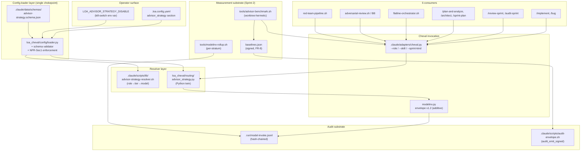
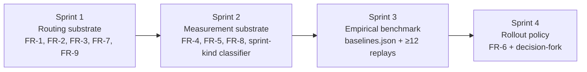
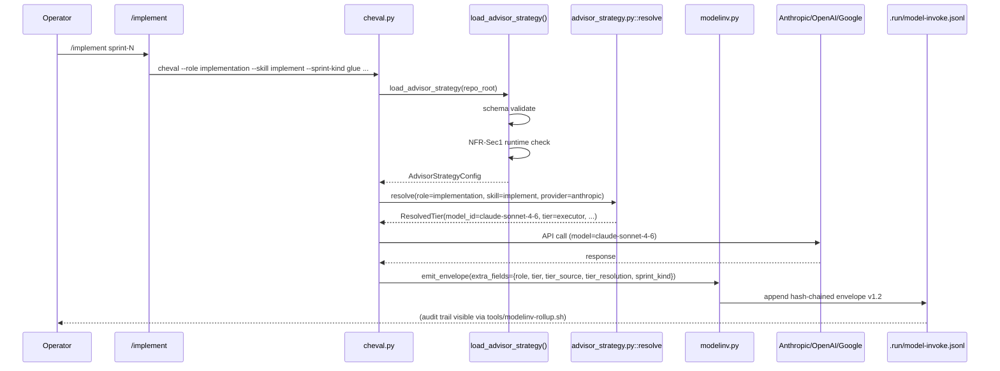

# Cycle-108 SDD — Advisor-Strategy Benchmark + Role→Tier Routing

> **Version**: 1.0 (pre-Flatline)
> **Status**: draft (awaiting /flatline-review + /red-team on SDD)
> **Cycle**: cycle-108-advisor-strategy
> **Created**: 2026-05-13
> **PRD**: `grimoires/loa/cycles/cycle-108-advisor-strategy/prd.md` v1.1 (Flatline-amended)
> **Operator**: @janitooor

---

## 0. Pre-flight: Integrity + grounding

| Check | Status |
|-------|--------|
| Integrity enforcement | `.loa.config.yaml::integrity_enforcement` honored; SDD modifies only State Zone (`grimoires/`) and proposes additions to System Zone via Sprint 1 (which is the only authorized writer) |
| PRD read | `grimoires/loa/cycles/cycle-108-advisor-strategy/prd.md` v1.1 — full text, 543 lines, 14 FRs, 5 NFR clusters, 11 risks, 4 sprints |
| Integration context | `grimoires/loa/a2a/integration-context.md` — **MISSING**; proceeding with standard workflow per skill `Phase 0` |
| Known failures | KF-001 RESOLVED, KF-002 LAYERS-2-3-RESOLVED (layer-1 latent — handled by FR-4 IMP-013 chain-exhaustion semantics), KF-005 RESOLVED, KF-008 RESOLVED. No active failure blocks SDD. |
| Substrate grounding | cheval.py at `.claude/adapters/cheval.py:517` (cmd_invoke); MODELINV emitter at `.claude/adapters/loa_cheval/audit/modelinv.py`; config loader at `.claude/adapters/loa_cheval/config/loader.py:105` reads `hounfour:` section; envelope schema v1.1.0 confirmed live in `.run/model-invoke.jsonl` |

---

## 1. System overview

### 1.1 Component architecture



### 1.2 Architectural pattern

**Pattern**: *Operator-policy-driven additive routing* over the existing cycle-104 cheval substrate.

**Justification**: PRD §6 NFR-R2 mandates "additive, not replacement" — the existing within-company fallback chain, voice-drop, and MODELINV v1.1 envelope are load-bearing for cycle-107 stability (production since e1032b76, 2026-05-09). The cleanest extension is:

1. A **single config section** (`advisor_strategy:`) read by a **single loader function** that produces a resolved **role→tier→model** table.
2. A **single `--role` parameter** added to cheval; every consumer passes its role explicitly; cheval resolves via the table.
3. A **MODELINV envelope bump v1.1 → v1.2** that *adds* five optional fields (`role`, `tier`, `tier_source`, `tier_resolution`, `sprint_kind`) — existing entries remain schema-valid (Flatline IMP-002 backward-compat).

This pattern preserves PRD §4 dependency reality: cycle-104 stability (DONE), cycle-099 model-resolver (DONE), cycle-107 multi-model activation (DONE). No replacement risk.

### 1.3 Single-chokepoint principle (NFR-Sec1, IMP-003)

All tier-resolution decisions flow through **one loader function** (`loa_cheval/config/loader.py::load_advisor_strategy()`) and **one resolver function** (`loa_cheval/routing/advisor_strategy.py::resolve_role_to_model()`). The bash twin (`.claude/scripts/lib/advisor-strategy-resolver.sh`) is a thin wrapper that exec's the Python resolver to guarantee single-source-of-truth resolution semantics — there is no parallel logic to drift.

NFR-Sec1 enforcement (review/audit must be advisor) lives **in the loader**, not in each consumer. A consumer that asks for `role=review` and gets back an executor-tier model would mean the loader failed — which the schema validator (`advisor-strategy.schema.json`) prevents at config-load time (exit 78 EX_CONFIG).

---

## 2. Software stack

### 2.1 Versions + justifications

| Component | Version / pin | Justification (PRD reference) |
|-----------|---------------|-------------------------------|
| Python (cheval, resolver) | 3.13 (existing repo standard) | Matches `.claude/adapters/__pycache__/cheval.cpython-313.pyc` — no version bump |
| Bash | ≥4.4 (existing pin) | Required by audit-envelope.sh `flock` semantics |
| `jsonschema` Python lib | 4.21+ (existing) | JSON Schema Draft 2020-12 compliance — matches L1 envelope schema |
| `yq` v4+ | sha256-pinned 0c4d965e (linux) / 6bfa43a4 (darwin-arm64) — cycle-099 Sprint 1B precedent | CLAUDE.md "Configurable Paths v1.27.0" already mandates yq v4+; same pin re-used |
| `ajv-cli` (Node, dev-only) | 5.0+ | CI-side JSON Schema validation; matches existing `tools/check-codegen-toolchain.sh` toolchain |
| `bats-core` | 1.10+ (existing) | Test framework for `.bats` suites in `tests/unit/` + `tests/integration/` |
| `flock` (util-linux) | system-default | Required by audit-envelope.sh + advisor-benchmark.sh worktree isolation |
| GitHub Actions runner | `ubuntu-latest` + `macos-latest` matrix | Matches cycle-099 Sprint 1C codegen-drift gate platform matrix |

**Zero new external dependencies.** Every primitive cycle-108 needs is already in the toolchain.

### 2.2 File-system layout (proposed)

```
.claude/
├── adapters/
│   ├── cheval.py                              (MODIFIED: add --role/--skill/--sprint-kind)
│   └── loa_cheval/
│       ├── config/
│       │   └── loader.py                      (MODIFIED: + load_advisor_strategy(),
│       │                                       schema validation, NFR-Sec1 reject)
│       ├── routing/
│       │   └── advisor_strategy.py            (NEW: resolve_role_to_model() canonical)
│       └── audit/
│           └── modelinv.py                    (MODIFIED: envelope v1.2 additive fields)
├── data/schemas/
│   └── advisor-strategy.schema.json           (NEW: JSON Schema for config section)
├── scripts/
│   └── lib/
│       └── advisor-strategy-resolver.sh       (NEW: bash twin — execs Python resolver)
└── skills/<skill>/SKILL.md                    (MODIFIED ×35: + role: / + primary_role:)

tools/
├── advisor-benchmark.sh                       (NEW)
├── modelinv-rollup.sh                         (NEW)
└── sprint-kind-classify.py                    (NEW: stratifier — used by both above)

tests/
├── unit/
│   ├── advisor-strategy-loader.bats           (NEW: NFR-Sec1 fixture suite)
│   ├── advisor-strategy-resolver.bats         (NEW: bash twin parity)
│   ├── advisor-strategy-resolver.test.py      (NEW: Python canonical)
│   ├── modelinv-envelope-v12.bats             (NEW: hash-chain compat)
│   └── sprint-kind-classify.test.py           (NEW: stratifier rules)
├── integration/
│   ├── rollback-trace-comparison.bats         (NEW: FR-7 IMP-010 mini-cycle)
│   ├── advisor-benchmark-hermetic.bats        (NEW: NFR-R1 worktree isolation)
│   └── modelinv-rollup-hash-chain.bats        (NEW: FR-5 IMP-008 fail-closed)
└── fixtures/advisor-strategy/
    ├── valid-default.yaml
    ├── poisoned-audit-override.yaml           (NFR-Sec1 negative)
    ├── unknown-skill-override.yaml            (FR-1 negative)
    ├── missing-tier-alias.yaml                (FR-1 negative)
    └── multi-role-skill-no-primary.yaml       (FR-3 IMP-012 negative)

grimoires/loa/cycles/cycle-108-advisor-strategy/
├── prd.md                                     (DONE)
├── sdd.md                                     (THIS FILE)
├── baselines.json                             (Sprint 3 — signed L1)
├── benchmark-report.md                        (Sprint 3)
└── rollout-policy.md                          (Sprint 4)
```

---

## 3. Role→tier routing architecture (FR-1, FR-2, FR-9)

### 3.1 `.loa.config.yaml` schema

The `advisor_strategy:` section is a peer of `hounfour:` (existing). Full canonical form:

```yaml
advisor_strategy:
  schema_version: 1                            # Required. Migration semantics in §3.4.
  enabled: false                               # Master switch. Default off (opt-in).
  tier_resolution: static                      # static | dynamic (FR-9; default static)
  defaults:                                    # Role → tier mapping
    planning: advisor
    review: advisor
    implementation: executor
  tier_aliases:                                # Tier → per-provider model-id
    advisor:
      anthropic: claude-opus-4-7
      openai: gpt-5.5-pro
      google: gemini-3.1-pro-preview
    executor:
      anthropic: claude-sonnet-4-6
      openai: gpt-5.3-codex
      google: gemini-3.1-flash               # [ASSUMPTION-A1] — validated in §3.6
  per_skill_overrides:                         # Optional. Skill-name → tier
    implement: executor
    bug: executor
  benchmark:                                   # FR-4 / NFR-P3 cost cap
    max_cost_usd: 50.0
    historical_median_tokens:                  # Per-stratum median (Sprint 2 populates)
      glue: { input: 12000, output: 4000 }
      parser: { input: 45000, output: 12000 }
      cryptographic: { input: 60000, output: 18000 }
      testing: { input: 30000, output: 9000 }
      infrastructure: { input: 25000, output: 7500 }
```

### 3.2 JSON Schema (`.claude/data/schemas/advisor-strategy.schema.json`)

Schema enforces:

| Rule | Schema mechanism | Closes |
|------|------------------|--------|
| Required top-level keys | `required: [schema_version, enabled, defaults, tier_aliases]` | FR-1 |
| `schema_version: 1` exact | `const: 1` | FR-1 migration |
| `enabled` boolean | `type: boolean` | FR-1 |
| `tier_resolution` enum | `enum: [static, dynamic]` | FR-9 |
| `defaults.*` only known roles | `propertyNames: { enum: [planning, review, implementation] }` | FR-1 |
| `defaults.review` + `defaults.audit` MUST be `advisor` | `properties.defaults.properties.review.const: advisor` (and audit) | **NFR-Sec1** |
| `tier_aliases` keys are known tiers | `propertyNames: { enum: [advisor, executor] }` | FR-1 |
| Per-tier provider keys are known | `propertyNames: { enum: [anthropic, openai, google] }` | FR-1 / OOS-4 (within-provider only) |
| Per-tier provider values match `^[a-z0-9-]+$` (alias-name shape) | regex pattern | FR-1 |
| `per_skill_overrides` values are tier names | `enum: [advisor, executor]` | FR-1 |
| `per_skill_overrides` keys MUST exist in skill registry | runtime check post-schema (loader walks `.claude/skills/*/SKILL.md` + plugin skills) | FR-1 (fail-closed) |
| `per_skill_overrides` key MUST NOT downgrade review/audit skills | runtime check: `if skill.role in {review, audit} and tier != advisor → reject` | **NFR-Sec1 / IMP-003** |
| `benchmark.max_cost_usd` is number ≥ 0 | `type: number, minimum: 0` | NFR-P3 / IMP-011 |
| `additionalProperties: false` at all levels | structural lock | NFR-Sec1 defense-in-depth |

The schema is committed under `.claude/data/schemas/advisor-strategy.schema.json`. CODEOWNERS protection (operator-only edits) is configured via `.github/CODEOWNERS`:

```
.claude/data/schemas/advisor-strategy.schema.json @janitooor
.claude/adapters/loa_cheval/config/loader.py @janitooor
```

This closes **R-8** (NFR-Sec1 bypass via PR-planted schema).

### 3.3 Loader-layer enforcement (`loa_cheval/config/loader.py`)

New function `load_advisor_strategy(repo_root: Path) -> AdvisorStrategyConfig`:

```python
def load_advisor_strategy(repo_root: Path) -> AdvisorStrategyConfig:
    # 1. Kill-switch wins (NFR-Sec3)
    if os.environ.get("LOA_ADVISOR_STRATEGY_DISABLE") == "1":
        return AdvisorStrategyConfig.disabled_legacy()

    # 2. Read .loa.config.yaml::advisor_strategy
    raw = _read_yaml_section(repo_root, "advisor_strategy")
    if raw is None:
        return AdvisorStrategyConfig.disabled_legacy()

    # 3. Validate against JSON Schema (jsonschema.Draft202012Validator)
    try:
        _validate_schema(raw, SCHEMA_PATH)
    except jsonschema.ValidationError as e:
        sys.stderr.write(f"[advisor-strategy] EX_CONFIG: schema invalid: {e.message}\n")
        sys.exit(78)  # EX_CONFIG per BSD sysexits.h

    # 4. Runtime checks (post-schema)
    skill_registry = _enumerate_skills(repo_root)
    for skill_name, tier in raw.get("per_skill_overrides", {}).items():
        if skill_name not in skill_registry:
            sys.stderr.write(f"[advisor-strategy] EX_CONFIG: unknown skill '{skill_name}'\n")
            sys.exit(78)
        skill_role = skill_registry[skill_name].primary_role
        if skill_role in {"review", "audit"} and tier != "advisor":
            sys.stderr.write(
                f"[advisor-strategy] EX_CONFIG: NFR-Sec1 violation — skill '{skill_name}' "
                f"has role '{skill_role}' which is pinned to advisor tier (got '{tier}')\n"
            )
            sys.exit(78)

    # 5. Static-mode pinning (FR-9): record commit SHA of .loa.config.yaml at load time
    config_sha = _config_file_git_sha(repo_root, ".loa.config.yaml")

    return AdvisorStrategyConfig.from_raw(raw, config_sha=config_sha)
```

**Exit code 78 (EX_CONFIG)** is the canonical fail-closed signal. Calling consumers MUST propagate (most already do — cheval.py:1187 cmd_poll has the pattern).

The schema-validator is wired into `load_config()` (existing function at loader.py:138). It runs unconditionally on every `cheval` invocation — closing the per-call re-read requirement of FR-7 IMP-007 (in-flight kill-switch). Cost is bounded by the JSON Schema validator's O(n) walk over a small config object — well under NFR-P1's 5ms budget.

### 3.4 Schema-version migration semantics

| Version | Behavior |
|---------|----------|
| `schema_version: 1` | This SDD. Schema as documented in §3.1–§3.2. |
| Absent `advisor_strategy` section | Treated as `enabled: false` legacy (advisor-everywhere). Identical to today. |
| `schema_version: 0` or `schema_version: <unknown>` | Reject at loader (exit 78). |
| Future `schema_version: 2+` | Schema files versioned as `advisor-strategy.v2.schema.json`. Migration: loader dispatches to versioned validator. Old config remains valid until operator opts to migrate. Documented in `grimoires/loa/runbooks/advisor-strategy-migration.md` (Sprint 4 deliverable). |

This pattern is **explicit forward-compat** — we never silently accept future versions, which closes a class of schema-injection attacks.

### 3.5 Cheval routing extension (FR-2)

cheval.py argparse additions (canonical signature):

```python
parser.add_argument("--role",
                    choices=["planning", "review", "implementation"],
                    help="Caller's logical role; resolved to tier via advisor_strategy config")
parser.add_argument("--skill",
                    help="Caller's skill name (canonical, e.g. 'implement'); used for per_skill_overrides lookup")
parser.add_argument("--sprint-kind", dest="sprint_kind",
                    help="Stratification label for MODELINV; values from sprint-kind taxonomy §8")
```

`cmd_invoke()` resolution flow:

```python
def cmd_invoke(args):
    advisor_cfg = load_advisor_strategy(repo_root)

    if advisor_cfg.enabled and args.role and not args.model:
        # Resolve role → tier → provider:model_id
        resolved = advisor_cfg.resolve(
            role=args.role,
            skill=args.skill,
            provider=_infer_provider_from_voice(args),
        )
        # resolved is a ResolvedTier dataclass: model_id, tier, tier_source, tier_resolution
        args.model = resolved.model_id
        _modelinv_extra_fields = {
            "role": args.role,
            "tier": resolved.tier,
            "tier_source": resolved.tier_source,       # "default" | "per_skill_override" | "kill_switch"
            "tier_resolution": resolved.tier_resolution, # "static:<sha>" | "dynamic"
            "sprint_kind": args.sprint_kind,
        }
    else:
        # Legacy path — preserved verbatim
        _modelinv_extra_fields = {}

    # ... existing cheval flow ...
    # MODELINV emit happens at end with _modelinv_extra_fields merged into envelope.payload
```

**Acceptance: backward-compat.** When `--role` is omitted (existing callers), cheval behaves identically — no envelope changes, no resolution, no errors. This is verified by `tests/unit/cheval-legacy-callers.bats` (existing) running unchanged.

**Acceptance: cross-runtime round-trip.** A test fixture (same config + same `--role review --skill review-sprint`) produces byte-identical `args.model` from cheval.py and from `advisor-strategy-resolver.sh` (which exec's the Python). This is the cycle-099 cross-runtime parity pattern (see `feedback_cross_runtime_parity_traps.md`).

### 3.6 Tier alias resolution mode (FR-9)

`tier_resolution: static` (DEFAULT — and required by Sprint 3 benchmark):

- At config load time, `_config_file_git_sha(repo_root, ".loa.config.yaml")` captures the commit SHA of `.loa.config.yaml`.
- The MODELINV envelope records `tier_resolution: "static:<sha>"`.
- The benchmark harness REQUIRES this mode (FR-4 acceptance) — verified by `tools/advisor-benchmark.sh` reading the MODELINV envelope of each replay and asserting `payload.tier_resolution` starts with `static:`.

`tier_resolution: dynamic`:

- No pinning; tier-aliases re-resolve on every invocation.
- MODELINV records `tier_resolution: "dynamic"`.
- Switching `static → dynamic` mid-cycle emits stderr warning `[advisor-strategy] WARN: tier_resolution changed mid-cycle; cross-replay variance may be affected` + writes an audit-envelope `L1` event `advisor_strategy.resolution_mode_changed`.

**[ASSUMPTION-A1] validation** (FR-9 / §3.1): Sprint 1 task `T1.G` validates `gemini-3.1-flash` exists in `.claude/defaults/model-config.yaml` provider registry. If absent, Sprint 1 picks the available mid-tier Google model AND records the decision in this SDD's §8 as an SDD amendment. Falsification path is mechanical.

---

## 4. Skill annotation contract (FR-3, IMP-012)

### 4.1 Frontmatter schema addition

Every `.claude/skills/*/SKILL.md` and every plugin-namespaced skill gains:

```yaml
---
name: implement
description: "..."
role: implementation               # NEW — one of: planning | review | implementation
primary_role: implementation       # NEW (multi-role only) — explicit tiebreaker
capabilities: { ... }              # existing
---
```

| Field | Required? | Values | Semantics |
|-------|-----------|--------|-----------|
| `role` | YES | `planning` \| `review` \| `implementation` | Default role used by `per_skill_overrides` lookup |
| `primary_role` | YES IFF skill is multi-role | same enum | Tiebreaker; resolves NFR-Sec1 ambiguity |

**Multi-role tiebreaker (IMP-012)**: when a skill is genuinely cross-cutting (e.g., `/run-bridge` runs BB-as-review THEN /run sprint-plan-as-planning+implementation), the YAML lists `role` once with the **most-restrictive** value (advisor wins ties: `review > planning > implementation`). `primary_role` documents the same value explicitly so downstream tools don't have to infer the tiebreaker.

### 4.2 Validator extension

`.claude/scripts/validate-skill-capabilities.sh` (existing at line 146 in current file) gains:

```bash
# After existing frontmatter extraction at line 147–157
role=$(echo "$frontmatter" | yq eval '.role' - 2>/dev/null) || role="null"
if [[ "$role" == "null" || -z "$role" ]]; then
    log_error "$skill_name" "Missing required 'role' field (one of: planning|review|implementation)"
    return 1
fi
case "$role" in
    planning|review|implementation) ;;
    *) log_error "$skill_name" "Invalid role '$role' (must be planning|review|implementation)"; return 1 ;;
esac

# Multi-role tiebreaker — currently only checked if primary_role is set
primary_role=$(echo "$frontmatter" | yq eval '.primary_role' - 2>/dev/null) || primary_role="null"
if [[ "$primary_role" != "null" && "$primary_role" != "$role" ]]; then
    # Disagreement permitted only if primary_role explicitly "downgrades" to most-restrictive
    case "$primary_role:$role" in
        review:planning|review:implementation|planning:implementation) ;;  # advisor-wins tiebreaker
        *) log_error "$skill_name" "primary_role '$primary_role' does not satisfy advisor-wins-ties rule against role '$role'"; return 1 ;;
    esac
fi
```

### 4.3 Migration plan (FR-3 acceptance)

A Sprint 1 task ships `.claude/scripts/migrate-skill-roles.sh` which:

1. Walks `.claude/skills/*/SKILL.md` (35 files in this repo) **and** discovered user-level + plugin-namespaced skills.
2. Applies the following classification rules (mechanical, deterministic):

| Heuristic | Maps to role |
|-----------|--------------|
| `name` matches `/plan-and-analyze\|architect\|sprint-plan\|discovering-requirements\|designing-architecture\|planning-sprints/` | `planning` |
| `name` matches `/review-sprint\|audit-sprint\|reviewing-code\|auditing-security\|bridgebuilder-review\|flatline-review\|red-team\|gpt-review/` | `review` |
| `name` matches `/implement\|implementing-tasks\|bug\|simstim\|continuous-learning\|build/` | `implementation` |
| `name` matches multi-role patterns `/run-bridge\|spiraling\|run\|loa\|compound\|autonomous\|run-mode\|run-resume\|run-halt/` | **flagged for manual review** — script emits `role: review` (advisor-wins) + comment `# MULTI-ROLE: validated by operator on YYYY-MM-DD` |
| Unmatched (utility / read-only / installer) | `implementation` (cheapest tier is acceptable for utility) |

3. Emits a migration report at `grimoires/loa/cycles/cycle-108-advisor-strategy/skill-role-migration.md` with:
   - Each skill's resolved role
   - The classification rule that matched
   - Multi-role skills flagged for operator review (expected list per PRD: `/run-bridge`, `/spiraling`, `/run`, `/loa`)
4. The CI gate (validator) is **enabled only after** this migration commit lands — preventing chicken-and-egg fail-closed on a fresh repo.

Manual review list (high-confidence multi-role candidates from skill inventory):

| Skill | Reason | Recommended `role` / `primary_role` |
|-------|--------|------------------------------------|
| `run-bridge` | Iterative implement → review loop | `role: review`, `primary_role: review` |
| `spiraling` | Autopoietic — covers planning + review + implementation | `role: review`, `primary_role: review` |
| `run` | Outer wrapper around implement+review+audit | `role: review`, `primary_role: review` |
| `loa` | Status/next-step router — could trigger any phase | `role: review`, `primary_role: review` |
| `compound` | Multi-skill composition | `role: review`, `primary_role: review` |
| `autonomous` | Runs all phases without operator | `role: review`, `primary_role: review` |

**Acceptance**: post-Sprint 1, `validate-skill-capabilities.sh` runs in CI and fails any PR adding a SKILL.md without a `role` field — closing the silent-drift class.

---

## 5. Benchmark harness architecture (FR-4, FR-8)

### 5.1 `tools/advisor-benchmark.sh` overview

**Inputs**:
- `--sprints <comma-separated-PRs-or-sprint-ids>` (e.g., `--sprints PR#735,PR#738,PR#741`)
- `--baselines <path>` (defaults to `grimoires/loa/cycles/cycle-108-advisor-strategy/baselines.json`)
- `--replays <int>` (default 3, IMP-004 minimum)
- `--cost-cap-usd <float>` (overrides config; default from `advisor_strategy.benchmark.max_cost_usd`)
- `--fresh-run` (REQUIRED for Sprint 3; explicit; recorded-replay is the omit-default for harness smoke tests)

**Outputs**:
- `grimoires/loa/cycles/cycle-108-advisor-strategy/benchmark-report.md` (markdown report)
- `grimoires/loa/cycles/cycle-108-advisor-strategy/benchmark-results.jsonl` (per-replay raw)
- Updates `.run/model-invoke.jsonl` (each replay emits MODELINV envelopes naturally via cheval)

### 5.2 Worktree isolation strategy (NFR-R1)

Per-replay flow:

```
1. Determine pre-sprint SHA:
   pre_sha = $(git log --format=%H "$sprint_pr_merge_sha^1" -1)   # parent of merge commit
2. Create isolated worktree:
   worktree_dir = $(mktemp -d /tmp/loa-advisor-replay-XXXXXX)
   git worktree add "$worktree_dir" "$pre_sha"
3. Materialize replay manifest:
   - Copy .loa.config.yaml from worktree → override advisor_strategy.enabled = true,
     defaults.implementation = <target tier>
   - Pin temperature, top_p, system_prompt_sha, tool_definitions_sha (FR-4 IMP-004)
4. Run replay:
   cd "$worktree_dir"
   # Reconstruct sprint inputs from PR body / original sprint plan
   # Invoke /implement <sprint_id> with cheval --role implementation --skill implement
   # Capture: cheval exit code, stdout, stderr, .run/model-invoke.jsonl deltas
5. Run /review-sprint + /audit-sprint inside the worktree
   - These ALWAYS use advisor tier (NFR-Sec1)
   - Capture outcomes
6. Capture metrics:
   - Audit-sprint outcome (PASS|FAIL|INCONCLUSIVE)
   - Review-sprint finding count by severity
   - BB iter count to plateau (via run-bridge if invoked)
   - MODELINV deltas: total tokens, cost USD, wall-clock
7. Emit per-replay JSONL row
8. Teardown:
   git worktree remove "$worktree_dir" --force
   rm -rf "$worktree_dir"
```

**Hermeticity guarantees** (CI-verified):
- No `git push` from inside worktree (verified by `tests/integration/advisor-benchmark-hermetic.bats` running with a fake `git push` stub that fails the test if invoked).
- No commits to tracked branches (worktree is at detached HEAD, abandoned post-replay).
- `.run/model-invoke.jsonl` writes go to the *main* repo's path via absolute path override (`LOA_AUDIT_LOG_PATH` env) so envelopes are captured for the rollup — but the worktree's own `.run/` is discarded.
- All other `grimoires/`, `.beads/`, `.ck/` writes inside the worktree are discarded with the worktree.

### 5.3 State tracking

`grimoires/loa/cycles/cycle-108-advisor-strategy/benchmark-state.json`:

```json
{
  "schema_version": 1,
  "baselines_sha": "<hash of baselines.json — must match for run to proceed>",
  "planned_replays": [
    {"sprint": "PR#735", "stratum": "testing", "tier": "advisor", "replay_idx": 0, "status": "pending"},
    {"sprint": "PR#735", "stratum": "testing", "tier": "advisor", "replay_idx": 1, "status": "pending"},
    {"sprint": "PR#735", "stratum": "testing", "tier": "executor", "replay_idx": 0, "status": "completed"}
  ],
  "cost_estimate_usd": 42.50,
  "cost_actual_usd": 38.17,
  "started_at": "2026-05-15T08:00:00Z",
  "last_replay_at": "2026-05-15T10:32:11Z"
}
```

Idempotent: harness reads state, skips completed replays, only runs pending. Enables resume-after-crash.

### 5.4 Replay-manifest schema (per-replay reproducibility)

`grimoires/loa/cycles/cycle-108-advisor-strategy/replay-manifests/<sprint>-<tier>-<idx>.json`:

```json
{
  "sprint_pr": "PR#735",
  "stratum": "testing",
  "tier": "executor",
  "replay_idx": 0,
  "pre_sprint_sha": "78c59568...",
  "config_overrides": {
    "advisor_strategy.enabled": true,
    "advisor_strategy.defaults.implementation": "executor"
  },
  "pinned": {
    "temperature": 0.2,
    "top_p": 0.95,
    "system_prompt_sha": "<sha256>",
    "tool_definitions_sha": "<sha256>",
    "model_config_sha": "<sha256 of .claude/defaults/model-config.yaml>"
  },
  "started_at": "2026-05-15T10:30:00Z",
  "completed_at": "2026-05-15T10:32:11Z",
  "modelinv_envelope_ids": ["MODELINV-001", "MODELINV-002", "..."],
  "outcomes": {
    "audit_sprint": "PASS",
    "review_findings_count": {"critical": 0, "high": 1, "medium": 4, "low": 7},
    "bb_iters_to_plateau": 2,
    "tokens_input": 14523,
    "tokens_output": 4288,
    "cost_usd": 1.42,
    "wall_clock_s": 131
  }
}
```

### 5.5 Variance protocol (IMP-004)

Implemented in `tools/advisor-benchmark-stats.py` (called by harness post-replay):

```python
def classify_pair(replays: list[ReplayResult], metric: str) -> ClassificationResult:
    """
    Per (sprint, tier) pair across ≥3 replays.
    Returns one of: STABLE, FLAG_FOR_RERUN, DROP.
    """
    values = [r.metrics[metric] for r in replays]
    mean = statistics.mean(values)
    stdev = statistics.stdev(values)  # sample stdev (n-1 denominator)
    cv = stdev / mean if mean else float("inf")

    if max(values) - min(values) <= 2 * stdev:
        return ClassificationResult.STABLE
    elif len(replays) < 5:
        return ClassificationResult.FLAG_FOR_RERUN  # add 2 more replays
    else:
        return ClassificationResult.DROP  # variance persists → harness defect candidate
```

The harness loops: ≥3 replays → classify → if FLAG_FOR_RERUN, schedule 2 more → re-classify → if still FLAG, DROP from stratum aggregate (recorded separately).

### 5.6 Replay-semantics enforcement (IMP-005)

The harness has TWO modes:

| Mode | Flag | Purpose | Affects headline? |
|------|------|---------|-------------------|
| **fresh-run** | `--fresh-run` (REQUIRED for Sprint 3) | LLM generates code from prompts | YES — counted in benchmark-report.md headline scorecard |
| **recorded-replay** | `--recorded-replay <manifest-dir>` | Replay cached prompt/response pairs (for harness smoke testing) | NO — emits to `benchmark-report.md` under `## Harness self-test (NOT a quality signal)` section |

Enforcement: every row in `benchmark-results.jsonl` has a `replay_type: fresh-run|recorded-replay` field. The markdown emitter has separate templates for the two; recorded-replay rows can NEVER appear in the headline `## Stratum scorecard` section — enforced by a bats assertion `tests/integration/replay-semantics-isolation.bats`.

### 5.7 Chain-exhaustion classification (IMP-013)

After each replay, harness inspects the MODELINV envelopes for that replay's window:

```python
def classify_replay_outcome(envelopes: list[dict]) -> ReplayOutcome:
    statuses = [e["payload"].get("models_failed", []) for e in envelopes]
    succeeded = [e["payload"].get("models_succeeded", []) for e in envelopes]

    if any(not s and f for s, f in zip(succeeded, statuses)):
        return ReplayOutcome.INCONCLUSIVE  # chain exhausted
    elif any(f for f in statuses):
        return ReplayOutcome.OK_WITH_FALLBACK
    else:
        return ReplayOutcome.OK
```

| ReplayOutcome | Counted in stratum aggregate? | Reported where? |
|---------------|--------------------------------|-----------------|
| `OK` | YES | Headline + detail |
| `OK_WITH_FALLBACK` | YES (flagged) | Headline + detail with badge |
| `INCONCLUSIVE` | NO | Separate "Inconclusive runs" table |
| `EXCLUDED` (operator-aborted) | NO | Not reported at all (audit log retains) |

### 5.8 Cost-cap pre-estimate (IMP-011)

Formula:

```
estimate_usd = Σ over planned_replays:
  (median_input_tokens[stratum] × pricing[provider][model].input_per_1m / 1e6)
+ (median_output_tokens[stratum] × pricing[provider][model].output_per_1m / 1e6)
```

`median_input_tokens` and `median_output_tokens` are read from `advisor_strategy.benchmark.historical_median_tokens.<stratum>`. Sprint 2 populates these by running `tools/modelinv-rollup.sh --per-stratum` over the last 90 days of `.run/model-invoke.jsonl`.

Pre-run flow:

```
1. Compute estimate_usd
2. Read max_cost_usd from config (overridable via --cost-cap-usd)
3. If estimate_usd > max_cost_usd:
   - Print "ERROR: Estimated cost $X exceeds cap $Y" to stderr
   - Print breakdown: per-stratum × per-tier × per-replay
   - Exit 6 (BudgetExceeded, matches cheval.py convention)
4. Else: proceed; record estimate_usd in benchmark-state.json
```

Post-run: harness emits `actual_usd` vs `estimate_usd` delta in benchmark-report.md (closes IMP-011 reporting requirement).

### 5.9 Pre-registered baselines (FR-8 / IMP-001)

`grimoires/loa/cycles/cycle-108-advisor-strategy/baselines.json`:

```json
{
  "schema_version": 1,
  "git_sha_at_signing": "<sha of commit that contains this file>",
  "signed_by_key_id": "<L1 audit signing key id>",
  "timestamp": "2026-05-15T09:00:00Z",
  "strata": {
    "glue": {
      "advisor_baseline": {
        "audit_pass_rate": 0.97,
        "review_findings_density": 12.4,
        "bb_iters_mean": 2.0,
        "cost_usd_mean": 4.20,
        "wall_clock_s_mean": 180,
        "source_sprints": ["PR#737", "PR#722", "PR#739"]
      },
      "executor_target": {
        "audit_pass_rate_min": 0.92,
        "review_findings_density_max": 14.88,
        "bb_iters_max": 3.0,
        "cost_usd_reduction_min": 0.40,
        "wall_clock_overhead_max": 0.30
      }
    },
    "parser": { "...": "..." },
    "cryptographic": { "...": "..." },
    "testing": { "...": "..." },
    "infrastructure": { "...": "..." }
  }
}
```

**Signing flow**:

```bash
# Sprint 3 task: Sprint-3-T1 (baseline computation)
tools/modelinv-rollup.sh --per-stratum --last-90-days > strata-historical.json
tools/compute-baselines.py --historical strata-historical.json \
    --sc-table grimoires/loa/cycles/cycle-108-advisor-strategy/prd.md \
    --output baselines.json

# Sprint 3 task: Sprint-3-T2 (sign)
source .claude/scripts/audit-envelope.sh
audit_emit_signed BASELINES baselines.signed \
    "$(cat baselines.json | jq -c .)" \
    grimoires/loa/cycles/cycle-108-advisor-strategy/baselines.audit.jsonl

# Commit baselines.json + baselines.audit.jsonl in the same commit
git add baselines.json baselines.audit.jsonl
git commit -m "cycle-108: pre-register baselines for advisor-benchmark"
```

**Refusal logic in advisor-benchmark.sh**:

```bash
# Before any replay:
expected_sha=$(jq -r '.git_sha_at_signing' baselines.json)
actual_sha=$(git log -1 --format=%H -- baselines.json)
if [[ "$expected_sha" != "$actual_sha" ]]; then
    echo "ERROR: baselines.json hash mismatch — expected $expected_sha, got $actual_sha" >&2
    echo "Replays REFUSED. Re-sign baselines.json if intentional." >&2
    exit 78  # EX_CONFIG — same code class as schema-fail
fi
audit_verify_chain baselines.audit.jsonl || {
    echo "ERROR: baselines audit chain invalid" >&2
    exit 78
}
```

This closes IMP-001: retrospective threshold-fitting is **mechanically prevented**. Operators who want to revise baselines mid-cycle must commit a new signed file with a new SHA, which is auditable.

---

## 6. Cost aggregator architecture (FR-5, IMP-008, IMP-014)

### 6.1 `tools/modelinv-rollup.sh` overview

**Inputs**:
- `--log <path>` (default `.run/model-invoke.jsonl`)
- `--group-by <field-list>` (comma-separated: `cycle_id,skill_name,role,tier,final_model_id,sprint_kind`)
- `--last-N-days <int>` (optional time window)
- `--output-json <path>` / `--output-md <path>` (optional; defaults to stdout JSON)
- `--per-stratum` (shortcut for `--group-by sprint_kind`)

**Read-only contract**: tool MUST NOT mutate `.run/model-invoke.jsonl`. Verified by `tests/integration/modelinv-rollup-readonly.bats`.

### 6.2 Hash-chain validation order (FR-5 / IMP-008)

```
1. Open .run/model-invoke.jsonl
2. Read all envelopes in order
3. Compute hash chain: for each envelope, recompute hash(prev_hash || canonical_payload)
   and verify against next envelope's prev_hash field
4. If any link breaks:
   - Print: "ERROR: hash-chain broken at line N, primitive_id=<id>, expected prev_hash=<X>, got <Y>"
   - Print: "Recovery: see grimoires/loa/runbooks/audit-log-recovery.md"
   - Exit 1 (NOT 78 — this is a data-integrity error, not a config error)
   - DO NOT EMIT PARTIAL REPORT (IMP-008 requirement)
5. If all links valid: proceed to grouping
```

Implementation: re-use `audit_verify_chain` from `.claude/scripts/audit-envelope.sh` (existing function).

### 6.3 Per-stratum grouping (IMP-014)

When `--per-stratum` (or `--group-by sprint_kind`), the rollup groups by `payload.sprint_kind`. Envelopes without `sprint_kind` (legacy or rollups outside benchmark windows) go into a `null` bucket — explicit, not silently dropped.

```markdown
## Per-stratum cost rollup (last 90 days)

| Stratum | Replays | Tokens In | Tokens Out | Cost USD | Cost reduction vs advisor |
|---------|---------|-----------|------------|----------|---------------------------|
| glue | 12 | 144,000 | 48,000 | $4.32 | -68% |
| parser | 8 | 360,000 | 96,000 | $19.20 | -42% |
| cryptographic | 6 | 360,000 | 108,000 | $21.60 | -38% |
| testing | 9 | 270,000 | 81,000 | $14.85 | -65% |
| infrastructure | 5 | 125,000 | 37,500 | $7.50 | -51% |
| (no sprint_kind) | 47 | 1,234,567 | 234,567 | $89.34 | N/A |
```

### 6.4 Sprint-kind injection point

**Decision**: `sprint_kind` is assigned **at sprint-start** by the stratifier (`tools/sprint-kind-classify.py`), not at cheval invocation time.

Rationale:
- A single sprint may emit dozens of MODELINV envelopes (multiple skill calls). Classifying each independently risks divergent labels for the same sprint.
- Sprint-kind is a property of the *sprint*, not the *invocation*. Classifying once at sprint-start ensures consistency.

Mechanism:
- `/run sprint-N` (and `/implement sprint-N` / `/bug`) writes `.run/sprint-plan-state.json::sprints[N].sprint_kind` at sprint-start.
- Cheval reads this value (when present) and includes it as `--sprint-kind <kind>` in subsequent MODELINV envelopes via the existing `_modelinv_extra_fields` injection (§3.5).
- For benchmark replays, the harness sets `--sprint-kind` explicitly from the replay manifest (§5.4).

### 6.5 `tools/sprint-kind-classify.py` rules

Mechanical classification (IMP-006 closure — formalizes Appendix A of PRD):

```python
def classify_sprint(sprint_meta: SprintMeta) -> SprintKind:
    """
    Inputs: sprint_meta has:
      - files_touched: list of paths (from git diff)
      - skills_used: list of skill names (from sprint-plan)
      - test_categories: list of (e.g., 'bats', 'pytest', 'integration')

    Returns one of: glue | parser | cryptographic | testing | infrastructure | (future) frontend
    """
    paths = sprint_meta.files_touched
    skills = set(sprint_meta.skills_used)

    # Highest-precedence rules first
    if any(p.endswith(".schema.json") for p in paths) and any("audit" in p for p in paths):
        return SprintKind.CRYPTOGRAPHIC
    if any("trust-events" in p or "audit-envelope" in p or "soul-events" in p for p in paths):
        return SprintKind.CRYPTOGRAPHIC

    if any("canonicalize" in p or "endpoint-validator" in p or "log-redactor" in p for p in paths):
        return SprintKind.PARSER
    if any("jcs" in p or "frontmatter" in p for p in paths):
        return SprintKind.PARSER

    if (paths_touched_dirs(paths, ["tests/"]) > paths_touched_dirs(paths, [".claude/scripts/", ".claude/adapters/"])):
        return SprintKind.TESTING
    if "testing-harness" in skills or "testing-fuzzing" in skills:
        return SprintKind.TESTING

    if any("scheduled-cycle" in p or "flatline-orchestrator" in p or "cron" in p for p in paths):
        return SprintKind.INFRASTRUCTURE
    if any("dispatch-contract" in p for p in paths):
        return SprintKind.INFRASTRUCTURE

    # Default — small adapters, config wiring, helpers
    return SprintKind.GLUE
```

Classification rules are **explicit and reviewable**; multi-rule ambiguity defaults to the more-restrictive (more-tail-risk-prone) class — `cryptographic` and `parser` are tail-risk strata where executor regression matters most.

Sprint 3 deliverable: initial labels for the last 12+ sprints (FR-4 dependency). Generated by running the classifier over `git log --merges --since=90.days`.

---

## 7. Rollback design (FR-7, IMP-007, IMP-010)

### 7.1 In-flight kill-switch semantics (IMP-007)

Two activation paths:

| Path | Mechanism | Latency |
|------|-----------|---------|
| Config flip | Operator edits `.loa.config.yaml::advisor_strategy.enabled` to `false`, commits | Next cheval invocation re-reads config (no daemon caching) |
| Env-var override | `export LOA_ADVISOR_STRATEGY_DISABLE=1` | Next cheval invocation reads env (immediate, no commit needed) |

**Per-invocation re-read** is the key invariant. cheval.py NEVER caches the resolved config across invocations. Cost: O(few ms YAML parse + JSON Schema walk) per call — well under NFR-P1's 5ms budget.

**Currently-running invocation behavior**: cheval makes ONE API call per invocation (synchronous). Mid-call swap is impossible; it would invalidate the call's audit envelope. So `enabled: false` mid-sprint means:
- The currently-executing cheval call **finishes at its resolved tier** (executor, if that's where it started).
- The NEXT cheval call within the same sprint reads the new config and routes to advisor.
- `.run/sprint-plan-state.json::sprints[N].tier_transitions` is appended with a row:
  ```json
  {"at": "2026-05-15T11:23:45Z", "from": "executor", "to": "advisor", "trigger": "config_flip"}
  ```
- Operator sees on next cheval invocation:
  ```
  [advisor-strategy] WARN: tier transition mid-sprint: executor → advisor (config flip detected at <ts>)
  ```

This behavior is **eventually consistent, not transactional**. Documented in `grimoires/loa/runbooks/advisor-strategy-rollback.md` (Sprint 4 deliverable).

### 7.2 Kill-switch precedence semantics across 6 consumers

Single source of truth: `loa_cheval/config/loader.py::load_advisor_strategy()` (per §3.3). The precedence cascade is **only** in this function:

```
1. LOA_ADVISOR_STRATEGY_DISABLE=1 → return disabled_legacy (highest priority)
2. .loa.config.yaml::advisor_strategy section missing → return disabled_legacy
3. .loa.config.yaml::advisor_strategy.enabled = false → return disabled_legacy
4. Schema validation fails → exit 78 (fail-closed; do NOT default to enabled)
5. Otherwise → return enabled config
```

All 6 consumers (implement, review-sprint, audit-sprint, plan-and-analyze + architect + sprint-plan, flatline-orchestrator, adversarial-review BB, red-team-pipeline) route through cheval and therefore through `load_advisor_strategy()`. There is no per-consumer override path — this is a deliberate single-chokepoint to close NFR-Sec3 / IMP-007.

CI verification: `tests/integration/rollback-precedence.bats` runs all 6 consumers under each of the 5 cascade conditions and asserts behavior matches the expected legacy-mode trace.

### 7.3 Trace-comparison integration test (IMP-010)

`tests/integration/rollback-trace-comparison.bats`:

```bash
@test "FR-7 IMP-010: full mini-cycle under enabled=false produces advisor-only trace" {
    # Setup
    setup_clean_worktree
    cat > .loa.config.yaml.fragment <<EOF
    advisor_strategy:
      enabled: false
    EOF

    # Run mini-cycle: PRD → SDD → 1 sprint → review → audit → BB
    run_mini_cycle --topic "trace-comparison-test"

    # Collect MODELINV envelopes for this run
    envelopes=$(jq -c '. | select(.payload.cycle_id == "trace-comparison-test")' .run/model-invoke.jsonl)

    # Assert ALL envelopes have advisor-tier model IDs
    for env in $envelopes; do
        model_id=$(echo "$env" | jq -r '.payload.final_model_id')
        case "$model_id" in
            *opus-4-7*|*gpt-5.5-pro*|*gemini-3.1-pro*) ;;  # advisor models
            *) fail "Found non-advisor model under enabled=false: $model_id"
        esac
    done

    # Compare against golden trace
    diff <(echo "$envelopes" | jq -c '.payload | {role, tier, final_model_id}') \
         tests/fixtures/advisor-strategy/golden-disabled-trace.jsonl
}
```

The golden trace is generated once (in Sprint 1) from a clean enabled=false run and committed. Subsequent runs that deviate fail the test — closing IMP-010.

---

## 8. Stratification taxonomy (PRD Appendix A → SDD §8 formalization)

### 8.1 Taxonomy

| Stratum | Definition | Feature signals | Initial historical labels (for Sprint 3) |
|---------|-----------|-----------------|------------------------------------------|
| **glue** | Adapter wiring, config plumbing, thin helpers | files touched mostly in `.claude/scripts/lib/`, no schema changes, ≤200 LOC delta | PR#737 (T2.1 schema wiring), PR#722 (sprint-1A codegen foundation), PR#724 (codegen-toolchain) |
| **parser** | Input parsing, format conversion, canonicalization, validation | files in `endpoint-validator`, `jcs`, `frontmatter`, `log-redactor`; regex / parser logic | PR#730 (endpoint-validator), PR#728 (log-redactor + migrate-model-config), PR#729 (endpoint-validator IPv4) |
| **cryptographic** | Hash chains, signatures, audit-envelopes, trust ledgers | files in `audit-envelope`, `trust-events`, `soul-events`, signing helpers | cycle-098 L1, L4, L6, L7 sprints; cycle-099 sprint-1E.c.2 (DNS rebinding defense) |
| **testing** | Test infrastructure, fixtures, golden files, harnesses | majority of LOC in `tests/`; `tests/fixtures/`, `.bats` files | PR#735 (sprint-1D cross-runtime parity), PR#724 (drift gate matrix) |
| **infrastructure** | Cron, scheduling, dispatch contracts, retry/timeout, hooks | files in `scheduled-cycle-template`, `flatline-orchestrator`, `cron-*`, `dispatch-contract` | cycle-098 Sprint 3 (L3 scheduled-cycle); cycle-104 voice-drop; cycle-107 multi-model activation |
| **frontend / TUI** | Terminal UI, layout, color | files in TUI-related dirs; out-of-scope for cycle-108 (no Loa-core TUI work) | (none) |

### 8.2 Stratum-assignment rules

See `tools/sprint-kind-classify.py` in §6.5 — ten ordered rules, deterministic, reviewable. Sprint 3 acceptance includes: every selected historical sprint (≥12) is classified by the script, classification is recorded in `replay-manifests/<sprint>-<tier>-<idx>.json::stratum`, and operator reviews the labels before signing baselines.json.

### 8.3 Feature-extraction heuristics

Inputs to the classifier are derived mechanically:

| Feature | Source |
|---------|--------|
| `files_touched` | `git diff --name-only <pre-sha>..<post-sha>` |
| `skills_used` | Parsed from sprint-plan markdown OR from `.run/sprint-plan-state.json::sprints[N].skills_invoked` |
| `test_categories` | Discovered by file-extension + dir scan of `files_touched` |

These features are reproducible from git state alone — supports NFR-O2 (benchmark report reproducible from git + jsonl).

---

## 9. Statistical methodology (PRD §3 → SDD §9 formal spec)

### 9.1 Paired bootstrap

```python
# tools/advisor-benchmark-stats.py

import numpy as np

def paired_bootstrap_ci(
    advisor_results: list[float],
    executor_results: list[float],
    n_resamples: int = 10000,
    ci_level: float = 0.95,
    seed: int = 0,
) -> tuple[float, float, float]:
    """
    Returns (mean_delta, ci_lower, ci_upper) for paired (advisor_i, executor_i) samples.
    Pairing index: replay i of sprint X under advisor vs replay i of sprint X under executor.
    """
    assert len(advisor_results) == len(executor_results), "Pairs must align"
    rng = np.random.default_rng(seed)
    n = len(advisor_results)
    deltas = np.array(executor_results) - np.array(advisor_results)

    bootstrap_means = np.empty(n_resamples)
    for k in range(n_resamples):
        idxs = rng.integers(0, n, size=n)
        bootstrap_means[k] = deltas[idxs].mean()

    alpha = 1 - ci_level
    ci_lower = np.quantile(bootstrap_means, alpha / 2)
    ci_upper = np.quantile(bootstrap_means, 1 - alpha / 2)
    return deltas.mean(), ci_lower, ci_upper
```

- `n_resamples = 10000` (PRD §3 pinned)
- `ci_level = 0.95` (PRD §3 pinned)
- `seed = 0` (deterministic — supports NFR-O2 reproducibility)
- Pairing: replay-index pairing (replay-0 advisor vs replay-0 executor for sprint X)

### 9.2 Variance flag

Per §5.5 — sample stdev (denominator `n-1`), implemented via `statistics.stdev()`. Threshold: range / stdev > 2σ.

### 9.3 Pass/Fail/Inconclusive classification (PRD §3 → mechanical implementation)

```python
def classify_stratum(
    metrics: StratumMetrics,
    targets: StratumTargets,
) -> StratumOutcome:
    # PRD §3 rules, translated to code:

    # Inconclusive checks first
    if metrics.n_replays < 3:
        return StratumOutcome.INCONCLUSIVE("fewer than 3 replays")
    if metrics.any_variance_flagged:
        return StratumOutcome.INCONCLUSIVE("≥2σ variance flagged")
    if (targets.sc1_min >= metrics.sc1_ci_lower and
        targets.sc1_min <= metrics.sc1_ci_upper):
        return StratumOutcome.INCONCLUSIVE("CI overlaps target boundary")

    # FAIL checks
    if (metrics.sc1_pass_rate < 0.85 or
        metrics.sc2_findings_delta_pct > 40 or
        metrics.sc3_bb_iters_delta > 3) and \
       metrics.sc1_ci_upper < targets.sc1_min:
        return StratumOutcome.FAIL

    # OPT-IN check
    if (metrics.sc1_pass_rate >= targets.sc1_min and
        (metrics.sc2_findings_delta_pct > 20 or metrics.sc3_bb_iters_delta > 1)):
        return StratumOutcome.OPT_IN_ONLY

    # PASS check
    if (metrics.sc1_pass_rate >= targets.sc1_min and
        metrics.sc2_findings_delta_pct <= 20 and
        metrics.sc3_bb_iters_delta <= 1 and
        metrics.sc1_ci_upper >= targets.sc1_min):
        return StratumOutcome.PASS

    return StratumOutcome.INCONCLUSIVE("non-matching rule fall-through")
```

Tie handling: ties on SC-1 boundary value default to **INCONCLUSIVE** (conservative — operator decides). Edge case: zero variance + exact match means CI lower = CI upper = target — counted as PASS only if observed value ≥ target.

### 9.4 Per-stratum aggregation

The same logic runs per stratum (PRD SC-6: ≥4 strata × ≥3 replays = ≥12 runs). The benchmark report has one classification per stratum, plus an overall summary table.

---

## 10. Integration with existing substrate

| Substrate | Status | Cycle-108 interaction |
|-----------|--------|----------------------|
| cycle-104 within-company fallback chains (`fallback_chain` in model-config.yaml) | DONE | **Preserved verbatim.** cheval's chain-walk operates within the resolved tier. If `defaults.implementation = executor` and the executor chain exhausts, behavior is identical to today (chain-exhaustion → operator-visible error). |
| cycle-104 T2.8 voice-drop semantics | DONE | **Preserved verbatim.** Voice-drop operates orthogonally to tier; a dropped voice is dropped regardless of tier. The cycle-108 advisor benchmark, ironically, depends on voice-drop continuing to work during its own SDD Flatline pass. |
| cycle-099 model-resolver.sh (alias resolution) | DONE | **Extended additively.** New helper `resolve_role_to_tier()` in `.claude/scripts/lib/model-resolver.sh` (the existing file gains one function). Existing callers (`resolve_alias`, `resolve_provider_id`) unchanged. |
| cycle-104 T2.6 MODELINV v1.1 envelope | DONE | **Schema-bumped to v1.2 additively.** Five optional fields (`role`, `tier`, `tier_source`, `tier_resolution`, `sprint_kind`). Hash-chain stays compatible (existing entries valid; new entries valid against new schema with optional fields). |
| cycle-099 T1.13 log-redactor | DONE | **Preserved verbatim.** All five new MODELINV fields are scalars (role/tier/etc are short strings or null) and pass through the existing redaction pipeline unchanged. No new redaction-leak vectors. |
| cycle-107 `flatline_routing: true` default | DONE | **Foundation.** Advisor-strategy assumes `hounfour.flatline_routing: true` (cheval is the canonical model dispatcher). If `flatline_routing: false`, advisor_strategy still works for FR-2 cheval routes but Flatline / RT bypass cheval — so the per-consumer guarantee weakens. Loader emits warning `[advisor-strategy] WARN: hounfour.flatline_routing is false; rollback semantics weakened for Flatline + RT consumers`. |

**No replacement risk.** Every cycle-104 / 099 / 107 invariant is preserved.

---

## 11. Security architecture

### 11.1 NFR-Sec1 (config-tamper) — closed by IMP-003 / R-8

| Layer | Mechanism |
|-------|-----------|
| Schema | `.claude/data/schemas/advisor-strategy.schema.json` pins `defaults.review.const = advisor` and `defaults.audit.const = advisor` |
| Runtime | Loader rejects `per_skill_overrides` where `skill.role ∈ {review, audit}` and `tier != advisor` |
| Repo | `.github/CODEOWNERS` protects `.claude/data/schemas/advisor-strategy.schema.json` and `loa_cheval/config/loader.py` (operator-only edits) |
| CI | `tests/unit/advisor-strategy-loader.bats` has 5 negative fixtures (poisoned-audit, poisoned-review, unknown-skill, missing-tier, downgraded-via-override) — all MUST exit 78 |
| Red Team gate | Sprint-1 SDD Red Team validates the threat model and fixture coverage |

### 11.2 NFR-Sec2 (audit-log integrity)

| Aspect | Mechanism |
|--------|-----------|
| Envelope schema bump | v1.1 → v1.2 with five optional fields; existing entries remain valid |
| Hash chain | Unchanged — `prev_hash` computed over canonical payload via JCS (cycle-098 R15 invariant) |
| Backward compat | Aggregator (`modelinv-rollup.sh`) handles `null` for new fields gracefully (entries pre-cycle-108 group as `null` for `role`/`tier`/etc) |
| Forward compat | Existing readers ignore additional fields they don't recognize (JSON Schema `additionalProperties` is enforced only at writer side) |
| Audit-recover | `audit_recover_chain` (per CLAUDE.md L1 envelope rules) unchanged — works on any v1.x envelope |

### 11.3 NFR-Sec3 (kill-switch) — single source of truth

The kill-switch cascade lives **only** in `load_advisor_strategy()` (§7.2). No consumer has a parallel implementation. CI verifies via `tests/integration/rollback-precedence.bats` running all 6 consumers under each cascade state.

### 11.4 Threat model summary

| Threat | Mitigation |
|--------|------------|
| Malicious PR plants `per_skill_overrides.audit-sprint: executor` | Schema + runtime reject (exit 78); CODEOWNERS protection on loader |
| Malicious PR weakens schema (e.g., removes `defaults.review.const`) | CODEOWNERS protection on schema file |
| Operator misconfigs `tier_aliases.advisor.anthropic` to a cheap model | Out-of-scope for cycle-108 (PRD OOS-3); future cycle may add tier-tier-id allowlist |
| Replay results contaminate main branch | Worktree isolation (§5.2) + hermeticity bats test |
| Recorded-replay leaks into benchmark headline | Two-mode separation + bats assertion (§5.6) |
| Retrospective baseline fitting | Pre-registered + signed baselines.json (§5.9); refusal on hash mismatch |
| Cost-cap circumvention | Pre-run estimate + abort; estimate-vs-actual reported |
| Audit-log forgery to fake cost reductions | Hash-chain validation pre-report (§6.2); fail-closed |

---

## 12. Testing strategy

### 12.1 Test pyramid

| Layer | Count (target) | Examples |
|-------|----------------|----------|
| Unit (bats + pytest) | ~120 tests | loader fixtures (Sec1), resolver parity (cycle-099 pattern), schema validation, classifier rules |
| Integration | ~25 tests | full mini-cycle (FR-7 IMP-010), worktree hermeticity, rollup hash-chain, replay-semantics separation |
| Cross-runtime parity | ~15 tests | bash twin = Python canonical (resolver), JSON output identity |
| End-to-end | ~3 tests | Sprint 1 trace test; Sprint 2 dry-run benchmark; Sprint 3 actual benchmark (the deliverable itself) |

### 12.2 Cycle-099 cross-runtime parity pattern reuse

Resolver has bash + Python twins. Tests follow the cycle-099 sprint-1D pattern:

- One canonical fixture YAML per case (`tests/fixtures/advisor-strategy/parity-cases/`)
- Bash runner sources `advisor-strategy-resolver.sh`, emits JSON
- Python runner imports `loa_cheval.routing.advisor_strategy`, emits JSON
- byte-equal comparison via `diff -q`

This closes the cross-runtime parity trap class documented in `feedback_cross_runtime_parity_traps.md`.

### 12.3 Fixture inventory (Sprint 1 deliverable)

```
tests/fixtures/advisor-strategy/
├── valid-default.yaml                 (happy path)
├── valid-with-overrides.yaml          (per_skill_overrides happy path)
├── valid-disabled.yaml                (enabled: false)
├── poisoned-audit-override.yaml       (NFR-Sec1 negative)
├── poisoned-review-override.yaml      (NFR-Sec1 negative)
├── unknown-skill-override.yaml        (runtime check negative)
├── missing-tier-alias.yaml            (schema negative)
├── invalid-tier-resolution.yaml       (FR-9 enum negative)
├── schema-v0.yaml                     (version reject)
├── multi-role-skill-no-primary.yaml   (FR-3 IMP-012 negative)
├── parity-cases/
│   ├── case-01-default-planning.yaml
│   ├── case-02-default-review.yaml
│   ├── case-03-default-implementation.yaml
│   ├── case-04-override-implementation.yaml
│   ├── case-05-override-review-rejected.yaml
│   └── case-06-dynamic-resolution.yaml
└── golden-disabled-trace.jsonl         (FR-7 IMP-010 golden trace)
```

### 12.4 Error-handling strategy

| Class | Exit code | Recovery |
|-------|-----------|----------|
| Schema invalid | 78 (EX_CONFIG) | Operator fixes `.loa.config.yaml`; commit; retry |
| Unknown skill in overrides | 78 (EX_CONFIG) | Operator corrects skill name or removes override |
| NFR-Sec1 violation | 78 (EX_CONFIG) | Operator removes review/audit downgrade; commit |
| MODELINV hash-chain broken | 1 (general) | Run `audit_recover_chain` per `audit-log-recovery.md` runbook |
| Baseline hash mismatch | 78 (EX_CONFIG) | Re-sign `baselines.json` with new SHA + commit (audit-trail preserved) |
| Cost estimate > cap | 6 (BudgetExceeded; cheval.py convention) | Override `--cost-cap-usd N` or trim replay set |
| Chain-exhausted during benchmark replay | (replay classified INCONCLUSIVE; benchmark continues) | Reported in benchmark-report.md; replay re-runnable |
| Replay non-determinism > 2σ | (pair flagged; harness adds 2 more replays) | If still flagged after 5, pair DROPPED from stratum aggregate; benchmark continues |

---

## 13. Development phases (sprint sequencing)

Per PRD §7:



### 13.1 Sprint 1 — Routing substrate

| Task | FR | Deliverable | Acceptance |
|------|----|----|------------|
| T1.A | FR-1 schema | `.claude/data/schemas/advisor-strategy.schema.json` | Schema validates with `ajv-cli`; 11 fixture cases pass/fail correctly |
| T1.B | FR-1 loader | `load_advisor_strategy()` in `loa_cheval/config/loader.py` | 5 NFR-Sec1 negative fixtures all exit 78 |
| T1.C | FR-2 cheval CLI | `--role` / `--skill` / `--sprint-kind` in cheval.py | Argparse accepts; cmd_invoke resolves; backward-compat fixture passes |
| T1.D | FR-2 resolver | `loa_cheval/routing/advisor_strategy.py` + `.claude/scripts/lib/advisor-strategy-resolver.sh` | 6 parity cases byte-equal across bash + Python |
| T1.E | FR-2 MODELINV v1.2 | Schema bump + emitter update | Hash-chain integrity preserved across schema-bump; v1.1 entries still validate |
| T1.F | FR-3 skill annotation | Validator extension + migration script + 35 SKILL.md updates | `validate-skill-capabilities.sh` runs in CI; all 35 skills have valid `role` |
| T1.G | FR-9 + [ASSUMPTION-A1] | `gemini-3.1-flash` validated; tier-resolution mode logged in MODELINV | If A1 wrong, SDD amendment lands in same sprint |
| T1.H | FR-7 IMP-010 | Trace-comparison test + golden file | `rollback-trace-comparison.bats` green |
| T1.I | FR-7 IMP-007 | In-flight kill-switch semantics + `sprint-plan-state.json` `tier_transitions` | Per-call re-read verified; mid-sprint flip test passes |
| T1.J | CODEOWNERS | `.github/CODEOWNERS` updated | Schema + loader files require @janitooor review |
| T1.K | Documentation | `grimoires/loa/runbooks/advisor-strategy-rollback.md` | Operator-facing rollback guide |

### 13.2 Sprint 2 — Measurement substrate

| Task | FR | Deliverable | Acceptance |
|------|----|----|------------|
| T2.A | FR-4 harness skeleton | `tools/advisor-benchmark.sh` (worktree, state, manifest) | Hermeticity bats test passes |
| T2.B | FR-4 IMP-004 variance | `tools/advisor-benchmark-stats.py` + classify_pair | Unit tests for stable/flag/drop cases |
| T2.C | FR-4 IMP-005 replay-semantics | Two-mode separation + bats isolation test | Recorded-replay never reaches headline section |
| T2.D | FR-4 IMP-011 cost cap | Pre-run estimate + abort + report | Estimate-vs-actual fixture test |
| T2.E | FR-4 IMP-013 chain-exhaustion | Classify_replay_outcome + report bucketing | INCONCLUSIVE doesn't bias aggregate |
| T2.F | FR-5 rollup | `tools/modelinv-rollup.sh` | Hash-chain validate; per-stratum grouping |
| T2.G | FR-5 IMP-008 hash-chain | Fail-closed integrity check before report | Broken-chain fixture exits 1, no partial report |
| T2.H | FR-5 IMP-014 per-stratum | `--per-stratum` flag + markdown column | Rollup includes per-stratum cost reduction |
| T2.I | Stratifier | `tools/sprint-kind-classify.py` + sprint-kind injection | Initial labels for ≥12 historical sprints generated |
| T2.J | MODELINV coverage audit | Verify ≥90% MODELINV envelope coverage of cycle token spend ([ASSUMPTION-A4]) | Coverage report committed; if <90%, Sprint 2 ships coverage-improvement task before Sprint 3 |
| T2.K | Median tokens | Populate `advisor_strategy.benchmark.historical_median_tokens.*` from rollup | 5 strata with median input/output |

### 13.3 Sprint 3 — Empirical benchmark

| Task | FR | Deliverable | Acceptance |
|------|----|----|------------|
| T3.A | FR-8 baselines compute | `tools/compute-baselines.py` runs over historical data | `baselines.json` candidates committed |
| T3.B | FR-8 sign | `audit_emit_signed` over baselines.json | `baselines.audit.jsonl` committed; chain valid |
| T3.C | FR-8 acceptance | benchmark refuses to run with mismatch | Negative test passes |
| T3.D | Select replay sprints | ≥12 sprints across ≥4 strata; operator approves | Replay-manifest dir populated |
| T3.E | Run replays | Execute ≥36 replays (12 sprints × 3 replays for executor + 0 for advisor — baseline is from history) | All replays complete OR INCONCLUSIVE classified |
| T3.F | Stats + report | Paired bootstrap CIs; classification per stratum | `benchmark-report.md` committed |
| T3.G | Cost reconciliation | estimate-vs-actual reported | Within ±20% expected; deviations explained |

Sprint-3 wall-clock budget: NFR-P2 caps at ≤6 hours; with cost cap default $50, realistic for the substrate (cheaper-tier executor + advisor-baselines from history, not freshly run).

### 13.4 Sprint 4 — Rollout policy + decision-fork

| Task | FR | Deliverable | Acceptance |
|------|----|----|------------|
| T4.A | FR-6 rollout policy | `rollout-policy.md` with per-stratum recommendations | Cites data points from `benchmark-report.md` |
| T4.B | Decision-fork (a/b/c) | Mechanical decision per PRD §7 Sprint 4 | Outcome recorded in rollout-policy.md |
| T4.C | `.loa.config.yaml.example` | Defaults updated per outcome | Operator-facing default reflects decision |
| T4.D | Migration guide | `grimoires/loa/runbooks/advisor-strategy-migration.md` | Operators can adopt or rollback safely |
| T4.E | Auto-memory update | `feedback_advisor_benchmark.md` updated with cycle-108 datapoints | Replaces spiral-harness-only data |
| T4.F | known-failures.md | Add KF-NNN entries for any failure classes observed during benchmark | Append-only per CLAUDE.md context-intake discipline |

---

## 14. Risks & mitigation (PRD §8 mirror with SDD-specific additions)

PRD §8 enumerates R-1 through R-11. SDD adds implementation-specific risks:

| ID | Risk | Likelihood | Impact | SDD-specific mitigation |
|----|------|------------|--------|-------------------------|
| SR-1 | Loader perf regression > 5ms breaks NFR-P1 | Low | Medium | `tests/unit/advisor-strategy-loader-perf.bats` measures via `time` (p95 over 1000 calls < 5ms); regression fails CI |
| SR-2 | Bash twin (`advisor-strategy-resolver.sh`) drifts from Python canonical | Medium | High | Twin is a thin exec wrapper around Python — there is no parallel logic to drift; cross-runtime parity test enforces byte-equal output |
| SR-3 | JSON Schema validator differs across `jsonschema` (Python) and `ajv-cli` (Node) | Medium | Medium | Both use Draft 2020-12; cycle-099 Sprint 1A precedent shows compatibility for our schema patterns; differential test in CI |
| SR-4 | Worktree teardown fails leaving orphan dirs in `/tmp` | Low | Low | `trap 'cleanup_worktree' EXIT` in harness; daily cron cleanup of `/tmp/loa-advisor-replay-*` older than 24h |
| SR-5 | Pre-sprint SHA for replay isn't reproducible (e.g., merged-rebased) | Medium | Medium | Use `git log --format=%H "$pr_merge_sha^1"` for the parent of the merge commit; for squash-merged PRs, fall back to `git log --format=%H "$pr_merge_sha^"` and warn operator |
| SR-6 | Skill migration miscategorizes a multi-role skill silently | Medium | Medium | Migration script outputs a review file; operator MUST sign off before Sprint 1 closes; 6 high-confidence multi-role skills hand-reviewed (§4.3 table) |
| SR-7 | MODELINV envelope coverage <90% breaks Sprint 3 benchmark validity | Low (Medium per [ASSUMPTION-A4]) | High | Sprint 2 task T2.J audits coverage before Sprint 3 begins; if <90%, coverage-improvement task lands first |

---

## 15. Open questions (carried from PRD + SDD-surfaced)

### Resolved during SDD

- **OQ-1 → RESOLVED via FR-9** (PRD): static is default; dynamic is opt-in with warning.
- **NEW OQ-SDD-1 → RESOLVED in §6.4**: sprint_kind is assigned at sprint-start, not per-invocation.
- **NEW OQ-SDD-2 → RESOLVED in §3.5**: backward-compat means cheval without `--role` behaves identically — no envelope changes.

### Remaining for Red Team + SDD-Flatline to surface

- **OQ-2** (PRD): How do `/implement` and `/bug` differ in same cycle? *SDD position*: `/bug` is implementation-role (same as `/implement`); per-skill override available if operator wants `/bug: advisor`. Recommend keeping symmetric.
- **OQ-3** (PRD): Skill-level vs phase-level role granularity? *SDD position*: Skill-level only for cycle-108. Phase-level is an OOS-1-ish future cycle.
- **OQ-4** (PRD): Should benchmark-report.md re-run on every cycle-N+1? *SDD position*: Out-of-scope for cycle-108. Operators can re-invoke `advisor-benchmark.sh` manually; automation is a future cycle.

### [ASSUMPTION] resolution status

| Tag | Resolution path | Sprint |
|-----|-----------------|--------|
| A1 (Gemini executor candidate) | T1.G validates `gemini-3.1-flash`; SDD amendment if wrong | Sprint 1 |
| A2 (≥12 historical sprints exist) | T2.I generates initial labels; T3.D selects | Sprint 2/3 |
| A3 (worktree hermeticity sufficient) | T2.A hermeticity bats test | Sprint 2 |
| A4 (MODELINV coverage >90%) | T2.J coverage audit | Sprint 2 |
| A5 (failures observable via existing signals) | T3.E observations; if defect-detection signal missing, SDD amendment | Sprint 3 |

---

## 16. Compliance traceability matrix

Every PRD requirement maps to ≥1 SDD section:

| PRD ID | Description | SDD section(s) |
|--------|-------------|---------------|
| FR-1 | Role→tier config schema | §3.1, §3.2, §3.3, §3.4 |
| FR-1 IMP-003 | NFR-Sec1 loader-layer enforcement | §3.3, §11.1 |
| FR-2 | cheval routing extension | §3.5 |
| FR-2 acceptance backward-compat | preserve callers without `role` | §3.5 |
| FR-2 acceptance MODELINV bump | envelope v1.2 additive | §3.5, §11.2 |
| FR-3 | Skill annotation contract | §4.1 |
| FR-3 IMP-012 | Multi-role tiebreaker | §4.1, §4.3 |
| FR-3 validator | extend `validate-skill-capabilities.sh` | §4.2 |
| FR-3 migration | populate role for 35+ skills | §4.3 |
| FR-4 | Benchmark harness | §5.1, §5.2, §5.3, §5.4 |
| FR-4 IMP-004 | Variance protocol | §5.5, §9.2 |
| FR-4 IMP-005 | Fresh-run / recorded-replay separation | §5.6 |
| FR-4 IMP-011 | Cost-cap pre-estimate | §5.8, NFR-P3 |
| FR-4 IMP-013 | Chain-exhaustion classification | §5.7 |
| FR-5 | MODELINV cost aggregator | §6.1 |
| FR-5 IMP-008 | Hash-chain fail-closed | §6.2, §12.4 |
| FR-5 IMP-014 | Per-stratum reporting | §6.3 |
| FR-6 | Rollout policy doc | §13.4 (Sprint 4 T4.A) |
| FR-7 | Rollback semantics | §7.1, §7.2 |
| FR-7 IMP-007 | In-flight kill-switch | §7.1 |
| FR-7 IMP-010 | Trace-comparison test | §7.3 |
| FR-8 IMP-001 | Pre-registered baselines | §5.9 |
| FR-9 IMP-009 | Tier alias resolution mode | §3.6 |
| NFR-Sec1 | Loader-layer review/audit pin | §3.3, §11.1 |
| NFR-Sec2 | Audit-log integrity | §11.2 |
| NFR-Sec3 | Kill-switch precedence | §7.2, §11.3 |
| NFR-R1 | Hermetic replay | §5.2 |
| NFR-R2 | Additive routing | §10 |
| NFR-R3 | Chain-exhaustion error preserved | §10, §5.7 |
| NFR-O1 | MODELINV always has role field | §3.5 |
| NFR-O2 | Report reproducible from jsonl + git | §6.5, §9.1 (seeded) |
| NFR-P1 | ≤5ms config-load overhead | §3.3, SR-1 |
| NFR-P2 | ≤6h for 12 replays | §13.3 |
| NFR-P3 IMP-011 | Cost-cap pre-estimate | §5.8 |
| NFR-C1 | Dogfood quality gates | this SDD's Flatline + RT runs |
| NFR-C2 | Never bypass gates | implicit in §13 sprint sequencing |
| Appendix A IMP-006 | Sprint-kind taxonomy | §8.1, §8.2, §8.3 |
| §3 Pass/Fail/Inconclusive | Decision rules | §9.3 |
| R-8 NFR-Sec1 bypass | CODEOWNERS + schema + runtime | §11.1 |
| R-9 IMP-011 benchmark cost overrun | Cost cap + abort | §5.8 |
| R-10 Voice degradation recurs | (out-of-band; tracked in known-failures.md) | §10 (preserved voice-drop) |
| R-11 IMP-005 recorded-replay leak | Two-mode separation | §5.6 |

---

## 17. Visual: data flow at runtime



---

## 18. Visual: rollback flow

```mermaid
stateDiagram-v2
    [*] --> Enabled: advisor_strategy.enabled = true
    Enabled --> KillSwitched: LOA_ADVISOR_STRATEGY_DISABLE=1
    Enabled --> ConfigFlipped: edit .loa.config.yaml; commit
    KillSwitched --> Enabled: unset env var
    ConfigFlipped --> Enabled: revert commit
    Enabled --> ChainExhausted: executor + fallback chain fails
    ChainExhausted --> OperatorVisible: stderr error + audit log
    OperatorVisible --> [*]
    KillSwitched: All 6 consumers route to advisor on next invocation
    ConfigFlipped: Per-call re-read picks up new config (NFR-P1)
```



---

## 19. Sources

| Section | Source |
|---------|--------|
| §1 architecture overview | PRD §6 NFR-R2 (additive); `.claude/adapters/cheval.py:517`; `.claude/adapters/loa_cheval/audit/modelinv.py` |
| §2 software stack | cycle-099 Sprint 1A toolchain pin (`grimoires/loa/runbooks/codegen-toolchain.md`) |
| §3 role→tier routing | PRD §5 FR-1, FR-2, FR-9; existing `loa_cheval/config/loader.py:105` reads `hounfour:` |
| §4 skill annotation | PRD §5 FR-3, IMP-012; `.claude/scripts/validate-skill-capabilities.sh:146` |
| §5 benchmark harness | PRD §5 FR-4, FR-8; PRD §6 NFR-R1, NFR-P3 |
| §6 cost aggregator | PRD §5 FR-5; `.claude/scripts/audit-envelope.sh::audit_emit` and `audit_verify_chain` |
| §7 rollback | PRD §5 FR-7; PRD §6 NFR-Sec3 |
| §8 stratification | PRD Appendix A (IMP-006); historical sprint metadata via `git log --merges` |
| §9 statistics | PRD §3 pass/fail/inconclusive table; paired bootstrap canonical method (Efron & Tibshirani 1993) |
| §10 integration | cycle-104 commits (within-company chains); cycle-099 PR#735 (model-resolver); cycle-107 commits ea12e236, e1032b76 (multi-model activation) |
| §11 security | PRD §6 NFR-Sec1/2/3; CLAUDE.md L1 audit-envelope constraints |
| §12 testing | cycle-099 cross-runtime parity pattern (`feedback_cross_runtime_parity_traps.md`); `feedback_atomic_write_symlink_defenses.md` |
| §13 sprints | PRD §7 sprint-1..4 |
| §14 risks | PRD §8 R-1..R-11; SDD-surfaced SR-1..SR-7 |
| §16 traceability | full PRD walk |

---

## 20. Red-Team v1.0 → SDD v1.1 amendments (cycle-108 Red Team pass)

> **Source**: `grimoires/loa/a2a/red-team/cycle-108-sdd-red-team.md` (manual fallback — automated runs degraded at 72KB doc size; KF-002 layer-1 substrate-edge signature). 20 attack scenarios analyzed. 2 CRITICAL + 7 HIGH + 7 MEDIUM + 4 LOW. Amendments below close the 9 BLOCK-class findings.

### 20.1 ATK-A1 closure — skill-role registry (§3.7 NEW)

**Attack**: Role-spoofing via new skill PR (operator-unprotected SKILL.md plants any role).

**Amendments**:

1. Extend `.github/CODEOWNERS` (Sprint 1 T1.A):
   ```
   .claude/skills/*/SKILL.md @janitooor
   .github/CODEOWNERS @janitooor
   .github/workflows/cycle-108-*.yml @janitooor
   .claude/defaults/model-config.yaml @janitooor
   ```
2. New SDD §3.7 — **Schema-pinned skill registry**:
   - `advisor-strategy.schema.json` gains `audited_review_skills: { type: array, items: { enum: [<explicit allowlist>] } }`.
   - Initial allowlist: `[review-sprint, audit-sprint, reviewing-code, auditing-security, bridgebuilder-review, flatline-review, red-team, red-teaming, gpt-review, post-pr-validation]`.
   - Adding a new review-class skill requires a schema-version bump + operator review of the schema PR.
   - Loader at §3.3 step 4 gains: `for skill_name, skill in skill_registry.items(): if skill.role == "review" and skill_name not in cfg.audited_review_skills: sys.exit(78, "Unaudited review skill")`.
3. Validator at §4.2 gains: invocation-chain audit — every cheval `--role review|audit` call records the parent slash-command in MODELINV envelope (`payload.invocation_chain: [...]`). Post-merge audit detects skills claiming review tier but never invoked from a review/audit-chain.

### 20.2 ATK-A19 closure — deterministic sprint selection (§5.10 NEW)

**Attack**: Cherry-pick easy sprints for the Sprint 3 benchmark input list.

**Amendments**:

1. New SDD §5.10 — **`tools/select-benchmark-sprints.py`** (Sprint 2 T2.K):
   - Inputs: stratifier output for last 90 days of merged PRs; min-replays-per-stratum N (default 3).
   - Rule: select the largest N such that ALL ≥4 strata have ≥N candidates. Pick the most-recent-merge-date N sprints from each stratum.
   - Operator override: `--manual-selection <comma-list> --rationale <text>` requires an audit-envelope entry pinning the rationale; only valid if signed by the operator's L1 key.
2. PRD §7 Sprint 4 amendment (cross-doc note in SDD §13.4): **per-stratum FAIL veto** — if ANY stratum FAILs at executor tier, decision-fork (a) "default-on" is unavailable regardless of aggregate. Operator can opt into (b) opt-in-per-stratum.
3. Post-rollout 30-day watch period: any production FAIL within 30 days of executor-tier rollout auto-reverts `advisor_strategy.enabled` to false via a post-merge hook (Sprint 4 T4.B).

### 20.3 ATK-A4 closure — baselines.json chain continuity (§5.9 PATCH)

**Attack**: Tamper-and-resign attack — any contributor with L1 signing key access can rewrite baselines.

**Amendments**:

1. `baselines.audit.jsonl` MUST chain off the PREVIOUS cycle's audit chain (cycle-107's last L1 entry's hash becomes the genesis `prev_hash` for cycle-108 baselines). Pre-commit hook rejects audit-jsonl files that lack the cross-cycle linkage.
2. New SDD §5.9.1 — **Out-of-band hash commitment via Git tag**:
   - Sprint 3 task: after `audit_emit_signed`, the operator (NOT any contributor) runs `git tag -s -m "cycle-108 baselines pin" cycle-108-baselines-pin-$(jq -r .git_sha_at_signing baselines.json)` with their tag-signing key (separate from L1 signing key).
   - Harness verifies the tag's existence + signature before any replay.
3. Tag-signing key id MUST appear in `OPERATORS.md` keys list (operator-identity verification).

### 20.4 ATK-A7 closure — MODELINV v1.2 strict cutoff + strip-attack detection (§6 PATCH)

**Attack**: Strip v1.2 fields from envelopes to blind the tier-routing audit trail.

**Amendments**:

1. v1.2 envelope schema gains `schema_version: { const: "1.2" }` REQUIRED. Existing v1.1 entries (without `schema_version` or with `"1.1"`) remain readable.
2. Rollup tool records the **cutoff timestamp** = `ts_utc` of the first v1.2 entry on file. Entries AFTER cutoff lacking `schema_version: "1.2"` → `[STRIP-ATTACK-DETECTED]` BLOCKER emitted; rollup aborts (exit 78).
3. Every writer in cycle-108+ MUST declare `writer_version` in envelope payload. Rollup tracks per-writer schema evolution. Mirrors cycle-098 L1 strip-attack defense (CLAUDE.md L1 envelope rules).

### 20.5 ATK-A13 closure — semantic-vs-declared role lie detection (§4 PATCH)

**Attack**: A skill declares `role: review` to access advisor tokens for non-review work (cost exfiltration).

**Amendments**:

1. Validator at §4.2 gains a **heuristic linter**:
   - For any skill with `role: review|audit`, the SKILL.md body MUST contain ≥2 review-class keywords from: `review`, `audit`, `validate`, `verify`, `score`, `consensus`, `adversarial`, `inspect`, `findings`, `regression`.
   - Failures emit a soft warning + require `# REVIEW-EXEMPT: <rationale>` comment for explicit operator override (PR-reviewed).
2. Cheval at §3.5 emits `payload.invocation_chain` capturing parent slash-command lineage. Post-merge audit (Sprint 4 task) detects skills claiming review tier but never invoked from a review/audit chain.
3. Per-skill daily token quota (Sprint 4 task): MODELINV rollup alerts when any single skill exceeds `daily_token_budget_default` (operator-configurable).

### 20.6 ATK-A14 closure — symlink-traversal defense (§5.2 PATCH)

**Attack**: Replay creates a symlink pointing outside worktree; writes through it escape.

**Amendments**:

1. Pre-replay symlink scan: harness runs `find "$worktree_dir" -type l` and verifies every symlink's `realpath` resolves to INSIDE `$worktree_dir`. Outside-pointing symlinks → BLOCK replay, classify INCONCLUSIVE + harness-defect.
2. Post-replay symlink scan: same check repeated; new outside-pointing symlinks → BLOCK + audit-log entry naming the symlink and target.
3. Filesystem-snapshot diff (Sprint 1 acceptance):
   - Pre-replay: capture mtimes + sizes for `~`, `/tmp`, `/var/tmp`, `<repo-root>-but-outside-worktree`, `.run/` (excluding `.run/model-invoke.jsonl` which is intentionally written).
   - Post-replay: re-capture; diff. Any unexplained mutation → BLOCK + classify INCONCLUSIVE.
4. Stretch (Sprint 2 task): container-isolated replays via `podman run --userns=keep-id --rm -v "$worktree_dir":/work:rw …` — deferred but documented.

### 20.7 ATK-A17 closure — CI-side schema guard (§11.1 PATCH)

**Attack**: GitHub admin-merge bypasses CODEOWNERS.

**Amendments**:

1. New CI workflow `.github/workflows/cycle-108-schema-guard.yml` (Sprint 1 T1.B):
   - Triggers on PRs touching `.claude/data/schemas/advisor-strategy.schema.json`, `.claude/adapters/loa_cheval/config/loader.py`, `.claude/data/lore/agent-network/soul-prescriptive-rejection-patterns.txt` (extension point), `.claude/skills/*/SKILL.md`, `.claude/defaults/model-config.yaml`, `.github/CODEOWNERS`.
   - Required-checks pinned via branch-protection — admins editing branch-protection settings logs to GH audit log + alerts.
   - Asserts PR has @janitooor as approver; if absent, sets `failure` status check.
   - Asserts no admin-bypass event in last 24h via GH API `/repos/.../audit-log` query; on detection, sets `failure` status check + emits Slack/email alert.
2. Post-merge orchestrator extension (Sprint 4 T4.C): scans merged-commit metadata for branch-protection-bypass; if detected on protected files, opens an automatic revert PR + escalates to operator.

### 20.8 ATK-A18 closure — CODEOWNERS self-protection (§3.2 PATCH)

**Attack**: 2-PR sequence where PR1 removes CODEOWNERS coverage and PR2 plants malicious change.

**Amendment**: Add to `.github/CODEOWNERS` (in §20.1's expanded block above):
```
.github/CODEOWNERS @janitooor
.github/workflows/cycle-108-*.yml @janitooor
```
This makes CODEOWNERS self-protecting AND protects the workflows that enforce the schema guard.

### 20.9 ATK-A20 closure — envelope-captured pricing (§6 PATCH)

**Attack**: Pricing manipulation in `model-config.yaml` skews cost estimates and rollout decision.

**Amendments**:

1. Every MODELINV envelope emitted in cycle-108+ MUST include `payload.pricing_snapshot: { input_per_mtok: N, output_per_mtok: M }` captured at invocation time from the active model-config.
2. `tools/modelinv-rollup.sh` reads pricing FROM envelopes (not from current `model-config.yaml`). Historical pricing changes don't retroactively rewrite cost reports — the envelope is the source of truth.
3. CODEOWNERS on `.claude/defaults/model-config.yaml` (§20.1).
4. CI check on pricing changes (Sprint 1 T1.B subtask): pre-merge comment with % diff per model; operator must approve.

### 20.10 MEDIUM-findings batch (§5.7, §5.8, §3.1, §8, §7, §5.2, §6 PATCH)

Compact closures for the 7 MEDIUM findings:

| ID | Affected SDD section | Patch |
|----|----------------------|-------|
| ATK-A2 | §4.2 validator | Validator gains diff-aware rule: changes to `role` field on existing skills require a magic comment `# ROLE-CHANGE-AUTHORIZED-BY: <operator> ON <YYYY-MM-DD>` AND CI check that detects `review|audit → implementation` transitions and rejects without explicit operator co-sign in PR description. |
| ATK-A5 | §5.7 chain-exhaustion | Add 5th outcome `UNTESTABLE`: if `INCONCLUSIVE_count / total_replays > 0.25` for any stratum, that stratum is `UNTESTABLE` and DOES NOT default to executor in rollout. Rollout-policy decision-fork is amended accordingly. |
| ATK-A6 | §3.1, §5.8 cost-cap | `historical_median_tokens` is REMOVED from `.loa.config.yaml`; instead, Sprint 2 ships `historical-medians.json` computed by `tools/modelinv-rollup.sh --per-stratum --last-90-days`. The file is CODEOWNERS-protected + path-referenced from config. Running-total cost check during benchmark: after every replay, recompute `cost_so_far + remaining_estimate`; abort if it exceeds cap. |
| ATK-A9 | §8 sprint-kind classifier | Rules become MULTI-FEATURE SCORED, not first-match: each rule emits `(stratum, confidence)`; classifier picks highest confidence. Ties broken by stratum priority `cryptographic > parser > audit-envelope > testing > infrastructure > glue`. Operator override `--stratum-override <name> --rationale <text>` with audit-log entry. |
| ATK-A11 | §7 trace-comparison test | Golden MODELINV file content-addressed via `golden-pins.json` (signed via `audit_emit_signed`, CODEOWNERS-protected). Test reads pin, computes golden SHA, compares before running trace match. |
| ATK-A15 | §5.2, §6 replay marker | Cheval invoked with `LOA_REPLAY_CONTEXT=1` env (set by harness) emits envelope with `payload.replay_marker: true`. Rollup tool's default mode EXCLUDES replay-marked envelopes from prod queries; `--include-replays` opts in. |
| ATK-A16 | §5.2 network egress | Harness sets `LOA_NETWORK_RESTRICTED=1`; cheval + shell wrappers check this and refuse to invoke disallowed network tools (curl, wget, nc, ftp) unless explicitly allowlisted (LLM provider endpoints). Sprint 2 stretch: container netns with egress-only-to-allowlist. |

### 20.11 Updated Sprint 1 acceptance criteria (delta from §13)

Sprint 1 deliverables expanded to incorporate ATK-A1, ATK-A13, ATK-A14, ATK-A17, ATK-A18, ATK-A20:

- T1.A: CODEOWNERS coverage (the full block in §20.1)
- T1.B: `cycle-108-schema-guard.yml` workflow with required status checks
- T1.C: Schema-pinned skill registry in `advisor-strategy.schema.json` (`audited_review_skills` enum); loader §3.3 step 4 enforcement
- T1.D: Validator heuristic linter (ATK-A13) + role-change-diff rule (ATK-A2)
- T1.E: Symlink scan + FS-snapshot-diff stubs (ATK-A14) — implemented as harness pre-/post-replay hooks
- T1.F: Invocation-chain envelope field (ATK-A13)

### 20.12 Updated Sprint 2 acceptance criteria (delta from §13)

- T2.J: Envelope-captured pricing (ATK-A20) — modelinv.py + rollup tool reads from envelope
- T2.K: Deterministic sprint-selection algorithm (ATK-A19) — `tools/select-benchmark-sprints.py`
- T2.L: `historical-medians.json` computed + CODEOWNERS-protected (ATK-A6)
- T2.M: Replay-marker field + rollup default-exclude (ATK-A15)
- T2.N: Network-restriction env enforcement (ATK-A16)
- T2.O: Multi-feature sprint-kind scorer (ATK-A9)
- T2.P: UNTESTABLE outcome + INCONCLUSIVE-rate gate (ATK-A5)

### 20.13 Updated Sprint 3 acceptance criteria (delta from §13)

- T3.A: Operator generates `cycle-108-baselines-pin-<sha>` Git tag with separate tag-signing key (ATK-A4)
- T3.B: Cross-cycle audit-chain continuity verified (ATK-A4 step 1)

### 20.14 Updated Sprint 4 acceptance criteria (delta from §13)

- T4.B: 30-day post-rollout watch hook (ATK-A19)
- T4.C: Post-merge admin-bypass scan (ATK-A17)
- T4.D: Per-skill daily token quota + alert (ATK-A13)
- T4.E: Per-stratum FAIL veto codified in rollout-policy doc (ATK-A19)

### 20.15 LOW-findings (deferred — implementation review)

- ATK-A3 (YAML anchor injection): defended; no action.
- ATK-A8 (hash-chain fork at schema-bump): defended by existing L1 envelope.
- ATK-A10 (no classifier escape valve): closed by ATK-A9's operator override.
- ATK-A12 (substring model-ID match): test acceptance criteria use exact match; documented in §12.

---

> **SDD v1.1 status**: Red Team pass complete (manual fallback documented; substrate degradation noted in known-failures.md as KF-002 layer-1 recurrence). Ready for Phase 2c — `/flatline-review` on SDD v1.1 — before `/sprint-plan`.

---

## 21. Flatline v1.1 → SDD v1.2 amendments (cycle-108 SDD Flatline pass)

> **Source**: `grimoires/loa/a2a/flatline/sdd-review.json`. Three Flatline runs against SDD v1.1 (88KB) produced variable output — substrate variance at the cheval connection-loss threshold (~70KB; issue #774). Run-1 produced 12 findings from gpt-5.5-pro; runs 2 & 3 degraded. Opus + Gemini chain-exhausted across all runs. Treated as effective single-voice review per voice-drop semantics (cycle-104 T2.8). Findings IMP-001, IMP-009, IMP-010, IMP-012 integrated below; IMP-011 deferred to Sprint 2 AC; IMP-008 flagged for sprint-plan re-review.

### 21.1 IMP-001 closure — canonical AdvisorStrategyConfig dataclass (§3.3 PATCH)

The loader returns an `AdvisorStrategyConfig` dataclass. Canonical definition (Python; bash twin via dataclass-to-shell-env mapping):

```python
@dataclass(frozen=True)
class ResolvedTier:
    """Result of role→tier→model resolution for a single cheval invocation."""
    model_id: str                          # e.g. "claude-sonnet-4-6"
    tier: Literal["advisor", "executor"]
    tier_source: Literal["default", "per_skill_override", "kill_switch"]
    tier_resolution: str                   # "static:<sha>" or "dynamic"
    provider: Literal["anthropic", "openai", "google"]

@dataclass(frozen=True)
class AdvisorStrategyConfig:
    """Canonical config loaded from .loa.config.yaml::advisor_strategy."""
    schema_version: int                    # 1 (current); future bump triggers migration path
    enabled: bool                          # master switch
    tier_resolution: Literal["static", "dynamic"]
    defaults: dict[Literal["planning", "review", "implementation"], Literal["advisor", "executor"]]
    tier_aliases: dict[Literal["advisor", "executor"], dict[Literal["anthropic", "openai", "google"], str]]
    per_skill_overrides: dict[str, Literal["advisor", "executor"]]    # skill_name → tier
    audited_review_skills: frozenset[str]  # §3.7 ATK-A1 closure
    benchmark_max_cost_usd: float          # NFR-P3
    config_sha: str                        # captured at load time for static-mode pin

    @classmethod
    def disabled_legacy(cls) -> "AdvisorStrategyConfig":
        """Returned when advisor_strategy is absent OR LOA_ADVISOR_STRATEGY_DISABLE=1."""
        return cls(
            schema_version=1, enabled=False, tier_resolution="static",
            defaults={}, tier_aliases={}, per_skill_overrides={},
            audited_review_skills=frozenset(), benchmark_max_cost_usd=0.0,
            config_sha="DISABLED",
        )

    def resolve(self, role: str, skill: str, provider: str) -> ResolvedTier:
        """O(1) lookup: role + skill → ResolvedTier. Raises if NFR-Sec1 violated."""
        ...
```

**Invariants** (asserted in `__post_init__`):

- `schema_version == 1` for this SDD; future versions dispatched at loader layer.
- If `enabled == False`: all other fields except `schema_version`, `tier_resolution`, `config_sha` MAY be empty.
- If `enabled == True`: `defaults` MUST have all three role keys; `tier_aliases` MUST have both tier keys with at least one provider each.
- `audited_review_skills` is FROZEN at load time — runtime mutation MUST raise.
- `config_sha` is non-empty when `enabled == True` (static-mode pinning requirement).

**Cross-runtime parity** (bash twin):

The bash resolver `advisor-strategy-resolver.sh` exec's the Python resolver — there is no parallel data structure to drift. The Python `AdvisorStrategyConfig` is the canonical source; bash receives JSON-serialized `ResolvedTier` via stdout and parses with `jq`.

**Test fixture** (Sprint 1 T1.D acceptance): `tests/fixtures/advisor-strategy/canonical-resolved-tier.json` is the golden output for a baseline (role=review, skill=review-sprint, provider=anthropic) lookup. Both bash + Python MUST produce byte-identical JSON.

### 21.2 IMP-010 closure — atomic schema-enum seeding (§20.1 PATCH)

Sprint 1 task T1.A is amended: the CODEOWNERS update + the `audited_review_skills` enum seeding + the SKILL.md `role` field additions MUST land in ONE commit (or one atomically-applied PR), NOT in separate PRs.

Specifically:

```bash
# Sprint 1 T1.A — atomic commit sequence:
1. tools/migrate-skill-roles.sh --dry-run > migration-plan.md   # operator reviews
2. tools/migrate-skill-roles.sh --apply                          # writes role: to all SKILL.md
3. tools/seed-audited-review-skills.py \                         # NEW — emits enum from migration
     --migration-output migration-plan.md \
     --schema .claude/data/schemas/advisor-strategy.schema.json \
     --in-place                                                  # rewrites schema's audited_review_skills enum
4. git add -p .claude/skills .claude/data/schemas .github/CODEOWNERS
5. git commit -m "cycle-108 T1.A: atomic skill-role migration + schema enum seed"
```

The CI gate `cycle-108-schema-guard.yml` (§20.7) enforces: PRs touching SKILL.md `role:` fields MUST also touch `audited_review_skills` enum within the same commit (no cross-commit splits). Implementation: a CI step diffs the affected files and rejects mismatches.

**Rollback path**: revert is also atomic — reverting the seeding commit restores prior schema enum + prior SKILL.md roles in lockstep.

### 21.3 IMP-009 closure — golden-pins.json operational spec (§20.6.1 NEW)

The golden-pins file (§7 trace-comparison + ATK-A11) requires explicit operational definitions. SDD §20.6.1:

**File**: `tests/fixtures/cycle-108/golden-pins.json`

```json
{
  "schema_version": 1,
  "pins": {
    "rollback-trace": {
      "fixture_path": "tests/fixtures/cycle-108/golden-rollback-trace.modelinv",
      "sha256": "<canonical hex>",
      "signed_by_key_id": "<operator-pinned key id from OPERATORS.md>",
      "signed_at": "2026-05-15T09:00:00Z",
      "rotation_policy": "operator-triggered; no automatic expiration",
      "last_verified_at": "2026-05-15T09:00:00Z"
    }
  }
}
```

**Signing**: golden-pins.json signed via `audit_emit_signed` with operator's key (NOT contributor L1 keys); audit envelope path `tests/fixtures/cycle-108/golden-pins.audit.jsonl`. Pre-commit hook verifies signing key matches operator's id.

**Verification timing**:
- At test setup (per-test invocation): compute SHA256 of fixture file, compare to pin. Mismatch → test FAILS (not skipped).
- Pre-commit hook: re-verify when golden-pins.json is touched.
- Quarterly operator-triggered audit: re-verify all pins independent of test runs (recorded in `last_verified_at`).

**Rotation**:
- Operator triggers rotation when adding/removing pins. Existing pins remain valid; new pins added; deprecated pins flagged but retained for replay-history.
- Signing key rotation: when operator's tag-signing key rotates, all pins are RE-signed with the new key; the audit envelope chain captures the rotation event.

**Implementation script**: `tools/cycle108-update-golden-pins.sh` (Sprint 1 T1.G) handles compute-sha → sign → emit-envelope → commit, all atomically.

### 21.4 IMP-012 closure — writer_version single source of truth (§20.4.1 NEW)

The `writer_version` field on MODELINV envelopes (§20.4) must have ONE source-of-truth file readable by all emitters (Python `modelinv.py`, bash `audit-envelope.sh` wrappers, future TS emitters):

**File**: `.claude/data/cycle-108/modelinv-writer-version`

Contents (single line): `1.2`

**Emitter contract**:

| Emitter | Read source | Behavior |
|---------|-------------|----------|
| `modelinv.py` (canonical) | `Path('.claude/data/cycle-108/modelinv-writer-version').read_text().strip()` | Always read at module import; cached for process lifetime |
| `audit-envelope.sh` (bash) | `cat .claude/data/cycle-108/modelinv-writer-version` | Read on each emit (cheap) |
| Future TS emitters | `fs.readFileSync('...', 'utf8').trim()` | Read at process init |

**Bump procedure**:

1. Increment version in `.claude/data/cycle-108/modelinv-writer-version` (e.g., `1.2` → `1.3`).
2. Update v1.3 schema file at `.claude/data/schemas/modelinv-envelope-v1.3.schema.json`.
3. Update rollup tool's `MAX_KNOWN_VERSION` constant.
4. CI gate (`cycle-108-schema-guard.yml`): any commit touching `modelinv-writer-version` MUST also touch the corresponding schema file + rollup tool constant.

**Cross-emitter parity test** (Sprint 1 T1.F): `tests/integration/modelinv-writer-version-parity.bats` invokes the bash emitter AND the Python emitter for the same logical event; both emit envelopes with identical `writer_version` field. Byte-equal assertion.

### 21.5 IMP-011 deferral — replay-array memory budget (Sprint 2 AC)

Sprint 2 T2.P AC gains: "`tools/advisor-benchmark-stats.py` MUST process replay-result JSONL in streaming mode (line-by-line iterator), NOT load all replay results into memory at once. Memory budget: ≤256MB resident for 100-replay aggregation. Verified by `tests/integration/benchmark-stats-memory.bats` running under `ulimit -v 262144`."

### 21.6 IMP-008 flagged for sprint-plan re-review

IMP-008 content was not fully captured in the Flatline artifact (substrate variance — see §21 substrate note). Sprint-plan phase MUST surface this gap explicitly: sprint-plan Flatline pass (Phase 3b) re-reviews the SDD's critical sections; if Flatline produces a re-emission of IMP-008's content, it gets integrated in sprint-plan v1.1. Otherwise carried as `cycle-108-IMP-008-LOST` in the cycle's outstanding-items log for cycle-109 Sprint 1 review.

---

> **SDD v1.2 status**: Red Team v1.0 + Flatline v1.1 amendments integrated. 1 known gap (IMP-008 content unrecoverable from current substrate). Ready for `/sprint-plan` (Phase 3) with binding AC inherited from §13 + §20 (Red Team) + §21 (Flatline) sections.

---

> **Next gate**: `/sprint-plan` (Phase 3). Sprint-plan Flatline pass (Phase 3b) follows; expected to produce smaller doc → more reliable consensus.
