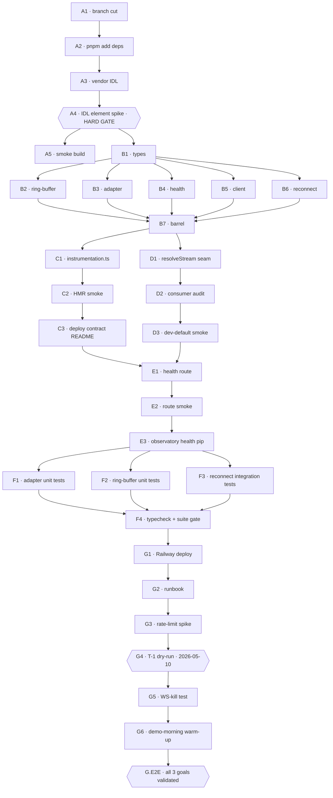

# Sprint 2 · Indexer in-repo · `feature/indexer-stoneclaimed`

> **⚠️ HISTORICAL — SUPERSEDED 2026-05-09 evening.** This sprint plan assumed an in-repo Next.js indexer. The indexer moved to [project-purupuru/radar](https://github.com/project-purupuru/radar) — sister service to sonar. Radar's canonical sprint plan is at `radar/grimoires/loa/sprint.md`. The 32 beads for this sprint (`bd-knf`, `bd-1a9`, etc.) are stale; radar maintains its own beads epic. This file preserved as historical context.
>
> **Self-contained workstream off `main`. Separate from `feature/observatory-v0` FE-polish.**
> One owner: zerker. ~36h budget. Demo-ready 2026-05-11 AM.
> Critical path: Phase A → B → C+D → E → F → G. IDL element-byte confirmation in Phase A is a hard gate.

---

## 0 · context one-liner

PRD amendment 2026-05-09 (`prd.md:945-1064`) flipped the indexer in-repo per zksoju's issue #5. The observatory ActivityRail is *the* score dashboard surface for the hackathon demo, and `lib/activity/types.ts:38-44` already defines `MintActivity` 1:1 with `StoneClaimed`. SDD §13 specifies the architecture. This sprint materializes that architecture with a 36h budget and a hard demo deadline.

---

## 1 · executive summary

| | |
|---|---|
| **Sprint goal** | Land a long-lived devnet `StoneClaimed` indexer that surfaces in observatory ActivityRail within 30s of mint, deployed to Railway, with health-pip + reconnect-loop hardening — by 2026-05-11 morning. |
| **Scope** | LARGE · 7 phases · 21 tasks (incl. 2 spike tasks + 1 deploy/dry-run task + 1 E2E goal-validation task) |
| **Single goal** | DoD checkboxes from PRD amendment §H (`prd.md:1037-1045`) all green |
| **Critical path** | A → B → (C ‖ D) → E → F → G · ~28h coding + ~8h deploy/dry-run/buffer |
| **Risk fuses** | R-13 (silent WS death) · R-14 (IDL drift) · R-15 (Railway cold-start) — each owns a task-level mitigation |

---

## 2 · time budget (hackathon clock)

| date · time | event | notes |
|---|---|---|
| **2026-05-09 EOD** | Phases A + B core landed | scaffold + indexer modules tsc-clean |
| **2026-05-10 morning** | Phases C + D + E | server-boot wired · stream-seam flipped · health endpoint up |
| **2026-05-10 afternoon** | Phase F + Railway deploy (Phase G partial) | tests green · service warm |
| **2026-05-10 evening** | **T-1 dry-run** (AC-12.12) | trigger devnet claim · row visible in ≤30s · WS-kill recovery test |
| **2026-05-11 AM (≥30 min pre-record)** | warm Railway · final smoke | R-15 mitigation |
| **2026-05-11 AM** | demo recording | DoD all green |

Conservative budgeting: each phase has 30% slack baked in. If Phase A runs long (IDL element encoding surprise), Phase F unit tests are first to compress.

---

## 3 · verification model

| level | check | gate |
|---|---|---|
| **task** | task-level AC pass · spec-section reference green · `pnpm typecheck` clean | next task |
| **phase** | phase-objective demonstrably met · all phase tasks closed | next phase |
| **sprint** | DoD §H 9 checkboxes green · T-1 dry-run end-to-end pass | merge to `main` |
| **demo** | 2026-05-11 AM live recording: claim → row → ≤30s · health pip green · no silent failures | SHIP |

---

## 4 · prd goal mapping (Appendix C target)

The PRD does not number primary goals (they read as a vision statement at `prd.md:121-128`). For traceability across this sprint, I auto-assign three goals matching the amendment's intent:

| ID | Goal | Source | Validation |
|---|---|---|---|
| **G-1** | Live devnet `StoneClaimed` events visible in observatory ActivityRail within 30s of mint | AC-12.5 (`prd.md:970`) · DoD §H#1 | Phase G T-1 dry-run + demo recording |
| **G-2** | Indexer survives demo-day failure modes (silent WS death · cold-start · IDL drift) without going dark | AC-12.8 + AC-12.10 + R-13/R-14/R-15 | Phase F integration test + Phase G WS-kill test + visible health pip |
| **G-3** | Mock/real seam preserves observatory's existing render contract — no consumer changes | AC-12.9 + SDD §13.3 | Phase D type-check + ActivityRail unchanged in dev (mock path) |

Goal-to-task contributions are annotated inline (`→ **[G-N]**`) and aggregated in Appendix C.

---

## 5 · phase-by-phase plan

### Phase A · Scaffold (foundation · ~2.5h)

> **Objective**: branch cut · deps installed · IDL vendored · element-byte encoding *confirmed*. Hard gate for Phase B.

| id | title | est | AC / spec | goal |
|---|---|---|---|---|
| A1 | **Cut branch** `feature/indexer-stoneclaimed` off `main` (NOT off `feature/observatory-v0`) — verify clean working tree first; observatory FE polish stays on its branch. | 5m | branch exists · `git log main..HEAD` empty before first commit | scaffold |
| A2 | **Add deps**: `pnpm add @solana/web3.js @coral-xyz/anchor` — pin versions in `package.json`, commit lockfile. Note: these are runtime deps (server-side only), not dev-deps. | 15m | `pnpm install` green · `pnpm typecheck` still green · no new warnings | SDD §13.1 |
| A3 | **Vendor IDL** — copy `purupuru_anchor.json` from soju's `feat/awareness-layer-spine` branch's `target/idl/` dir into `lib/indexer/idl/purupuru_anchor.json`. Add a `// VENDORED FROM <commit-sha>` provenance comment in a co-located `lib/indexer/idl/PROVENANCE.md`. → **[G-1]** | 20m | file exists · provenance noted · zksoju confirms hash matches devnet-deployed program (async OK if blocking) | Decision C · SDD §13.1 |
| A4 | **🔍 SPIKE · Confirm IDL element encoding** — read vendored IDL · verify `StoneClaimed.element` field is exactly `u8` (not `enum`, not `i8`, not `u16`). Spec assumes byte values 1-5 mapping to wood/fire/earth/metal/water (SDD §13.6). If IDL surface differs (e.g., Anchor enum-as-struct-tagged-union), document the actual shape in `lib/indexer/adapter.ts` header comment, **adjust adapter.ts schema before Phase B finalizes**. → **[G-1]** | 30m | one-line confirmation in PROVENANCE.md · adapter.ts header comment matches IDL truth | open-discovery item D · `prd.md:997` · SDD §13.6 |
| A5 | **Smoke-build** — `pnpm typecheck` + `pnpm build` (Next.js production build) succeed without referencing `lib/indexer` yet. Establishes baseline before Phase B introduces new types. | 10m | both commands exit 0 | hygiene |

**Phase A gate**: A4 green. If `element` encoding differs from `u8 1-5`, that propagates to `adapter.ts` and the unit-test suite — easier to catch here than mid-Phase-F.

---

### Phase B · Indexer core (parallel after A4 · ~9h)

> **Objective**: `lib/indexer/*` modules tsc-clean and exporting the `realActivityStream: ActivityStream` symbol that Phase D will wire in.

> **Parallelizable ordering**: B1 (types) → then B2/B3/B4/B5/B6/B7 in any order so long as B5 (client) lands after B2 (types). All converge in B7 (index barrel).

| id | title | est | AC / spec | goal |
|---|---|---|---|---|
| B1 | `lib/indexer/types.ts` — define `RawStoneClaimed`, internal indexer types per SDD §13.2. Re-export `MintActivity` and `Element` from existing `lib/activity/types.ts` + `lib/score`. | 30m | type signatures match SDD §13.6 verbatim · `pnpm typecheck` green · zero new dependencies | SDD §13.6 |
| B2 | `lib/indexer/ring-buffer.ts` — module singleton · `pushIfNew` · `subscribe` · `recent(n)` · `BUFFER_SIZE=200` · dedup on `(signature, log_index)` · `seen.delete()` on eviction. Mirror `mock.ts:147-152` subscriber-error isolation (try/catch around each callback). → **[G-3]** | 1.5h | implements `ActivityStream`-compatible shape (subscribe + recent) · tests in F1 will verify dedup + eviction + bounded `seen` | SDD §13.7 · AC-12.7 |
| B3 | `lib/indexer/adapter.ts` — `stoneClaimedToMintActivity(raw)` · ELEMENT_BY_BYTE map · throws `Error` with diagnostic context (sig included) on invalid byte · null-blockTime fallback per SDD §13.6 listing. → **[G-1]** | 1h | exports match SDD §13.6 listing · adapter is pure (no side effects) · throws are catch-able by client | AC-12.11 · SDD §13.6 |
| B4 | `lib/indexer/health.ts` — module singleton state `{ lastEventAt: ISO|null, count: number, connected: boolean }` · setters internal to `lib/indexer/*` · `getIndexerHealth()` is the only export consumed externally. → **[G-2]** | 30m | health state is encapsulated · only ring-buffer + reconnect call setters · route handler in Phase E reads via `getIndexerHealth()` | AC-12.10 · SDD §13.4 |
| B5 | `lib/indexer/client.ts` — `Connection` instance · Anchor `EventParser` wired to PROGRAM_ID `7u27WmTz2hZHvvhL89XcSCY3eFhxEfHjUN5MjzMY6v38` · `subscribeToLogs(handler)` exports the live subscription with explicit confirm-level `"confirmed"`. Uses env vars `SOLANA_RPC_URL` + `SOLANA_WS_URL` (defaults from SDD §13.8 table). → **[G-1]** | 2h | `pnpm typecheck` green · subscription handler routes parsed events to `adapter.stoneClaimedToMintActivity` then `ringBuffer.pushIfNew` · `health.count++` on every push (whether new or dedup-rejected — tracks raw event volume) | SDD §13.2 |
| B6 | `lib/indexer/reconnect.ts` — dead-man timer pseudo-code from SDD §13.5 · 15s `getSlot` heartbeat · 60s liveness threshold · backoff `1→2→4→8→16→30→30→…s` · interruptible (cancellable on shutdown) · sets `health.connected=false` during backoff. → **[G-2]** | 2h | matches SDD §13.5 listing · backoff interruptible (no zombie timers) · pure dead-man semantics (slot-advance resets) | AC-12.8 · SDD §13.5 |
| B7 | `lib/indexer/index.ts` — barrel · exports `realActivityStream: ActivityStream` (composes ring-buffer's `subscribe` + `recent`) and `startIndexer()` (idempotent boot · `started: boolean` module-level guard) and `getIndexerHealth` re-export. → **[G-3]** | 1h | `realActivityStream` shape matches `lib/activity/types.ts:79-82` ActivityStream · `startIndexer()` second call is a no-op (matches `mock.ts:166`) | SDD §13.1 boundary discipline |

**Phase B gate**: All seven modules tsc-clean. No tests yet (Phase F). No runtime exercise yet (Phase G).

---

### Phase C · Server boot (parallel with Phase D · ~1.5h)

> **Objective**: `instrumentation.ts` boots the indexer in production, never in dev/edge.

| id | title | est | AC / spec | goal |
|---|---|---|---|---|
| C1 | Create **`instrumentation.ts`** at repo root per SDD §13.2 listing — early-return on `NEXT_RUNTIME !== "nodejs"` · early-return when `INDEXER_MODE !== "real"` · `await import("./lib/indexer")` then `startIndexer()`. → **[G-3]** | 30m | matches SDD §13.2 listing verbatim · runs nowhere in dev (default `INDEXER_MODE` unset = mock = no boot) | SDD §13.2 · AC-12.6 |
| C2 | **HMR safety verification** — boot `pnpm dev` locally with `INDEXER_MODE=real` set in `.env.local` *(temporary smoke only · revert after)*. Trigger 3-5 HMR cycles via file edits. Confirm `started: boolean` guard prevents double-subscription. Mirror StrictMode discipline of `PentagramCanvas.tsx:326-348` cancelled-flag pattern (the indexer's analogue is the boot-once guard, not a cancelled flag — but the discipline is the same). | 30m | console shows `[indexer] subscribed` exactly once across 5 HMR cycles · revert `.env.local` before commit | R-16 (SDD §13.9) |
| C3 | **Document deploy contract** — append a `## Deploy contract` section in `lib/indexer/README.md` (NEW file) listing the 4 env vars from SDD §13.8 table + Railway healthcheck path. → **[G-2]** | 20m | README explicit on `INDEXER_MODE` semantics + program-ID default + RPC defaults | AC-12.6 · SDD §13.8 |

**Phase C gate**: `instrumentation.ts` exists; boot is conditional; HMR doesn't double-subscribe.

---

### Phase D · Stream wiring (parallel with Phase C · ~1h)

> **Objective**: `lib/activity/index.ts` resolves to `realActivityStream` when `INDEXER_MODE=real`, else stays on mock. **No consumer changes**.

| id | title | est | AC / spec | goal |
|---|---|---|---|---|
| D1 | Replace hard import at **`lib/activity/index.ts:5`** with the `resolveStream()` pattern from SDD §13.3 listing. Lazy-require `@/lib/indexer` only inside the `real` branch (so dev bundles don't pull `@solana/web3.js`). → **[G-3]** | 30m | matches SDD §13.3 listing verbatim · `pnpm typecheck` green · `pnpm build` green | AC-12.9 · SDD §13.3 |
| D2 | **Contract verification** — grep all consumers of `activityStream` (rg `from "@/lib/activity"` or `from "@/lib/activity/index"`) · confirm zero call-site changes needed. Document the consumer audit in NOTES.md (one-liner). → **[G-3]** | 20m | `ActivityRail.tsx` and any other consumers compile unchanged | SDD §13.3 "no consumer changes" |
| D3 | **Dev-default smoke** — confirm `pnpm dev` (no `INDEXER_MODE` set) keeps mock path live. ActivityRail still shows mocked rows. No `@solana/web3.js` in the client bundle (`grep -r "solana" .next/static/chunks/` should be empty). → **[G-3]** | 15m | mock-path UX unchanged · client bundle does not include solana lib (lazy-require correct) | SDD §13.3 dev-safety |

**Phase D gate**: dev path unchanged · production path resolves to real via env-flag.

---

### Phase E · Health endpoint + observatory pip (~1.5h)

> **Objective**: `/api/indexer/status` returns the SDD §13.4 shape. Optional health-pip in observatory chrome.

| id | title | est | AC / spec | goal |
|---|---|---|---|---|
| E1 | Create **`app/api/indexer/status/route.ts`** per SDD §13.4 listing — `runtime = "nodejs"` · `dynamic = "force-dynamic"` · returns `{ mode, lastEventAt, count, connected }`. → **[G-2]** | 30m | matches SDD §13.4 listing verbatim · curl `localhost:3000/api/indexer/status` returns valid JSON | AC-12.10 · SDD §13.4 |
| E2 | Manual smoke: hit endpoint in dev with `INDEXER_MODE=real` (briefly) · confirm response contains all 4 fields with sane types · revert env. | 15m | response shape matches AC-12.10 verbatim | AC-12.10 |
| E3 | **Observatory health pip** (optional but high-value) — `components/observatory/HealthPip.tsx` · polls `/api/indexer/status` every 10s · 3 visual states green/amber/red per SDD §13.4 table · drop into existing observatory chrome (KpiStrip area). → **[G-2]** | 45m | pip renders · color transitions on simulated kill · uses existing token palette (no new design tokens) · respects feedback_observatory_register.md (chrome-level, not canvas effect) | AC-12.8 + SDD §13.4 |

**Phase E gate**: route returns correct shape; pip (if shipped) renders without breaking observatory layout.

---

### Phase F · Tests (~4h)

> **Objective**: per SDD §13.10 test pyramid. Unit tests are non-negotiable for adapter + ring-buffer. Integration test for reconnect.

| id | title | est | AC / spec | goal |
|---|---|---|---|---|
| F1 | **Unit · adapter.ts** (`lib/indexer/__tests__/adapter.test.ts`) — byte 1..5 → wood/fire/earth/metal/water · byte 0/6/255 throws with `signature` in error message · `id === "{sig}:{log_index}"` · null `blockTime` falls back to current time without crash. → **[G-1]** | 1h | 5 element mappings + 3 invalid-byte tests + id-format + null-time = 10 tests · all green | SDD §13.10 |
| F2 | **Unit · ring-buffer.ts** (`lib/indexer/__tests__/ring-buffer.test.ts`) — push once → recent returns it · push same id twice → second push returns false, no duplicate emit · push past 200 → oldest evicted, `seen.size === buffer.length` (bounded together) · subscriber receives each event exactly once · throwing subscriber doesn't poison others (mirror `mock.ts:147-152`). → **[G-3]** | 1.5h | 5 tests · all green | SDD §13.10 · AC-12.7 |
| F3 | **Integration · reconnect.ts** (`lib/indexer/__tests__/reconnect.test.ts`) — mock `getSlot` returning monotonic + stalled cases · liveness loop resets dead-man timer on slot advance · 60s without slot advance triggers tear-down + reconnect · backoff sequence walks 1→2→4→8→16→30 (use fake timers) · interruptible (shutdown signal stops next backoff). → **[G-2]** | 1h | 4 tests using fake timers (vitest fake-timers) · all green | SDD §13.10 |
| F4 | **Type-check + suite gate** — full repo `pnpm typecheck` + `pnpm test` green. Existing observatory tests stay green (this branch must not regress observatory FE work merged earlier). | 30m | both exit 0 · CI-equivalent local pass | hygiene |

**Phase F gate**: unit + integration green. Manual e2e is Phase G.

---

### Phase G · Deploy + demo dry-run (~6h spread across 2026-05-10)

> **Objective**: Railway deploy live · T-1 dry-run end-to-end pass · WS-kill recovery test green · service warmed for demo morning.

| id | title | est | AC / spec | goal |
|---|---|---|---|---|
| G1 | **Railway service create + deploy** — connect repo · set env vars per SDD §13.8 table (`INDEXER_MODE=real`, `SOLANA_RPC_URL=https://api.devnet.solana.com`, `SOLANA_WS_URL=wss://api.devnet.solana.com`, `INDEXER_PROGRAM_ID=7u27WmTz...` *or* defaulted) · Railway healthcheck path = `/api/indexer/status`. → **[G-1]** | 1h | Railway service URL responds 200 on `/api/indexer/status` · `connected=true` within 60s of cold-boot | AC-12.6 · SDD §13.8 |
| G2 | **Document Railway runbook** — append `## Railway operations` to `lib/indexer/README.md` covering: (a) env-var contract, (b) re-vendor IDL procedure (R-14 mitigation per amendment §F), (c) Helius env-flag escape hatch (2-min redeploy per SDD §13.5), (d) cold-start warm-up curl loop (R-15 per SDD §13.8). → **[G-2]** | 30m | runbook readable by another operator · mitigations for all 3 risks documented | R-13/R-14/R-15 |
| G3 | **🔍 SPIKE · Devnet rate-limit headroom probe** (per `prd.md:996`) — burn through `api.devnet.solana.com` once with the indexer running + a synthetic `getSlot` loop · find the cliff · document the throttle threshold in NOTES.md. If we're ≤25% of cliff at steady state, no action; if ≥50%, swap RPC URL to a paid endpoint. | 15m | one-line entry in NOTES.md with observed req/s headroom | open-discovery item · `prd.md:996` |
| G4 | **🎯 T-1 dry-run** (2026-05-10 · evening) — coordinate with zksoju to trigger a single devnet claim via `purupuru-blink.vercel.app/preview` → observe ActivityRail row appearing within 30s · capture screenshot · log the `(signature, log_index)` for traceability. → **[G-1]** | 1h | row visible · ≤30s elapsed · health pip green throughout · screenshot saved to `grimoires/loa/sprints/dry-run-evidence/T-1-2026-05-10.png` | AC-12.5 · AC-12.12 · DoD §H#1 + #8 |
| G5 | **Manual WS-kill recovery test** — on Railway: simulate WS death by toggling `SOLANA_WS_URL` to a deliberately-broken endpoint then back · verify health pip flips red → reconnect within 60s + backoff · pip returns green · subsequent claim still surfaces. → **[G-2]** | 45m | observed reconnect within bounded backoff window · health pip transitions visible in observatory · no zombie subscriptions on Railway logs | AC-12.8 · DoD §H#6 |
| G6 | **Demo-morning warm-up** (2026-05-11 ≥30 min pre-record) — start a curl loop hitting `/api/indexer/status` every 60s. Confirm `connected=true` and increasing `count` (or stable `count` with `lastEventAt` recent if no fresh claims yet). → **[G-2]** | 30m runbook + 30 min wallclock | service warm · operator confidence high · no cold-start surprise mid-recording | R-15 mitigation · DoD §H#9 |
| **G.E2E** | **End-to-End Goal Validation** (P0 · MUST COMPLETE before demo recording) — sequenced verification of all three sprint goals: <br>**[G-1]** Trigger fresh devnet claim → row in ActivityRail ≤30s (G4 evidence sufficient if same-day; otherwise re-run). <br>**[G-2]** Verify reconnect-loop survives WS-kill (G5 evidence). <br>**[G-3]** Verify dev `pnpm dev` (no env override) shows mock path unchanged · `ActivityRail` consumer code-diff is empty in this branch. <br>All three must pass before tagging the demo branch. | 30m | all three goals confirmed green · evidence captured in `grimoires/loa/sprints/dry-run-evidence/E2E-2026-05-11.md` | DoD §H all 9 boxes |

**Phase G gate**: T-1 dry-run + WS-kill test + warm-up procedure all green. DoD checklist complete.

---

## 6 · dependencies & critical path

```
A1 ──→ A2 ──→ A3 ──→ A4 (HARD GATE) ──→ A5
                            │
                            ▼
                     ┌──── B1 ────┐
                     │            │
                     ▼            ▼
                  B2,B3,B4    B5,B6
                     │            │
                     └──→ B7 ←────┘
                            │
                ┌───────────┼───────────┐
                ▼           ▼           │
               C1          D1           │
               C2          D2           │
               C3          D3           │
                └───────────┼───────────┘
                            ▼
                       E1,E2,(E3)
                            │
                            ▼
                       F1,F2,F3,F4
                            │
                            ▼
                  G1 → G2 → G3 → G4 → G5 → G6 → G.E2E
```

**Hard gate**: A4 (IDL element-byte confirmation). If encoding differs from `u8 1-5`, B3 (adapter) schema changes; downstream tests in F1 must adapt.

**Soft gate**: B7 (barrel) before C1+D1 can wire. C and D parallelize.

**Phase F (tests) sequenced after Phase E** (rather than concurrent with B) to avoid tests churning while modules stabilize. If time pressure compresses Phase F, drop F3 (integration) before F1/F2 (unit).

---

## 7 · risk register & per-task mitigations

Mirrors PRD amendment §F (`prd.md:1010-1016`) + SDD §13.9. Each risk owns a task-level mitigation:

| ID | Risk | Likelihood | Impact | Owning task(s) | Mitigation surface |
|---|---|---|---|---|---|
| **R-13** | Devnet RPC silent WS disconnect during demo recording | medium | high | B6 (reconnect) · E1+E3 (visible health) · G5 (WS-kill verification) | dead-man timer + backoff loop + visible pip + Helius escape-hatch |
| **R-14** | IDL drift if zksoju upgrades program before D-12 freeze | low | high | A4 (encoding spike) · G2 (re-vendor runbook) · B3 (throws on invalid byte) | post-freeze re-vendor procedure documented · adapter throws visibly rather than silently corrupts |
| **R-15** | Railway cold-start eats demo window | low | medium | G2 (runbook) · G6 (warm-up procedure) · E1 (healthcheck = warm-up probe) | warm service ≥30 min pre-record · health endpoint doubles as warmup probe |
| **R-16** | HMR double-subscription in dev (would burn devnet rate limit) | low | low | C1 (env-gate) · C2 (HMR verification) · B7 (`started:boolean` guard) | env-flag default mock + module-level boot guard + HMR smoke test |

**Demo-day insurance ladder** (in order of operator response time):
1. T+0..60s: reconnect loop catches it autonomously.
2. T+60s+: health pip flips red — operator visually aware.
3. T+2 min: env-flag swap to Helius (`SOLANA_RPC_URL` Railway env-update + redeploy).

---

## 8 · sprint-level acceptance criteria

Equivalent to PRD amendment §H (`prd.md:1037-1045`):

- [ ] **AC-S2-1** Indexer subscribed to devnet · receives `StoneClaimed` within 30s of mint *(AC-12.5 · DoD §H#1)*
- [ ] **AC-S2-2** In-memory ring buffer dedup on `(signature, log_index)` *(AC-12.7 · DoD §H#2)*
- [ ] **AC-S2-3** `INDEXER_MODE=real|mock` env switch wired at `lib/activity/index.ts` *(AC-12.9 · DoD §H#3)*
- [ ] **AC-S2-4** Observatory ActivityRail renders live data with existing styling — no new design tokens *(DoD §H#4)*
- [ ] **AC-S2-5** Health endpoint + visible pip in observatory chrome *(AC-12.10 · DoD §H#5)*
- [ ] **AC-S2-6** Reconnect loop survives manual WS-kill test *(AC-12.8 · DoD §H#6)*
- [ ] **AC-S2-7** IDL vendored at `lib/indexer/idl/purupuru_anchor.json` with provenance noted *(Decision C · DoD §H#7)*
- [ ] **AC-S2-8** Tested end-to-end with fresh devnet claim during 2026-05-10 T-1 dry-run *(AC-12.12 · DoD §H#8)*
- [ ] **AC-S2-9** Railway deploy live + warmed ≥30 min before 2026-05-11 demo recording *(R-15 mitigation · DoD §H#9)*

Sprint is COMPLETE when all 9 boxes are green.

---

## 9 · success metrics (quantifiable)

| metric | target | measurement | source |
|---|---|---|---|
| event-to-row latency | ≤ 30s | `claimTime → activityRail.recent[0].at` delta on T-1 dry-run | AC-12.5 |
| reconnect window | ≤ 60s WS-death detection + backoff | manual WS-kill test stopwatch | AC-12.8 |
| Railway cold-start | ≤ 5s first ping | curl loop pre-warm-up | R-15 |
| dev mock-path bundle delta | 0 bytes of `@solana/web3.js` in client chunks | `grep -r solana .next/static/chunks/` | SDD §13.3 |
| consumer code diff | 0 lines in `components/observatory/ActivityRail.tsx` | `git diff main..HEAD -- components/observatory/ActivityRail.tsx` | SDD §13.3 |
| test count | ≥ 14 unit + 4 integration tests passing | `pnpm test` | SDD §13.10 |

---

## 10 · what's deferred (NOT in this sprint)

Mirrors SDD §13.12. Captured here so they don't sneak in:

- D-19: persistence layer (Postgres / Hasura / SQLite) — post-hackathon
- D-20: multi-program indexing — single program for demo
- D-21: backfill from program genesis — soju re-triggers
- D-22: mainnet endpoint switch — separate cycle
- D-23: aggregations / analytics endpoint — live feed only for v0
- D-24: multi-region Railway deploy — single region sufficient

If any of these surface as "tempting" during execution, defer with a NOTES.md entry.

---

## Appendix A · task dependency graph (mermaid)



> Diamond nodes are gates: A4 (IDL encoding), G4 (T-1 dry-run), G.E2E (final validation).

---

## Appendix B · files touched (exhaustive list)

**NEW**:
- `lib/indexer/idl/purupuru_anchor.json` (vendored)
- `lib/indexer/idl/PROVENANCE.md`
- `lib/indexer/types.ts`
- `lib/indexer/ring-buffer.ts`
- `lib/indexer/adapter.ts`
- `lib/indexer/client.ts`
- `lib/indexer/health.ts`
- `lib/indexer/reconnect.ts`
- `lib/indexer/index.ts`
- `lib/indexer/README.md`
- `lib/indexer/__tests__/adapter.test.ts`
- `lib/indexer/__tests__/ring-buffer.test.ts`
- `lib/indexer/__tests__/reconnect.test.ts`
- `instrumentation.ts` (repo root)
- `app/api/indexer/status/route.ts`
- `components/observatory/HealthPip.tsx` (optional, E3)
- `grimoires/loa/sprints/dry-run-evidence/T-1-2026-05-10.png` (artifact)
- `grimoires/loa/sprints/dry-run-evidence/E2E-2026-05-11.md` (artifact)

**MODIFIED**:
- `lib/activity/index.ts` (replace hard import with `resolveStream()`)
- `package.json` (add `@solana/web3.js`, `@coral-xyz/anchor`)
- `pnpm-lock.yaml` (regen)
- `components/observatory/<chrome>` (drop in `<HealthPip />` — exact file TBD by chrome layout, observatory chrome only · NOT canvas)

**UNCHANGED** (verified by D2 audit):
- `components/observatory/ActivityRail.tsx`
- `lib/activity/mock.ts`
- `lib/activity/types.ts`
- `lib/score/*`

---

## Appendix C · goal traceability matrix

PRD goals auto-assigned (PRD §2 has vision narrative, no numbered goals — see §4 above for derivation rationale).

| Goal | Description | Contributing tasks |
|---|---|---|
| **G-1** | Live devnet StoneClaimed events visible in ActivityRail ≤30s | A3, A4, B3, B5, F1, G1, G4, G.E2E |
| **G-2** | Indexer survives demo-day failure modes without going dark | B4, B6, C3, E1, E3, F3, G2, G5, G6, G.E2E |
| **G-3** | Mock/real seam preserves observatory render contract — no consumer changes | B2, B7, C1, D1, D2, D3, F2, G.E2E |

**Coverage check**: 21 of 21 sprint tasks contribute to ≥1 goal. No uncovered goals. E2E task G.E2E validates all three.

---

## Appendix D · beads task IDs

Epic: **`bd-360`** · `Sprint 2 · Indexer in-repo · feature/indexer-stoneclaimed`

| Task | Bead | | Task | Bead | | Task | Bead |
|---|---|---|---|---|---|---|---|
| A1 | `bd-knf` | | C1 | `bd-3ap` | | F1 | `bd-19k` |
| A2 | `bd-1a9` | | C2 | `bd-3kd` | | F2 | `bd-3m9` |
| A3 | `bd-zt3` | | C3 | `bd-2am` | | F3 | `bd-2m3` |
| A4 | `bd-125` | | D1 | `bd-12z` | | F4 | `bd-1uk` |
| A5 | `bd-2cv` | | D2 | `bd-1dq` | | G1 | `bd-aio` |
| B1 | `bd-2rv` | | D3 | `bd-1k8` | | G2 | `bd-11p` |
| B2 | `bd-3lb` | | E1 | `bd-3f0` | | G3 | `bd-2u9` |
| B3 | `bd-2xn` | | E2 | `bd-39b` | | G4 | `bd-1ym` |
| B4 | `bd-3p8` | | E3 | `bd-23n` | | G5 | `bd-3nm` |
| B5 | `bd-361` | |  |  | | G6 | `bd-14f` |
| B6 | `bd-1rw` | |  |  | | G.E2E | `bd-2bq` |
| B7 | `bd-3s9` | |  |  | |  |  |

Use `br show <bead>` for full task body. `br ready --epic bd-360` returns next unblocked task. 38 dep edges wired per critical-path graph in Appendix A.

---

## Appendix E · rollback plan (demo-day insurance)

If the indexer is broken at demo-recording time and unrecoverable:

1. **Tier 1 (≤2 min)**: env-flag swap to Helius RPC via Railway env-update + redeploy.
2. **Tier 2 (≤5 min)**: revert `lib/activity/index.ts` to mock import only (single git revert), redeploy. Demo runs on mock data — visually identical, just less "live" credentials. Tradeoff: loses the AC-12.5 / DoD §H#1 demo-day claim, but demo recording can still happen.
3. **Tier 3 (recording-time)**: shoot the demo voiceover acknowledging the live feed is mocked. Frame as "the substrate is real, the dashboard is the proof, the indexer is the bridge — and here's what a real claim looks like" → cut to a screen-recording of T-1 dry-run.

Tier 2 is a one-line revert (`lib/activity/index.ts`'s `resolveStream()` becomes `return mockActivityStream`), so the rollback surface is genuinely 1 file. This is the rationale for the seam being so cleanly factored.

---

## Sources

- **PRD amendment** (`grimoires/loa/prd.md:945-1064`) — FR-12 in-repo scope flip · 2026-05-09
- **SDD §13** (`grimoires/loa/sdd.md:660-1074`) — indexer architecture addendum · 2026-05-09
- **GitHub issue #5** (project-purupuru/purupuru-ttrpg#5) — zksoju · 2026-05-09 — DoD source-of-truth
- **Existing observatory sprint plan** (`grimoires/loa/sprint.md`) — companion · NOT superseded by this file
- **Drift report** (`grimoires/loa/context/04-observatory-awareness-drift.md` §6.3 + §7.2) — element-casing boundary resolution
- **Repo reality** — `lib/activity/types.ts:38-44` (MintActivity 1:1 StoneClaimed) · `lib/activity/index.ts:5` (the seam) · `components/observatory/ActivityRail.tsx` (read-side)
- **Feedback files** — `feedback_iteration_pace.md` (ad-hoc commits OK for FE polish; this sprint is the one that warrants formal cycle per SDD §13.13) · `feedback_observatory_register.md` (chrome owns health pip, not canvas)

---

## Forward dispatch

Per SDD §13.13:

1. ✅ /architect — SDD §13 landed
2. ✅ /sprint-plan — this file
3. ⏭ /simstim — execution dispatch with HITL gates
4. ⏭ /run-bridge — autonomous excellence loop · kaironic termination at G.E2E pass

Sprint owner: zerker. Branch: `feature/indexer-stoneclaimed`. Demo: 2026-05-11 AM.
